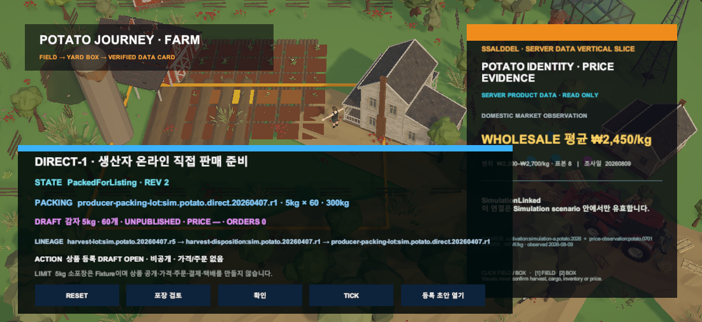

# Unity 생산자 온라인 직접 판매 준비

## 변경

- `DirectOnlineSale` 판로로 결정된 300kg HarvestLot만 생산자 소포장 검토를 시작한다.
- 포장 Preview·Confirm·Simulation Tick 뒤 Fixture 기준 5kg `ParcelBox` 60개를 생성한다.
- 같은 lineage를 가진 온라인 상품 등록 후보와 비공개 등록 초안을 연다.
- 등록 초안은 가격 미설정, 주문 0이며 공개되지 않는다.

## 경계

- 5kg 포장 규칙은 Simulation Fixture이며 실제 포장·택배 기준이 아니다.
- 상품 공개·주문·결제·택배 접수를 실행하지 않는다.
- 원장 수량 300kg을 사용하며 화면 Renderer 수로 수량을 계산하지 않는다.

## 대표 Game View

## 검증

- DIRECT-1 core 집중 테스트 8/8 통과
- Unity core 전체 321/321 통과
- Unity EditMode `DirectOnlineSaleLifecycleViewTests` 4/4 통과
- Unity Play Mode Game View 직접 확인
