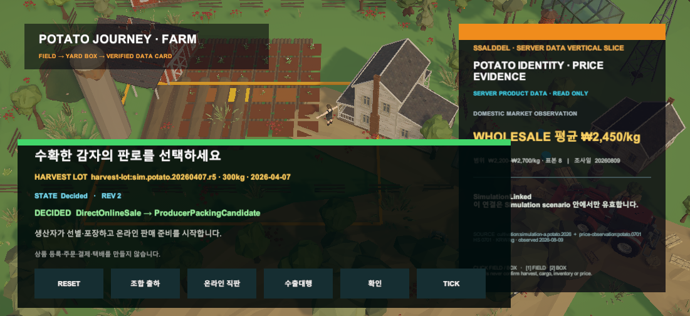

# Unity 수확물 판로 선택 카드

## 변경

- FARM-3가 만든 canonical 감자 300kg HarvestLot marker를 클릭 가능한 상호작용 대상으로 연결했다.
- 판로 카드에서 `생산자 조합에 출하`, `온라인 마켓 직접 판매`, `수출대행 준비`를 선택할 수 있다.
- 선택은 Preview, 명시적 Confirm, Simulation Tick을 거쳐야만 `HarvestDispositionDecision`이 된다.
- 각 결정은 조합 인수·생산자 포장·수출 준비 후속 업무 후보 중 하나만 만든다.
- 화면의 상자나 Renderer 수로 수량을 계산하지 않고 HarvestLot 원장의 `300kg`을 사용한다.

## 경계

- 조합 인수·정산을 실행하지 않는다.
- 온라인 상품 등록·주문·결제·택배를 만들지 않는다.
- 수출계약·검사·통관·운송을 확정하지 않는다.
- 기존 CARGO-1/Farm→Hub 흐름은 보존하지만 조합 출하 선택과 아직 자동 연결하지 않는다.

## 대표 Game View

Play Mode에서 `DirectOnlineSale`을 Confirm하고 Tick한 뒤 `ProducerPackingCandidate`만 활성화된 상태다. 오른쪽 상품 identity·가격 카드는 계속 서버 데이터 읽기 전용이다.

## 검증

- Harvest disposition core 집중 테스트 8/8 통과
- Unity core 전체 305/305 통과
- Unity EditMode `HarvestDispositionChoiceViewTests` 4/4 통과
- Unity Play Mode Game View 직접 확인
