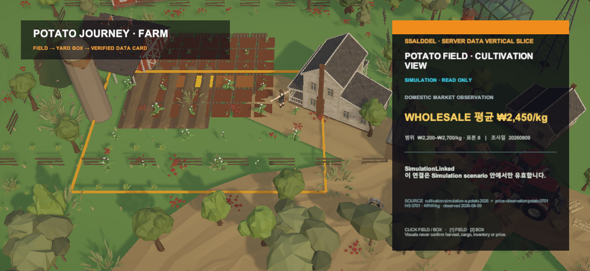

# Unity 감자 여정 Farm 수직 슬라이스

## 결과

서버의 감자 World read projection을 Unity Data·Interpretation·Presentation으로 연결하고, 별도 Farm Scene에서 감자 필지와 감자 상자를 선택해 상품·국내 가격 관측·관계 상태·source lineage를 읽는 PVS3~PVS5 흐름을 구현했다.

## 대표 Game View

- 실제 POLYGON Farm 감자 식재와 감자 상자를 사용한다.
- 노란 필지 경계는 현재 `SimulationLinked` 선택을 나타낸다.
- 가격은 정보용 국내 도매 관측으로 표시하며 판매가·정산가로 해석하지 않는다.
- 카드에 source stable ID, HS 0701, 관측 기준일과 linkage 한계를 함께 표시한다.
- Scene presenter는 `SimulationFixture`를 명시하며 운영 API 실패 fallback으로 동작하지 않는다.

## 검증

- 서버 수직 슬라이스 집중 테스트: 9/9 통과
- Unity Core PVS3~PVS4 집중 테스트: 9/9 통과
- Unity PVS5 EditMode: 3/3 통과
- 연결된 Unity 6000.5.6f1 Editor에서 실제 Play Mode 상태 확인
- Play Mode Game View 캡처와 카드 가독성 직접 확인

## 남은 경계

인증된 서버 응답을 Unity로 전송하는 HTTP adapter, loading·stale·partial·error 실제 화면, canonical cargo 관계에 따른 Hub 이동은 아직 구현하지 않았다. 따라서 현재 화면은 Farm 읽기 수직 슬라이스의 Simulation 증거이며 운영 화물·재고·입고 완료를 뜻하지 않는다.
