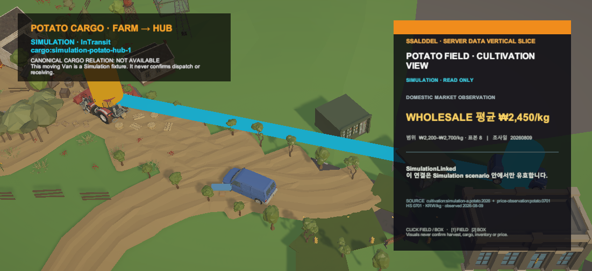

# Unity 감자 여정 Farm→Hub 관계 Gate

## 결과

PVS5 Farm 가격 카드 위에 PVS6 cargo route Gate를 연결했다. cyan 경로와 Synty City Van은 명시적 `SimulationLinked` fixture일 때만 나타나며, 현재 운영 서버에 감자 재배/상품과 운송 화물을 잇는 canonical stable-ID 관계가 없다는 경계를 화면에 함께 표시한다.

## 대표 Game View

- 왼쪽 HUD: cargo stable ID, `SIMULATION`, handoff 상태와 canonical 관계 부재
- 중앙 cyan 경로: `farm-yard.potato-cargo → hub.inbound-dock` Presentation
- Synty Van: 경로 위 왕복 Presentation이며 배차·출하·입고 완료를 확정하지 않음
- 오른쪽 카드: PVS5의 감자 상품·도매가격 관측·source lineage 유지

## 데이터·전송 경계

- Bearer token을 요구하는 `UnityWebRequest` client를 추가했다.
- 빈 응답, 인증 실패, HTTP 실패를 Simulation fixture로 대체하지 않는다.
- Newtonsoft wire JSON 변환으로 nullable 수량을 0과 구분한 뒤 기존 mapper가 권한·출처·linkage를 다시 검증한다.
- loading·refreshing·ready·partial·stale·error를 구분하고 오류 시 마지막 성공본 표시 여부를 별도로 보존한다.
- 실제 로그인 token과 실행 서버를 이용한 live 호출은 이번 작업에서 수행하지 않았다.

## 검증

- Unity Core 감자 집중 테스트: 14/14 통과
- Unity 감자 관련 EditMode: 9/9 통과
- Unity 6000.5.6f1 연결 Editor 실제 Play Mode와 Game View 확인
