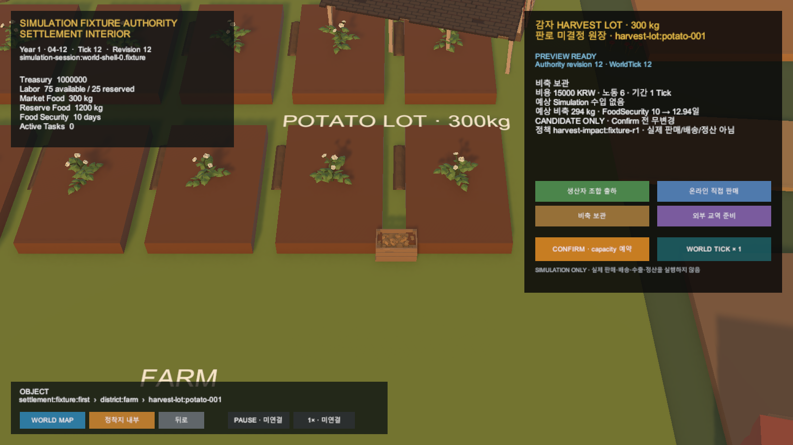
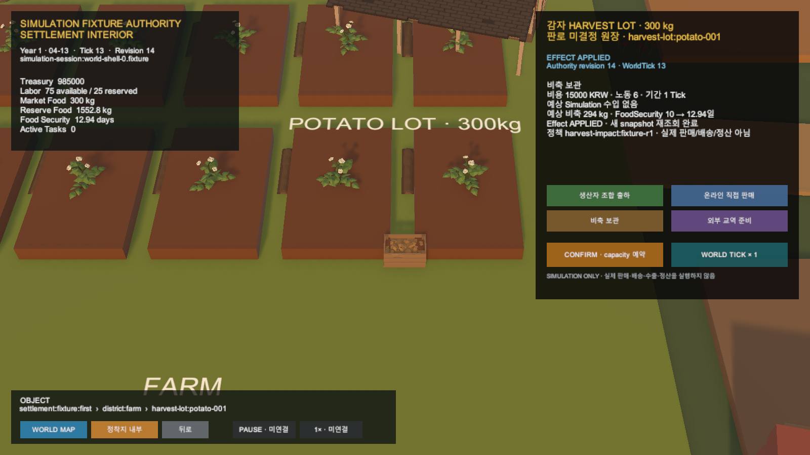

# Unity 정착지 HarvestLot 판로 상호작용

## 결과

`SimulationWorldShell`에서 감자 300kg HarvestLot을 선택하면 생산자 조합 출하·온라인 직접 판매·비축 보관·외부 교역 준비 네 판로가 열린다. 각 선택은 다음 권위 흐름을 따른다.

```text
HarvestLot 선택
  → Simulation authority Preview
  → 명시적 Confirm
  → allocation·capacity 예약
  → 명시적 WorldTick
  → Effect 적용
  → authoritative snapshot으로 HUD·카드 갱신
```

Production repository는 공식 Simulation API의 session GET, 판로 impact Preview·Confirm, Tick 경로와 expected revision을 사용한다. 이번 Game View는 실제 실행 서버가 아니라 운영 fallback이 아닌 `SimulationFixtureAuthority` test double로 검증했다.

## Preview



- revision 12·WorldTick 12 유지
- 비용 15,000 KRW, 노동 6, 기간 1 Tick
- 예상 비축 294kg, FoodSecurityDays 10→12.94
- Confirm 전 재정·노동·재고 무변경

## Confirm과 Effect

Confirm은 revision 13·WorldTick 12에서 재정 15,000 KRW, 노동 6, storage 294kg을 예약한다. 완료 Tick 응답에서만 revision 14·WorldTick 13, 재정 985,000 KRW, storage 1,494kg, FoodEquivalent 1,552.8, FoodSecurityDays 12.94와 Effect Applied가 된다.



## 경계

- Preview는 snapshot을 바꾸지 않는다.
- Unity는 정책값과 Effect를 계산하지 않는다.
- 상자·Renderer·NPC·차량은 Task 완료의 권위가 아니다.
- 실제 판매·배송·수출·계약·정산은 실행하지 않는다.
- 실제 실행 서버 live 호출은 이번 검증에 포함하지 않았다.

## 검증

- `SettlementInteractionTests`: 8/8 통과
- `Ssalddel.Unity.Tests.EditMode`: 65/65 통과
- `SimulationHarvestDispositionImpactTests`: 23/23 통과
- .NET `HarvestDispositionBranchAdapterTests`: 6/6 통과
- 최종 Play Mode Console 오류: 0건

커밋과 푸시는 수행하지 않았다.
