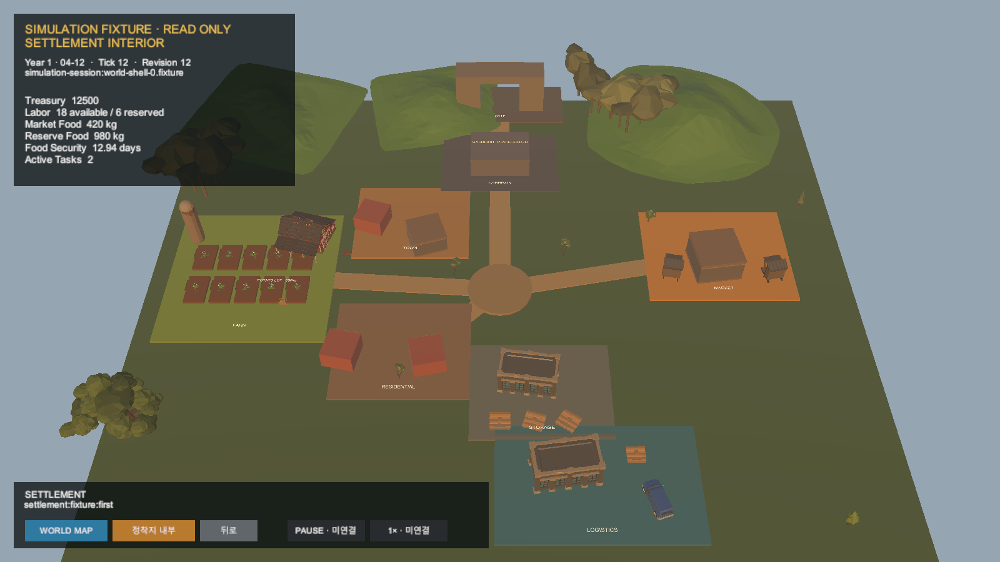
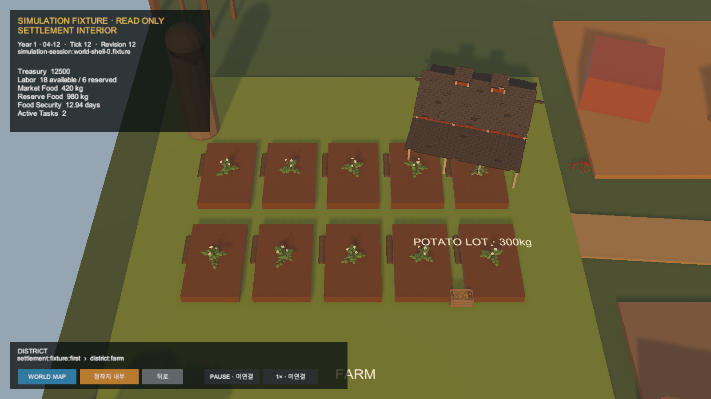
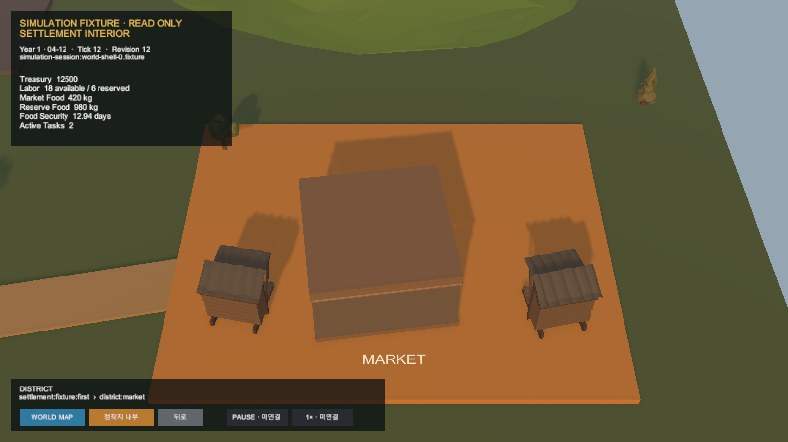

# Unity 정착지 1차 시각 기반

## 결과

`SimulationWorldShell`의 동일한 Tick 12·Revision 12 snapshot 위에 `SETTLEMENT-VISUAL-BASE-0`을 적용했다. 기존 District socket과 도로·navigation은 유지하고 Farm/Urban/Environment catalog의 semantic `VisualKey`로 45개 이상의 Synty visual wrapper를 연결했다.

- Farm: 감자 경작지 10개, Barn, Silo, 300kg HarvestLot 상자
- Town/Market: 주거·시장 건물과 생산물 판매대
- Storage/Logistics: 창고, pallet, cargo box, van
- Residential: 주거 건물과 수목
- Gate/Garrison: 기능 없는 primitive placeholder 유지
- 시간대: 오후 15:00 고정 Presentation, Simulation Tick/Revision 불변

## 권위 경계

Prefab 이름·경로, Renderer와 상자 수는 상품 identity·재고·Task 완료를 결정하지 않는다. 시간 presenter도 경제나 `WorldTick`을 진행하지 않는다. 다음 `SETTLEMENT-INTERACTION-0`에서만 HarvestLot 선택과 네 판로의 서버 Preview·Confirm·Task·Tick·Effect를 연결한다.

## 검증

- `Ssalddel.Unity.Tests.EditMode`: 57/57 통과
- `HarvestDispositionChoiceViewTests`: 4/4 통과
- 최종 Play Mode Overview·Farm·Market 전환 및 1600×900 Game View 캡처
- 최종 Play Mode Console 오류: 0건

커밋과 푸시는 수행하지 않았다.
