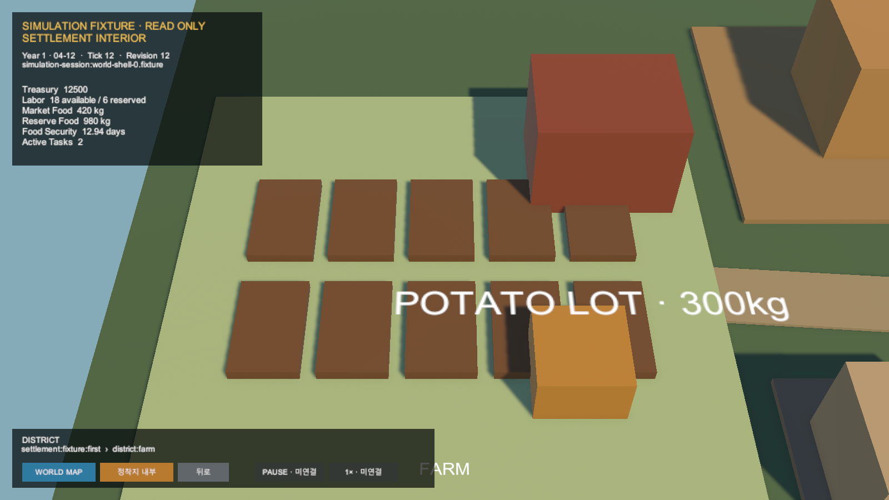
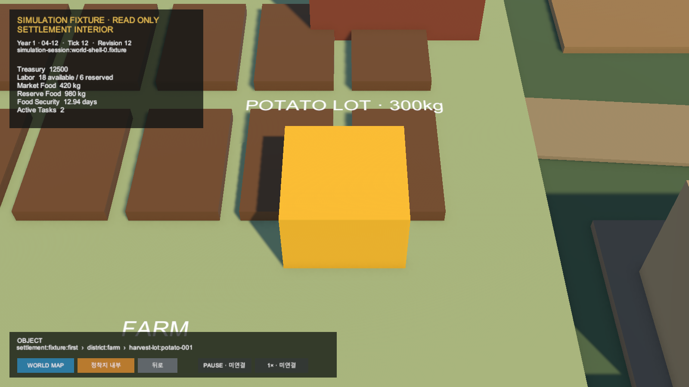

# Unity World·정착지 관찰 규모 Navigation

- 날짜: 2026-08-10
- 범위: `WORLD-SETTLEMENT-NAV-0`
- 화면: 직접 확인

## 변경

- World Map의 Settlement marker에서 Settlement Interior로 이동한다.
- 8개 District surface를 stable ID로 선택하고 Zone camera focus로 이동한다.
- Farm District의 `harvest-lot:potato-001`을 Object focus로 선택한다.
- Back은 Object → District → Settlement → World Map 순서로 이동한다.
- breadcrumb와 선택 강조를 표시하고 상위 선택만 보존한다.

## 권위 경계

- 모든 화면은 같은 Simulation fixture의 Tick 12·Revision 12를 공유한다.
- navigation은 Decision, Task, Effect, 재고와 시간을 변경하지 않는다.
- Pause·Speed는 계속 미연결이다.

## 시각 증거

## 검증

- `SimulationWorldShellTests` 8/8 통과
- Unity 기본 EditMode assembly: 36/47 통과, 기존 삭제 상태의 `Experiments/CityFarmWorld` scene·catalog 부재로 11건 실패
- Play Mode District/Object focus와 Back 3회 뒤 Tick 12·Revision 12 유지
- Play Mode Console 오류 0건
