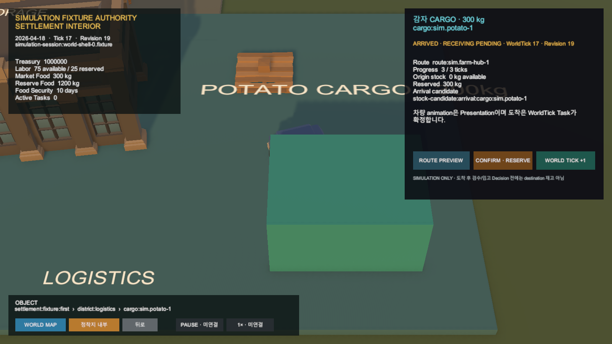

# Simulation 물류 이동과 정착지 재고 예약

## 결과

- 기존 CARGO-1의 `cargo:sim.potato-1`과 HarvestLot·PackageLot lineage를 서버 Simulation session 계약으로 연결했다.
- Preview는 WorldTick·revision·재고를 바꾸지 않고 경로와 도착 재고 후보만 반환한다.
- Confirm은 원천 HarvestLot allocation 300kg을 예약하고 공통 `Decision → Task → Effect`를 만든다.
- 3회의 공통 WorldTick이 같은 Cargo를 `Reserved → InTransit → ArrivedAtDestination`으로 진행한다.
- 도착 결과는 `DestinationStockCandidate`이며 Hub 검수·입고 Decision 전에는 destination 재고로 확정하지 않는다.
- Unity production repository는 공식 물류 Preview·Confirm·Tick API와 expected revision을 사용한다. Game View는 `SimulationFixtureAuthority` test double로 검증했다.

## 시각 증거

화면의 차량·상자와 animation은 Presentation이다. 도착과 재고 예약의 근거는 서버 WorldTick Task snapshot이다.

## 검증

- `SimulationLogisticsMovementTests`: 5/5 통과
- `Ssalddel.Simulation.Tests`: 166/166 통과
- Unity `LogisticsMovementTests`: 4/4 통과
- Unity 기본 EditMode assembly: 69/69 통과
- Play Mode Game View 1600×900 직접 확인, 이번 실행 이후 Console 오류 0건
- scoped Fast 통과. scoped Task는 build 통과 후 이번 범위와 무관한 기존 route·metadata·CSS 기대 7건으로 4,482/4,489 통과

## 미수행

- 실제 운영 화물 배차·운송·입고·정산
- 실제 Simulation Server live 호출
- Hub 검수와 destination stock 확정
- commit·push·배포
