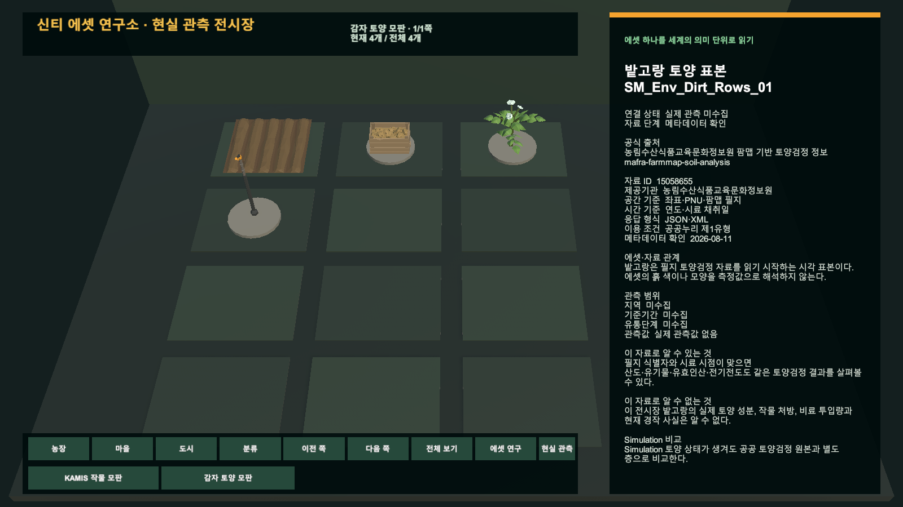
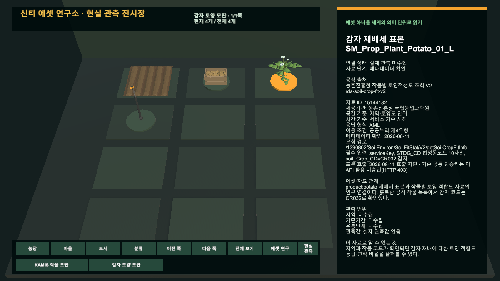

# Unity 감자 토양 모판과 공공자료 출처표

## 결과

신티 에셋 연구소의 첫 화면을 `감자 토양 모판`으로 구성했다. 서로 다른 분류의 밭고랑, 감자 재배체, 감자 수확 상자와 밭 관수 스프링클러를 하나의 연구 질문으로 묶고, 선택한 표본의 공식 자료와 현재 연구 단계를 한국어 카드로 표시한다.

공식 명세와 첫 호출 Gate를 반영한 감자 재배체 카드는 요청 경로, `STDG_CD`, 감자 코드 `CR032`와 HTTP 403 활용 미승인 상태를 보여준다.

## 경계

- 출처표는 자료 ID, 제공기관, 공식 주소, 응답 형식, 공간·시간 기준, 관측 항목, 이용조건과 한계를 보존한다.
- 에셋 연결표는 source asset GUID, 현재 모판 문맥, 알 수 있는 것과 없는 것, Simulation 비교를 별도로 보존한다.
- 네 표본은 모두 `실제 관측 미수집`이며 메타데이터를 실제 토양값, 재배 권고 또는 관수 명령으로 사용하지 않는다.
- 같은 감자 수확 상자가 KAMIS 작물 모판과 감자 토양 모판에 함께 참여해도 현재 모판의 연결을 우선한다.

## 검증

| 항목 | 결과 |
| --- | --- |
| Unity 스크립트 재컴파일 | 오류 0건 |
| `에셋연구-0 생성` Builder | 저장 Scene·Catalog 생성 및 자체 검증 통과 |
| 집중 Unity EditMode | 11/11 통과 |
| Game View | 1600×900 직접 확인 |

공식 명세에서 토양적성 API의 감자 코드 `CR032`와 응답 구조를 확인했다. 기존 공통 인증키의 실제 표본 호출은 두 인코딩 방식 모두 HTTP 403으로 차단됐으며, 성공 응답으로 기록하거나 실제 관측 단계로 승격하지 않았다.

공공데이터포털 활용신청, 운영 저장, commit과 push는 수행하지 않았다.
