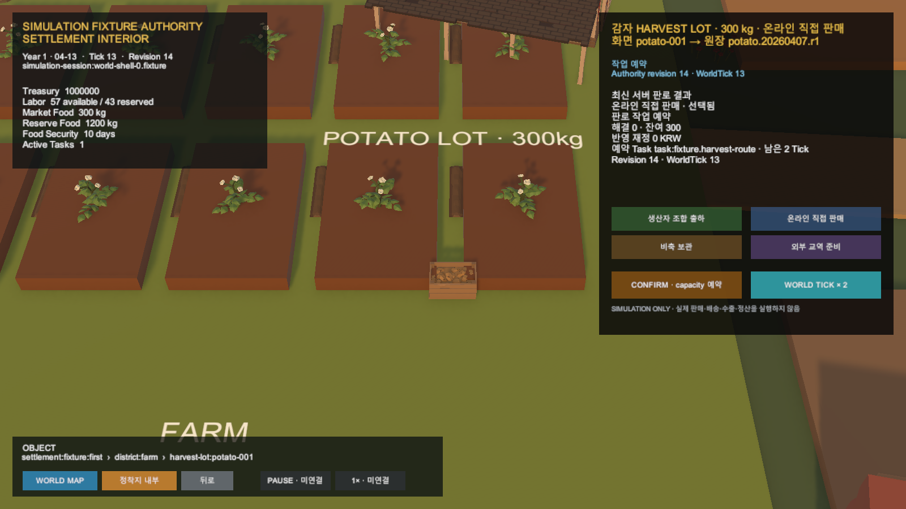

# Unity HarvestLot 다중 원장 선택

## 결과

Unity가 Simulation session의 여러 HarvestLot allocation을 Lot별 Task authority로 보존한다. 사용자가 선택한 Scene object와 명시적으로 mapping된 HarvestLot 결과만 현재 생산자 카드에 연결한다.

## 선택 경계

- Scene object stable ID와 HarvestLot stable ID는 일대일 mapping으로 관리한다.
- 여러 allocation을 한 항목으로 축약하거나 결과 목록의 첫 항목을 자동 선택하지 않는다.
- 선택 Lot을 바꾸면 allocation·Task·Effect·남은 Tick을 같은 Lot 기준으로 함께 교체한다.
- mapping 대상 결과·Task가 없거나 mapping 양쪽이 중복되면 기존 선택을 보존하고 차단한다.
- object 이름, prefab과 표시 순서는 원장 identity가 아니다.
- 서버·Simulation 규칙과 운영 효과는 변경하지 않는다.

## 검증

- Unity 집중 EditMode: 17/17 통과
- Unity 전체 EditMode: 209/210 통과
- 기존 기준선 실패: 연구 Scene 기대 27개, 현재 28개
- HTTP session parsing: 두 allocation과 두 Task를 Lot별로 보존
- 선택 격리: Applied 첫 Lot과 InProgress 두 번째 Lot의 카드·Task 전환 확인
- Play Mode: `화면 potato-001 → 원장 potato.20260407.r1` 표시
- Unity Console 오류: 0건

