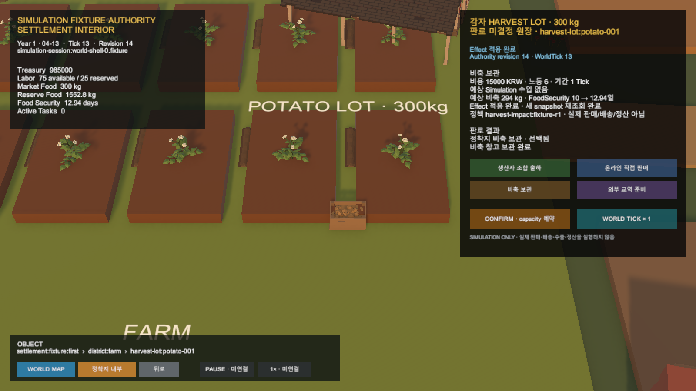

# Unity HarvestLot 판로 결과 카드

## 결과

기존 정착지 HarvestLot 상호작용 카드가 서버 Simulation의 통합 판로 결과를 조회해 보여준다.

- 생산자 조합 출하
- 온라인 직접 판매
- 정착지 비축 보관
- 외부 교역 준비

선택된 경로만 현재 단계와 실제 Simulation 수량·재정·위험 결과를 가지며, 선택하지 않은 경로는 결과가 없는 상태로 유지된다.

## Presentation 경계

Unity는 서버의 단계 code를 조합 인수 대기, 비축 완료, 항만 이동, 가상 수출 도착·손실 같은 한국어 문구로 대응시킨다. 수량과 재정은 다시 계산하지 않는다. 결과 조회 실패도 이미 확정된 Decision·Task·Effect나 session snapshot을 되돌리지 않는다.

## 검증

- Unity 집중 EditMode: 10/10 통과
- Unity 전체 EditMode: 202/203 통과
- 기존 기준선 실패: 연구 Scene 기대 27개, 현재 28개
- Play Mode 비축 완료 경로 실행
- Unity Console 오류: 0건
- 운영 live 서버 호출 없음

