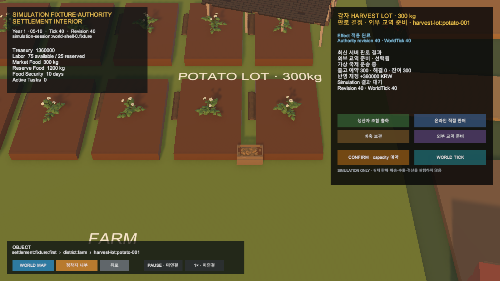

# Unity HarvestLot 판로 재접속 갱신

## 결과

Unity가 기존 Simulation session에 다시 연결되거나 후속 물류 진행 뒤 HarvestLot 카드를 다시 열 때 최신 session snapshot과 판로 결과 목록을 함께 읽는다.

두 응답의 session, revision과 WorldTick이 일치할 때만 화면 상태를 교체한다. 오래된 목록이나 누락된 결과는 기존 카드 상태를 덮어쓰지 않는다.

## 재접속 경계

- 메모리에 판로 Preview가 없어도 한 개 Lot의 선택과 현재 단계를 복원한다.
- `Reserved`와 `Applied` allocation phase를 서버 snapshot에서 읽는다.
- 저장된 Preview가 없으면 Task 기간이나 남은 Tick을 추정하지 않는다.
- 여러 Lot에서는 명시적 object-Lot mapping 없이 임의 항목을 선택하지 않는다.
- 운영 판매·운송·수출 효과를 만들지 않는다.

## 검증

- Unity 집중 EditMode: 12/12 통과
- Unity 전체 EditMode: 204/205 통과
- 기존 기준선 실패: 연구 Scene 기대 27개, 현재 28개
- Play Mode 재접속: 외부 교역 준비, 가상 국제 운송 중, 출고 예약 300kg, revision 40
- Unity Console 오류: 0건
- 서버 및 Simulation 규칙 변경 없음

