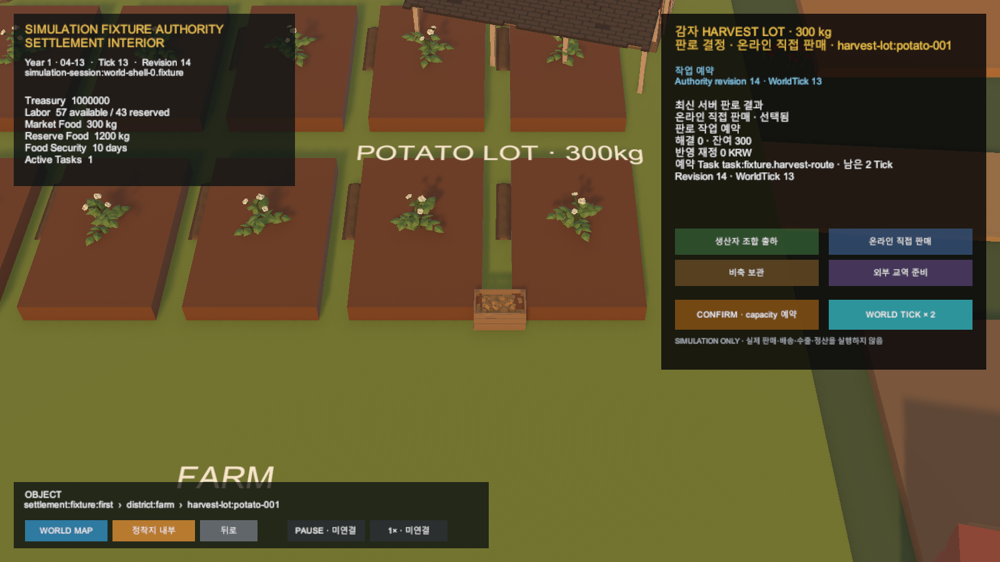

# Unity HarvestLot 예약 작업 재개

## 결과

Unity 생산자 카드가 재접속 뒤 저장된 Preview 없이도 공식 Simulation session snapshot에 남은 예약 Task를 이어갈 수 있다.

카드는 allocation과 연결된 Task stable ID, 상태, 예정 시작 Tick과 완료 Tick을 읽고 `ExpectedEndTick - WorldTick`을 남은 기간으로 표시한다. 이 관계가 모두 유효할 때만 기존 Tick Command를 활성화한다.

## 권위와 실패 경계

- `Reserved` allocation과 활성 Task가 같은 stable ID로 연결되어야 한다.
- Task 상태는 `Scheduled` 또는 `InProgress`여야 한다.
- 남은 Tick은 서버 일정에서 계산하며 cached Preview 기간을 사용하지 않는다.
- 모순되거나 완료 시점이 지난 Task는 최신 카드 상태로 적용하지 않는다.
- 계속 진행은 현재 revision과 남은 Tick을 공식 `/ticks` API에 전달한다.
- Unity는 실제 판매·배송·수출·정산을 만들지 않는다.

## 검증

- Unity 집중 EditMode: 14/14 통과
- Unity 전체 EditMode: 206/207 통과
- 기존 기준선 실패: 연구 Scene 기대 27개, 현재 28개
- Play Mode 재접속: 온라인 직접 판매, Task 진행 중, 남은 2 Tick, revision 14
- 계속 진행 결과: WorldTick 15, revision 16, 온라인 판매 재고 반영
- Unity Console 오류: 0건
- 서버 및 Simulation 규칙 변경 없음

