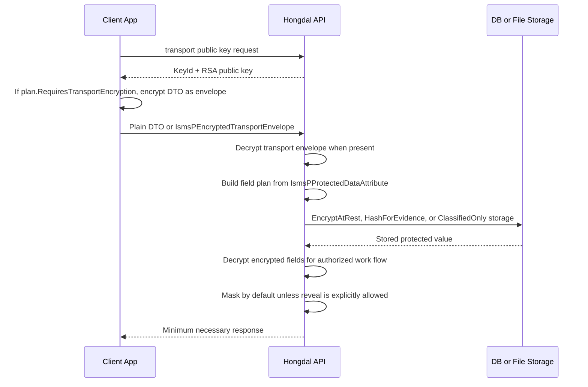

# ISMS-P Protected Data Flow

이 문서는 Hongdal에서 개인정보와 계약 보호 정보가 클라이언트, 서버, DB, 응답 화면을 오갈 때 적용할 기본 흐름을 정리한다. 이 문서는 인증 적합 선언이 아니라 내부 설계 기준이다. 실제 ISMS-P 인증 적합성은 운영 범위, 관리체계 증적, 심사기관 확인으로 판단해야 한다.

공식 기준 참고:

- 개인정보 포털: ISMS-P 인증기준은 관리체계 수립 및 운영, 보호대책 요구사항, 개인정보 처리단계별 요구사항으로 구성된다.  
  https://www.privacy.go.kr/front/contents/cntntsView.do?contsNo=59
- 개인정보 포털 안내서: 정보보호 및 개인정보보호 관리체계(ISMS-P) 인증기준 안내서, 2023년 11월.  
  https://www.privacy.go.kr/front/bbs/bbsView.do?bbsNo=BBSMSTR_000000000049&bbscttNo=20677
- KISA: ISMS-P 인증 심사는 신청, 계약, 인증심사, 보완조치, 심의, 인증서 발급 흐름으로 진행된다.  
  https://www.kisa.or.kr/1050602

## 기본 원칙

모든 데이터를 암호화하지 않는다. 데이터의 성격과 사용 목적에 따라 아래 셋 중 하나로 구분한다.

| 저장 보호 방식 | 의미 | 예시 |
| --- | --- | --- |
| `ClassifiedOnly` | 개인정보 또는 계약 정보로 분류하되, 저장 암호화 대신 목적 제한, 권한, 마스킹, 감사로 통제한다. | 표시명, 도로명주소 2단계, 결제수단, 근무 일정, 통관 진행 상태 |
| `EncryptAtRest` | DB 또는 파일 저장소에 원문을 남기지 않고 복호화 가능한 암호문으로 저장한다. | 연락처, 상세주소, 계좌번호, 위치 좌표, 계약 문서, 완료 사진, 전자서명 증적 |
| `HashForEvidence` | 원문 복구가 필요 없는 증적은 해시로 저장한다. | 접속 IP 증적, 비교용 서명/동의문 해시 |

## 처리 흐름

## 코드 기준

| 책임 | 코드 |
| --- | --- |
| 필드 분류와 보호 방식 | `Hongdal.Contracts/Common/Privacy/PersonalDataFieldProtectionCatalog.cs` |
| DTO 속성 표시 | `IsmsPProtectedDataAttribute` |
| 클라이언트 전송 암호화 판단 | `HongdalIsmsPClientEncryptionService.RequiresEncryptedTransport<T>()` |
| 클라이언트 공통 보호 전송 | `HongdalProtectedApiClient` |
| 클라이언트 envelope 생성 | `hongdal-isms-p-transport.js`, `HongdalIsmsPClientEncryptionService` |
| 서버 envelope 자동 복호화 | `IsmsPEncryptedTransportMiddleware` |
| 서버 transport 복호화 | `RsaOaepAesGcmClientTransportProtectionService` |
| transport 키 활성 메타데이터 | `RedisIsmsPTransportKeyStatusStore` |
| 저장 전 보호 | `IsmsPProtectedDataStorePreparationService` |
| 조회 응답 준비 | `IsmsPProtectedDataResponsePreparationService` |
| AES-256-GCM 저장 암호화와 SHA-256 증적 해시 | `AesGcmIsmsPProtectedDataCryptoService` |

## 현재 보완 상태

- 보호 카탈로그는 `StorageProtectionCode`로 저장 암호화 대상과 비대상을 분리한다.
- `EncryptInTransit`가 필요한 DTO만 클라이언트 envelope 암호화 대상으로 판단할 수 있다.
- 저장 전 처리에서 `AuditOnAccess`만 있다는 이유로 값을 해시하지 않는다.
- IP처럼 복구가 필요 없는 증적은 `HashForEvidence`로 분리한다.
- DB에서 조회한 암호문은 서버에서 복호화한 뒤 기본 응답에서는 마스킹한다.

## 남은 운영 증적

아래 항목은 코드만으로 완료되지 않는다.

- 개인정보 처리방침, 수집 고지, 동의 이력
- 접근권한 신청, 변경, 회수 기록
- 관리자 접근 감사 로그와 정기 점검 기록
- 키 관리 절차, 키 교체, 백업, 폐기 기록
- 외부 API, 클라우드 저장소, 결제대행 등 제3자 제공 또는 위탁 검토 기록
- 침해사고 대응 훈련과 백업/복구 테스트 결과

## Transport Key Metadata

- Redis에는 `KeyId`, 알고리즘, 활성 상태, 발급/만료 시각 같은 transport 키 메타데이터만 저장한다.
- 서버 개인키 원문, DB 저장 암호화 키, hash salt는 Redis가 아니라 비밀 저장소 또는 환경변수에서 관리한다.
- 서버는 암호화 envelope를 복호화하기 전에 Redis의 KeyId 활성 상태를 확인한다.
- Redis의 TTL은 공개키 응답의 `ExpiresAtUtc`와 맞추며, 클라이언트는 만료 전에 공개키를 다시 조회한다.
