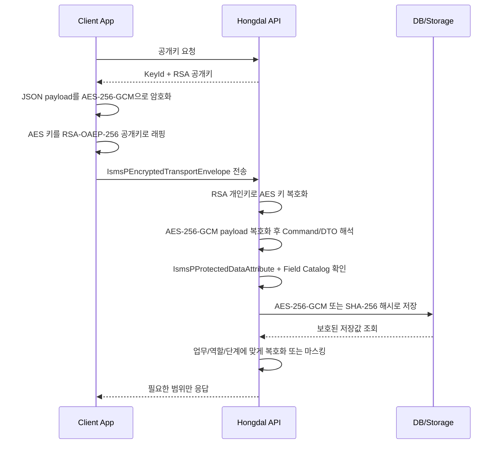

# ISMS-P Readiness

이 문서는 Hongdal의 개인정보 및 계약 데이터 처리 기능을 ISMS-P 관점에서 점검하기 위한 내부 준비도 문서입니다. 실제 ISMS-P 인증 적합 판정은 인증기관/심사기관의 심사, 운영 증적, 보완 조치 결과를 통해 확인되어야 하므로 이 문서는 인증 취득을 보장하지 않습니다.

## 공식 기준 요약

공식 안내 기준은 개인정보보호위원회와 KISA의 ISMS-P 기준을 따른다.

- 개인정보보호위원회 인증심사 기준: 관리체계 수립 및 운영, 보호대책 요구사항, 개인정보 처리단계별 요구사항
- 개인정보 포털 안내서: `정보보호 및 개인정보보호 관리체계(ISMS-P) 인증기준 안내서`, 2023년 11월 개정
- KISA 인증 절차: 심사 신청, 계약, 인증심사, 보완조치, 인증심의, 인증서 발급

참고 링크:

- https://www.pipc.go.kr/np/default/page.do?mCode=D040020000
- https://www.privacy.go.kr/front/bbs/bbsView.do?bbsNo=BBSMSTR_000000000049&bbscttNo=20677
- https://www.kisa.or.kr/1050602

## 현재 판단

현재 프로젝트를 곧바로 ISMS-P 적합 상태라고 판단할 수는 없습니다.

이유는 다음과 같습니다.

- 관리체계 범위, 책임자, 자산 목록, 위험평가, 내부 점검 증적이 아직 운영 문서로 닫혀 있지 않습니다.
- 개인정보 생명주기별 수집 목적, 보유 기간, 파기, 권리 행사 처리 기준이 기능별로 완전히 연결되어 있지 않습니다.
- 계약 데이터, 정산 데이터, 주소, 연락처, 계좌, 통관/거주 정보의 접근권한과 감사 로그 기준이 기능별로 표준화되어야 합니다.
- 외부 API, 클라우드 파일 저장소, 기사/창고/관세사/화주에게 제공되는 데이터가 제3자 제공인지 위탁인지 기능별로 구분되어야 합니다.
- 침해사고 대응, 백업/복구, 운영자 권한 검토, 배포 전 보안 검토가 실제 운영 증적으로 남아야 합니다.

따라서 현재 단계의 목표는 `인증 적합 선언`이 아니라 `개인정보/계약 기능을 배포하기 전 빠진 통제를 확인하는 내부 준비도 체계`를 갖추는 것입니다.

## 추가된 공통 코드

`Hongdal.Contracts/Common/Privacy/IsmsPComplianceReadiness.cs`는 개인정보 또는 계약 데이터를 다루는 기능을 다음 기준으로 점검합니다.

| 영역 | 점검 항목 |
| --- | --- |
| 관리체계 | 관리 책임자와 위험 검토 범위, 계약 조항 검토 |
| 보호대책 | 역할 기반 접근권한, 마스킹/암호화, 감사 로그, 외부자/위탁 검토, 사고 대응 담당, 개발 보안 검토, 백업/복구 |
| 개인정보 처리단계 | 처리 목적과 법적 근거, 최소 수집, 보유/파기 기준, 고지/동의 |

`Hongdal.Contracts/Common/Privacy/PersonalDataFieldProtectionCatalog.cs`는 필드 단위 보호 기준을 관리합니다. 기능 단위로 `HasMaskingOrEncryption=true`를 두는 것만으로는 어떤 필드를 어떻게 보호해야 하는지 흐려지기 때문에, 연락처, 상세주소, 계좌번호, 위치 좌표, 상차/하차 사진, 계약 문서, 통관 참조 정보 같은 필드를 카탈로그로 분리합니다.

| 필드 예시 | 기본 보호 조치 |
| --- | --- |
| 연락처 | 목적 제한, 고지/동의, 기본 마스킹, 저장/전송 보호, 역할 접근, 접근 로그, 보유/파기, 제공/위탁 검토 |
| 상세 주소 | 기본 마스킹, 저장/전송 보호, 단계적 노출, 접근 로그, 보유/파기, 제공/위탁 검토 |
| 계좌번호 | 기본 마스킹, 저장/전송 보호, 정산 담당자 접근 제한, 접근 로그, 보유/파기 |
| 상차/하차 완료 사진 | 증빙 목적 제한, 썸네일 기본 표시, 파일 저장 보호, 다운로드/조회 로그, 보유/파기 |
| 계약 문서 | 문서번호/상태 중심 목록 표시, 저장/전송 보호, 당사자/운영자 접근 제한, 접근 로그 |
| 전자서명 증적 | 서명 완료 여부, 시각, 방법, 문서/동의문/증적 해시 중심 표시, 원본 서명 접근 제한 |

## ISMS-P 보호 어트리뷰트

개인정보나 계약 보호가 필요한 DTO 속성에는 `IsmsPProtectedDataAttribute`를 붙입니다. 어트리뷰트 이름에 `IsmsP`를 포함해 코드만 읽어도 이 속성이 ISMS-P 기준의 보호 대상으로 관리된다는 점이 드러나게 합니다.

```csharp
[IsmsPProtectedData(
    PersonalDataFieldKey.BankAccountNumber,
    "급여 지급 계좌 등록",
    IsContractData = true,
    ProtectionNote = "요청 DTO의 원본 계좌번호는 저장/전송 보호와 접근 로그가 필요")]
public string AccountNumber { get; set; } = string.Empty;
```

적용 기준은 다음과 같습니다.

- `FieldKey`는 `PersonalDataFieldProtectionCatalog`에 등록된 키를 사용합니다.
- `Purpose`는 이 속성을 처리하는 업무 목적을 짧게 적습니다.
- 계약 조건, 지급 조건, 계약 문서처럼 개인정보가 아니어도 계약 보호 대상이면 `IsPersonalData=false`, `IsContractData=true`로 표시합니다.
- 속성별 예외나 단계적 노출 기준은 `ProtectionNote`에 남깁니다.
- 리플렉션 검사에는 `IsmsPProtectedDataAttributeReader`를 사용합니다.

## 전자서명 UI 원칙

계약 서명 패드는 `Hongdal.Ui.Common`의 `HongdalSignatureGate`와 `HongdalSignaturePad`를 사용합니다. 서명 패드는 모든 화면에 상시 노출하지 않고, 업무 단계가 서명을 요구할 때만 렌더링합니다.

예시는 다음과 같습니다.

- 창고 앱: 입고 계약 또는 보관/검수 계약에 서명이 필요한 경우
- 화주/차주 흐름: 거래 양식이나 정산 조건상 서명이 필요한 경우
- 기사 앱: 상차지 인수, 하차지 인수, 하차 완료 확인에 서명이 필요한 경우
- HR 앱: 근로계약서 초안이 서명 가능한 상태가 된 경우

서명 입력 결과는 PNG data URL과 서명자 이름을 UI에서 만들지만, 계약 증적으로 저장할 때는 문서 해시, 동의문 해시, 증적 해시, 서명 시각, 서명 방법을 함께 기록합니다. 원본 서명 이미지나 접근 IP는 필요한 보호 저장소에 두고, 기본 화면에는 해시나 마스킹된 값만 표시합니다.

## 보호 데이터 흐름

ISMS-P 보호 속성이 붙은 값은 다음 흐름을 기본으로 둡니다.



이 흐름은 TLS를 대체하지 않습니다. TLS 위에서 앱 레벨 보호를 한 겹 더 두는 구조입니다.

| 단계 | 구현 위치 | 기준 |
| --- | --- | --- |
| 클라이언트 암호화 | `Hongdal.Ui.Common/Areas/App/wwwroot/js/hongdal-isms-p-transport.js` | `RSA-OAEP-256+A256GCM` |
| 클라이언트 래퍼 | `Hongdal.Ui.Common/Areas/App/Services/HongdalIsmsPClientEncryptionService.cs` | 공개키 응답을 받아 암호화 봉투 생성 |
| 서버 복호화 | `RsaOaepAesGcmClientTransportProtectionService` | 서버 개인키로 AES 키 복호화 후 payload 해석 |
| 저장 전 보호 | `IsmsPProtectedDataStorePreparationService` | `IsmsPProtectedDataAttribute`와 필드 카탈로그 기반 처리 |
| 저장 암호화 | `AesGcmIsmsPProtectedDataCryptoService` | `AES-256-GCM` |
| 증적/검색 해시 | `AesGcmIsmsPProtectedDataCryptoService` | `SHA-256` + salt |

운영 설정은 `IsmsPProtectedData` 섹션에 둡니다. `Aes256GcmKeyBase64`는 정확히 32바이트 Base64 키여야 하고, `TransportPrivateKeyPem`은 서버 비밀 저장소에서 관리합니다. 공개키는 클라이언트 암호화에 사용되지만 개인키와 저장 암호화 키는 저장소에 커밋하지 않습니다.

사용 방식은 기능 프로필을 만들고 `IsmsPReadinessPlanner.Plan(profile)`으로 내부 검토 가능 여부와 빠진 필수 항목을 확인하는 형태입니다.

```csharp
var plan = IsmsPReadinessPlanner.Plan(new PersonalDataContractFeatureProfile(
    FeatureName: "수입 식품 공동 주문 계약서",
    Owner: "플랫폼 운영자",
    ProcessesPersonalData: true,
    ProcessesContractData: true,
    HasPurposeAndLegalBasis: true,
    HasDataMinimization: true,
    HasRetentionAndDestructionRule: true,
    HasConsentOrNotice: true,
    HasRoleBasedAccessControl: true,
    HasMaskingOrEncryption: true,
    HasAuditLog: true,
    HasThirdPartyOrOutsourcingReview: true,
    HasIncidentResponseOwner: true,
    HasBackupOrRecoveryPlan: true,
    HasSecureDevelopmentReview: true,
    HasContractTermsReview: true,
    PersonalDataFieldKeys:
    [
        PersonalDataFieldKey.DisplayName,
        PersonalDataFieldKey.PhoneNumber,
        PersonalDataFieldKey.DetailedAddress,
        PersonalDataFieldKey.PaymentMethod,
        PersonalDataFieldKey.ContractDocument
    ]));
```

`plan.IsReadyForInternalReview`가 `true`라도 이는 내부 검토 준비가 되었다는 뜻입니다. 인증 적합이나 법률 검토 완료를 뜻하지 않습니다.

개인정보를 처리하는 기능은 `PersonalDataFieldKeys`에 필드 목록을 넣어야 합니다. 알 수 없는 필드가 들어오거나 필드 목록이 비어 있으면 `P-05 개인정보 필드 보호 카탈로그` 항목이 미충족으로 남습니다.

## 개인정보/계약 기능 배포 전 체크

개인정보 또는 계약 데이터를 다루는 화면, API, Command, Event는 배포 전 다음 항목을 확인합니다.

- 처리 목적과 법적 근거가 기능 설명 또는 약관/고지에 연결되어 있는가
- 필수/선택 개인정보와 최소 수집 범위가 구분되어 있는가
- 기능이 다루는 개인정보 필드가 `PersonalDataFieldProtectionCatalog`에 등록되어 있는가
- 역할별로 조회/수정/다운로드/승인 권한이 나뉘어 있는가
- 화면에는 주소, 연락처, 계좌, 거주 정보가 필요한 순간에만 마스킹 해제되는가
- 저장/전송 구간에서 암호화가 필요한 필드가 분리되어 있는가
- 개인정보 조회, 계약 상태 변경, 지급 상태 변경, 파일 다운로드가 감사 로그로 남는가
- 보유 기간, 파기 조건, 분쟁 보존 조건이 정의되어 있는가
- 기사, 창고, 관세사, 화주, 외부 API, 클라우드 저장소로 넘어가는 데이터가 제공/위탁 관점에서 정리되어 있는가
- 사고 발생 시 담당자, 통지, 차단, 복구, 재발 방지 절차가 정의되어 있는가
- 백업/복구 주기와 복구 테스트 증적이 있는가

## 수입 식품 공동 주문 계약서 적용 기준

2.5 공동구매의 `수입 식품 공동 주문 계약서`는 개인정보와 계약 데이터가 동시에 섞이는 기능입니다.

최소한 다음 데이터를 민감하게 봅니다.

- 주문자 식별자, 연락 가능 정보, 주문자 집단 범위, 대표 입고지, 수령 지점
- 화주/공급자, 창고, 관세사, 운영자 당사자 정보
- HS 코드, 수입식품 검토 상태, 콜드체인 조건
- 결제 마일스톤, 환불/취소, 분쟁 처리, 분배 확인율

이 기능은 배포 전에 `IsmsPReadinessPlanner`에서 개인정보와 계약 데이터 처리 항목을 모두 통과해야 합니다. 특히 고지/동의, 보유/파기, 마스킹/암호화, 감사 로그, 제3자 제공/위탁 검토, 계약 조항 검토가 빠지면 운영 승인 상태로 넘기지 않습니다.

## 운영 증적 후보

ISMS-P 인증을 실제로 준비하려면 코드 외에도 다음 증적을 남깁니다.

| 증적 | 예시 |
| --- | --- |
| 관리체계 | 정보보호/개인정보 보호 책임자 지정, 범위 정의서, 자산 목록, 위험평가표 |
| 정책/절차 | 개인정보 처리방침, 내부관리계획, 접근권한 정책, 외부자/위탁 관리 절차 |
| 개발/운영 | 보안 리뷰 기록, 취약점 조치 이력, 배포 승인 기록, 로그 모니터링 기록 |
| 개인정보 생명주기 | 수집 고지, 동의 이력, 제3자 제공/위탁 이력, 파기 이력, 권리 행사 처리 이력 |
| 사고/복구 | 사고 대응 훈련, 백업/복구 테스트, 장애/침해사고 보고서 |

## 다음 보완 후보

- 관리자 화면에서 기능별 ISMS-P 준비도 상태를 볼 수 있게 한다.
- 개인정보 필드 카탈로그를 Admin 화면에서 조회하고 필드별 보호 기준 변경 이력을 남긴다.
- 감사 로그 이벤트명을 Command/Event 카탈로그와 연결한다.
- 계약 템플릿마다 개인정보/위탁/제3자 제공/분쟁/파기 조항 체크리스트를 붙인다.
