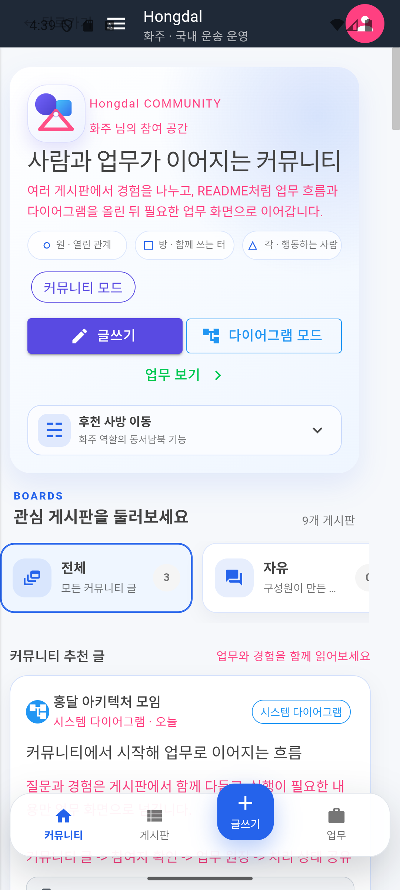

# 첨부 문서

이 폴더는 루트 `README.md`에서 덜어낸 상세 문서를 모아 둡니다. 처음에는 기술 구조보다 **현재 존재하는 화면과 캡처**를 먼저 봅니다.

루트 README는 현재 집중 범위인 문화교통 0.0 커뮤니티·공공데이터 기반을 먼저 보여 줍니다. 이 폴더에서는 글쓰기와 음식·재료 탐색, 참여 동의, 공동 원장과 완료 사례로 이어지는 통합 클라이언트를 먼저 보고, 0.5 이후 화면은 후속 자산으로 구분해 확인합니다.

## 화면으로 먼저 보기

첨부 문서도 기술 구조보다 화면을 먼저 봅니다. 장기 보존 화면은 `docs/ProjectOverview/assets/`와 `docs/assets/changes/`를 기준으로 관리합니다. `artifacts/community-sales-preview/`의 로컬 검증 캡처는 저장소 용량 정리 과정에서 제거했습니다.

일반 글, 질문, 판매, 공동구매는 서로 떨어진 제품이 아닙니다. 같은 게시판에서 가볍게 시작하고, 참여 의사가 모일 때 가원장·역할 슬롯·다이어그램을 붙여 공동행동으로 확장합니다.

### 후속 실행 모듈 참고 화면

| 화주 의뢰 상세 | 기사 지도 홈 |
| --- | --- |
|  |  |

| 기사 추천 상세 | 기사 상하차 증빙 |
| --- | --- |
|  |   |

| 관리자 운송 원장 | 창고 피킹 배치 |
| --- | --- |
|  |  |

### 새 통합 클라이언트

[통합 커뮤니티 클라이언트와 꾸미기 상점](unified-community-client.md)에서 게시판, 글쓰기, 역할 참여, 모바일 세로 다이어그램, 후천 사방 이동판과 꾸미기 흐름을 확인합니다. 화면을 구성하는 상위 원칙은 [Ssalddel 0.0](../Versions/v0.0/README.md)과 [통합 클라이언트 3단계 내비게이션](../Architecture/ThreeStageClientNavigation.md)에 둡니다.

## 먼저 볼 화면 문서

| 번호 | 문서 | 내용 |
| --- | --- | --- |
| 0.0 | [Ssalddel 0.0](../Versions/v0.0/README.md) | 글쓰기 → 가원장 → 역할 슬롯 → 실원장으로 이어지는 현재 제품 범위 |
| 00 | [첨부 문서 목차](00-첨부문서목차.md) | 화면 문서부터 기술 문서까지 읽는 순서 |
| 01 | [page-docs/README.md](page-docs/README.md) | 각 화면별 독립 README와 인라인 캡처, 상세 설명 |
| 01-A | [community-board-field-focus-guide.md](community-board-field-focus-guide.md) | 배달 현장에서 게시판 하나씩 관찰·검토하기 위한 질문, 근거, 안전·개인정보 경계와 16개 업무 게시판 점검표 |
| 02 | [unified-community-client.md](unified-community-client.md) | 통합 홈, 역할, 모바일 다이어그램, 사방 이동, 꾸미기 상점 |
| 03 | [ThreeStageClientNavigation.md](../Architecture/ThreeStageClientNavigation.md) | 사방괘 → 다이어그램 → 구체 데이터 페이지의 사용자 화면 구조 |
| 04 | [app-page-catalog.md](app-page-catalog.md) | 코드 프로젝트에 실제로 선언된 `@page` 화면 전체 카탈로그와 인라인 캡처 |
| 05 | [ssalddel-v1-required-pages.md](ssalddel-v1-required-pages.md) | 레거시 파일명으로 보존된 살뜰 2.0 운송 흐름의 화주, 기사, 관리자 화면 |
| 06 | [ssalddel-v1-page-validation-walkthrough.md](ssalddel-v1-page-validation-walkthrough.md) | 레거시 파일명으로 보존된 2.0 운송 페이지 검증 순서와 확인 항목 |
| 07 | [ssalddel-v1-render-capture-summary.md](ssalddel-v1-render-capture-summary.md) | 실제 화면 캡처 방식, 렌더링 확인 결과, 남은 검증 항목 |
| 08 | [workflow-app-screen-map.md](workflow-app-screen-map.md) | 여러 코드 프로젝트의 화면이 하나의 업무 흐름을 완성하는 관계를 설명 |
| 09 | [screen-flows.md](screen-flows.md) | 화면의 버튼, 노드 행동, 모드 전환이 다음 행동으로 이어지는 흐름 |

## 업무 흐름 문서

| 번호 | 문서 | 내용 |
| --- | --- | --- |
| 08 | [dispatch-flows.md](dispatch-flows.md) | 화물/용달 배차와 음식 배달 배차의 경계 |
| 09 | [warehouse-flows.md](warehouse-flows.md) | 입고, 적재, 출고, 주문 발생 시 창고 알림 흐름 |
| 10 | [orderer-group-commerce-flows.md](orderer-group-commerce-flows.md) | 공동주문, 해외 선적/통관, 국내 운송, 판매채널 출고 흐름 |
| 11 | [version-roadmap.md](version-roadmap.md) | 1.0부터 3.5까지의 단계별 제품 방향 |

## 기술 참고 문서

기술 용어와 내부 구조는 처음 화면을 파악한 뒤에 봅니다.

| 번호 | 문서 | 내용 |
| --- | --- | --- |
| T-01 | [workflow-api-policy.md](workflow-api-policy.md) | API를 화면과 업무 절차 기준으로 관리하는 기준 |
| T-02 | [HIOPSLayerModel.md](../Architecture/HIOPSLayerModel.md) | 원장 블록, OS, 엔진, API의 층위와 책임 경계 |
| T-03 | [DomesticCargoTransportOS.md](../Architecture/DomesticCargoTransportOS.md) | 국내 화물 운송을 운영하는 내부 기준 |
| T-04 | [EngineOverview.md](../Architecture/EngineOverview.md) | OS, 워크플로우, 엔진의 관계 |
| T-05 | [HIOPSAI.md](../Architecture/HIOPSAI.md) | 참여자 입장 해석과 배차 조율을 돕는 AI 방향 |
| T-06 | [OutboundBatchEngine.md](../Architecture/OutboundBatchEngine.md) | 출고 배치와 피킹 배치 판단 기준 |
| T-07 | [DispatchQueueResponsibility.md](../Architecture/DispatchQueueResponsibility.md) | 배차 상태 저장과 실행 자료의 책임 경계 |
| T-08 | [hiops-ai-judgment-cases.md](hiops-ai-judgment-cases.md) | AI 판단 보조를 만들기 위한 상황별 판단 사례 |
| T-09 | [glossary.md](glossary.md) | POD, BL, 3PL, 레그, RAG 같은 주요 용어 정의 |
| T-10 | [Blazor_Maui_공통화_1차.md](../Architecture/Blazor_Maui_공통화_1차.md) | 네이티브 기능이 꼭 필요한 경우를 제외하고 MudBlazor 컴포넌트 UI를 기본으로 삼는 기준 |

## 관리 원칙

1. 루트 README에는 커뮤니티 0.0 기반, 0.5 개별주문과 1.0 공동주문의 제품 의도·대표 화면을 먼저 두고, 1.5 이후 화면은 후속 모듈로 구분한다.
2. 화면별 README와 전체 페이지 카탈로그를 첨부 문서의 앞순위에 둔다.
3. OS, 엔진, AI, API 같은 기술 설명은 뒤쪽 참고 문서로 둔다.
4. 새 화면을 추가하면 `app-page-catalog.md`, `page-docs/`, 캡처 이미지부터 갱신한다.
5. 화면 간 상태 전파나 시퀀스는 `workflow-app-screen-map.md`에 둔다.
6. 사용자 내비게이션은 3단계 화면 구조로 먼저 설명하고, 프로젝트별 표는 코드 위치를 찾는 용도로 사용한다.
