# 코드 프로젝트별 전체 페이지 카탈로그

이 문서는 홍달 저장소 안의 클라이언트 프로젝트에 선언된 `@page` 라우트를 코드 위치별로 모은 전체 페이지 카탈로그다. 사용자에게 별도 앱을 강제하는 내비게이션 목록이 아니라, 통합 클라이언트 화면의 구현 파일을 찾기 위한 물리 색인이다. 사용자 화면은 [통합 클라이언트 3단계 내비게이션](../Architecture/ThreeStageClientNavigation.md)의 `사방괘 → 다이어그램 → 구체 데이터 페이지` 순서로 이해한다.

## 문서 기준

| 기준 | 설명 |
| --- | --- |
| 수집 기준 | `*.razor` 파일의 `@page` 라우트 선언 |
| 페이지 ID / 제목 | 실제 프로젝트명을 접두사로 붙인 `ProjectName-P번호`와 사람이 읽는 화면 제목을 함께 표기 |
| 필수 워크플로우 연결 | 1.0 필수 페이지 문서와 직접 연결되는 경우 같은 ID를 병기 |
| 분류 | `필수`, `보조`, `확장`, `운영`, `시스템` |
| 캡처 | 실제 캡처 파일이 있으면 `완료`, 인증 장벽이 먼저 뜨면 `인증 필요`, 현재 실행 표면이 없으면 `캡처 대기`로 표시 |
| 제외 기준 | `@page`가 없는 공용 컴포넌트, 서비스, 레이아웃, 팝업 내부 섹션 |

전체 페이지 캡처 파일은 `docs/ProjectOverview/assets/app-pages/{앱명}/{페이지ID}.png`에 둔다. 기존 1.0 대표 캡처는 링크 안정성을 위해 `docs/ProjectOverview/assets/v1-pages/`에도 남긴다.

화면별 상세 설명은 [화면별 상세 README](page-docs/README.md)에서 코드 프로젝트별/페이지별로 확인한다. 이 카탈로그는 빠른 색인이고, 개별 README는 캡처와 화면 책임, 사용자/참여자, API/보안 점검을 함께 둔다.

## 통합 클라이언트 3단계 색인

| 단계 | 화면 형태 | 현재 구현 위치 | 문서에서 확인할 것 |
| --- | --- | --- | --- |
| 공통 셸 | 역할 선택, 커뮤니티, 하단 내비게이션 | `ShipperApp`의 `/`, `/shipper`, `MainLayout` | 역할이 바뀔 때 세 단계의 메뉴와 문맥이 함께 바뀌는가 |
| 1단계 | 후천 사방 이동판 | `PlatformCommunityHome` 내부의 `HongdalLaterHeavenBaguaNavigator` | 역할별 네 방향과 관련 다이어그램 진입 |
| 2단계 | 원장 관계·흐름 다이어그램 | `PlatformCommunityHome` 다이어그램 모드 | 단일·연결·복합 원장 경계, 노드 요약, 상태, 진행도, 행동 메뉴 |
| 3단계 | 목록·상세·작업 페이지 | 아래 `@page` 카탈로그 | 한 페이지가 한 가지 조회·입력·처리 책임을 갖는가 |

### 대표 원장 구성

| 2단계 표시 단위 | 원장 구성 | 다음 탐색 |
| --- | --- | --- |
| 음식 주문·배달 연결 묶음 | 음식 주문 원장 1건 → 음식 배달 원장 0..N건 | 묶음 개요 → 주문 또는 첫 배달·분할·재배달 회차 → 노드별 데이터 페이지 |
| 공동구매 복합 원장 | 수요 → 수입 결정 → 선적/통관 → 입고/분배 | 복합 개요 → 하위 원장 세부 다이어그램 → 창고·운송을 포함한 데이터 페이지 |

연결 묶음의 원장은 각각 별도 상태와 권한을 유지한다. 복합 원장은 하위 원장의 진행을 요약하고 필요한 외부 원장으로 인계한다. 자세한 원장 관계는 [3단계 내비게이션 문서](../Architecture/ThreeStageClientNavigation.md)의 원장 다이어그램 기준을 따른다.

### 대표 노드에서 3단계 페이지로

| 2단계 노드 | 행동 메뉴 | 현재 3단계 라우트 예시 |
| --- | --- | --- |
| 창고 | 입고 내역 | `/shipper/inbound/requests` |
| 창고 | 재고 목록 | `/shipper/warehouse/inventory` |
| 창고 | 현장 스캔 | `/shipper/warehouse/scan` |
| 운송 | 운송 업무 | `/shipper/transport` |
| 운송 의뢰 | 의뢰 상세 | `/shipper/request/{RequestId}` |
| 상품·판매채널 | 판매 주문 | `/shipper/sales/orders` |
| 마트 주문 | 피킹·포장 | `/mart/picking` |
| 운송 원장 | 이벤트·증빙·정산 | `/transports/{RequestId}/events`, `/proofs`, `/settlement` |

위 표는 내비게이션 계약의 목표 연결이다. 공통 노드 행동 메뉴와 다이어그램 문맥 전달이 아직 연결되지 않은 항목은 기존 페이지가 있어도 3단계 연결 완료로 보지 않는다.

## 코드 프로젝트 요약

| 코드 프로젝트 | 페이지 수 | 주 사용자 | 현재 포함 화면 |
| --- | ---: | --- | --- |
| `ShipperApp` | 30 | 화주, 창고 관리자, 판매자, 물류 의뢰자 | 통합 커뮤니티, 역할 전환, 운송 의뢰, 창고/입고, 꾸미기 상점 |
| `DriverApp` | 23 | 기사 | 운행 시작, 추천, 수락/거절, 상차/하차, 정산, 알림 |
| `HongdalAdmin` | 42 | 관리자, 운영자 | 배차, 운송 원장, 문서/POD, 결제/정산, 정책 운영 |
| `WarehouseManagerApp` | 13 | 창고 관리자, 작업자 | 작업 보드, 입고 검수, 스캔, 피킹 배치, 알뜰살뜰 마트 창고 |
| `OrdererApp` | 8 | 주문자, 공동구매 참여자 | 공동구매, 음식/마트 주문, 화물 주문, 주문 이력 |
| `RestaurantDeskApp` | 5 | 음식점/매장 운영자 | 주변/인기 음식점, 리뷰 관리, 배차 주소 |
| `HumanResourcesManagerApp` | 1 | 인사/고용 담당자 | 인사 관리 홈 |

## 캡처 진행 현황

| 상태 | 수 | 의미 |
| --- | ---: | --- |
| 완료 | 118 | 현재 문서에서 인라인 이미지로 바로 확인할 수 있는 화면 |
| 인증 필요 | 0 | 관리자 보호 라우트도 개발용 인증 세션과 문서용 메모리 데이터로 운영 화면까지 캡처한 상태 |
| 캡처 대기 | 4 | 운송 업무, 내 꾸미기 만들기, Admin Fake PG/정산, 마트 피킹/포장 전용 캡처 필요 |

## ShipperApp

| 페이지 ID / 제목 | 라우트 | 파일 | 분류 | 화면 책임 | 필수 연결 | 캡처 |
| --- | --- | --- | --- | --- | --- | --- |
| `ShipperApp-P00 - 역할 기반 통합 커뮤니티 홈` | `/` | `ShipperApp/Components/Pages/UnifiedHome.razor` | 필수 | 현재 역할에 맞는 화주 또는 창고 관리자 홈 선택 | - | 완료  |
| `ShipperApp-P01 - 화주 업무 홈, 운송 의뢰/상태/창고/판매 업무 진입` | `/shipper` | `ShipperApp/Components/Pages/Home.razor` | 필수 | 커뮤니티와 화주 업무 요약, 목적별 업무 진입 | `ShipperApp-P01` | 완료 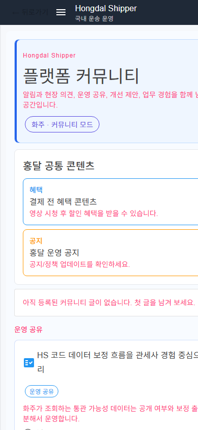 |
| `ShipperApp-P01-1 - 화주 프로필과 운영 프로필 설정` | `/shipper/settings/profile` | `ShipperApp/Components/Pages/ShipperProfileSettings.razor` | 보조 | 화주 프로필과 운영 프로필 설정 | - | 완료 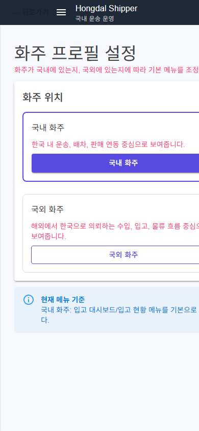 |
| `ShipperApp-P01-2 - 화주 앱 메뉴/화면 노출 설정` | `/shipper/settings/views` | `ShipperApp/Components/Pages/ShipperViewSettings.razor` | 보조 | 화주 앱 메뉴/화면 노출 설정 | - | 완료 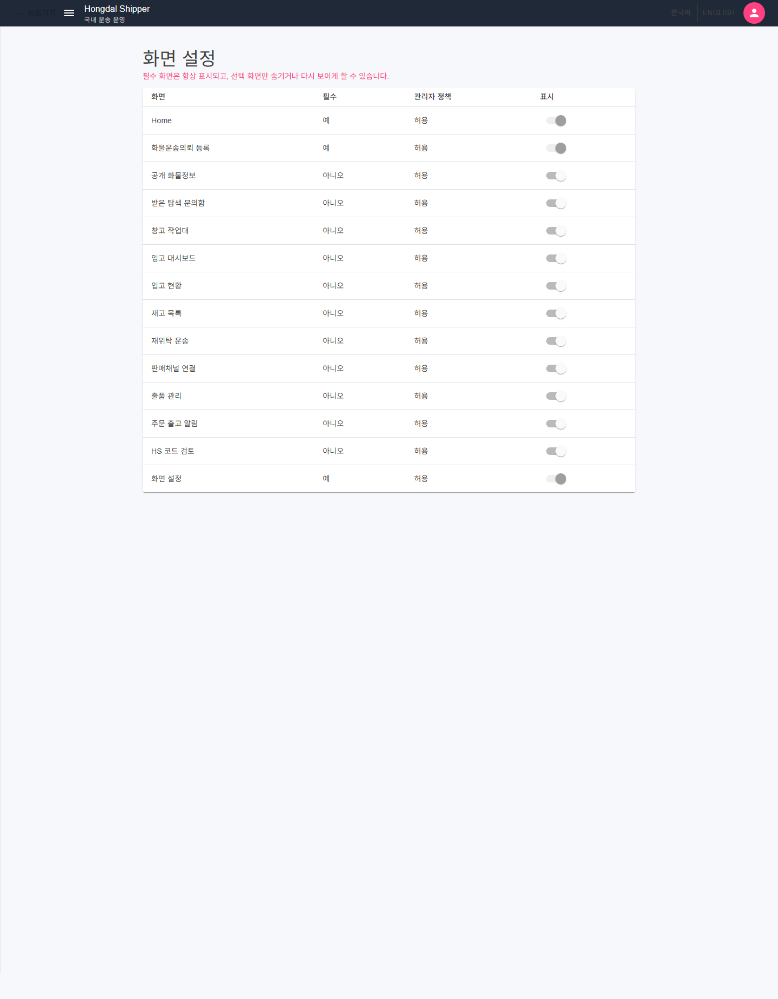 |
| `ShipperApp-P01-3 - 공개 화물 또는 공개 의뢰 확인` | `/shipper/public-cargo` | `ShipperApp/Components/Pages/PublicCargo.razor` | 확장 | 공개 화물 또는 공개 의뢰 확인 | - | 완료 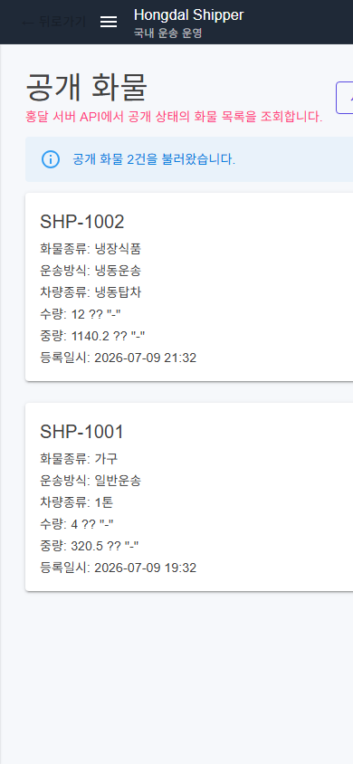 |
| `ShipperApp-P01-4 - 탐색/제안성 업무 수신함` | `/shipper/exploration/inbox` | `ShipperApp/Components/Pages/ExplorationInbox.razor` | 확장 | 탐색/제안성 업무 수신함 | - | 완료 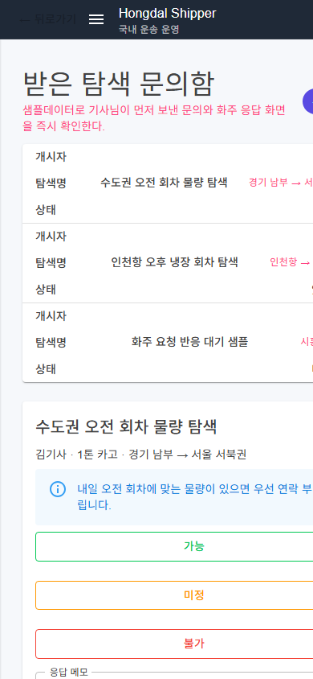 |
| `ShipperApp-P02 - 운송 의뢰 작성` | `/shipper/request` | `ShipperApp/Components/Pages/ShipperRequestWizard.razor` | 필수 | 운송 의뢰 작성 | `ShipperApp-P02` | 완료 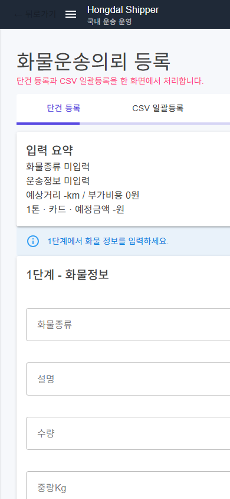 |
| `ShipperApp-P02-1 - 운송 의뢰 대량 등록` | `/shipper/request/bulk` | `ShipperApp/Components/Pages/ShipperBulkImport.razor` | 보조 | 운송 의뢰 대량 등록 | `ShipperApp-P02-1` | 완료 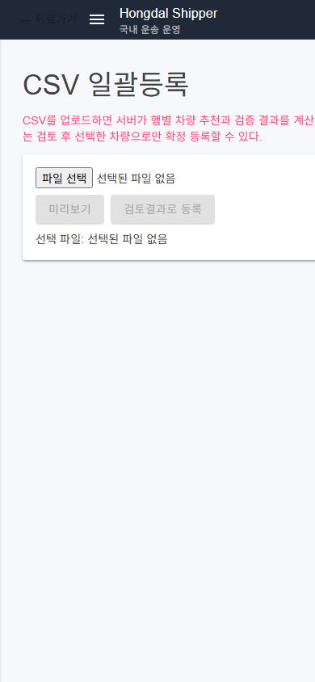 |
| `ShipperApp-P02-2 - 배차 주소 입력/검증 폼` | `/dispatch/address-form` | `ShipperApp/Components/Pages/DispatchAddressForm.razor` | 보조 | 배차 주소 입력/검증 폼 | - | 완료 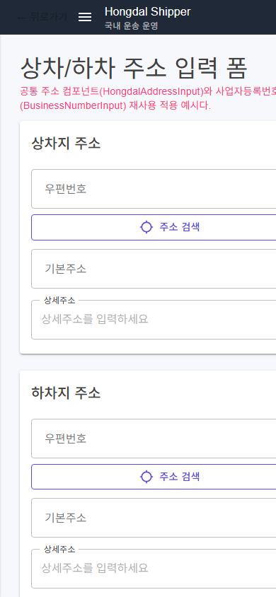 |
| `ShipperApp-P03 - 의뢰 상세, 결제/배차/상차/하차/정산 타임라인` | `/shipper/request/{RequestId}` | `ShipperApp/Components/Pages/ShipperRequestDetail.razor` | 필수 | 의뢰 상세, 결제/배차/상차/하차/정산 타임라인 | `ShipperApp-P03` | 완료  |
| `ShipperApp-P04 - 화주 입고 업무 대시보드` | `/shipper/inbound/dashboard` | `ShipperApp/Components/Pages/InboundDashboard.razor` | 확장 | 화주 입고 업무 대시보드 | - | 완료 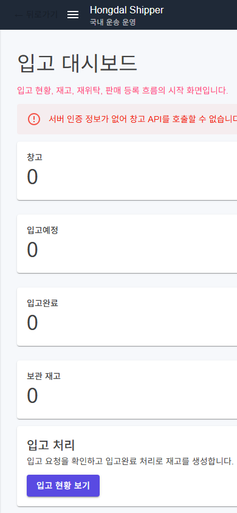 |
| `ShipperApp-P04-1 - 입고 요청 목록과 처리` | `/shipper/inbound/requests` | `ShipperApp/Components/Pages/InboundRequests.razor` | 확장 | 입고 요청 목록과 처리 | - | 완료 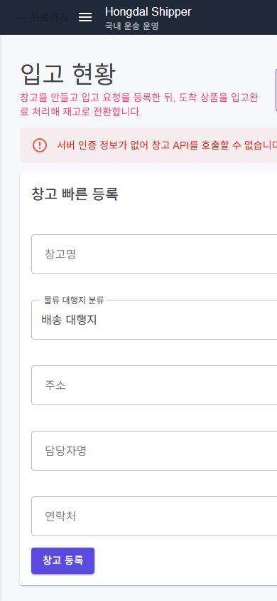 |
| `ShipperApp-P05 - 화주 관점 창고 업무 허브` | `/shipper/warehouse/workspace` | `ShipperApp/Components/Pages/WarehouseWorkspace.razor` | 확장 | 화주 관점 창고 업무 허브 | - | 완료 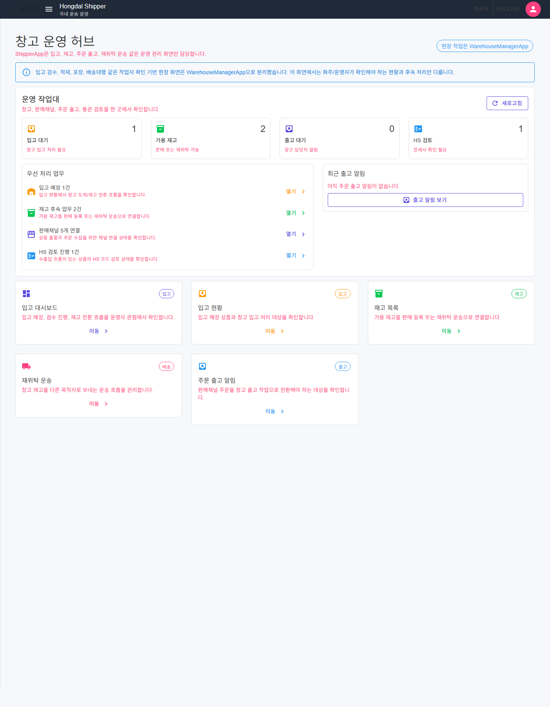 |
| `ShipperApp-P05-1 - 창고 재고 조회` | `/shipper/warehouse/inventory` | `ShipperApp/Components/Pages/WarehouseInventory.razor` | 확장 | 창고 재고 조회 | - | 완료 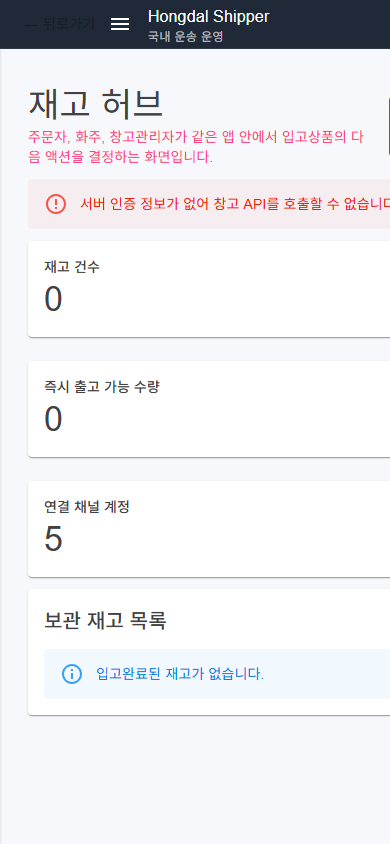 |
| `ShipperApp-P05-2 - 창고 스캔 작업` | `/shipper/warehouse/scan` | `ShipperApp/Components/Pages/WarehouseScanStation.razor` | 확장 | 창고 스캔 작업 | - | 완료 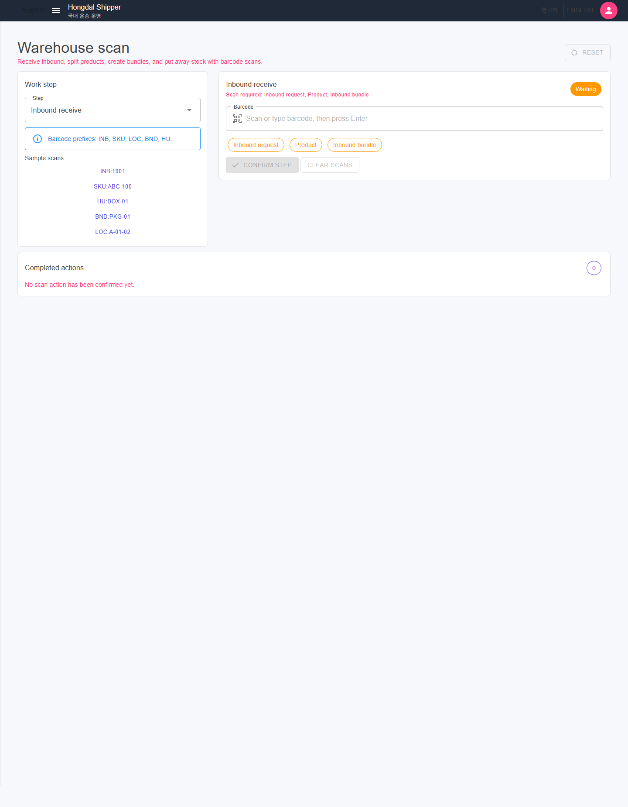 |
| `ShipperApp-P05-3 - 창고 프로세스별 작업 시작` | `/shipper/warehouse/work/{ProcessCode}` | `ShipperApp/Components/Pages/WarehouseWorkStart.razor` | 확장 | 창고 프로세스별 작업 시작 | - | 완료 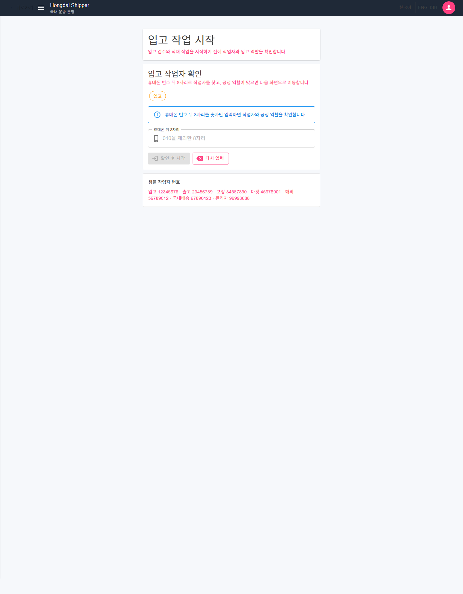 |
| `ShipperApp-P06 - 판매채널 연결/관리` | `/shipper/sales/channels` | `ShipperApp/Components/Pages/SalesChannels.razor` | 확장 | 판매채널 연결/관리 | - | 완료 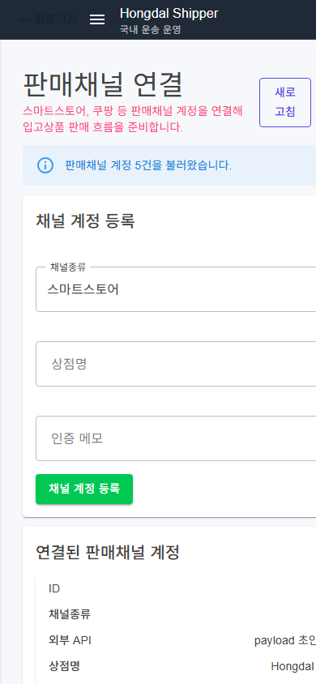 |
| `ShipperApp-P06-1 - 상품 등록/리스팅` | `/shipper/sales/listings` | `ShipperApp/Components/Pages/ProductListings.razor` | 확장 | 상품 등록/리스팅 | - | 완료 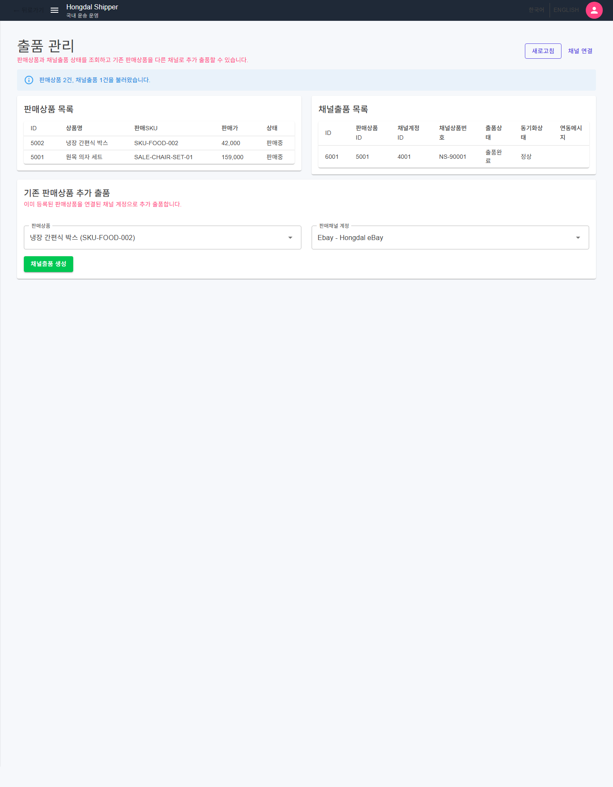 |
| `ShipperApp-P06-2 - 판매 주문 이행/출고 연결` | `/shipper/sales/orders` | `ShipperApp/Components/Pages/OrderFulfillment.razor` | 확장 | 판매 주문 이행/출고 연결 | - | 완료 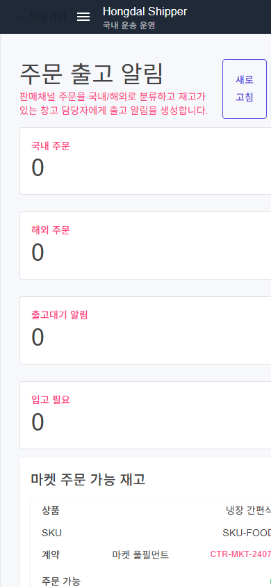 |
| `ShipperApp-P07 - FCL/LCL 해외 물류 계획` | `/shipper/international/fcl-lcl` | `ShipperApp/Components/Pages/FclLclPlanner.razor` | 확장 | FCL/LCL 해외 물류 계획 | - | 완료 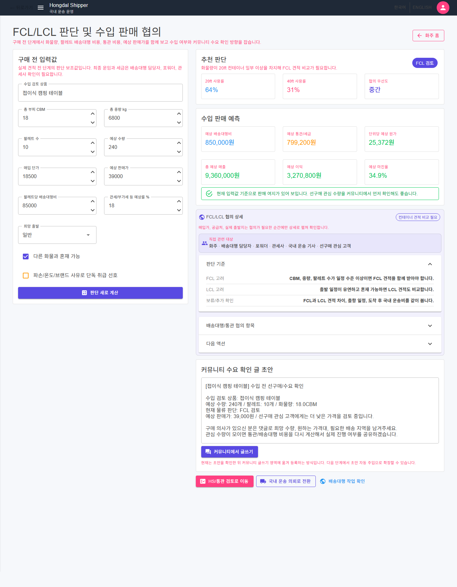 |
| `ShipperApp-P07-1 - HS 코드/통관 검토` | `/shipper/customs/hs-reviews` | `ShipperApp/Components/Pages/CustomsHsReviews.razor` | 확장 | HS 코드/통관 검토 | - | 완료 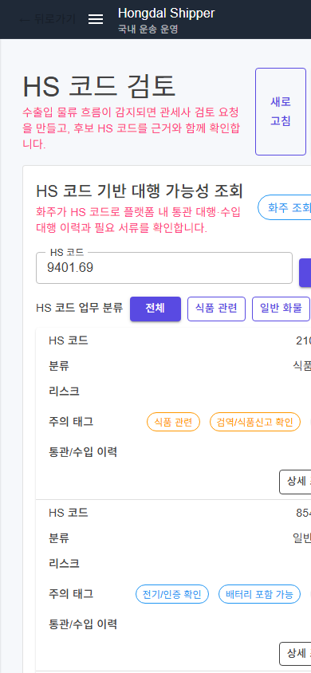 |
| `ShipperApp-P08 - 재위탁/재운송 주문` | `/shipper/reconsignment/orders` | `ShipperApp/Components/Pages/ReconsignmentOrders.razor` | 확장 | 재위탁/재운송 주문 | - | 완료 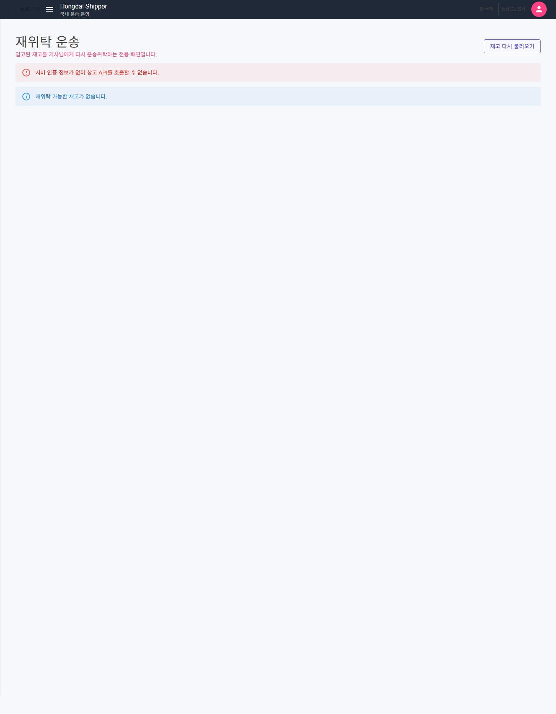 |
| `ShipperApp-P09 - 운송 업무 워크스페이스` | `/shipper/transport` | `ShipperApp/Components/Pages/TransportWorkspace.razor` | 필수 | 의뢰별 결제·배차·운송 진행 상태와 다음 행동 처리 | - | 캡처 대기 |
| `ShipperApp-P10 - 꾸미기 상점` | `/community/decorations` | `ShipperApp/Components/Pages/CommunityDecorationStorePage.razor` | 확장 | 플랫폼·크리에이터·보유 꾸미기 상품 탐색 | - | 완료  |
| `ShipperApp-P10-1 - 꾸미기 상품 상세` | `/community/decorations/{ProductKey}` | `ShipperApp/Components/Pages/CommunityDecorationDetailPage.razor` | 확장 | 상품 미리보기, 구매·적용 판단 | - | 완료  |
| `ShipperApp-P10-2 - 꾸미기 FakePG 결제` | `/community/decorations/{ProductKey}/checkout` | `ShipperApp/Components/Pages/CommunityDecorationCheckoutPage.razor` | 개발·확장 | 실제 청구 없는 개발용 구매 승인 흐름 | - | 완료  |
| `ShipperApp-P10-3 - 내 꾸미기 만들기` | `/community/decorations/create` | `ShipperApp/Components/Pages/CommunityDecorationCreatePage.razor` | 확장 | 개인 괘상·다이어그램 노드 이미지 제작 | - | 캡처 대기 |
| `ShipperApp-P90 - 템플릿/샘플성 날씨 화면` | `/weather` | `ShipperApp/Components/Pages/Weather.razor` | 시스템 | 템플릿/샘플성 날씨 화면 | - | 완료 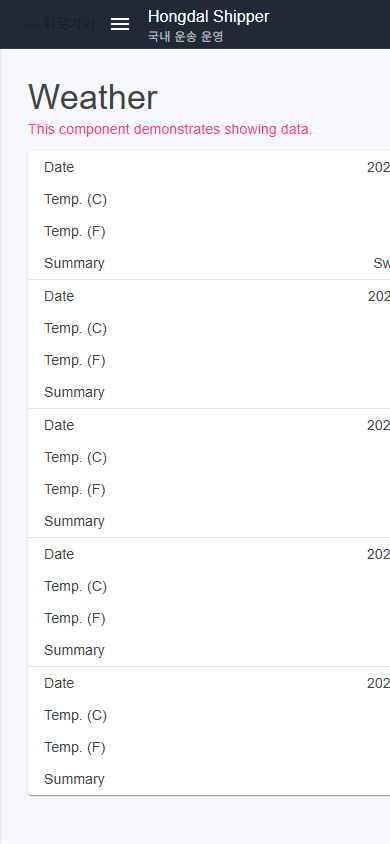 |
| `ShipperApp-P91 - 템플릿/샘플성 카운터 화면` | `/counter` | `ShipperApp/Components/Pages/Counter.razor` | 시스템 | 템플릿/샘플성 카운터 화면 | - | 완료 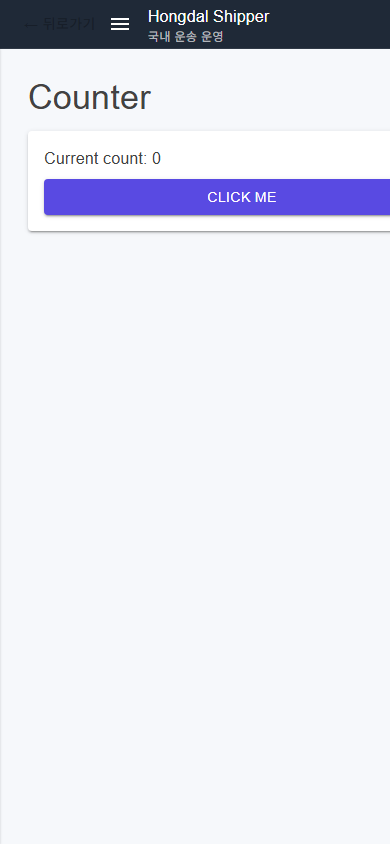 |
| `ShipperApp-P99 - 미발견 페이지` | `/not-found` | `ShipperApp/Components/Pages/NotFound.razor` | 시스템 | 미발견 페이지 | - | 완료 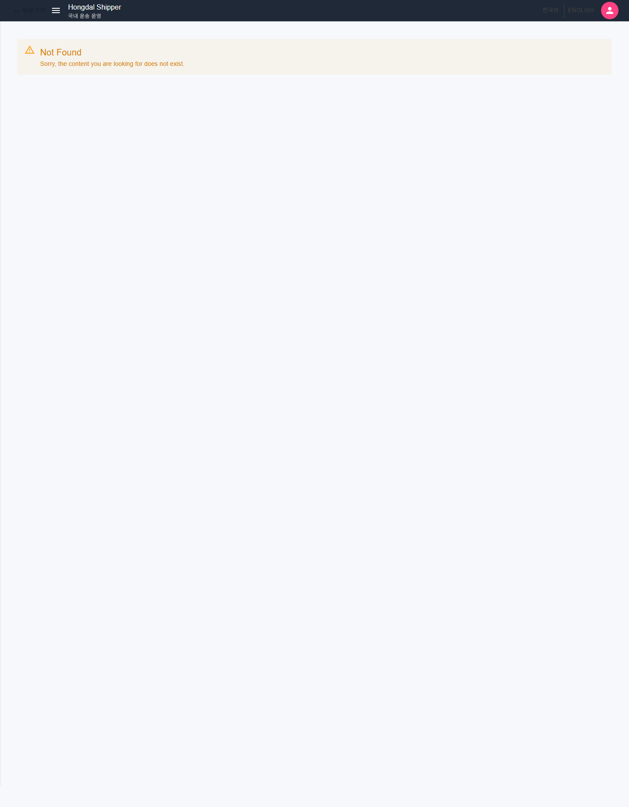 |

## DriverApp

| 페이지 ID / 제목 | 라우트 | 파일 | 분류 | 화면 책임 | 필수 연결 | 캡처 |
| --- | --- | --- | --- | --- | --- | --- |
| `DriverApp-P00 - 기사 앱 시작 라우트 리다이렉트` | `/` | `DriverApp/Components/Pages/RootRedirect.razor` | 시스템 | 기사 앱 시작 라우트 리다이렉트 | - | 완료 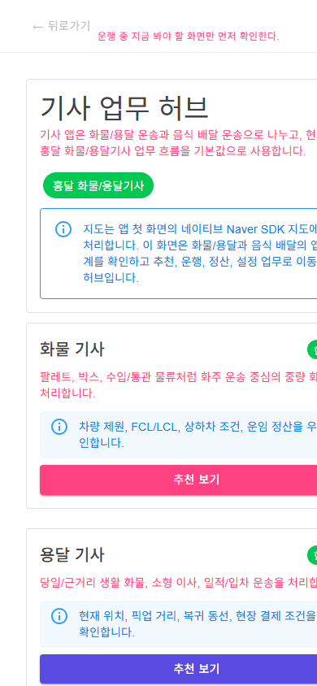 |
| `DriverApp-P01 - 로그인` | `/login` | `DriverApp/Components/Pages/Login.razor` | 시스템 | 로그인 | - | 완료 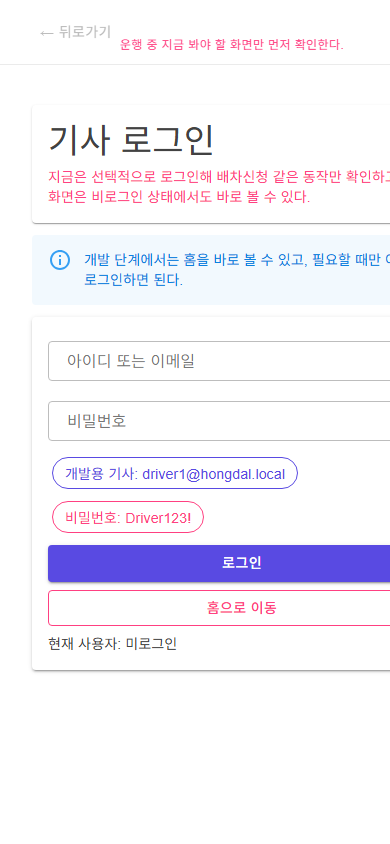 |
| `DriverApp-P02 - 기사 앱 메뉴` | `/driver/menu` | `DriverApp/Components/Pages/Driver/04_Settings/메뉴Page.razor` | 보조 | 기사 앱 메뉴 | - | 완료 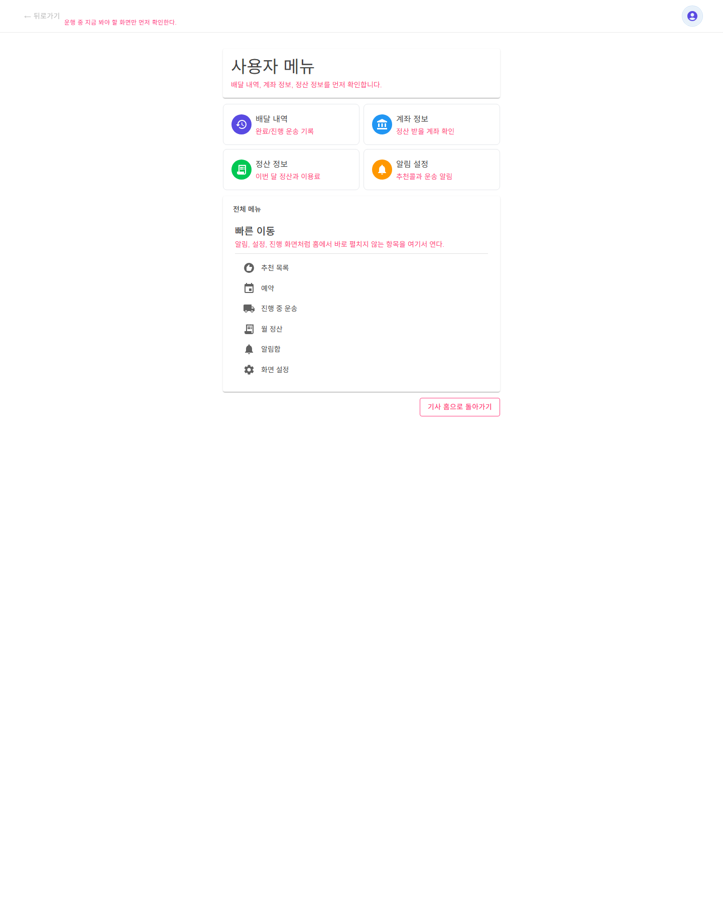 |
| `DriverApp-P02-1 - 기사 앱 화면 노출 설정` | `/driver/settings/views` | `DriverApp/Components/Pages/Driver/04_Settings/화면설정Page.razor` | 보조 | 기사 앱 화면 노출 설정 | - | 완료 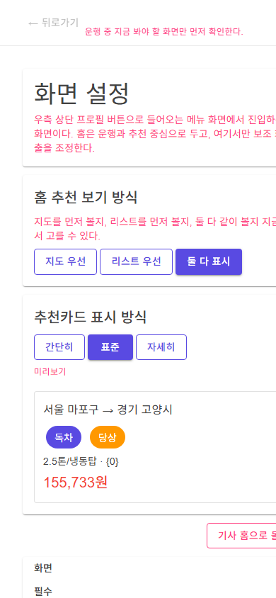 |
| `DriverApp-P03 - 예약 운송 또는 예약 업무` | `/driver/reservations` | `DriverApp/Components/Pages/Driver/04_Reservation/예약Page.razor` | 확장 | 예약 운송 또는 예약 업무 | - | 완료 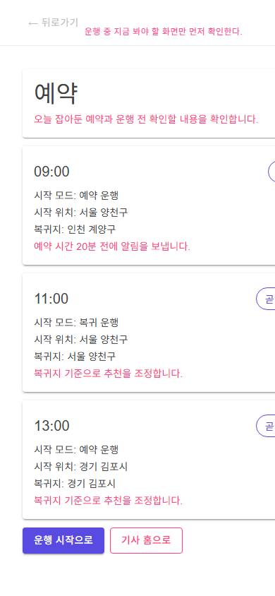 |
| `DriverApp-P04 - 탐색 캠페인/추천 확장` | `/driver/exploration/campaigns` | `DriverApp/Components/Pages/Driver/02_Recommendation/탐색캠페인Page.razor` | 확장 | 탐색 캠페인/추천 확장 | - | 완료 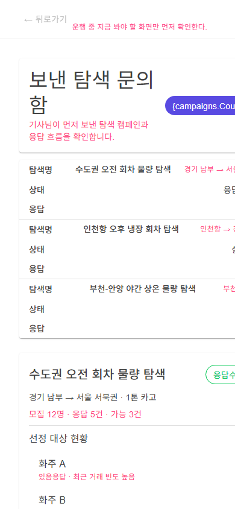 |
| `DriverApp-P05 - 운송/배달 이력 조회` | `/driver/transports/history` | `DriverApp/Components/Pages/Driver/03_Progress/배달내역Page.razor` | 보조 | 운송/배달 이력 조회 | - | 완료 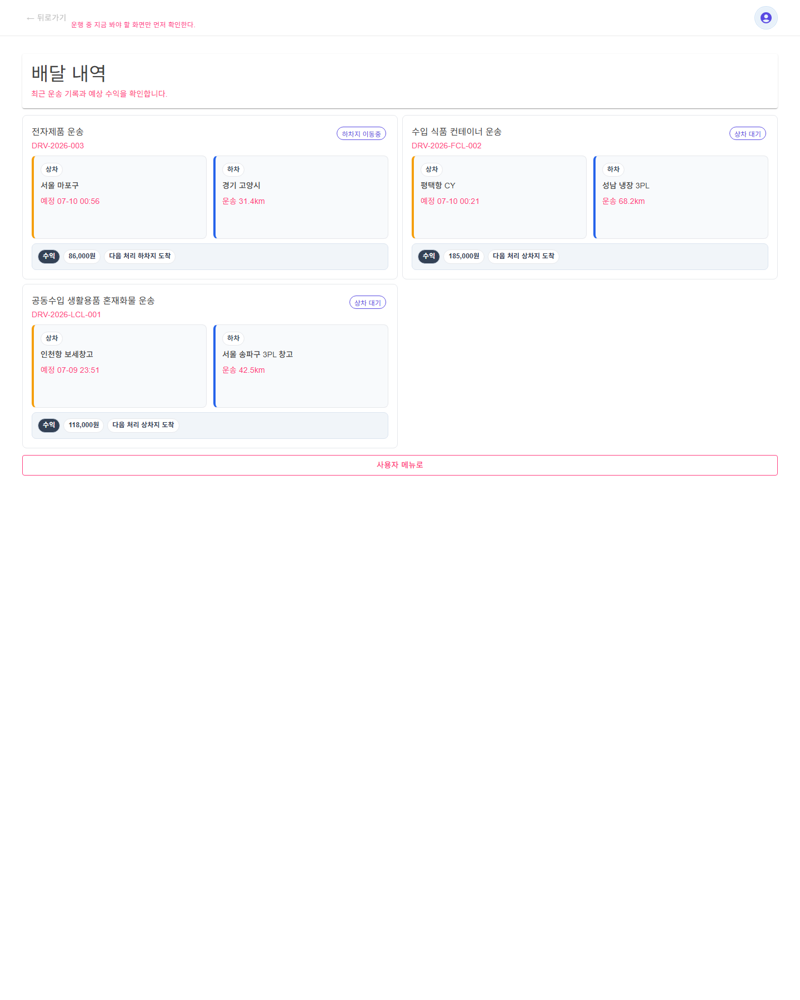 |
| `DriverApp-P06 - 운행 시작, 위치 송신 시작` | `/driver/work/start` | `DriverApp/Components/Pages/Driver/01_Work/운행시작Page.razor` | 필수 | 운행 시작, 위치 송신 시작 | `DriverApp-P06` | 완료  |
| `DriverApp-P06-1 - 운행 조건과 선호 설정` | `/driver/work/settings` | `DriverApp/Components/Pages/Driver/04_Settings/운행설정Page.razor` | 보조 | 운행 조건과 선호 설정 | `DriverApp-P06-1` | 완료 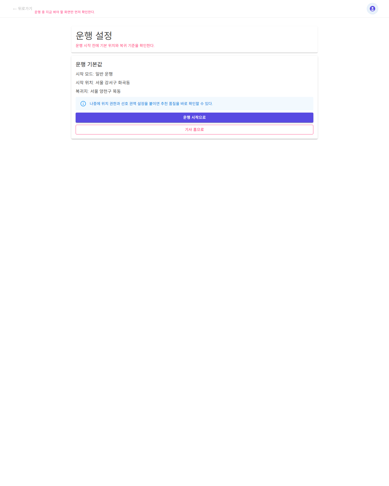 |
| `DriverApp-P07 - 지도 홈, 추천 배너, 현재 운송 진입` | `/driver/home` | `DriverApp/Components/Pages/Home.razor` | 필수 | 지도 홈, 추천 배너, 현재 운송 진입 | `DriverApp-P07` | 완료  |
| `DriverApp-P07-1 - 기사 업무 허브/요약` | `/driver/home/summary` | `DriverApp/Components/Pages/Driver/Home/기사홈Page.razor` | 보조 | 기사 업무 허브/요약 | `DriverApp-P07-1` | 완료 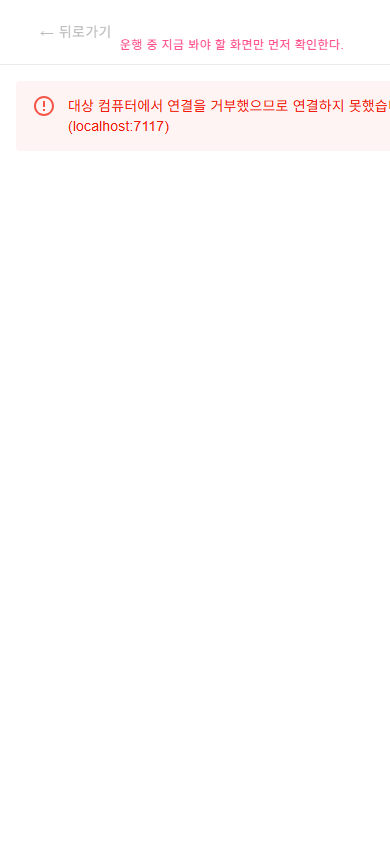 |
| `DriverApp-P08 - 추천 목록` | `/driver/recommendations` | `DriverApp/Components/Pages/Driver/02_Recommendation/추천목록Page.razor` | 필수 | 추천 목록 | `DriverApp-P08` | 완료 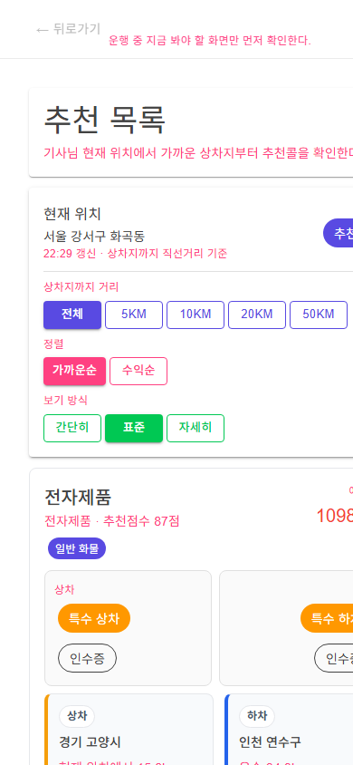 |
| `DriverApp-P09 - 추천 상세와 판단 정보` | `/driver/recommendations/{의뢰Id}` | `DriverApp/Components/Pages/Driver/02_Recommendation/추천상세Page.razor` | 필수 | 추천 상세와 판단 정보 | `DriverApp-P09` | 완료  |
| `DriverApp-P10 - 추천 수락/거절/보류 처리` | `/driver/recommendations/{의뢰Id}/decision` | `DriverApp/Components/Pages/Driver/02_Recommendation/배차처리Page.razor` | 필수 | 추천 수락/거절/보류 처리 | `DriverApp-P10` | 완료 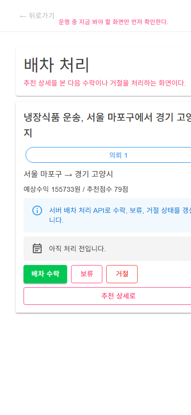 |
| `DriverApp-P11 - 진행 중 운송과 다음 행동` | `/driver/transports/current` | `DriverApp/Components/Pages/Driver/03_Progress/진행중운송Page.razor` | 필수 | 진행 중 운송과 다음 행동 | `DriverApp-P11` | 완료 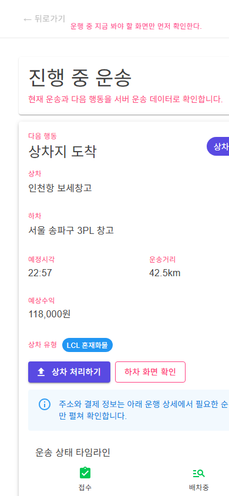 |
| `DriverApp-P12 - 상차 증빙, 상차 예외` | `/driver/transports/{운송Id:long}/pickup` | `DriverApp/Components/Pages/Driver/03_Progress/상차Page.razor` | 필수 | 상차 증빙, 상차 예외 | `DriverApp-P12` | 완료  |
| `DriverApp-P13 - 하차 증빙, POD, 하차 예외` | `/driver/transports/{운송Id:long}/dropoff` | `DriverApp/Components/Pages/Driver/03_Progress/하차Page.razor` | 필수 | 하차 증빙, POD, 하차 예외 | `DriverApp-P13` | 완료  |
| `DriverApp-P14 - 월정산 확인` | `/driver/settlements/current-month` | `DriverApp/Components/Pages/Driver/05_Settlement/월정산Page.razor` | 필수 | 월정산 확인 | `DriverApp-P14` | 완료 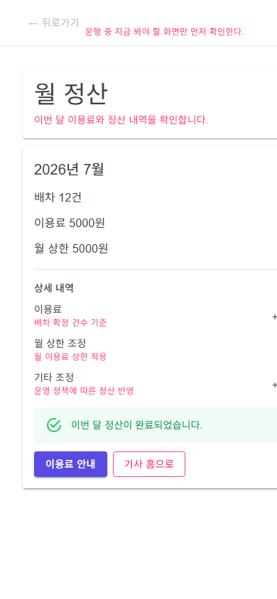 |
| `DriverApp-P14-1 - 이용료/정산 정책 안내` | `/driver/settlements/info` | `DriverApp/Components/Pages/Driver/05_Settlement/이용료안내Page.razor` | 보조 | 이용료/정산 정책 안내 | `DriverApp-P14-1` | 완료 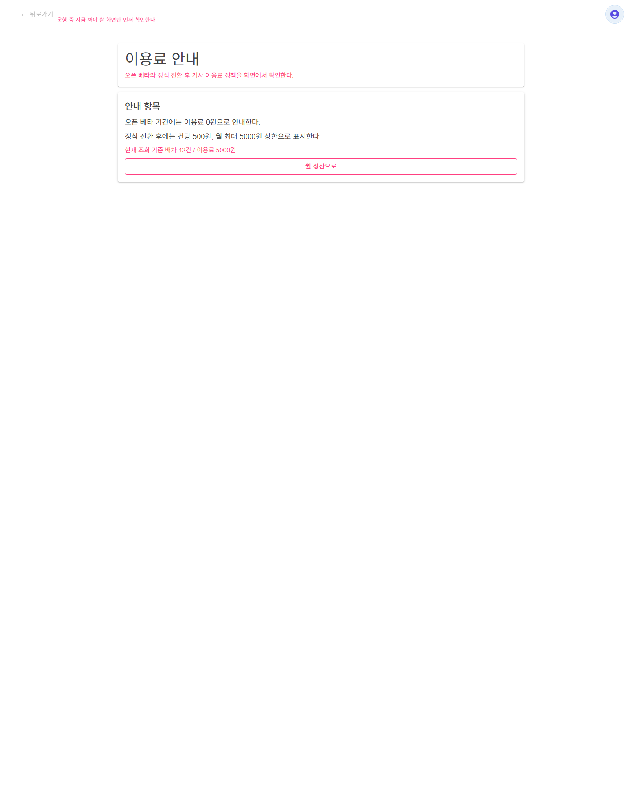 |
| `DriverApp-P14-2 - 기사 정산 계좌 정보` | `/driver/account/bank` | `DriverApp/Components/Pages/Driver/05_Settlement/계좌정보Page.razor` | 보조 | 기사 정산 계좌 정보 | - | 완료 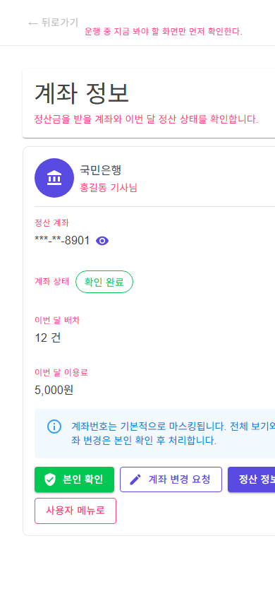 |
| `DriverApp-P15 - 알림함` | `/driver/notifications` | `DriverApp/Components/Pages/Driver/06_Notification/알림함Page.razor` | 필수 | 알림함 | `DriverApp-P15` | 완료 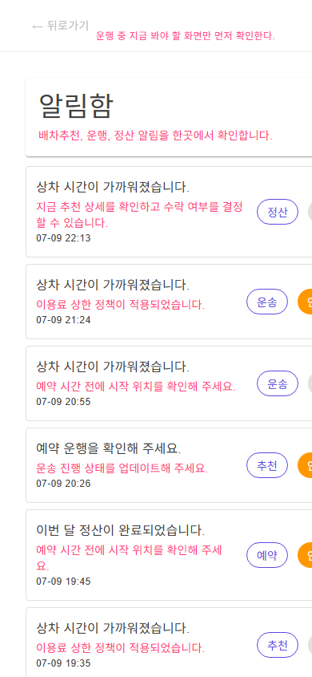 |
| `DriverApp-P15-1 - 알림 수신 설정` | `/driver/notifications/settings` | `DriverApp/Components/Pages/Driver/04_Settings/알림설정Page.razor` | 보조 | 알림 수신 설정 | `DriverApp-P15-1` | 완료 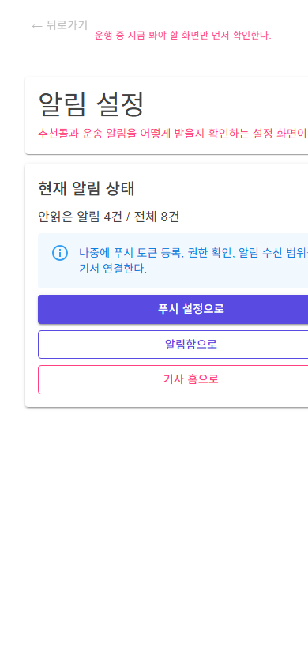 |
| `DriverApp-P15-2 - 푸시 토큰/권한 설정` | `/driver/notifications/push` | `DriverApp/Components/Pages/Driver/06_Notification/푸시설정Page.razor` | 보조 | 푸시 토큰/권한 설정 | `DriverApp-P15-2` | 완료 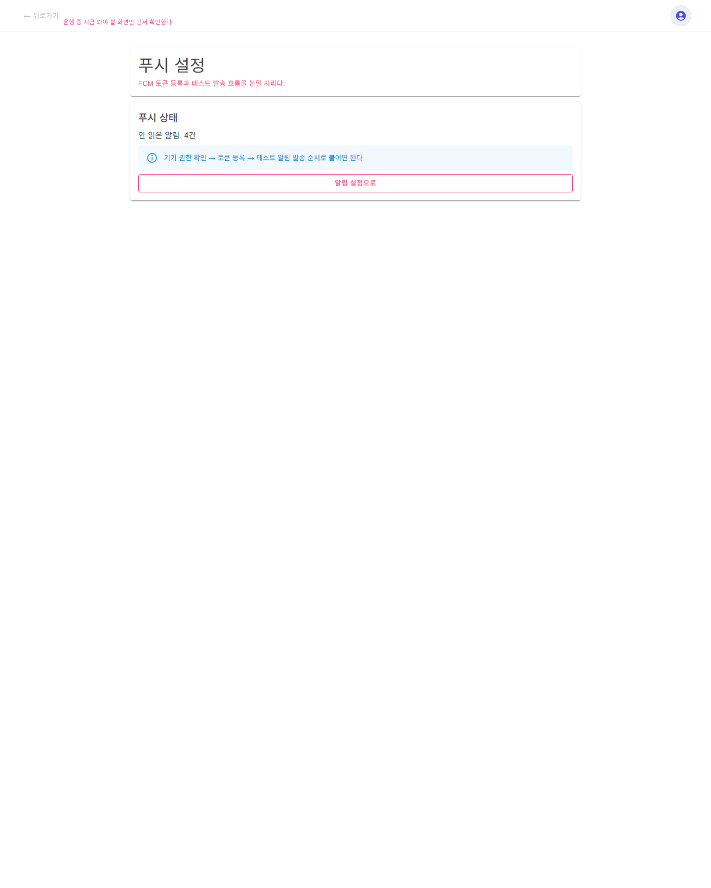 |

## HongdalAdmin

| 페이지 ID / 제목 | 라우트 | 파일 | 분류 | 화면 책임 | 필수 연결 | 캡처 |
| --- | --- | --- | --- | --- | --- | --- |
| `HongdalAdmin-P00 - 관리자 홈` | `/` | `HongdalAdmin/Components/Pages/Home.razor` | 시스템 | 관리자 홈 | - | 완료 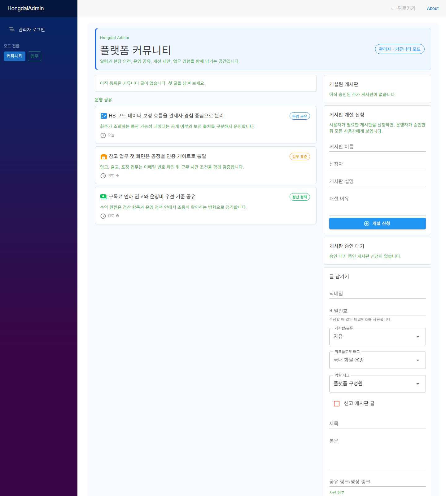 |
| `HongdalAdmin-P00-1 - 관리자 로그인` | `/login` | `HongdalAdmin/Components/Pages/AdminLogin.razor` | 시스템 | 관리자 로그인 | - | 완료  |
| `HongdalAdmin-P00-2 - 오류 화면` | `/Error` | `HongdalAdmin/Components/Pages/Error.razor` | 시스템 | 오류 화면 | - | 완료 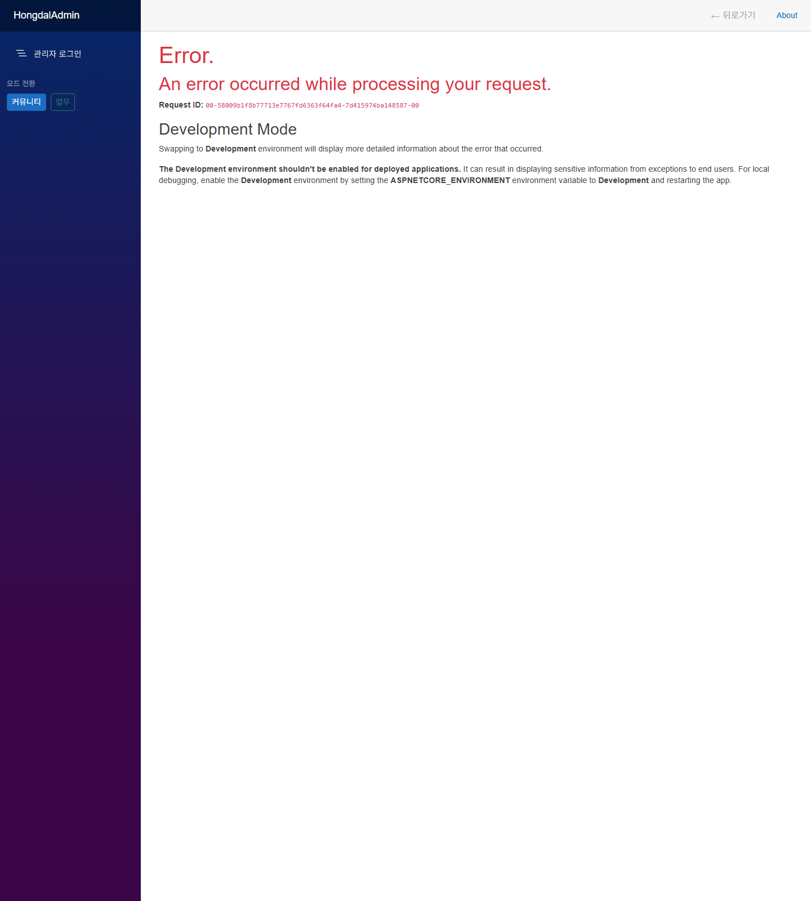 |
| `HongdalAdmin-P16 - 운영 대시보드` | `/dashboard` | `HongdalAdmin/Components/Pages/Dashboard.razor` | 필수 | 운영 대시보드 | `HongdalAdmin-P16` | 완료 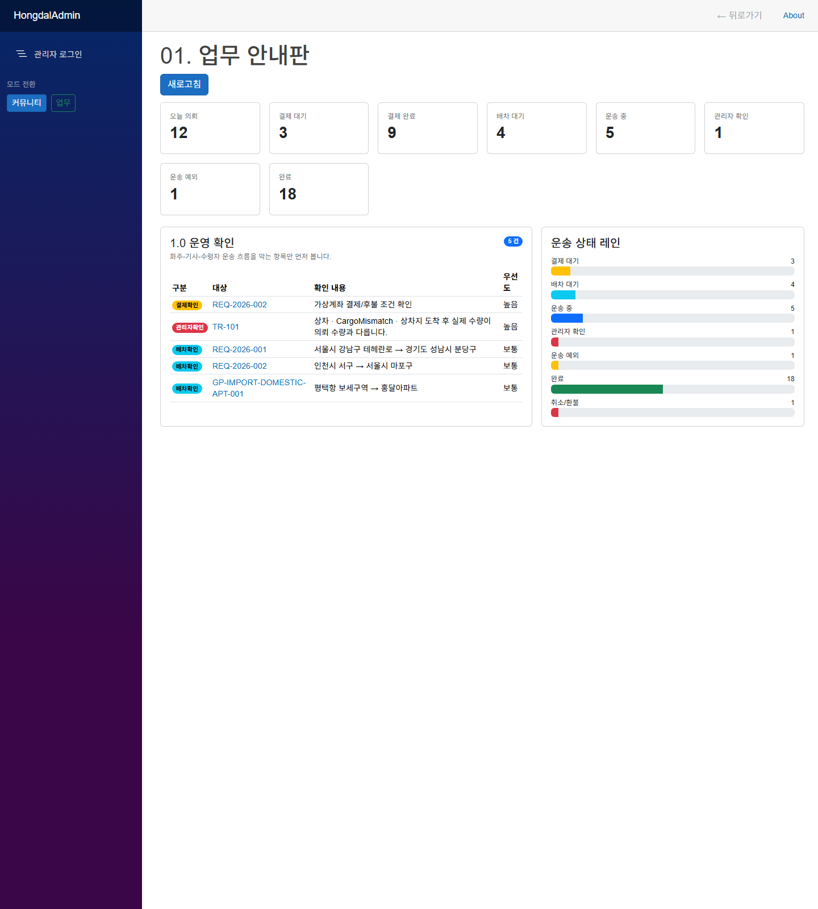 |
| `HongdalAdmin-P17 - 의뢰 목록` | `/requests` | `HongdalAdmin/Components/Pages/Requests.razor` | 필수 | 의뢰 목록 | `HongdalAdmin-P17` | 완료 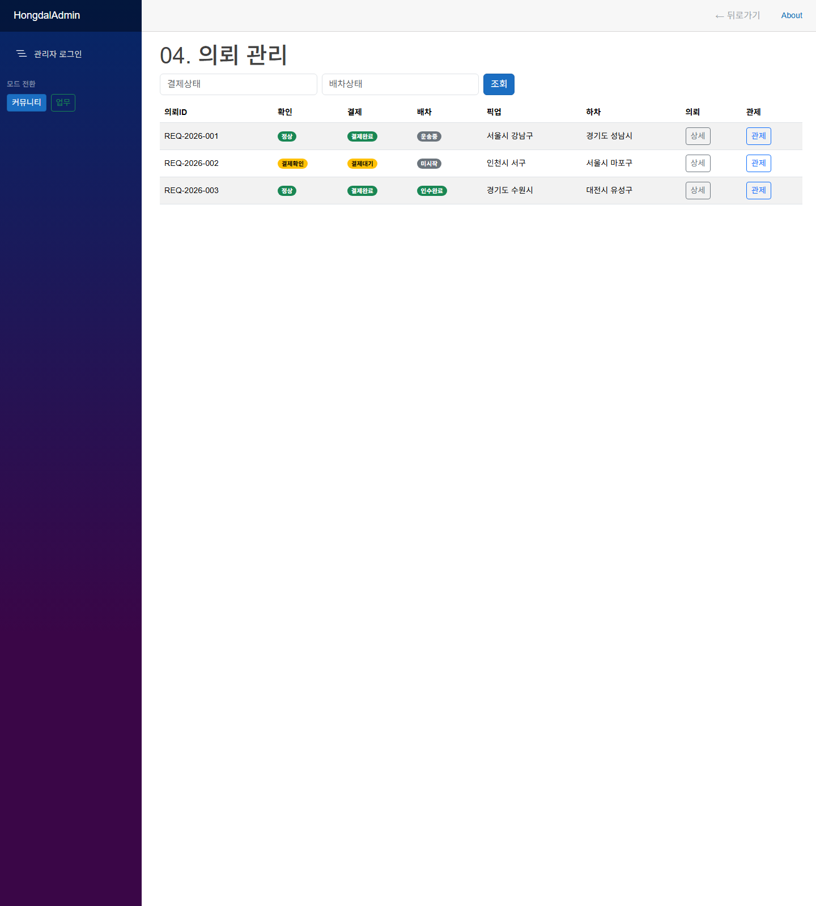 |
| `HongdalAdmin-P18 - 의뢰 상세` | `/requests/{RequestId}` | `HongdalAdmin/Components/Pages/RequestDetail.razor` | 필수 | 의뢰 상세 | `HongdalAdmin-P18` | 완료 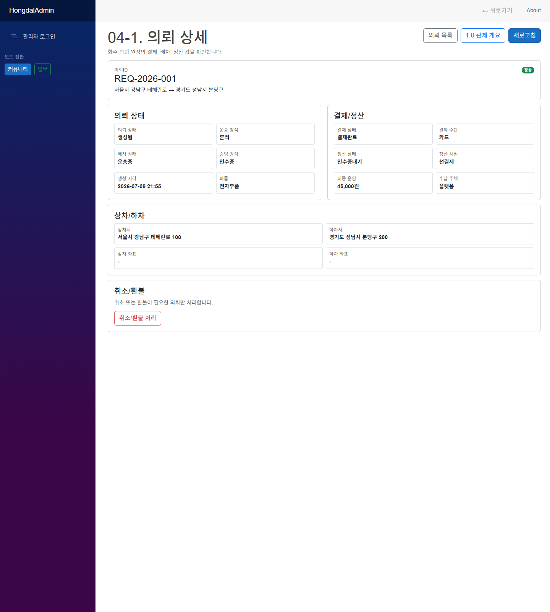 |
| `HongdalAdmin-P19 - 배차대기/추천 잠금 상태` | `/dispatch/wait` | `HongdalAdmin/Components/Pages/DispatchWait.razor` | 필수 | 배차대기/추천 잠금 상태 | `HongdalAdmin-P19` | 완료 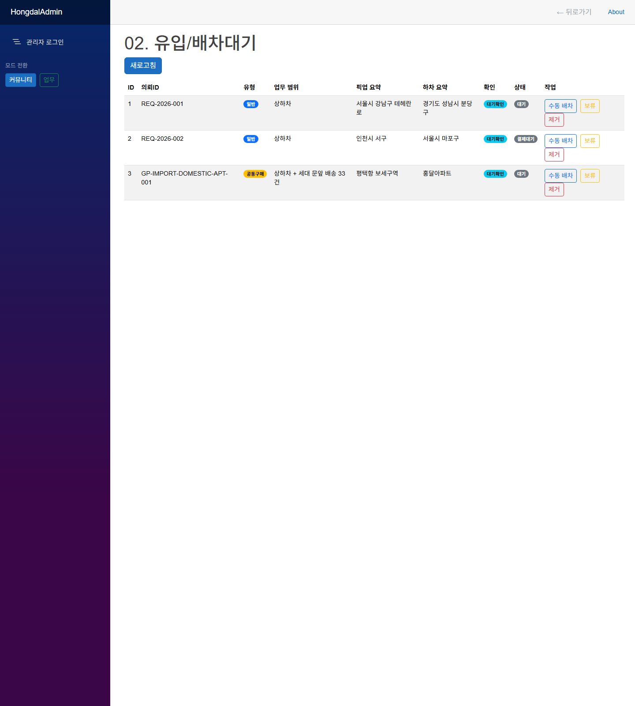 |
| `HongdalAdmin-P20 - 운행 중 기사 현황` | `/drivers/operating` | `HongdalAdmin/Components/Pages/DriverOperatingView.razor` | 필수 | 운행 중 기사 현황 | `HongdalAdmin-P20` | 완료 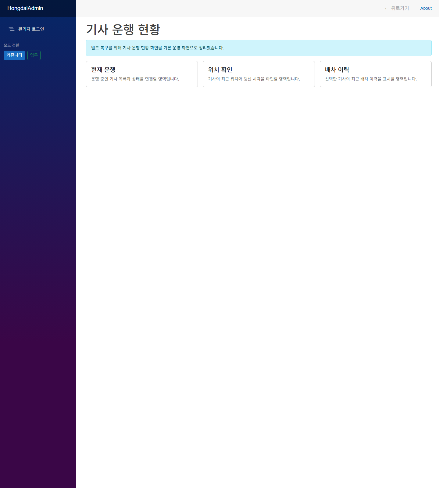 |
| `HongdalAdmin-P21 - 운송 목록` | `/transports` | `HongdalAdmin/Components/Pages/Transports.razor` | 필수 | 운송 목록 | `HongdalAdmin-P21` | 완료 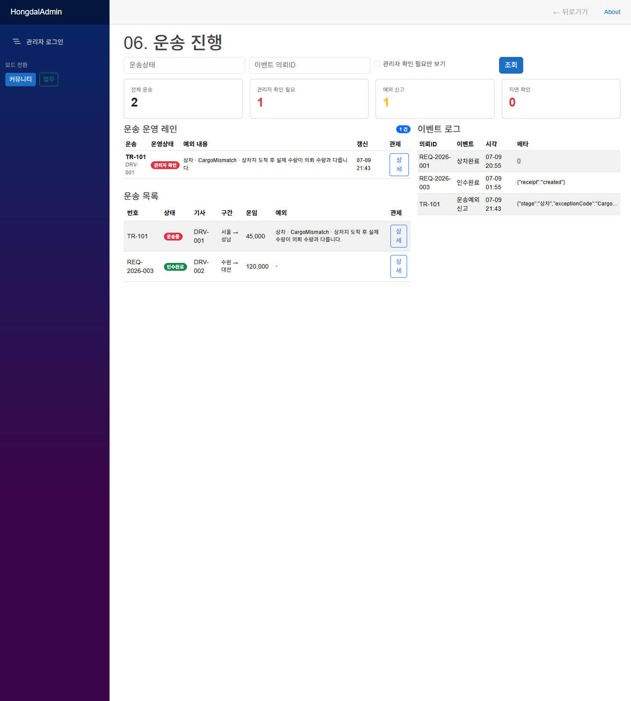 |
| `HongdalAdmin-P22 - 운송 상세 원장` | `/transports/{RequestId}` | `HongdalAdmin/Components/Pages/TransportWorkflowDetail.razor` | 필수 | 운송 상세 원장 | `HongdalAdmin-P22` | 완료  |
| `HongdalAdmin-P22-1 - 운송 이벤트 감사` | `/transports/{RequestId}/events` | `HongdalAdmin/Components/Pages/TransportWorkflowEvents.razor` | 필수 | 운송 이벤트 감사 | `HongdalAdmin-P22-1` | 완료 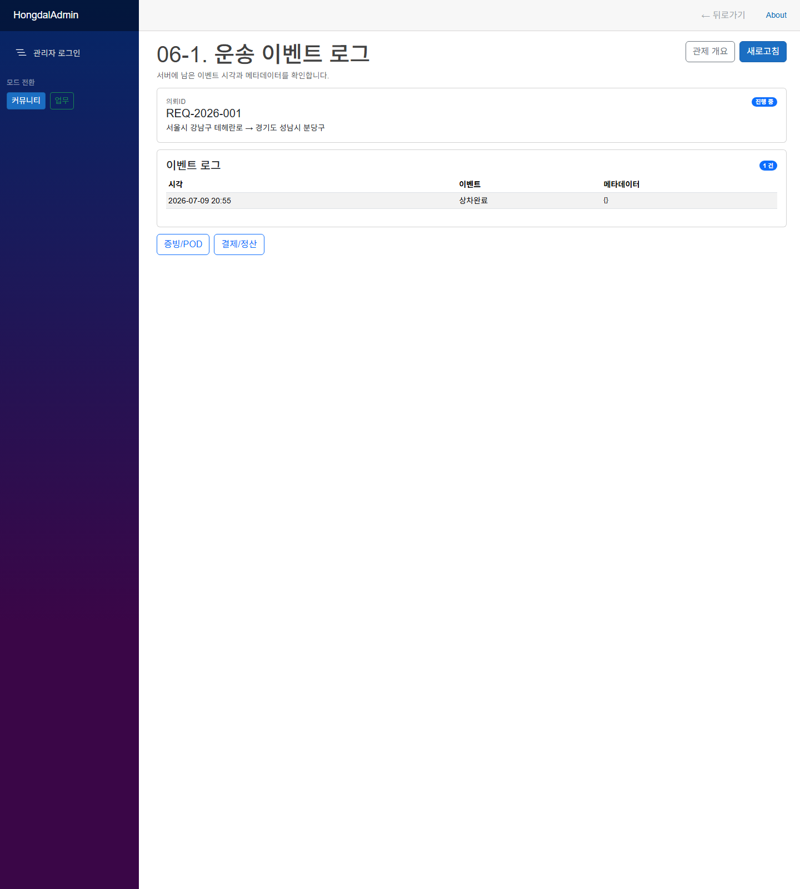 |
| `HongdalAdmin-P22-2 - 운송 증빙/POD` | `/transports/{RequestId}/proofs` | `HongdalAdmin/Components/Pages/TransportWorkflowProofs.razor` | 필수 | 운송 증빙/POD | `HongdalAdmin-P22-2` | 완료  |
| `HongdalAdmin-P22-3 - 운송 정산 상세` | `/transports/{RequestId}/settlement` | `HongdalAdmin/Components/Pages/TransportWorkflowSettlement.razor` | 필수 | 운송 정산 상세 | `HongdalAdmin-P22-3` | 완료  |
| `HongdalAdmin-P23 - 관리자 활동 로그` | `/activity-logs` | `HongdalAdmin/Components/Pages/ActivityLogs.razor` | 운영 | 관리자 활동 로그 | - | 완료  |
| `HongdalAdmin-P24 - 화면/기능 노출 정책` | `/view-policies` | `HongdalAdmin/Components/Pages/ViewPolicies.razor` | 운영 | 화면/기능 노출 정책 | - | 완료  |
| `HongdalAdmin-P25 - 공통 콘텐츠 관리` | `/common-contents` | `HongdalAdmin/Components/Pages/CommonContents.razor` | 운영 | 공통 콘텐츠 관리 | - | 완료  |
| `HongdalAdmin-P26 - 결제 목록` | `/payments` | `HongdalAdmin/Components/Pages/Payments.razor` | 필수 | 결제 목록 | `HongdalAdmin-P26` | 완료  |
| `HongdalAdmin-P26-1 - 정산 목록` | `/settlements` | `HongdalAdmin/Components/Pages/Settlements.razor` | 필수 | 정산 목록 | `HongdalAdmin-P26-1` | 완료  |
| `HongdalAdmin-P27 - 문서 목록` | `/documents` | `HongdalAdmin/Components/Pages/Documents.razor` | 필수 | 문서 목록 | `HongdalAdmin-P27` | 완료  |
| `HongdalAdmin-P27-1 - 문서 업로드` | `/documents/upload` | `HongdalAdmin/Components/Pages/DocumentUpload.razor` | 필수 | 문서 업로드 | `HongdalAdmin-P27-1` | 완료  |
| `HongdalAdmin-P27-2 - 문서 정책 목록` | `/documents/policies` | `HongdalAdmin/Components/Pages/DocumentPolicies.razor` | 필수 | 문서 정책 목록 | `HongdalAdmin-P27-2` | 완료  |
| `HongdalAdmin-P27-3 - 문서 정책 상세` | `/documents/policies/{DocumentCode}` | `HongdalAdmin/Components/Pages/DocumentPolicyDetail.razor` | 필수 | 문서 정책 상세 | `HongdalAdmin-P27-3` | 완료  |
| `HongdalAdmin-P27-4 - 문서 조회 로그` | `/documents/logs` | `HongdalAdmin/Components/Pages/DocumentLogs.razor` | 필수 | 문서 조회 로그 | `HongdalAdmin-P27-4` | 완료  |
| `HongdalAdmin-P27-5 - 파일/POD 관리` | `/files/pod` | `HongdalAdmin/Components/Pages/FilesPod.razor` | 필수 | 파일/POD 관리 | `HongdalAdmin-P27-5` | 완료  |
| `HongdalAdmin-P28 - 공개 화물/화물 운영 화면` | `/cargo` | `HongdalAdmin/Components/Pages/PublicCargo.razor` | 운영 | 공개 화물/화물 운영 화면 | - | 완료  |
| `HongdalAdmin-P29 - HS 코드/통관 운영` | `/customs/hs-codes` | `HongdalAdmin/Components/Pages/HsCodeOperations.razor` | 운영 | HS 코드/통관 운영 | - | 완료  |
| `HongdalAdmin-P30 - 음식 주문/배달 운영` | `/food/operations` | `HongdalAdmin/Components/Pages/FoodOperations.razor` | 운영 | 음식 주문/배달 운영 | - | 완료  |
| `HongdalAdmin-P30-1 - 음식점 검색 정책` | `/restaurant-search-policy` | `HongdalAdmin/Components/Pages/RestaurantSearchPolicySettings.razor` | 운영 | 음식점 검색 정책 | - | 완료  |
| `HongdalAdmin-P31 - 탐색 캠페인 운영` | `/exploration/campaigns` | `HongdalAdmin/Components/Pages/ExplorationCampaigns.razor` | 운영 | 탐색 캠페인 운영 | - | 완료  |
| `HongdalAdmin-P32 - 기사 목록/관리` | `/drivers` | `HongdalAdmin/Components/Pages/Drivers.razor` | 운영 | 기사 목록/관리 | - | 완료  |
| `HongdalAdmin-P32-1 - 차량 관리` | `/vehicle-management` | `HongdalAdmin/Components/Pages/VehicleManagement.razor` | 운영 | 차량 관리 | - | 완료  |
| `HongdalAdmin-P33 - 파트너 관리` | `/partners` | `HongdalAdmin/Components/Pages/Partners.razor` | 운영 | 파트너 관리 | - | 완료  |
| `HongdalAdmin-P34 - 수익/요율 정책` | `/revenue-policies` | `HongdalAdmin/Components/Pages/RevenuePolicies.razor` | 운영 | 수익/요율 정책 | - | 완료  |
| `HongdalAdmin-P35 - 보조 기능 설정` | `/auxiliary-feature-settings` | `HongdalAdmin/Components/Pages/AuxiliaryFeatureSettings.razor` | 운영 | 보조 기능 설정 | - | 완료  |
| `HongdalAdmin-P36 - 연락처 통합 검색` | `/contact-search` | `HongdalAdmin/Components/Pages/ContactSearch.razor` | 운영 | 전화번호 뒤 8자리 기준 인물/역할 통합 조회 | - | 완료  |
| `HongdalAdmin-P37 - 국내화물 AI 배차 검토` | `/dispatch/ai-review` | `HongdalAdmin/Components/Pages/DomesticCargoDispatchAIReview.razor` | 운영 | 국내화물 AI 배차 검토 | - | 완료  |
| `HongdalAdmin-P38 - 음식배달 AI 배차 검토` | `/dispatch/food-ai-review` | `HongdalAdmin/Components/Pages/FoodDeliveryDispatchAIReview.razor` | 운영 | 음식배달 AI 배차 검토 | - | 완료  |
| `HongdalAdmin-P39 - 배차 AI 판단 사례` | `/dispatch-ai-judgment-cases` | `HongdalAdmin/Components/Pages/DispatchAIJudgmentCases.razor` | 운영 | 배차 AI 판단 사례 | - | 완료  |
| `HongdalAdmin-P40 - 개발용 Fake PG/정산 콘솔` | `/development/fake-payment-settlement` | `HongdalAdmin/Components/Pages/FakePaymentSettlementConsole.razor` | 개발 | 결제 보증·상하차·정산·보류·환불 상태 전이 시뮬레이션 | - | 캡처 대기 |
| `HongdalAdmin-P90 - 템플릿/샘플성 날씨 화면` | `/weather` | `HongdalAdmin/Components/Pages/Weather.razor` | 시스템 | 템플릿/샘플성 날씨 화면 | - | 완료  |
| `HongdalAdmin-P91 - 템플릿/샘플성 카운터 화면` | `/counter` | `HongdalAdmin/Components/Pages/Counter.razor` | 시스템 | 템플릿/샘플성 카운터 화면 | - | 완료  |
| `HongdalAdmin-P99 - 미발견 페이지` | `/not-found` | `HongdalAdmin/Components/Pages/NotFound.razor` | 시스템 | 미발견 페이지 | - | 완료  |

## WarehouseManagerApp

| 페이지 ID / 제목 | 라우트 | 파일 | 분류 | 화면 책임 | 필수 연결 | 캡처 |
| --- | --- | --- | --- | --- | --- | --- |
| `WarehouseManagerApp-P01 - 창고 관리자 홈` | `/` | `WarehouseManagerApp/Components/Pages/Home.razor` | 보조 | 창고 관리자 홈 | - | 완료  |
| `WarehouseManagerApp-P02 - 일반 창고 작업 보드` | `/work-board` | `WarehouseManagerApp/Components/Pages/WorkBoard.razor` | 확장 | 일반 창고 작업 보드 | - | 완료  |
| `WarehouseManagerApp-P02-1 - 프로세스별 창고 작업 시작` | `/work/{ProcessCode}` | `WarehouseManagerApp/Components/Pages/WorkStart.razor` | 확장 | 프로세스별 창고 작업 시작 | - | 완료  |
| `WarehouseManagerApp-P02-2 - 작업대 스캔` | `/work/{ProcessCode}/workbench` | `WarehouseManagerApp/Components/Pages/WorkbenchScan.razor` | 확장 | 작업대 스캔 | - | 완료  |
| `WarehouseManagerApp-P02-3 - 범용 스캔 스테이션` | `/scan` | `WarehouseManagerApp/Components/Pages/ScanStation.razor` | 확장 | 범용 스캔 스테이션 | - | 완료  |
| `WarehouseManagerApp-P03 - 입고 검수` | `/work/inbound/inspection` | `WarehouseManagerApp/Components/Pages/InboundInspection.razor` | 확장 | 입고 검수 | - | 완료  |
| `WarehouseManagerApp-P03-1 - 입고 상품 스캔` | `/work/inbound/products` | `WarehouseManagerApp/Components/Pages/InboundProductScan.razor` | 확장 | 입고 상품 스캔 | - | 완료  |
| `WarehouseManagerApp-P04 - 피킹 배치 작업` | `/work/picking-batch` | `WarehouseManagerApp/Components/Pages/PickingBatchWorkspace.razor` | 확장 | 피킹 배치 작업 | - | 완료  |
| `WarehouseManagerApp-P05 - 알뜰살뜰 마트 창고 홈` | `/mart` | `WarehouseManagerApp/Components/Pages/MartHome.razor` | 확장 | 알뜰살뜰 마트 창고 홈 | - | 완료  |
| `WarehouseManagerApp-P05-1 - 알뜰살뜰 마트 작업 보드` | `/mart/work-board` | `WarehouseManagerApp/Components/Pages/MartWorkBoard.razor` | 확장 | 알뜰살뜰 마트 작업 보드 | - | 완료  |
| `WarehouseManagerApp-P05-2 - 알뜰살뜰 마트 프로세스별 작업 시작` | `/mart/work/{ProcessCode}` | `WarehouseManagerApp/Components/Pages/MartWorkStart.razor` | 확장 | 알뜰살뜰 마트 프로세스별 작업 시작 | - | 완료  |
| `WarehouseManagerApp-P05-3 - 알뜰살뜰 마트 피킹/포장` | `/mart/picking` | `WarehouseManagerApp/Components/Pages/MartPickingPacking.razor` | 확장 | 주문별 피킹·포장·출고 완료 요청 | - | 캡처 대기 |
| `WarehouseManagerApp-P99 - 미발견 페이지` | `/not-found` | `WarehouseManagerApp/Components/Pages/NotFound.razor` | 시스템 | 미발견 페이지 | - | 완료  |

## OrdererApp

| 페이지 ID / 제목 | 라우트 | 파일 | 분류 | 화면 책임 | 필수 연결 | 캡처 |
| --- | --- | --- | --- | --- | --- | --- |
| `OrdererApp-P01 - 주문자 홈` | `/` | `OrdererApp/Components/Pages/Home.razor` | 보조 | 주문자 홈 | - | 완료  |
| `OrdererApp-P02 - 공동구매 의사 표시/집단화` | `/group-purchase` | `OrdererApp/Components/Pages/GroupPurchaseIntent.razor` | 확장 | 공동구매 의사 표시/집단화 | - | 완료  |
| `OrdererApp-P03 - 주문자 화물 주문` | `/cargo` | `OrdererApp/Components/Pages/CargoOrder.razor` | 확장 | 주문자 화물 주문 | - | 완료  |
| `OrdererApp-P04 - 음식 주문 홈` | `/food` | `OrdererApp/Components/Pages/FoodOrderHome.razor` | 확장 | 음식 주문 홈 | - | 완료  |
| `OrdererApp-P04-1 - 음식점 주문` | `/food/restaurants` | `OrdererApp/Components/Pages/RestaurantOrder.razor` | 확장 | 음식점 주문 | - | 완료  |
| `OrdererApp-P04-2 - 마트 주문` | `/food/mart` | `OrdererApp/Components/Pages/MartOrder.razor` | 확장 | 마트 주문 | - | 완료  |
| `OrdererApp-P05 - 주문 이력` | `/orders` | `OrdererApp/Components/Pages/OrderHistory.razor` | 보조 | 주문 이력 | - | 완료  |
| `OrdererApp-P99 - 미발견 페이지` | `/not-found` | `OrdererApp/Components/Pages/NotFound.razor` | 시스템 | 미발견 페이지 | - | 완료  |

## RestaurantDeskApp

| 페이지 ID / 제목 | 라우트 | 파일 | 분류 | 화면 책임 | 필수 연결 | 캡처 |
| --- | --- | --- | --- | --- | --- | --- |
| `RestaurantDeskApp-P01 - 음식점 데스크 홈` | `/` | `RestaurantDeskApp/Components/Pages/Home.razor` | 보조 | 음식점 데스크 홈 | - | 완료  |
| `RestaurantDeskApp-P02 - 주변 음식점 조회` | `/restaurants/nearby` | `RestaurantDeskApp/Components/Pages/NearbyRestaurants.razor` | 확장 | 주변 음식점 조회 | - | 완료  |
| `RestaurantDeskApp-P02-1 - 인기 음식점 조회` | `/restaurants/popular` | `RestaurantDeskApp/Components/Pages/PopularRestaurants.razor` | 확장 | 인기 음식점 조회 | - | 완료  |
| `RestaurantDeskApp-P03 - 리뷰 관리` | `/reviews/moderation` | `RestaurantDeskApp/Components/Pages/ReviewModeration.razor` | 운영 | 리뷰 관리 | - | 완료  |
| `RestaurantDeskApp-P04 - 배차 주소 입력/검증 폼` | `/dispatch/address-form` | `RestaurantDeskApp/Components/Pages/DispatchAddressForm.razor` | 보조 | 배차 주소 입력/검증 폼 | - | 완료  |

## HumanResourcesManagerApp

| 페이지 ID / 제목 | 라우트 | 파일 | 분류 | 화면 책임 | 필수 연결 | 캡처 |
| --- | --- | --- | --- | --- | --- | --- |
| `HumanResourcesManagerApp-P01 - 인사/고용 관리 홈` | `/` | `HumanResourcesManagerApp/Components/Pages/Home.razor` | 확장 | 인사/고용 관리 홈 | - | 완료  |

## 보완 메모

| 항목 | 내용 |
| --- | --- |
| 필수 페이지와 전체 페이지의 관계 | 필수 페이지는 1.0 운송 루프를 닫는 최소 화면이고, 이 문서는 코드 프로젝트 전체 화면을 찾기 위한 색인이다. |
| 라우트 충돌 후보 | `ShipperApp`과 `RestaurantDeskApp` 모두 `/dispatch/address-form`을 가진다. 앱이 다르므로 런타임 충돌은 아니지만 문서에서 책임을 구분해야 한다. |
| 템플릿성 화면 | `Counter`, `Weather`는 시스템/샘플 화면으로 분류했다. 출시 전 제거 또는 숨김 여부를 따로 판단한다. |
| 미발견 페이지 | `NotFound`는 사용자 업무 화면이 아니지만 앱 운영에 필요한 라우트로 남긴다. |
| 다음 문서화 단계 | 각 페이지별 상세 README는 `page-docs/{앱명}/{페이지ID}/README.md`에 두고, 캡처는 `assets/app-pages/{앱명}/` 아래 추가한다. |
| 통합 클라이언트 단계 | 새 페이지에는 가능한 경우 진입 사방괘, 다이어그램·노드 행동, 필요한 식별자와 복원 문맥을 기록한다. |
| 관리자 캡처 | 관리자 보호 화면은 개발용 관리자 인증 세션과 문서용 메모리 데이터를 붙여 실제 운영 화면까지 캡처한다. |
| MAUI 캡처 | Android/Windows MAUI 앱의 Blazor 페이지는 문서용 캡처 호스트에서 실제 Razor 컴포넌트를 렌더링하고, Chrome DevTools 전체 페이지 캡처로 내부 스크롤 높이까지 반영해 PNG로 남긴다. |
