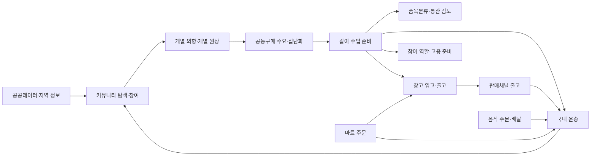

# 업무 프로세스별 페이지 지도

이 문서는 살뜰의 페이지를 앱이나 코드 프로젝트가 아니라 **업무 프로세스 순서**로 찾기 위한 기준 색인이다. 전체 물리 라우트는 [코드 프로젝트별 전체 페이지 카탈로그](app-page-catalog.md), 상위 워크플로우와 앱 간 상태 전파는 [워크플로우 앱 화면 지도](workflow-app-screen-map.md)를 따른다.

현재 제품 우선순위는 문화교통 `0.0` 커뮤니티·공공데이터 기반이다. 아래 표에는 후속 버전의 준비 자산도 포함하지만, 페이지가 존재한다는 사실만으로 기능 플래그, 인증, 운영 실행이나 외부 효과가 허용된 것은 아니다.

## 판정 기준

| 표시 | 의미 |
| --- | --- |
| 현재 | 실제 Razor 파일에 `@page`가 선언된 페이지 |
| 업무 연결 | 같은 워크플로우 코드나 원장 인계 관계로 연결되지만 페이지의 직접 API 호출은 별도 확인이 필요한 관계 |
| 화면 미연결 | 서버 API·UseCase·ProcessManager는 있으나 이를 완결하는 사용자 페이지나 Client adapter가 없는 상태 |
| 후속 후보 | 다음 원장이나 역할로 넘기려면 필요하지만 현재 전용 페이지가 확인되지 않은 상태 |

각 행의 페이지는 대표 경로다. 페이지와 API의 직접 호출을 확정할 때는 `Razor/Screen → ViewModel → Client → Controller → UseCase/ProcessManager` 순서로 확인한다.

## 전체 프로세스와 인계

| 프로세스 묶음 | 시작 | 종료 또는 다음 인계 | 상위 워크플로우 |
| --- | --- | --- | --- |
| 공개 정보 탐색 | 공식 가격·재료·지역 정보 조회 | 커뮤니티 이야기 또는 개별 의향의 근거 | `CommunityTrust` 보조 근거 |
| 커뮤니티 참여 | 게시판·글·활동 탐색 | 글, 댓글, 투표, 원장 초안, 관계 기록 | `CommunityTrust` |
| 개별 의향 | 본인의 조건과 철회 가능한 의사 저장 | 본인 원장 또는 공동구매 후보 | `GroupPurchaseDemand` |
| 공동구매 수요·집단화 | 상품·근거 탐색과 수요 등록 | 사람 승인 뒤 같이 수입 준비 | `GroupPurchaseDemand` |
| 같이 수입 준비 | 공급자·비용·품목분류·동의 검토 | 통관, 창고 또는 국내 운송 준비 | `GroupPurchaseImport` |
| 국내 운송 | 운송 의뢰와 배차 | 하차·증빙·정산·활동 신호 | `DomesticTransport` |
| 창고 이행 | 입고 요청과 검수 | 재고, 피킹·포장, 출고 인계 | `WarehouseFulfillment` |
| 판매채널 이행 | 채널·상품·주문 준비 | 창고 출고와 운송 인계 | `SalesChannelFulfillment` |
| 음식 주문·배달 | 음식점 탐색과 주문 | 음식점 처리, 기사 전달, 운영 추적 | `FoodDelivery` |
| 마트 주문 | 상품 탐색과 주문 요청 | 창고 피킹·포장과 기사 인계 | `SsalddelMart` |
| 역할·고용 준비 | 자발적 역할 지원 | 운영 검토, 계약·신고 준비 | `HrParticipation` |
| 운영 공통 | 활동·문서·결제·정산 상태 확인 | 각 업무 원장의 보정·감사 | 여러 워크플로우 공통 |

## 0.0 공개 정보와 커뮤니티

| ID | 하위 프로세스 | 페이지 순서 | 주 역할 | 서버 실행축·현재 판정 |
| --- | --- | --- | --- | --- |
| `PUB-01` | 공식 공공데이터 탐색 | `/information/public-data` → `/information/kamis-domestic-price-comparison` 또는 `/information/usda-us-price-comparison` | 비로그인 방문자·주문자 | 공공데이터 조회 Client/UseCase. 현재 읽기 전용 페이지가 있다. |
| `PUB-02` | 재료·지역 근거 탐색 | `/information/food-ingredients` → `/community/regions` → `/community/regions/{RegionKey}` → `/information/regional-products` | 커뮤니티 참여자·주문자 | 공식 출처, 단위, 지역 key를 다음 의향·공동구매 판단 근거로 사용한다. |
| `PUB-03` | 낮 업무·밤 알아차림 지도 탐색 | `/community/home` ↔ `/community/home?dataset=night-learning` → `GET /api/v1/community/world-map/observations` → 분야 레이어 선택 → 지역·자료 상세 | 모든 방문자 | 낮은 지역 문화·가격 시장, 밤은 생각·성찰 자료와 경전·고전 자료를 한 지도에서 가볍게 알아차리게 한다. 알아차림은 관심 등록·동의·추천 신호가 아니다. client는 30초마다 안정 revision을 확인하되 변경 자료를 자동 이동·반영하지 않고 사용자 승인 대기열에 둔다. 위치는 공개 자료의 지역 맥락이며 개인 정밀 위치, 사상 기원·우열, 사용자 추천 점수, 주문·계약·배차 실행에는 쓰지 않는다. |
| `COMM-01` | 커뮤니티 탐색·글 열람 | `/community` → `/community/categories` 또는 `/community/boards/directory` → `/community/boards` → `/community/posts/{PostId}` | 모든 역할 | `커뮤니티게시글조회UseCase`, 게시판·게시글 API. 현재 페이지가 여러 역할 앱에 존재한다. |
| `COMM-02` | 글 작성·발행·내 활동 확인 | `/community/write` → `/community/posts/{PostId}` → `/community/me` | 로그인 참여자 | `커뮤니티게시글발행UseCase`, 첨부·예약 발행 UseCase. 성공 뒤 같은 게시글 원장 재조회가 필요하다. |
| `COMM-03` | 댓글·참여·투표·결의 | `/community/posts/{PostId}` → `/community/actions/{PageKey}` 또는 공동구매 참여·결의 페이지 | 참여자·집단 대표 | 게시글 참여, `커뮤니티투표UseCase`, 서명 흐름. 캠페인 상태와 개인 동의를 분리한다. |
| `COMM-04` | 게시판 개설·운영 | `/community/boards/directory` → `/community/boards/manage` → 관리자 `/community` | 참여자·플랫폼 운영자 | `커뮤니티게시판UseCase`. 신청과 운영 승인·반려의 권한이 다르다. |
| `COMM-05` | 이야기에서 공동 원장으로 전환 | `/community/workspace` → `/community/ledgers/new` → `/diagram` → `/community/work/{GroupKey}` | 참여자·업무 담당자 | 원장 초안, 다이어그램, 업무 보드. 대화 기록과 실행 원장을 자동 합치지 않는다. |
| `COMM-06` | 신고·공개범위·관계 환류 | `/community/safety`, `/community/relationships`, 관리자 `/community/users` | 참여자·운영자 | 신고·숨김·친구 요청과 연락처 공개는 별도 동의 상태다. 일부 역할 앱에만 전용 route가 있다. |
| `COMM-07` | 활동 상세 유료 열람 | `/community/posts/{PostId}` → 유료 미리보기 → 구매 확인 → 본문 재조회 | 작성자·구매자 | `커뮤니티활동유료상세UseCase`, `커뮤니티활동상세구매ProcessManager`. API·원장·FakePG·열람권은 구현됐지만 구매 UI와 Client adapter는 **화면 미연결**이다. |
| `COMM-08` | 꾸미기 상품 탐색·모의 구매 | `/community/decorations` → `/community/decorations/products/{ProductKey}` → `/community/decorations/checkout/{ProductKey}` | 커뮤니티 참여자 | `노드스티커상점UseCase`. Development/Simulation FakePG 경계이며 실제 결제·정산이 아니다. |

## 0.5 개별 의향과 1.0 공동구매 수요

| ID | 하위 프로세스 | 페이지 순서 | 주 역할 | 서버 실행축·현재 판정 |
| --- | --- | --- | --- | --- |
| `INT-01` | 개별 의향 시작·철회 | `/community/orders/new` → `/community/orders` | 주문자 | 본인의 조건, 수량과 철회 가능한 의향만 저장한다. 자동 가입·결제·발주를 하지 않는다. |
| `GPD-01` | 상품·근거 비교 | `OrdererApp /group-purchase/products` → `/group-purchase/products/{ProductId}` → `/group-purchase/compare/{ProductId}` | 주문자 | 상품 Catalog, 주문방식 비교, 공공데이터 UseCase. 읽기 전용 판단 단계다. |
| `GPD-02` | 수요 등록·집단화 | `/group-purchase/demands/new/{ProductId}` → `/group-purchase/groups` → `/group-purchase/groups/{AutoGroupId}` | 주문자 | `공동구매자동집단화UseCase`, `공동구매수요모집ProcessManager`. 배송권 기준 집계와 마감·보류를 조율한다. |
| `GPD-03` | 공개 캠페인 협의 | `/community/group-purchase/new` → `/community/group-purchase/{CampaignId}` → `/community/group-purchase/{CampaignId}/participation` → `/community/group-purchase/{CampaignId}/negotiation` → `/community/group-purchase/{CampaignId}/objections` → `/community/group-purchase/{CampaignId}/resolution` → `/community/group-purchase/{CampaignId}/signature` | 참여자·집단 대표 | 참여, 이의, 결의와 서명을 각각 명시적으로 기록한다. 화면은 존재하지만 운영 원장과의 직접 연결은 페이지별 확인이 필요하다. |
| `GPD-04` | 공급자·배송안·이행 초안 | `/community/group-purchase/{CampaignId}/suppliers` → `/community/group-purchase/{CampaignId}/delivery-options` → `/community/group-purchase/{CampaignId}/fulfillment-draft` | 집단 대표·운영자 | 공급 조건과 운송 후보를 검토한다. 계약·결제·배차 확정 페이지로 사용하지 않는다. |
| `GPD-05` | 사람 승인 인계 | `/group-purchase/groups/{AutoGroupId}` → `/group-purchase/imports/{LedgerId}` | 집단 대표·운영자 | ProcessManager의 인계 승인 뒤 후속 원장을 연결한다. 승인만으로 수입 실행을 시작하지 않는다. |

## 1.5 같이 수입·통관 준비

| ID | 하위 프로세스 | 페이지 순서 | 주 역할 | 서버 실행축·현재 판정 |
| --- | --- | --- | --- | --- |
| `GPI-01` | 준비 원장 개요 | `/group-purchase/imports/{LedgerId}` | 참여 주문자 | `같이수입준비주문자조회UseCase`. 본인 참여 원장의 준비 상태만 조회한다. |
| `GPI-02` | 공급자·비용 검토 | `/group-purchase/imports/{LedgerId}/suppliers` → `/group-purchase/imports/{LedgerId}/costs` | 주문자·집단 대표 | `같이수입준비ProcessManager`. 견적·비용 근거와 책임 초안을 저장하며 계약·결제는 실행하지 않는다. |
| `GPI-03` | 품목분류·물류 검토 | `/group-purchase/imports/{LedgerId}/classification` → `/group-purchase/imports/{LedgerId}/logistics-review` | 주문자·전문가·운영자 | HS 후보, 물류 조건, 전문가 확인 필요 상태를 기록한다. |
| `GPI-04` | 참여 동의·전문 인계 | `/group-purchase/imports/{LedgerId}/consent` → `/group-purchase/imports/{LedgerId}/handoff`; 관리자 `/trade-readiness` | 참여자·운영자 | 동의와 포워더·전문가 인계를 분리한다. 외부 자동 전송·신고는 금지한다. |
| `CUS-01` | HS 코드 검토·운영 | `SsalddelApp /shipper/customs/hs-reviews` ↔ `SsalddelAdmin /customs/hs-codes` | 화주·판매자·관세 전문가·운영자 | `화주HS코드검토조회UseCase`, `HS코드운영UseCase`. 후보와 보정이며 품목분류 신고 확정이 아니다. |
| `GPI-05` | 선적·통관 진행 조회 | `/group-purchase/shipments` → 창고 `/warehouse/import/arrival` → `/warehouse/import/customs` → `/warehouse/import/release` | 주문자·창고 작업자 | `공동구매해외선적추적UseCase`. 기존 문서관리번호·BL/AWB 기반 조회 자산이며 새 외부 실행을 자동 생성하지 않는다. |
| `GPI-06` | 국내 이행 분기 | `/warehouse/import/domestic-handoff` → 직접 운송 또는 창고 입고 | 운영자·창고 관리자 | `공동구매커머스이행계획UseCase`. `DomesticTransport` 또는 `WarehouseFulfillment`로 사람 확인 뒤 인계한다. |

## 2.0 국내 운송

| ID | 하위 프로세스 | 페이지 순서 | 주 역할 | 서버 실행축·현재 판정 |
| --- | --- | --- | --- | --- |
| `TRN-01` | 운송 의뢰 작성 | `/shipper/request` → `/shipper/request/cargo` → `/shipper/request/transport` → `/shipper/request/procedure` → `/shipper/request/review` | 화주 | `화주운송의뢰UseCase`, `api/v1/shipper/requests`. 하나의 draft를 단계별로 저장한다. |
| `TRN-02` | 의뢰 확인·배차 대기 | `/shipper/request/{RequestId}` ↔ 관리자 `/dispatch/wait` | 화주·운영자 | 의뢰 원장의 배차대기 상태를 서로 다른 역할 투영으로 조회한다. |
| `TRN-03` | 기사 추천·결정 | `/driver/recommendations` → `/driver/recommendations/{RequestId}` → `/driver/recommendations/{RequestId}/decision` | 기사 | `기사배차추천UseCase`. 추천은 후보이며 기사 수락 뒤에만 진행 운송으로 인계한다. |
| `TRN-04` | 운송 수행·증빙 | `/driver/transports/current` → `/driver/transports/{TransportId}/pickup` → `/driver/transports/{TransportId}/dropoff`; 화주 `/shipper/request/{RequestId}/timeline`, `/shipper/request/{RequestId}/proofs` | 기사·화주 | 상차·하차·예외·POD를 기록하고 양쪽이 같은 원장을 재조회한다. |
| `TRN-05` | 운영 추적·분쟁 확인 | 관리자 `/transports` → `/transports/{RequestId}` → `/transports/{RequestId}/events` → `/transports/{RequestId}/proofs` | 운영자 | 운송 이벤트, 증빙과 예외를 추적한다. 자동 보정 대신 원장 상태와 감사 이력을 남긴다. |
| `TRN-06` | 결제·정산 상태 | 화주 `/{RequestId}/payment`; 기사 `/driver/settlements/current-month`; 관리자 `/payments`, `/settlements`, `/transports/{RequestId}/settlement` | 화주·기사·운영자 | 결제·기사 지급 준비·정산은 서로 다른 상태다. 실제 승인·송금·정산 완료 증거를 화면 존재와 혼동하지 않는다. |
| `TRN-07` | 수령자 확인 | 하차 후 수령 확인·이의·사진 열람 | 수령자 | 전용 공개/인증 페이지가 확인되지 않아 **후속 후보**다. |

## 2.5 창고와 판매채널

| ID | 하위 프로세스 | 페이지 순서 | 주 역할 | 서버 실행축·현재 판정 |
| --- | --- | --- | --- | --- |
| `WH-01` | 화주 입고 요청 | `/shipper/inbound/requests/new` → `/shipper/inbound/requests` → `/{InboundId}` → `/{InboundId}/complete` | 화주 | 입고 요청 원장 생성과 완료 확인 페이지가 있다. |
| `WH-02` | 입고·검수 | `/work-board` → `/work/inbound/products` 또는 `/scan` → `/work/inbound/inspection/{InboundItemId}` → `/work/inbound/inspection/{InboundItemId}/record` | 창고 작업자 | `창고작업UseCase`와 입고 검수 흐름. 스캔 결과와 검수 원장을 저장한다. |
| `WH-03` | 적재·재고 | `/work/inbound/put-away` → `/warehouse/general/inventory`; 화주 `/shipper/warehouse/inventory` | 창고 작업자·화주 | 적재와 재고 투영을 역할별로 분리해 조회한다. |
| `WH-04` | 피킹·포장 | `/work/picking-batch` → `/work/picking-batch/{TaskKey}` → `/work/picking-batch/{TaskKey}/execute` → `/work/outbound/packing` | 창고 작업자 | `피킹작업UseCase`, `포장작업UseCase`. 출고 후보를 준비하지만 운송을 자동 확정하지 않는다. |
| `WH-05` | 출고·운송 인계 | `/warehouse/general/outbound-plan-review` → `/warehouse/general/transport-request-draft` → `/warehouse/general/transport-handoff` | 창고 관리자 | 출고예정 검토와 운송 인계를 분리한다. 인계 뒤 `DomesticTransport`가 원장을 소유한다. |
| `WH-06` | 예외·이력 | `/warehouse/exceptions` → `/warehouse/history` | 창고 관리자·운영자 | 수량 불일치, 보류, 미인수와 작업 이력을 조회·보정한다. |
| `SALE-01` | 판매채널·상품 준비 | `/shipper/sales/channels` → `/shipper/sales/listings` → `/shipper/sales/pages/new` | 판매자 | `판매채널UseCase`, `판매페이지UseCase`. 외부 채널 계정과 출품의 실제 변경 여부는 adapter·실행 모드를 확인한다. |
| `SALE-02` | 판매 주문 조회 | `/shipper/sales/orders` → `/{OrderId}` | 판매자 | `판매채널주문조회UseCase`. 외부 주문과 내부 원장 식별자를 연결한다. |
| `SALE-03` | 출고 이행 | `/shipper/sales/fulfillment` → `/shipper/sales/fulfillment/orders` → `/shipper/sales/fulfillment/inventory` → `/shipper/sales/fulfillment/picking` → `/shipper/sales/fulfillment/packing` | 판매자·창고 작업자 | 현재 다수 하위 페이지는 Simulation 준비 자산이다. 창고 작업과 운송 인계가 실제 원장을 공유하는지 단계별 검증이 필요하다. |

## 3.0 음식 배달과 3.5 마트

| ID | 하위 프로세스 | 페이지 순서 | 주 역할 | 서버 실행축·현재 판정 |
| --- | --- | --- | --- | --- |
| `FOOD-01` | 음식점 탐색·주문 | `OrdererApp /food` → `/food/restaurants` → `/orders/food` | 주문자 | `음식점탐색조회UseCase`, `음식주문접수UseCase`, 주문자 음식주문 조회 UseCase. |
| `FOOD-02` | 음식점 접수·조리 준비 | `RestaurantDeskApp /orders` → `/orders/{OrderNo}`; 설정 `/settings/preparation-times` | 음식점 운영자 | 주문 수신·수락·준비시간·전표 처리 흐름. 서버 주문 원장과 SignalR 알림을 사용한다. |
| `FOOD-03` | 음식 배차·기사 수행 | 관리자 `/dispatch/food-ai-review` → 기사 `/driver/food-deliveries` 또는 `FDriverApp /food-delivery/open/{Focus}` | 운영자·배달 기사 | 음식 주문 상태를 운송 실행 투영으로 넘긴다. 음식 주문 원장과 운송 원장은 별도 상태를 유지한다. |
| `FOOD-04` | 운영 상관관계·복구 | 관리자 `/food/order-trace`, `/food/operations` | 운영자 | 주문·추천·운송·Outbox 상관관계와 복구 필요 상태를 개인정보를 가린 채 조회한다. |
| `MART-01` | 마트 상품 탐색·주문 | `OrdererApp /food/mart` → `/food/mart/products/{ProductId}` → `/food/mart/order/{ProductId}` → `/food/mart/reviews/{ProductId}` | 주문자 | 마트 공개 상품·주문 요청·후기 UseCase. |
| `MART-02` | 마트 창고 작업 | `WarehouseManagerApp /mart` → `/mart/work-board` → `/mart/picking` → `/mart/picking/orders/{OrderId}` | 마트·창고 작업자 | `마트피킹조회UseCase`와 창고 피킹·포장 흐름을 연결한다. |
| `MART-03` | 기사 인계·배송 | `/mart/work/{ProcessCode}` → 국내 운송 추천·진행 페이지 | 창고 작업자·기사 | `WarehouseFulfillment`에서 `DomesticTransport`로 인계되는 관계다. 전용 수령 확인 페이지는 `TRN-07`과 같은 간극이 있다. |

## 역할·고용과 운영 공통 프로세스

| ID | 하위 프로세스 | 페이지 순서 | 주 역할 | 서버 실행축·현재 판정 |
| --- | --- | --- | --- | --- |
| `HR-01` | 자발적 역할 지원 | `/community/roles/apply` → 본인 지원 상태 확인 | 참여자 | `HR역할지원CommandUseCase`, `HR역할지원조회UseCase`. 지원은 자동 배정·채용이 아니다. |
| `HR-02` | 역할 검토·고용 준비 | `HumanResourcesManagerApp /` 또는 관리자 `/dashboard` | 인사 담당자·운영자 | `HR역할검토조회UseCase`, `HR참여운영UseCase`, `사회보험신고UseCase`. 역할·계약·신고를 구분하는 전용 상세 페이지는 **후속 후보**다. |
| `OPS-01` | 활동 감사 | 관리자 `/activity-logs` | 운영자 | 사용자 행위 로그와 공개 활동 신호의 원천을 추적한다. |
| `OPS-02` | 문서·POD 관리 | `/documents` → `/documents/upload` → `/documents/logs` 또는 `/documents/policies/{DocumentCode}` | 운영자 | `문서관리UseCase`, 파일 POD UseCase. 업무 원장의 증빙과 문서 정책을 연결한다. |
| `OPS-03` | 결제·정산 운영 | `/payments` → `/settlements` | 운영자 | 결제 승인, 정산 후보, 지급 결과를 분리한다. 화면만으로 실제 외부 거래 완료를 증명하지 않는다. |
| `OPS-04` | 화면·기능 정책 | `/view-policies`, `/auxiliary-feature-settings` | 운영자 | View 설정과 보조 기능 플래그를 관리한다. 업무 원장 상태를 우회해 기능을 실행하지 않는다. |

## 현재 우선 확인할 화면 간극

| 우선순위 | 프로세스 | 간극 | 다음 세로 연결 |
| ---: | --- | --- | --- |
| 1 | `COMM-07` 활동 상세 유료 열람 | 게시글 상세에서 유료 상세 API로 가는 Client·구매 UI가 없음 | 게시글 상세 미리보기 → 명시적 FakePG 확인 → 열람권 재조회 |
| 2 | `TRN-07` 수령자 확인 | 하차 후 수령 확인·이의·사진 열람 페이지가 없음 | stable 운송/수령 식별자 기반 읽기·확인 화면 |
| 3 | `HR-02` 역할·고용 준비 | API와 관리자 허브는 있으나 역할·계약·신고를 분리한 상세 화면이 부족함 | 지원 검토 → 계약 준비 → 신고 준비의 별도 페이지 |
| 4 | `SALE-03` 판매채널 출고 | Simulation 하위 페이지와 실제 창고·운송 원장 인계 증거가 분리됨 | 판매 주문 → 출고 배치 → 창고 작업 → 운송 의뢰 재조회 |
| 5 | `GPD-03` 공개 캠페인 협의 | 페이지는 많지만 공개 캠페인과 영속 공동 원장의 직접 연결을 페이지별로 확인해야 함 | 참여·결의·서명 뒤 동일 원장 재조회와 인계 상태 표시 |

## 유지·검증 규칙

1. 새 업무 페이지를 만들 때 상위 워크플로우와 이 문서의 프로세스 ID를 먼저 정한다.
2. `@page` 존재, `SsalddelPageCapabilityCatalog` 등록, 워크플로우 코드와 기능 플래그를 각각 확인한다.
3. 상태 변경 페이지는 Controller와 UseCase/ProcessManager의 권한·현재 상태 검증을 우회하지 않는다.
4. 상태 변경 성공 뒤 여러 역할 페이지가 같은 stable 원장을 다시 조회하는지 검증한다.
5. Simulation 화면, 실제 운영 저장, 외부 PG·채널·신고·송금 완료를 서로 다른 증거로 보고한다.
6. 전체 라우트의 물리 위치나 캡처 상태는 이 문서에 복제하지 않고 [전체 페이지 카탈로그](app-page-catalog.md)와 페이지별 README를 갱신한다.
