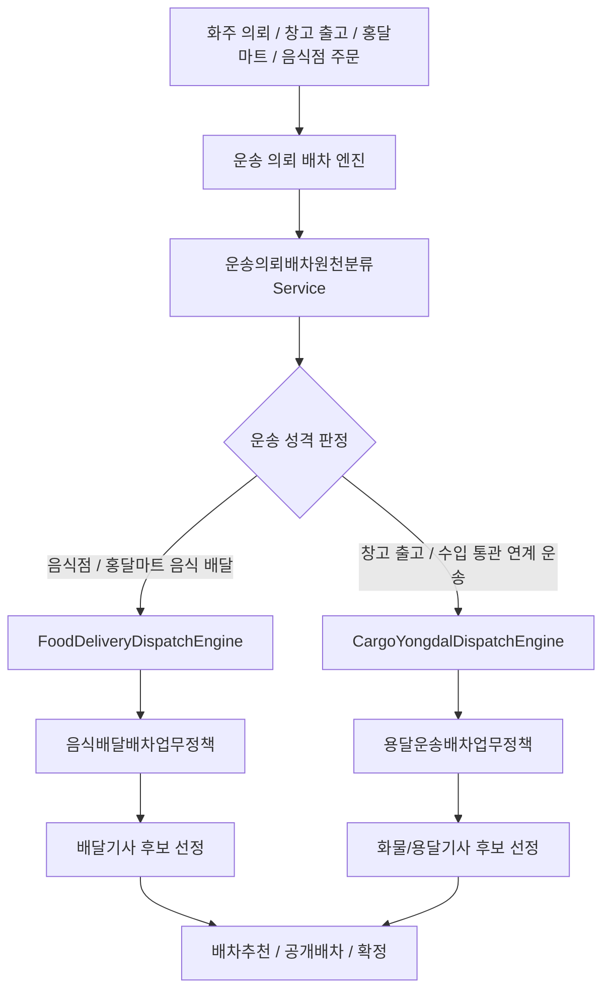
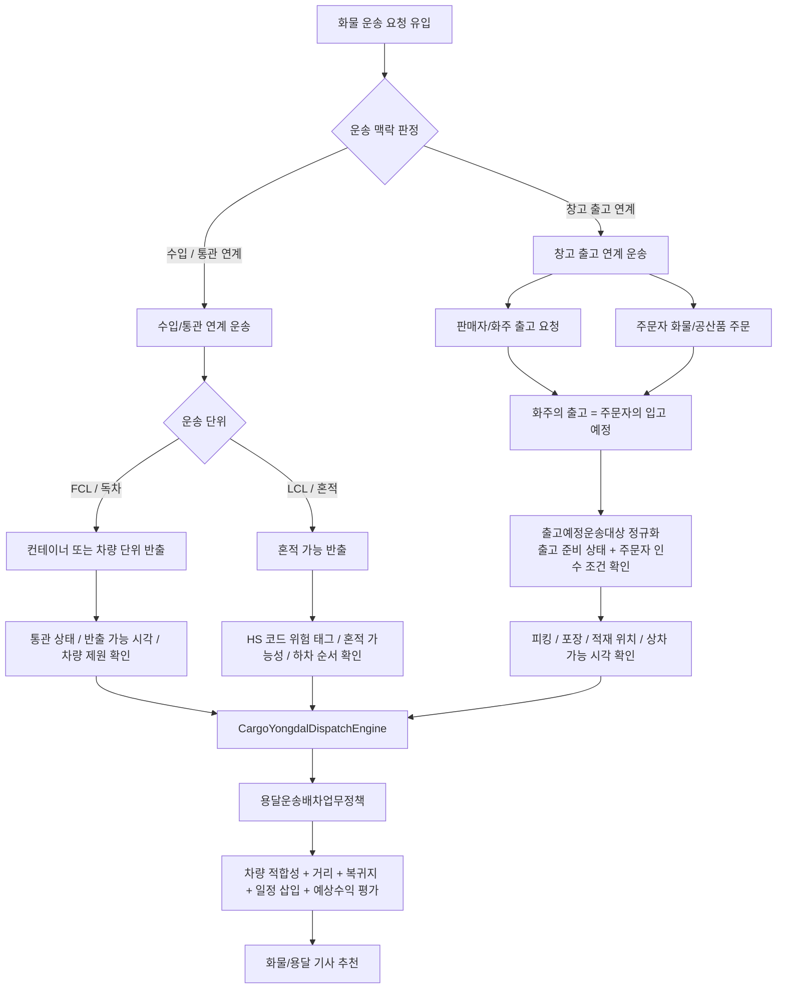
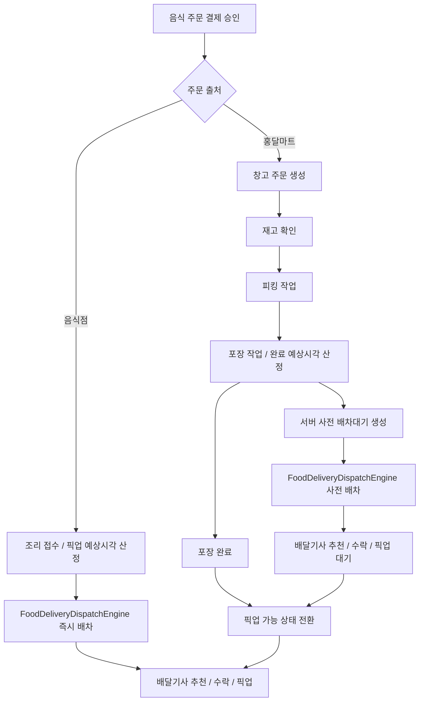

# Dispatch Flows

운송 의뢰 배차 엔진은 기사에게 맡길 실제 이동 업무를 통합해서 보는 서버 판단 계층입니다. 화주 운송 의뢰, 창고 출고품, 홍달마트 출고, 음식점 주문은 화면과 원장은 다를 수 있지만, 기사 추천 단계에서는 `배차대기.원본의뢰유형`과 `배차업무유형`으로 분류한 뒤 같은 배차 큐 흐름을 탑니다.

배차는 주문 유입 경로보다 실제 운송 성격을 기준으로 하위 엔진을 나눕니다.

| 엔진 | 배차업무유형 | 주요 대상 | 우선 판단 기준 |
| --- | --- | --- | --- |
| `CargoYongdalDispatchEngine` | `용달운송` | 창고 출고 연계 운송, 수입/통관 연계 운송 | 차량 적합성, 상하차 조건, 거리/복귀지, 운임, 일정 삽입 가능성 |
| `FoodDeliveryDispatchEngine` | `음식배달` | 음식점 주문, 홍달마트 주문, 포장 전 사전 배차와 포장 후 픽업 | 조리/포장 완료 예상시각, 고객 도착 시간, 묶음 배달 가능성, 기사 위치 |

## 엔진 선택



현재 코드는 `배차추천후보선정Service`가 `배차대기.배차업무유형`을 보고 `I운송의뢰배차엔진`을 선택합니다. 엔진은 다시 세부 `I배차업무정책`으로 후보 선정 알고리즘을 위임합니다.

```csharp
public interface I운송의뢰배차엔진
{
    string 엔진코드 { get; }
    string 표시명 { get; }
    int 배차업무유형 { get; }

    Task<배차추천후보?> 다음후보선정Async(
        배차대기 queue,
        string? 제외기사Id = null,
        CancellationToken cancellationToken = default);
}
```

## 화물/용달 배차

화물 배달 건은 "누가 주문했는가"보다 "어떤 운송 맥락에서 출고 또는 반출되는가"를 먼저 봅니다.
1.0 문맥에서는 화주 운송 의뢰와 주문자 화물/공산품 운송을 창고 출고 연계 운송의 대표 유입으로 본다. 판매자인 화주의 출고는 동시에 주문자의 입고 예정 이벤트가 될 수 있으므로, 배차 판단에는 출고 준비 상태와 주문자 인수 조건을 같이 올립니다.
따라서 ShipperApp 화면에는 `화주 운송 의뢰`로 보이더라도 서버 내부에서는 `출고예정운송대상`으로 정규화합니다. 판매채널 주문으로 생긴 `출고예정`, 창고에서 바로 나가는 출고 물량, 화주가 맡긴 물건은 모두 같은 배차 파이프라인에서 "운송 가능한 출고 예정 상품"으로 다룹니다.
FCL/LCL은 독립된 최상위 유입이라기보다 수입/통관 연계 운송 안에서 컨테이너/혼적 단위를 판단하는 하위 개념으로 둡니다.

| 흐름 | 원본의뢰유형 | 배차 시작 조건 | 배차 시 우선 확인 |
| --- | --- | --- | --- |
| 창고 출고 연계 운송 - 화주 출고 | `CargoTransport`, `WarehouseOutboundCargo`, `SalesChannelOutboundCargo`, `HongdalMartOutboundCargo` | 결제/승인 조건과 출고 예정 또는 출고 준비 상태 확인 | 판매자/화주 출고지, 주문자 입고지, 화물 제원, 운임, 결제/정산 조건 |
| 창고 출고 연계 운송 - 주문자 화물/공산품 | `WarehouseOutboundCargo`, `OrdererCargoOrder` | 주문 확정, 출고 예정, 주문자 인수 조건 확인 | 주문자 연락 가능 여부, 상품 크기, 파손 주의, 픽업/하차 주소 |
| 수입/통관 연계 FCL | `ImportCargoTransport`, `GroupPurchaseCargoTransport`, `FclCargoTransport` | 통관 또는 반출 가능 상태와 컨테이너/독차 조건 확정 | 통관 상태, 컨테이너/차량 제원, 팔레트 수, 중량, 상하차 장비 |
| 수입/통관 연계 LCL | `ImportCargoTransport`, `GroupPurchaseCargoTransport`, `LclCargoTransport` | 통관 또는 반출 가능 상태와 혼적 가능 조건 확인 | HS 코드 위험 태그, 온도/파손 민감도, 하차 순서, 경유 가능 시간 |



```csharp
// 화면 명칭은 화주 운송 의뢰지만 서버 내부 배차 입력은 출고 예정 운송 대상이다.
출고예정운송대상 target = 화주운송의뢰출고예정정규화.To출고예정운송대상(shipperRequest);

// 창고 재고를 거치는 경우에는 같은 target을 출고 배치 계획 요청으로 변환한다.
OutboundBatchPlanRequest planRequest = 화주운송의뢰출고예정정규화.To출고배치계획요청(target);

운송의뢰배차원천분류 source = sourceClassifier.분류(queue);
```

## 음식 배달 배차

음식 배달 엔진 안에서도 배차 시작 시점은 음식점 즉시 배달과 홍달마트 준비 중 배달로 나눕니다.
홍달마트 주문은 포장 완료 후에야 실제 픽업이 가능하지만, 서버는 포장 완료 전에도 포장 완료 예상시각을 기준으로 배달기사 후보를 미리 추천하거나 보류 상태의 배차를 만들 수 있어야 합니다.

| 흐름 | 원본의뢰유형 | 배차 시작 조건 |
| --- | --- | --- |
| 음식점 즉시 배달 | `RestaurantFoodOrder`, `FoodOrder` | 결제 승인과 조리 접수 후 바로 배차 가능 |
| 홍달마트 준비 중 사전 배차 | `HongdalMartOrder`, `MartFoodOrder` | 재고 확인, 피킹/포장 진행 중에도 포장 완료 예상시각 기준으로 서버 사전 배차 가능 |
| 홍달마트 포장 완료 픽업 | `HongdalMartPackedOrder` | 포장 완료 후 배달기사 실제 픽업 가능 |


