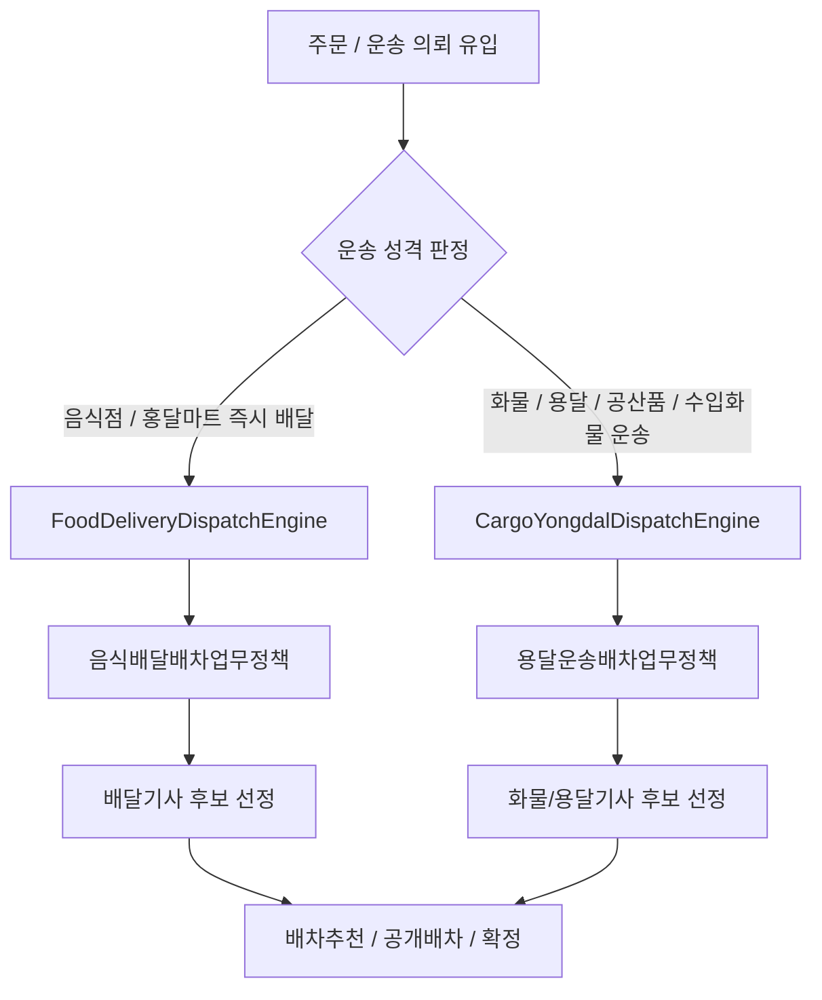
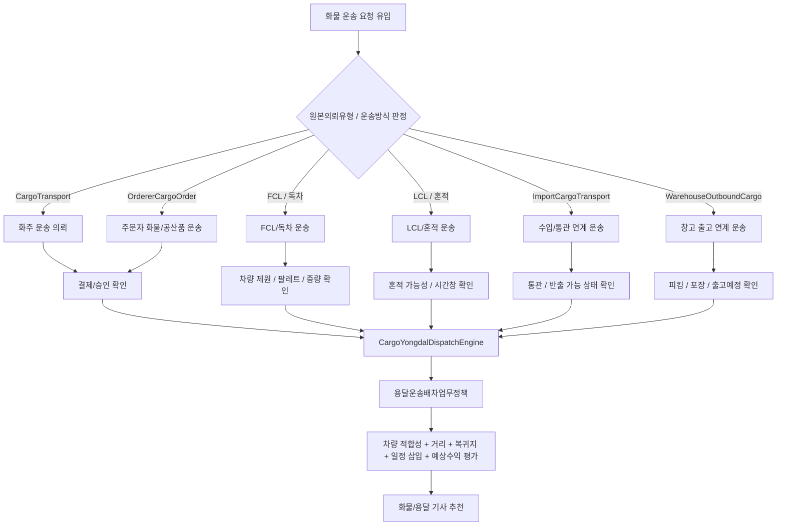
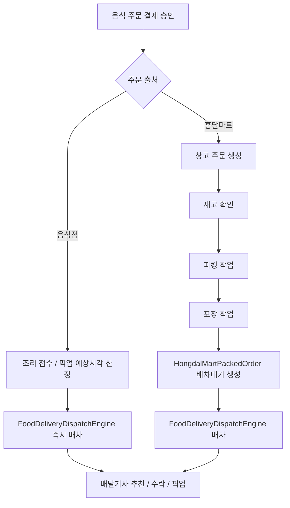

# Dispatch Flows

배차는 주문 유입 경로보다 실제 운송 성격을 기준으로 엔진을 나눕니다.

| 엔진 | 배차업무유형 | 주요 대상 | 우선 판단 기준 |
| --- | --- | --- | --- |
| `CargoYongdalDispatchEngine` | `용달운송` | 화주 운송 의뢰, 공산품 운송 요청, FCL/LCL 연계 운송 | 차량 적합성, 상하차 조건, 거리/복귀지, 운임, 일정 삽입 가능성 |
| `FoodDeliveryDispatchEngine` | `음식배달` | 음식점 주문, 홍달마트 주문, 즉시 픽업 배달 | 조리/픽업 시간, 고객 도착 시간, 묶음 배달 가능성, 기사 위치 |

## 엔진 선택

현재 코드는 `배차추천후보선정Service`가 `배차대기.배차업무유형`을 보고 `I배차엔진`을 선택하는 구조를 지향합니다. 엔진은 다시 세부 `I배차업무정책`으로 후보 선정 알고리즘을 위임합니다.

## 화물/용달 배차

화물 배달 건은 "누가 주문했는가"보다 "어떤 운송 단위인가"를 먼저 봅니다.

| 흐름 | 원본의뢰유형 | 배차 시작 조건 | 배차 시 우선 확인 |
| --- | --- | --- | --- |
| 화주 운송 의뢰 | `CargoTransport` | 결제 완료, 후불 승인, 현장지급 승인 | 상차지, 하차지, 화물 제원, 운임, 결제/정산 조건 |
| 주문자 화물/공산품 운송 | `OrdererCargoOrder` | 운송 요청 확정과 결제/승인 조건 충족 | 주문자 연락 가능 여부, 상품 크기, 파손 주의, 픽업/하차 주소 |
| FCL/독차 운송 | `FclCargoTransport` | 컨테이너 또는 차량 단위 운송 조건 확정 | 차량 제원, 팔레트 수, 중량, 상하차 장비, 시간창 |
| LCL/혼적 운송 | `LclCargoTransport` | 혼적 가능 조건과 경유 가능 시간 확인 | 온도/파손 민감도, 하차 순서, 경유 가능 시간 |
| 수입/통관 연계 운송 | `ImportCargoTransport` | 통관 또는 반출 가능 상태 확인 | 통관 상태, 보세/창고 위치, 반출 가능 시각, HS 코드 위험 태그 |
| 창고 출고 연계 운송 | `WarehouseOutboundCargo` | 피킹/포장 또는 출고예정 상태 확인 | 출고 준비 상태, 적재 위치, 상차 가능 시각 |

## 음식 배달 배차

음식 배달 엔진 안에서도 배차 시작 시점은 음식점 즉시 배달과 홍달마트 준비 후 배달로 나눕니다.

| 흐름 | 원본의뢰유형 | 배차 시작 조건 |
| --- | --- | --- |
| 음식점 즉시 배달 | `RestaurantFoodOrder`, `FoodOrder` | 결제 승인과 조리 접수 후 바로 배차 가능 |
| 홍달마트 준비 중 배달 | `HongdalMartOrder`, `MartFoodOrder` | 재고 확인, 피킹, 포장 완료 전에는 배차 보류 |
| 홍달마트 포장 완료 배달 | `HongdalMartPackedOrder` | 포장 완료 후 배달기사 픽업 배차 가능 |

