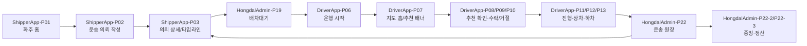

# 홍달 1.0 페이지 검증 순례

이 문서는 홍달 1.0 국내 화물/용달 운송을 실제 화면으로 하나씩 검증하기 위한 순서표다. `hongdal-v1-required-pages.md`가 필요한 화면의 기준을 정한다면, 이 문서는 그 화면들을 어떤 순서로 눌러 보고 무엇을 확인해야 하는지 정리한다.

검증의 목적은 화면이 존재하는지 확인하는 데서 끝나지 않는다. 한 화면에서 상태가 바뀌면 서버 원장이 갱신되고, 다른 앱 화면에서 그 상태가 다시 보이는지 확인해야 한다.

## 검증 원칙

| 기준 | 확인할 것 |
| --- | --- |
| 화면 존재 | 라우트가 열리고 렌더링 오류 없이 주요 UI가 보이는가 |
| 서버 데이터 | 클라이언트 메모리만이 아니라 서버 API 또는 개발 시드/인메모리 스냅샷에서 데이터가 내려오는가 |
| 상태 전파 | 한 화면의 조작 결과가 다른 앱의 화면에 같은 상태로 반영되는가 |
| 실패/예외 | 업로드 실패, 위치 송신 실패, 추천 만료, 현장 예외가 다음 행동과 함께 보이는가 |
| 보안/개인정보 | 연락처, 주소, 위치, 계좌, 결제 식별자, POD 원본이 필요한 권한 안에서만 보이는가 |
| 단일 책임 | 한 화면이 너무 많은 결정을 떠안지 않고 다음 화면으로 넘길 일을 분리하는가 |

## 1차 순례 흐름

가장 먼저 아래 순서로 본다. 이 순서는 실제 운송 의뢰 한 건이 닫히는 흐름이다.

## 필수 화면 검증 표

| 순서 | 페이지 | 앱/라우트 | 주 사용자 | 검증할 상태 | 서버/API 확인 | 현재 문서 |
| ---: | --- | --- | --- | --- | --- | --- |
| 1 | `ShipperApp-P01` 화주 홈 | `ShipperApp` `/shipper` | 화주 | 최근 의뢰, 운송 의뢰 작성, 의뢰 상세 진입 | 홈 데이터가 서버 의뢰 목록과 어긋나지 않는지 확인 | [문서](page-docs/ShipperApp/ShipperApp-P01/) |
| 2 | `ShipperApp-P02` 운송 의뢰 작성 | `ShipperApp` `/shipper/request` | 화주 | 의뢰 생성, 결제/정산 조건, 상하차지 | `POST api/v1/shipper/requests`, 차량 추천 API | [문서](page-docs/ShipperApp/ShipperApp-P02/) |
| 3 | `ShipperApp-P03` 의뢰 상세/타임라인 | `ShipperApp` `/shipper/request/{RequestId}` | 화주 | 결제, 배차, 수락, 상차, 하차, 정산 타임라인 | `GET api/v1/shipper/requests/{requestId}` | [문서](page-docs/ShipperApp/ShipperApp-P03/) |
| 4 | `HongdalAdmin-P19` 배차대기 | `HongdalAdmin` `/dispatch/wait` | 관리자 | 배차대기, 추천중, 후보부족, 추천 잠금 | `GET api/v1/dispatch/wait` | [문서](page-docs/HongdalAdmin/HongdalAdmin-P19/) |
| 5 | `DriverApp-P06` 운행 시작 | `DriverApp` `/driver/work/start` | 기사 | 운행 시작, 위치 송신 시작, 복귀/수익 선호 | `api/v1/driver/work/*`, 위치 송신 API | [문서](page-docs/DriverApp/DriverApp-P06/) |
| 6 | `DriverApp-P07` 지도 홈/추천 배너 | `DriverApp` `/driver/home` | 기사 | 신규 추천 배너, 60초 응답 제한, 현재 운송 진입 | `GET api/v1/driver/home`, 추천 API | [문서](page-docs/DriverApp/DriverApp-P07/) |
| 7 | `DriverApp-P08` 추천 목록 | `DriverApp` `/driver/recommendations` | 기사 | 추천 후보 목록, 공동주문/일반화물 구분 | `GET api/v1/driver/recommendations` | [문서](page-docs/DriverApp/DriverApp-P08/) |
| 8 | `DriverApp-P09` 추천 상세 | `DriverApp` `/driver/recommendations/{의뢰Id}` | 기사 | 운임, 추가 시간, 경로 이점, 증빙 조건 | 추천 상세 DTO와 배차 원장 | [문서](page-docs/DriverApp/DriverApp-P09/) |
| 9 | `DriverApp-P10` 배차 처리 | `DriverApp` `/driver/recommendations/{의뢰Id}/decision` | 기사 | 수락, 거절, 만료, 보류 | `POST api/v1/driver/dispatch-actions/{requestId}/accept`, `reject` | [문서](page-docs/DriverApp/DriverApp-P10/) |
| 10 | `DriverApp-P11` 진행 중 운송 | `DriverApp` `/driver/transports/current` | 기사 | 다음 행동, 상차/하차 진입, 진행 상태 | `GET api/v1/driver/transports/current` | [문서](page-docs/DriverApp/DriverApp-P11/) |
| 11 | `DriverApp-P12` 상차 | `DriverApp` `/driver/transports/{운송Id}/pickup` | 기사 | 상차 사진, 인수증, 서명, 상차 예외 | 상차 완료 Command, 파일 업로드 API | [문서](page-docs/DriverApp/DriverApp-P12/) |
| 12 | `DriverApp-P13` 하차 | `DriverApp` `/driver/transports/{운송Id}/dropoff` | 기사 | 하차 사진, POD, 인수 확인, 하차 예외 | 하차 완료 Command, 파일 업로드 API | [문서](page-docs/DriverApp/DriverApp-P13/) |
| 13 | `DriverApp-P14` 월정산 | `DriverApp` `/driver/settlements/current-month` | 기사 | 운임, 추가 수당, 정산 예정일, 입금 완료 | `GET api/v1/driver/settlements/current-month` | [문서](page-docs/DriverApp/DriverApp-P14/) |
| 14 | `DriverApp-P15` 알림함 | `DriverApp` `/driver/notifications` | 기사 | 추천, 수락 후 안내, 입금 요청, 실패 알림 | FCM/알림톡/서버 알림 목록 | [문서](page-docs/DriverApp/DriverApp-P15/) |
| 15 | `HongdalAdmin-P16` 운영 대시보드 | `HongdalAdmin` `/dashboard` | 관리자 | 막힌 배차, 증빙 누락, 정산 지연 요약 | `GET api/v1/admin/dashboard` | [문서](page-docs/HongdalAdmin/HongdalAdmin-P16/) |
| 16 | `HongdalAdmin-P21` 운송 목록 | `HongdalAdmin` `/transports` | 관리자 | 진행중, 완료, 예외 운송 목록 | `GET api/v1/admin/transports` | [문서](page-docs/HongdalAdmin/HongdalAdmin-P21/) |
| 17 | `HongdalAdmin-P22` 운송 상세 원장 | `HongdalAdmin` `/transports/{RequestId}` | 관리자 | 기사, 화주, 의뢰, 증빙, 정산 연결 | 운송 워크플로우 상세 조회 | [문서](page-docs/HongdalAdmin/HongdalAdmin-P22/) |
| 18 | `HongdalAdmin-P22-1` 운송 이벤트 감사 | `HongdalAdmin` `/transports/{RequestId}/events` | 관리자 | 수락, 거절, 만료, 상차, 하차, 예외 로그 | `GET api/v1/admin/transports/events` | [문서](page-docs/HongdalAdmin/HongdalAdmin-P22-1/) |
| 19 | `HongdalAdmin-P22-2` 운송 증빙/POD | `HongdalAdmin` `/transports/{RequestId}/proofs` | 관리자 | 사진, POD, 인수증, 서명, 문서 연결 | 파일/POD와 문서 API | [문서](page-docs/HongdalAdmin/HongdalAdmin-P22-2/) |
| 20 | `HongdalAdmin-P22-3` 운송 정산 상세 | `HongdalAdmin` `/transports/{RequestId}/settlement` | 관리자 | 입금 요청, 입금 완료, 기사 정산 후보 | 결제/정산 API | [문서](page-docs/HongdalAdmin/HongdalAdmin-P22-3/) |
| 21 | `HongdalAdmin-P26` 결제 목록 | `HongdalAdmin` `/payments` | 관리자 | 결제대기, 가상계좌, 입금완료 | `GET api/v1/payments` | [문서](page-docs/HongdalAdmin/HongdalAdmin-P26/) |
| 22 | `HongdalAdmin-P26-1` 정산 목록 | `HongdalAdmin` `/settlements` | 관리자 | 기사별 정산 상태, 월정산 확인 | `GET api/v1/admin/driver-settlements` | [문서](page-docs/HongdalAdmin/HongdalAdmin-P26-1/) |
| 23 | `HongdalAdmin-P27-5` 파일/POD 관리 | `HongdalAdmin` `/files/pod` | 관리자 | POD 업로드 상태, 원본 보호, 검수 | `api/v1/admin/files/pod` | [문서](page-docs/HongdalAdmin/HongdalAdmin-P27-5/) |

## 운영 보조 화면

아래 화면은 운송 흐름을 직접 전진시키지는 않지만, 1.0 운영에서 막힌 상태를 찾거나 민원/연락처 확인을 돕는다. 필수 화면 검증 뒤에 같이 본다.

| 페이지 | 라우트 | 검증할 것 |
| --- | --- | --- |
| `HongdalAdmin-P20` 운행 중 기사 현황 | `/drivers/operating` | 위치 최신성, 운행 상태, 후보 기사 확인 |
| `HongdalAdmin-P32` 기사 목록/관리 | `/drivers` | 기사 연락처, 차량, 최근 배차 내역 확인 |
| `HongdalAdmin-P33` 파트너 관리 | `/partners` | 화주 계정과 업체 연락처 확인 |
| `HongdalAdmin-P36` 연락처 통합 검색 | `/contact-search` | 전화번호 뒤 8자리로 기사/화주/창고 사용자 정보를 함께 조회 |
| `HongdalAdmin-P24` 화면/기능 노출 정책 | `/view-policies` | 1.0 필수 화면이 정책 때문에 숨겨지지 않는지 확인 |
| `HongdalAdmin-P35` 보조 기능 설정 | `/auxiliary-feature-settings` | 알림, 기록, 후속 처리 같은 부가 기능이 정책과 맞는지 확인 |

## 한 페이지를 검증할 때 남길 기록

각 페이지 README에는 다음 내용을 계속 보강한다.

| 항목 | 기록 방식 |
| --- | --- |
| 검증일 | 마지막으로 렌더링 또는 API 연동을 확인한 날짜 |
| 샘플 데이터 | 어떤 개발 시드, 인메모리 스냅샷, API 응답으로 화면을 확인했는지 |
| 성공 기준 | 사용자가 다음 행동을 판단할 수 있는지 |
| 실패 기준 | 서버 오류, 인증 오류, 빈 데이터, 업로드 실패 때 안내가 보이는지 |
| 다른 화면 반영 | 이 화면의 상태 변경이 어느 화면에서 다시 보이는지 |
| 보안 메모 | 연락처, 위치, 사진, 계좌, 결제값이 마스킹 또는 권한 통제되는지 |

## 다음 보완 순서

1. `ShipperApp-P01`부터 `DriverApp-P15`까지는 실제 개발 시드 데이터로 다시 열어 본다.
2. `HongdalAdmin-P16`부터 `HongdalAdmin-P27-5`까지는 서버 관리자 로그인 상태에서 다시 캡처한다.
3. 각 페이지 README의 `API 경로와 코드 연결`이 실제 코드와 어긋나면 그 자리에서 고친다.
4. 렌더링만 통과한 페이지와 실제 서버 API 데이터까지 확인한 페이지를 구분해 표시한다.
