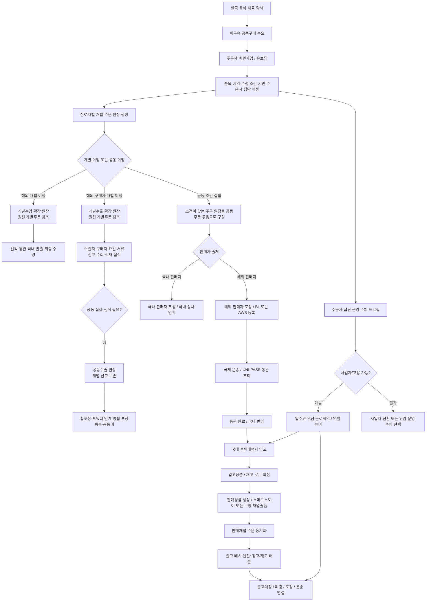

# 주문자 집단 공동주문/커머스 흐름

이 문서는 주문자 집단의 개별 주문 원장을 공동주문 묶음으로 구성하고, 해외 판매자 물품을 수입해 국내 물류대행사에 입고한 뒤, 스마트스토어/쿠팡 같은 판매채널과 출고 배치로 이어지는 흐름을 정리한다.

공동주문은 독립된 주문 데이터를 새로 만드는 개념이 아니다. 각 사용자의 주문 원장을 기본 단위로 유지하면서 상품, 수량, 가격, 배송권 같은 공동 조건이 맞는 주문 원장을 여러 개 묶은 집합이다. 수입·통관·입고·분배는 이 묶음에서 파생되는 후속 이행 절차다.

개별수입도 독립 주문이 아니다. 해외에서 개별적으로 이행할 주문에는 `individual-import` 원장을 `order` 원장의 하위 수입 이행 확장으로 연결한다. 상품·수량·가격·계약·서명 원본은 개별주문 원장에 한 번만 두고, 개별수입 확장에는 수입 주체, 해외 판매자, 선적·통관·국내 반출과 최종 수령 상태만 기록한다. 여러 사용자의 주문을 묶어 해외에서 이행할 때만 공동구매에서 공동수입 원장으로 인계한다.

개별수출 역시 독립 주문이 아니다. 권장 여정은 기존 커뮤니티 게시글·비구속 관심·가원장을 조립한 수출 교류장에서 문화·사용 경험과 상호 이익을 나눈 뒤, 당사자가 주문 제안과 조건을 별도로 동의해 `order`를 만드는 흐름이다. 교류가 없는 직접 B2B/B2C 주문도 허용하며, 어느 경우든 해외 구매자에게 이행할 주문에는 `individual-export`를 `order`의 하위 수출 이행 확장으로 연결한다. 여러 개별수출을 같은 집하·합포장·포워더 인계 단위로 조율할 때에는 `group-export`가 그 개별수출 원장들을 포함한다. 공동수출에서도 수출자, 해외 구매자, B2B/B2C 문맥, 신고·서류·적재 실적은 각 개별수출에 보존한다. 세부 모델은 [개별수출·공동수출 원장](../Architecture/ExportLedgerModel.md)을 따른다.

현재 릴리즈 집중 대상은 `문화교통 0.0` 커뮤니티·공공데이터 기반이다. 아래 기능은 보존된 후속 설계로서 `문화교통 0.5 개별주문 → 문화교통 1.0 공동주문·집단화 → 문화교통 1.5 공급·무역 준비 → 2.0 운송 → 2.5 창고·판매 이행`으로 나누며, 기본 개발·배포에서는 관련 Feature를 열지 않는다.

`0.5`의 정지선은 본인 소유 개별주문 원장 저장·변경·철회와 공동 참여 동의 분리다. `1.0`은 동의한 개별 원장만 기본 14일 모집에 포함해 조건 충족 여부를 계산하되 결제, 창고, 수입 신고와 운송 요청은 만들지 않으며, 조건 충족 후 별도 확인을 거쳐야 `1.5` 이후 절차로 이동한다.

## 최신 반영 범위

| 영역 | 반영 내용 | 주요 위치 |
| --- | --- | --- |
| 주문자 집단 온보딩 | 회원가입/온보딩 시 주소, 공동주택 단지, Kakao 지역 단서로 주문자 집단 범위를 자동 배정 | `AuthDtos`, `주문자집단자동배정Service`, `인증Controller` |
| 공동주문 물류 흐름 | 국내/해외 판매자 흐름을 분리하고, 해외 판매자 포장, 국제 운송, 통관, 국내 물류대행 입고, 판매채널 등록, 출고 배치 가능 단계를 정의 | `공동구매물류워크플로우Dtos`, `공동구매물류워크플로우저장소` |
| 개별수입 확장 관계 | 개별수입을 별도 주문 루트가 아닌 개별주문의 선택적 하위 원장으로 표현하고 잘못된 루트·역할 연결을 차단 | `CommunityLedgerTemplateCatalog`, `주문원장구성정책`, `주문원장통합UseCase` |
| 수출 교류장과 환류 | 마음·관심을 점수화하지 않고 대화·관심·연락처·주문·수출·완료 공유 동의를 분리해 `교류 → 개별주문 → 개별수출 → 선택적 환류`를 표현 | `CommunityLedgerTemplateCatalog`, `CommunityDiagramWorkbenchScreen` |
| 개별수출 확장 관계 | 개별수출을 개별주문의 선택적 하위 원장으로 두고 거래 당사자, 요건·서류, 신고·수리·적재 근거를 분리 | `CommunityLedgerTemplateCatalog`, `주문원장구성정책`, `주문원장통합UseCase` |
| 공동수출 물류 집계 | 여러 개별수출을 집하·합포장·포워더 인계·공통비 단위로 묶되 수출자별 신고 원본을 보존 | `CommunityLedgerTemplateCatalog`, `CommunityDiagramWorkbenchScreen` |
| 개별 주문자 서명 | 각 주문 원장에 서명 Hash 증적을 분리 저장하고, 공동주문에서 서명 완료·미서명 주문을 집계 | `주문원장서명UseCase`, `Mongo주문원장서명저장소`, `주문원장통합UseCase` |
| 해외 선적 추적 | BL/AWB, 문서관리번호, 선박/항공편, 통관 단계, 국내 입고 상태를 Mongo 원장으로 관리 | `공동구매해외선적추적Dtos`, `공동구매해외선적추적저장소` |
| 통관 조회 연동 | UNI-PASS 화물통관 진행 조회 결과를 공동주문 해외 선적 원장의 상태 이벤트로 반영 | `Unipass화물통관진행조회Service`, `공동구매해외선적통관동기화Service` |
| 국내 물류대행 입고 | 공동수입 물품이 국내 물류대행사 또는 외부 3PL에 입고되고, 입고상품/창고/재고 로트로 연결되는 플랜을 관리 | `공동구매커머스이행계획Dtos`, `공동구매커머스이행계획저장소` |
| 판매채널/출고 배치 연결 | 물류대행 입고상품을 판매상품과 채널출품으로 연결하고, 판매채널 주문 동기화 시 출고 배치 엔진이 재고를 배분 | `SalesChannelOrderSyncService`, `OutboundBatchEngine` |
| 공동주택 비용/수익 보기 | 공동주택 관리비 공공데이터와 공동판매 예상 수익을 함께 보여 관리비 감면 효과를 시뮬레이션 | `ApartmentManagementFeeLookupService`, `공공데이터조회Controller` |
| 잔여재고 판매·관리비 절감 설계 | 예약분 보호, 잔여재고 소유권·동의, 판매 정산, 공동주택 귀속과 실제 관리비 차감 확인을 별도 원장으로 연결 | [공동주택 잔여재고 판매·관리비 절감 흐름](../Architecture/ApartmentGroupPurchaseSurplusRevenueFlow.md) |
| 운영 주체/고용 | 주문자 집단이 비사업자 모임인지, 사업자/법인/협동조합/관리사무소 위임/플랫폼 위임인지 구분하고 고용 가능 상태를 관리 | `주문자집단운영주체Dtos`, `주문자집단운영주체저장소` |
| 입주민 우선 고용 | 공동주문 분류, 단지 내 배분, 택배/공동구매 물품 집합, 공동주택 관리 보조, 경비/순찰 보조 역할을 입주민 우선으로 정의 | `HrRoleDtos`, `주문자집단운영주체저장소` |

## 기본 흐름

## 운영 주체와 고용 흐름

주문자 집단은 처음에는 비사업자 모임일 수 있다. 다만 수입통관, 급여 지급, 단지 내 물품 집합/분류 업무를 안정적으로 운영하려면 누가 법적 운영 주체인지 별도로 정해야 한다.

| 운영 주체 유형 | 의미 | 수입/고용 판단 |
| --- | --- | --- |
| `비사업자모임` | 사업자 등록이 없는 주문자 모임 | 직접 수입자/고용주 역할은 제한하고, 사업자 전환 또는 위임 운영을 요구 |
| `개인사업자` | 개인사업자 대표가 있는 주문자 집단 | 사업자 검증 완료 후 수입자/고용주 후보 |
| `법인` | 법인 명의로 운영되는 주문자 집단 | 사업자 검증 완료 후 수입자/고용주 후보 |
| `협동조합` | 협동조합 또는 유사 공동 운영체 | 사업자 검증 완료 후 공동주문 운영 주체 후보 |
| `관리사무소위임` | 관리사무소 또는 관리 주체가 위임받아 운영 | 단지 규정과 계약 조건 확인 후 운영 |
| `플랫폼위임` | 플랫폼이 수입/고용/정산 일부를 위임받아 운영 | 주문자 집단은 참여 단위, 플랫폼은 운영 주체 역할 |

고용 후보 역할은 기본적으로 `입주민우선`다. 즉, 외부 인력을 먼저 쓰기보다 같은 단지 내부에서 일하고 싶은 주민을 우선 후보로 본다.

| 역할 코드 | 쉬운 표현 | 기본 업무 |
| --- | --- | --- |
| `OrdererGroup.SortingWorker` | 공동주문 입고 분류 알바 | 입고 확인, 세대/판매 단위 분류, 수량 검수 보조 |
| `OrdererGroup.DistributionWorker` | 단지 내 배분 알바 | 공동주택 거점 수령 이후 세대별 배분, 미수령 물품 관리 |
| `OrdererGroup.ParcelAggregationWorker` | 택배/공동구매 물품 집합 보조 | 택배, 공동구매, 공동수입 물품을 지정 장소에 모으고 상태 확인 |
| `OrdererGroup.CommunityFacilityWorker` | 공동주택 관리 보조 | 공용공간 정리, 물품 보관 장소 관리, 공동 작업 안내 |
| `OrdererGroup.SecurityWorker` | 단지 내부 경비/순찰 보조 | 경비, 순찰, 반입 시간대 안내, 거점 질서 유지 보조 |

경비 업무는 표현과 범위를 조심해야 한다. 법적 의미의 경비 업무는 경비업법상 결격사유, 신임교육, 업무 범위 제한을 확인해야 한다. 따라서 물품 집합/분류/관리 보조는 경비 역할과 분리하고, `SecurityWorker`는 `Compliance필요` 성격의 정책으로 다루는 것이 안전하다.

참고:
- 경비업법 제10조, 제13조: https://www.law.go.kr/LSW/lsInfoP.do?lsiSeq=268091
- 공동주택관리법 시행령 제69조의2: https://www.law.go.kr/lsLinkCommonInfo.do?chrClsCd=010202&lspttninfSeq=167947

## 주요 API

| API | 용도 |
| --- | --- |
| `GET /api/v1/orderer/group-purchase-auto-groups` | 개인 식별자를 제외한 공동구매 모집 현황과 종료 상태 조회 |
| `POST /api/v1/orderer/group-purchase-auto-groups/placement-preview` | 저장 전 배치 기준과 예상 모집 진행 확인 |
| `PUT/DELETE /api/v1/orderer/group-purchase-auto-groups/demands/{demandSourceKey}` | 멱등 키를 사용한 본인 비구속 수요 저장·철회 |
| `GET /api/v1/orderer/public-data/orderer-group-scopes` | 주소/지역 단서로 주문자 집단 후보 조회 |
| `POST /api/v1/auth/register/orderer` | 주문자 회원가입과 주문자 집단 자동 배정 |
| `POST /api/v1/auth/onboarding/orderer-group-scope` | 가입 후 주문자 집단 범위 재배정 |
| `GET /api/v1/orderer/group-purchase-overseas-shipments/lookup` | 문서관리번호로 해외 선적/통관 상태 공개 조회 |
| `POST /api/v1/admin/orderer/group-purchase-overseas-shipments` | 관리자 해외 선적 원장 등록/수정 |
| `POST /api/v1/admin/orderer/group-purchase-overseas-shipments/customs-sync` | UNI-PASS 화물통관 진행 조회 동기화 |
| `GET /api/v1/orderer/group-purchase-commerce-fulfillment-plans/by-group-purchase/{groupPurchaseId}` | 공동주문 물류대행 입고/판매채널/출고 준비 상태 공개 조회 |
| `POST /api/v1/admin/orderer/group-purchase-commerce-fulfillment-plans` | 관리자 커머스 풀필먼트 플랜 등록/수정 |
| `GET /api/v1/orderer/orderer-group-operating-entities/{ordererGroupScopeKey}` | 주문자 집단 운영 주체와 고용 가능 상태 조회 |
| `POST /api/v1/admin/orderer/orderer-group-operating-entities` | 관리자 운영 주체 프로필 등록/수정 |
| `GET /api/v1/orderer/public-data/apartment-complexes/{complexCode}/management-fee-snapshot` | 공동주택 관리비 스냅샷 조회 |
| `POST /api/v1/orderer/public-data/apartment-complexes/group-commerce-offset-simulation` | 공동판매 수익으로 관리비 감면 효과 시뮬레이션 |

## 용어 정리

| 용어 | 정의 |
| --- | --- |
| 주문자 집단 | 같은 주소, 생활권, 공동주택, 초대코드 같은 단서를 공유해 공동 주문이나 공동 입고를 함께 할 수 있는 사용자 묶음 |
| 주문자 집단 범위 | 주문자 집단을 식별하는 기준값. 예: 공동주택 단지, Kakao 지역 2단계, 도로명주소 2단계 |
| 공동주문 | 상품·수량·가격·배송권 같은 공동 조건이 맞는 여러 개별 주문 원장을 참조로 묶은 집합. 수량과 금액은 연결된 주문 원장을 합산해 계산한다. |
| 개별수입 확장 원장 | 한 개별주문 원장을 원천으로 삼아 수입 주체, 해외 판매자, 선적·통관·국내 반출과 최종 수령만 덧붙이는 하위 원장. 상품·수량·가격·계약·서명은 복제하지 않는다. |
| 개별수출 확장 원장 | 한 개별주문을 원천으로 삼아 수출자·해외 구매자, B2B/B2C, Incoterms, 요건·서류, 신고·수리·적재와 대금 증빙을 덧붙이는 하위 원장 |
| 공동수출 원장 | 하나 이상의 개별수출을 집하·합포장·포워더 인계·공동 선적 단위로 조율하되 수출자별 주문·신고·서류·적재 실적은 각 개별수출에 보존하는 집계 원장 |
| FCL | Full Container Load. 컨테이너 하나를 단독으로 쓰는 운송 단위 |
| LCL | Less than Container Load. 여러 화주의 물건을 한 컨테이너에 혼적하는 운송 단위 |
| BL | Bill of Lading. 선박 운송에서 화물이 선적되었음을 증명하는 선하증권 |
| AWB | Air Waybill. 항공 운송에서 화물 접수/운송을 증명하는 항공화물운송장 |
| 문서관리번호 | 플랫폼이 BL/AWB, 통관 조회, 공동주문 원장을 연결하기 위해 쓰는 내부 관리 번호 |
| UNI-PASS | 관세청 전자통관 시스템. 화물통관 진행 상태 조회에 사용 |
| 수입자 | 통관 과정에서 수입 책임을 지는 주체. 사업자 여부와 위임 구조를 확인해야 한다 |
| 물류대행사 / 3PL | Third Party Logistics. 보관, 입고, 피킹, 포장, 출고 같은 물류 업무를 대신 수행하는 외부 물류 업체 |
| 입고상품 | 창고에 실제 입고되어 재고로 관리되는 상품 단위 |
| 재고 로트 | 같은 입고/통관/유통기한/보관 조건으로 묶어 추적하는 재고 묶음 |
| 판매상품 | 입고상품을 스마트스토어/쿠팡 등 판매채널에 팔 수 있게 만든 상품 정보 |
| 채널출품 | 판매상품을 특정 판매채널 계정의 상품 번호와 연결한 상태 |
| 출고 배치 | 주문이 들어왔을 때 어느 창고의 어느 재고를 어떤 수량으로 출고할지 정하는 계획 |
| 운영 주체 프로필 | 주문자 집단이 비사업자 모임인지, 사업자/법인/협동조합/관리사무소/플랫폼 위임인지 기록하는 원장 |
| HR Scope | 근로계약이나 역할 부여가 적용되는 범위. 주문자 집단은 `OrdererGroup` scope로 연결된다 |
| 입주민 우선 | 같은 단지 내부 주민을 먼저 근로 후보로 보고, 외부 인력은 운영자가 허용할 때만 쓰는 정책 |
| 관리비 감면 시뮬레이션 | 공동판매 예상 수익을 공동주택 관리비와 비교하는 추정치. 관리사무소가 실제 부과에 반영하기 전에는 확정 감면으로 표시하지 않는다. |
| 관리비 차감 확정액 | 판매 정산, 공동주택 귀속 승인, 지정 계좌 입금과 적용 월 확인이 끝나 관리사무소에 전달할 수 있는 금액 |

## 남은 결정 사항

- 경비/순찰 보조 역할을 실제 경비 업무로 볼지, 공동주택 관리 보조 업무로 제한할지에 대한 운영 정책
- 사업자 검증을 국세청 사업자등록 상태 조회와 자동 연결할지 여부
- 주문자 집단이 직접 고용주가 되는 경우와 플랫폼/관리사무소가 위임 운영하는 경우의 계약 문구
- 관리비 부과 시스템에 전달할 표준 파일/API와 실제 반영 확인서 형식
- 공동주택 유형·지역별 관리규약 준칙과 사업계획·예산 승인 증빙의 표준화 범위
- 잔여재고의 실제 seller of record를 관리주체, 협동조합 또는 별도 판매 사업자 중 누가 맡을지
- 물류대행 입고 완료 시 `입고요청`, `입고상품`, `판매상품`, `채널출품`을 자동 생성할지 여부
