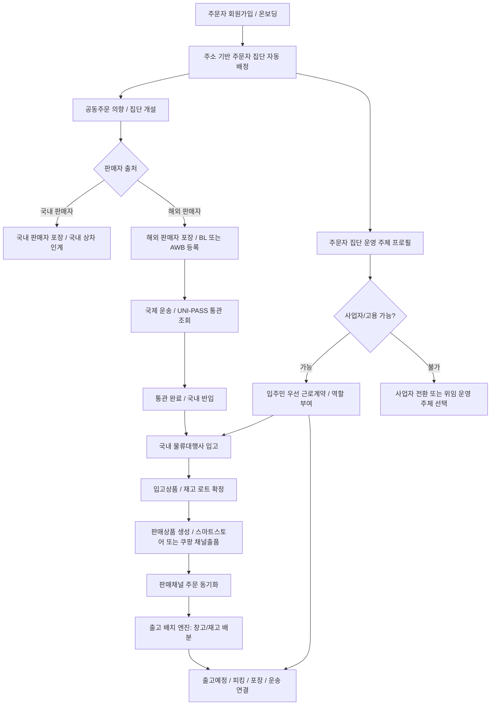

# 주문자 집단 공동주문/커머스 흐름

이 문서는 주문자 집단이 공동주문을 만들고, 해외 판매자 물품을 수입해 국내 물류대행사에 입고한 뒤, 스마트스토어/쿠팡 같은 판매채널과 출고 배치로 이어지는 흐름을 정리한다.

현재 릴리즈 집중 대상은 여전히 `1.0` 국내 화물/용달 운송이다. 아래 기능은 `2.5` 주문자 집단 공동주문 확장 축이며, 기본 UI 노출과 운영 적용은 버전 정책과 기능 플래그를 따른다.

## 최신 반영 범위

| 영역 | 반영 내용 | 주요 위치 |
| --- | --- | --- |
| 주문자 집단 온보딩 | 회원가입/온보딩 시 주소, 공동주택 단지, Kakao 지역 단서로 주문자 집단 범위를 자동 배정 | `AuthDtos`, `주문자집단자동배정Service`, `인증Controller` |
| 공동주문 물류 흐름 | 국내/해외 판매자 흐름을 분리하고, 해외 판매자 포장, 국제 운송, 통관, 국내 물류대행 입고, 판매채널 등록, 출고 배치 가능 단계를 정의 | `공동구매물류워크플로우Dtos`, `공동구매물류워크플로우저장소` |
| 해외 선적 추적 | BL/AWB, 문서관리번호, 선박/항공편, 통관 단계, 국내 입고 상태를 Mongo 원장으로 관리 | `공동구매해외선적추적Dtos`, `공동구매해외선적추적저장소` |
| 통관 조회 연동 | UNI-PASS 화물통관 진행 조회 결과를 공동주문 해외 선적 원장의 상태 이벤트로 반영 | `Unipass화물통관진행조회Service`, `공동구매해외선적통관동기화Service` |
| 국내 물류대행 입고 | 공동수입 물품이 국내 물류대행사 또는 외부 3PL에 입고되고, 입고상품/창고/재고 로트로 연결되는 플랜을 관리 | `공동구매커머스이행계획Dtos`, `공동구매커머스이행계획저장소` |
| 판매채널/출고 배치 연결 | 물류대행 입고상품을 판매상품과 채널출품으로 연결하고, 판매채널 주문 동기화 시 출고 배치 엔진이 재고를 배분 | `SalesChannelOrderSyncService`, `OutboundBatchEngine` |
| 공동주택 비용/수익 보기 | 공동주택 관리비 공공데이터와 공동판매 예상 수익을 함께 보여 관리비 감면 효과를 시뮬레이션 | `ApartmentManagementFeeLookupService`, `PublicDataLookupController` |
| 운영 주체/고용 | 주문자 집단이 비사업자 모임인지, 사업자/법인/협동조합/관리사무소 위임/플랫폼 위임인지 구분하고 고용 가능 상태를 관리 | `주문자집단운영주체Dtos`, `주문자집단운영주체저장소` |
| 입주민 우선 고용 | 공동주문 분류, 단지 내 배분, 택배/공동구매 물품 집합, 공동주택 관리 보조, 경비/순찰 보조 역할을 입주민 우선으로 정의 | `HrRoleDtos`, `주문자집단운영주체저장소` |

## 기본 흐름

## 운영 주체와 고용 흐름

주문자 집단은 처음에는 비사업자 모임일 수 있다. 다만 수입통관, 급여 지급, 단지 내 물품 집합/분류 업무를 안정적으로 운영하려면 누가 법적 운영 주체인지 별도로 정해야 한다.

| 운영 주체 유형 | 의미 | 수입/고용 판단 |
| --- | --- | --- |
| `비사업자모임` | 사업자 등록이 없는 주문자 모임 | 직접 수입자/고용주 역할은 제한하고, 사업자 전환 또는 위임 운영을 요구 |
| `개인사업자` | 개인사업자 대표가 있는 주문자 집단 | 사업자 검증 완료 후 수입자/고용주 후보 |
| `법인` | 법인 명의로 운영되는 주문자 집단 | 사업자 검증 완료 후 수입자/고용주 후보 |
| `협동조합` | 협동조합 또는 유사 공동 운영체 | 사업자 검증 완료 후 공동주문 운영 주체 후보 |
| `관리사무소위임` | 관리사무소 또는 관리 주체가 위임받아 운영 | 단지 규정과 계약 조건 확인 후 운영 |
| `플랫폼위임` | 플랫폼이 수입/고용/정산 일부를 위임받아 운영 | 주문자 집단은 참여 단위, 플랫폼은 운영 주체 역할 |

고용 후보 역할은 기본적으로 `입주민우선`다. 즉, 외부 인력을 먼저 쓰기보다 같은 단지 내부에서 일하고 싶은 주민을 우선 후보로 본다.

| 역할 코드 | 쉬운 표현 | 기본 업무 |
| --- | --- | --- |
| `OrdererGroup.SortingWorker` | 공동주문 입고 분류 알바 | 입고 확인, 세대/판매 단위 분류, 수량 검수 보조 |
| `OrdererGroup.DistributionWorker` | 단지 내 배분 알바 | 공동주택 거점 수령 이후 세대별 배분, 미수령 물품 관리 |
| `OrdererGroup.ParcelAggregationWorker` | 택배/공동구매 물품 집합 보조 | 택배, 공동구매, 공동수입 물품을 지정 장소에 모으고 상태 확인 |
| `OrdererGroup.CommunityFacilityWorker` | 공동주택 관리 보조 | 공용공간 정리, 물품 보관 장소 관리, 공동 작업 안내 |
| `OrdererGroup.SecurityWorker` | 단지 내부 경비/순찰 보조 | 경비, 순찰, 반입 시간대 안내, 거점 질서 유지 보조 |

경비 업무는 표현과 범위를 조심해야 한다. 법적 의미의 경비 업무는 경비업법상 결격사유, 신임교육, 업무 범위 제한을 확인해야 한다. 따라서 물품 집합/분류/관리 보조는 경비 역할과 분리하고, `SecurityWorker`는 `Compliance필요` 성격의 정책으로 다루는 것이 안전하다.

참고:
- 경비업법 제10조, 제13조: https://www.law.go.kr/LSW/lsInfoP.do?lsiSeq=268091
- 공동주택관리법 시행령 제69조의2: https://www.law.go.kr/lsLinkCommonInfo.do?chrClsCd=010202&lspttninfSeq=167947

## 주요 API

| API | 용도 |
| --- | --- |
| `GET /api/v1/orderer/public-data/orderer-group-scopes` | 주소/지역 단서로 주문자 집단 후보 조회 |
| `POST /api/v1/auth/register/orderer` | 주문자 회원가입과 주문자 집단 자동 배정 |
| `POST /api/v1/auth/onboarding/orderer-group-scope` | 가입 후 주문자 집단 범위 재배정 |
| `GET /api/v1/orderer/group-purchase-overseas-shipments/lookup` | 문서관리번호로 해외 선적/통관 상태 공개 조회 |
| `POST /api/v1/admin/orderer/group-purchase-overseas-shipments` | 관리자 해외 선적 원장 등록/수정 |
| `POST /api/v1/admin/orderer/group-purchase-overseas-shipments/customs-sync` | UNI-PASS 화물통관 진행 조회 동기화 |
| `GET /api/v1/orderer/group-purchase-commerce-fulfillment-plans/by-group-purchase/{groupPurchaseId}` | 공동주문 물류대행 입고/판매채널/출고 준비 상태 공개 조회 |
| `POST /api/v1/admin/orderer/group-purchase-commerce-fulfillment-plans` | 관리자 커머스 풀필먼트 플랜 등록/수정 |
| `GET /api/v1/orderer/orderer-group-operating-entities/{ordererGroupScopeKey}` | 주문자 집단 운영 주체와 고용 가능 상태 조회 |
| `POST /api/v1/admin/orderer/orderer-group-operating-entities` | 관리자 운영 주체 프로필 등록/수정 |
| `GET /api/v1/orderer/public-data/apartment-complexes/{complexCode}/management-fee-snapshot` | 공동주택 관리비 스냅샷 조회 |
| `POST /api/v1/orderer/public-data/apartment-complexes/group-commerce-offset-simulation` | 공동판매 수익으로 관리비 감면 효과 시뮬레이션 |

## 용어 정리

| 용어 | 정의 |
| --- | --- |
| 주문자 집단 | 같은 주소, 생활권, 공동주택, 초대코드 같은 단서를 공유해 공동 주문이나 공동 입고를 함께 할 수 있는 사용자 묶음 |
| 주문자 집단 범위 | 주문자 집단을 식별하는 기준값. 예: 공동주택 단지, Kakao 지역 2단계, 도로명주소 2단계 |
| 공동주문 | 여러 주문자가 구매 의사를 모아 목표 수량/금액을 맞추고, 대량 구매나 수입을 진행하는 흐름 |
| FCL | Full Container Load. 컨테이너 하나를 단독으로 쓰는 운송 단위 |
| LCL | Less than Container Load. 여러 화주의 물건을 한 컨테이너에 혼적하는 운송 단위 |
| BL | Bill of Lading. 선박 운송에서 화물이 선적되었음을 증명하는 선하증권 |
| AWB | Air Waybill. 항공 운송에서 화물 접수/운송을 증명하는 항공화물운송장 |
| 문서관리번호 | 플랫폼이 BL/AWB, 통관 조회, 공동주문 원장을 연결하기 위해 쓰는 내부 관리 번호 |
| UNI-PASS | 관세청 전자통관 시스템. 화물통관 진행 상태 조회에 사용 |
| 수입자 | 통관 과정에서 수입 책임을 지는 주체. 사업자 여부와 위임 구조를 확인해야 한다 |
| 물류대행사 / 3PL | Third Party Logistics. 보관, 입고, 피킹, 포장, 출고 같은 물류 업무를 대신 수행하는 외부 물류 업체 |
| 입고상품 | 창고에 실제 입고되어 재고로 관리되는 상품 단위 |
| 재고 로트 | 같은 입고/통관/유통기한/보관 조건으로 묶어 추적하는 재고 묶음 |
| 판매상품 | 입고상품을 스마트스토어/쿠팡 등 판매채널에 팔 수 있게 만든 상품 정보 |
| 채널출품 | 판매상품을 특정 판매채널 계정의 상품 번호와 연결한 상태 |
| 출고 배치 | 주문이 들어왔을 때 어느 창고의 어느 재고를 어떤 수량으로 출고할지 정하는 계획 |
| 운영 주체 프로필 | 주문자 집단이 비사업자 모임인지, 사업자/법인/협동조합/관리사무소/플랫폼 위임인지 기록하는 원장 |
| HR Scope | 근로계약이나 역할 부여가 적용되는 범위. 주문자 집단은 `OrdererGroup` scope로 연결된다 |
| 입주민 우선 | 같은 단지 내부 주민을 먼저 근로 후보로 보고, 외부 인력은 운영자가 허용할 때만 쓰는 정책 |
| 관리비 감면 시뮬레이션 | 공동판매 예상 수익을 공동주택 관리비와 비교해 세대별 비용 완화 가능성을 추정하는 계산 |

## 남은 결정 사항

- 경비/순찰 보조 역할을 실제 경비 업무로 볼지, 공동주택 관리 보조 업무로 제한할지에 대한 운영 정책
- 사업자 검증을 국세청 사업자등록 상태 조회와 자동 연결할지 여부
- 주문자 집단이 직접 고용주가 되는 경우와 플랫폼/관리사무소가 위임 운영하는 경우의 계약 문구
- 공동판매 수익을 관리비 감면, 포인트, 현금 정산 중 어떤 방식으로 환원할지
- 물류대행 입고 완료 시 `입고요청`, `입고상품`, `판매상품`, `채널출품`을 자동 생성할지 여부
