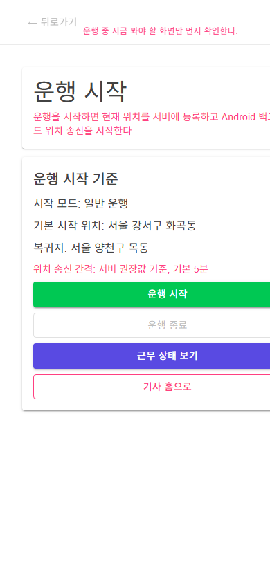

# DriverApp-P06 - 운행 시작, 위치 송신 시작

[전체 화면 문서](../../README.md) / [DriverApp 화면 목록](../README.md) / [앱 전체 카탈로그](../../../app-page-catalog.md)

## 화면 캡처

## 기본 정보

| 항목 | 내용 |
| --- | --- |
| 앱 | DriverApp |
| 페이지 ID / 제목 | DriverApp-P06 - 운행 시작, 위치 송신 시작 |
| 라우트 | /driver/work/start |
| 소스 파일 | [DriverApp/Components/Pages/Driver/01_Work/운행시작Page.razor](../../../../../DriverApp/Components/Pages/Driver/01_Work/운행시작Page.razor) |
| 분류 | 필수 |
| 2.0 운송 필수 연결 | [DriverApp-P06 - 운행 시작, 위치 송신 시작](../../../ssalddel-v1-required-pages.md) |
| 캡처 상태 | 완료 |

## 왜 필요한가

이 화면은 운행 시작, 위치 송신 시작을 담당하므로, 1.0 업무 흐름이 실제 사용자 행동으로 닫히기 위해 필요합니다.

## 사용자와 참여자

주 사용자: 기사 / 보조 참여자: 화주, 관리자, 창고 또는 현장 담당자

이 화면은 살뜰 2.0 국내 화물 운송 워크플로우 안에서 운행 시작, 위치 송신 시작 책임을 갖습니다. 화면 하나가 너무 많은 결정을 떠안지 않도록, 이 문서에서는 이 화면의 주 책임과 다른 화면으로 넘겨야 할 책임을 구분해 관리합니다.

## 화면에서 다루는 일

- 주 책임: 운행 시작, 위치 송신 시작
- 사용자가 확인해야 하는 것: 이 화면에서 상태, 입력값, 다음 행동이 명확히 보이는지 확인합니다.
- 사용자가 조작해야 하는 것: 버튼, 입력, 선택, 업로드, 조회 같은 조작이 이 화면의 책임 안에 머무는지 확인합니다.
- 화면 밖으로 넘길 일: 다른 앱이나 관리자 화면에서 처리해야 하는 상태 변경은 이 화면에 과하게 넣지 않습니다.

## 다른 화면과의 관계

- 이전 화면: [DriverApp-P05 - 운송/배달 이력 조회](../DriverApp-P05/)
- 다음 화면: [DriverApp-P06-1 - 운행 조건과 선호 설정](../DriverApp-P06-1/)
- 상위 화면: 없음
- 하위 화면: [DriverApp-P06-1 - 운행 조건과 선호 설정](../DriverApp-P06-1/)

상호작용 관점에서는 다음 흐름을 우선 봅니다. 기사의 수락, 거절, 상차, 하차, 증빙, 정산 관련 조작은 화주 상세와 관리자 원장에 상태 변경으로 반영됩니다.

## API 경로와 코드 연결

- 화면 소스: [DriverApp/Components/Pages/Driver/01_Work/운행시작Page.razor](../../../../../DriverApp/Components/Pages/Driver/01_Work/운행시작Page.razor)
- 클라이언트 서비스/계약: [DriverApp/Platforms/Android/Android기사위치송신Service.cs](../../../../../DriverApp/Platforms/Android/Android기사위치송신Service.cs), [DriverApp/Services/DriverWorkApiService.cs](../../../../../DriverApp/Services/DriverWorkApiService.cs), [DriverApp/Services/IDriverSampleDataService.cs](../../../../../DriverApp/Services/IDriverSampleDataService.cs), [DriverApp/Services/IDriverWorkApiService.cs](../../../../../DriverApp/Services/IDriverWorkApiService.cs), [DriverApp/Services/I기사위치송신Service.cs](../../../../../DriverApp/Services/I기사위치송신Service.cs), [DriverApp/Services/Noop기사위치송신Service.cs](../../../../../DriverApp/Services/Noop기사위치송신Service.cs), [DriverApp/Services/Samples/ServerBackedDriverSampleDataService.cs](../../../../../DriverApp/Services/Samples/ServerBackedDriverSampleDataService.cs), [DriverApp/Services/Samples/기사샘플데이터Service.cs](../../../../../DriverApp/Services/Samples/기사샘플데이터Service.cs)

| 구분 | 메서드 | API 경로 | 클라이언트/문서 근거 | 서버 근거 |
| --- | --- | --- | --- | --- |
| 2.0 운송 문서 | - | `api/v1/driver/shifts` | [docs/ProjectOverview/ssalddel-v1-required-pages.md](../../../ssalddel-v1-required-pages.md) | `GET api/v1/driver/shifts` [Ssalddel/Controllers/Driver/01_Work/기사근무Controller.cs](../../../../../Ssalddel/Controllers/Driver/01_Work/기사근무Controller.cs) `GET api/v1/driver/shifts/{id:long}` [Ssalddel/Controllers/Driver/01_Work/기사근무Controller.cs](../../../../../Ssalddel/Controllers/Driver/01_Work/기사근무Controller.cs) |
| 2.0 운송 문서 | - | `api/v1/driver/work` | [docs/ProjectOverview/ssalddel-v1-required-pages.md](../../../ssalddel-v1-required-pages.md) | `GET api/v1/driver/work/status` [Ssalddel/Controllers/Driver/01_Work/기사운행Controller.cs](../../../../../Ssalddel/Controllers/Driver/01_Work/기사운행Controller.cs) `GET api/v1/driver/work/current` [Ssalddel/Controllers/Driver/01_Work/기사운행Controller.cs](../../../../../Ssalddel/Controllers/Driver/01_Work/기사운행Controller.cs) `POST api/v1/driver/work/start` [Ssalddel/Controllers/Driver/01_Work/기사운행Controller.cs](../../../../../Ssalddel/Controllers/Driver/01_Work/기사운행Controller.cs) `POST api/v1/driver/work/stop` [Ssalddel/Controllers/Driver/01_Work/기사운행Controller.cs](../../../../../Ssalddel/Controllers/Driver/01_Work/기사운행Controller.cs) |
| 워크플로우 문서 | - | `api/v1/driver/dispatch-actions` | [docs/ProjectOverview/workflow-app-screen-map.md](../../../workflow-app-screen-map.md) | `POST api/v1/driver/dispatch-actions/{requestId}/accept` [Ssalddel/Controllers/Driver/03_Action/기사배차액션Controller.cs](../../../../../Ssalddel/Controllers/Driver/03_Action/기사배차액션Controller.cs) `POST api/v1/driver/dispatch-actions/{requestId}/reject` [Ssalddel/Controllers/Driver/03_Action/기사배차액션Controller.cs](../../../../../Ssalddel/Controllers/Driver/03_Action/기사배차액션Controller.cs) `POST api/v1/driver/dispatch-actions/{requestId}/cancel-acceptance` [Ssalddel/Controllers/Driver/03_Action/기사배차액션Controller.cs](../../../../../Ssalddel/Controllers/Driver/03_Action/기사배차액션Controller.cs) |
| 워크플로우 문서 | - | `api/v1/driver/recommendations` | [docs/ProjectOverview/workflow-app-screen-map.md](../../../workflow-app-screen-map.md) | `GET api/v1/driver/recommendations` [Ssalddel/Controllers/Driver/02_Recommendation/기사배차추천Controller.cs](../../../../../Ssalddel/Controllers/Driver/02_Recommendation/기사배차추천Controller.cs) `GET api/v1/driver/recommendations/idle` [Ssalddel/Controllers/Driver/02_Recommendation/기사배차추천Controller.cs](../../../../../Ssalddel/Controllers/Driver/02_Recommendation/기사배차추천Controller.cs) `GET api/v1/driver/recommendations/driving` [Ssalddel/Controllers/Driver/02_Recommendation/기사배차추천Controller.cs](../../../../../Ssalddel/Controllers/Driver/02_Recommendation/기사배차추천Controller.cs) `GET api/v1/driver/recommendations/search` [Ssalddel/Controllers/Driver/02_Recommendation/기사배차추천Controller.cs](../../../../../Ssalddel/Controllers/Driver/02_Recommendation/기사배차추천Controller.cs) |
| 클라이언트 서비스 | - | `api/v1/driver/recommendations` | [DriverApp/Services/Samples/ServerBackedDriverSampleDataService.cs](../../../../../DriverApp/Services/Samples/ServerBackedDriverSampleDataService.cs) | `GET api/v1/driver/recommendations` [Ssalddel/Controllers/Driver/02_Recommendation/기사배차추천Controller.cs](../../../../../Ssalddel/Controllers/Driver/02_Recommendation/기사배차추천Controller.cs) `GET api/v1/driver/recommendations/idle` [Ssalddel/Controllers/Driver/02_Recommendation/기사배차추천Controller.cs](../../../../../Ssalddel/Controllers/Driver/02_Recommendation/기사배차추천Controller.cs) `GET api/v1/driver/recommendations/driving` [Ssalddel/Controllers/Driver/02_Recommendation/기사배차추천Controller.cs](../../../../../Ssalddel/Controllers/Driver/02_Recommendation/기사배차추천Controller.cs) `GET api/v1/driver/recommendations/search` [Ssalddel/Controllers/Driver/02_Recommendation/기사배차추천Controller.cs](../../../../../Ssalddel/Controllers/Driver/02_Recommendation/기사배차추천Controller.cs) |
| 클라이언트 서비스 | - | `api/v1/driver/reservations` | [DriverApp/Services/Samples/ServerBackedDriverSampleDataService.cs](../../../../../DriverApp/Services/Samples/ServerBackedDriverSampleDataService.cs) | `GET api/v1/driver/reservations` [Ssalddel/Controllers/Driver/04_Reservation/기사예약Controller.cs](../../../../../Ssalddel/Controllers/Driver/04_Reservation/기사예약Controller.cs) `POST api/v1/driver/reservations` [Ssalddel/Controllers/Driver/04_Reservation/기사예약Controller.cs](../../../../../Ssalddel/Controllers/Driver/04_Reservation/기사예약Controller.cs) `POST api/v1/driver/reservations/{id:long}/cancel` [Ssalddel/Controllers/Driver/04_Reservation/기사예약Controller.cs](../../../../../Ssalddel/Controllers/Driver/04_Reservation/기사예약Controller.cs) `GET api/v1/driver/reservations/{id:long}` [Ssalddel/Controllers/Driver/04_Reservation/기사예약Controller.cs](../../../../../Ssalddel/Controllers/Driver/04_Reservation/기사예약Controller.cs) |
| 클라이언트 서비스 | - | `api/v1/driver/settlements/current-month` | [DriverApp/Services/Samples/ServerBackedDriverSampleDataService.cs](../../../../../DriverApp/Services/Samples/ServerBackedDriverSampleDataService.cs) | `GET api/v1/driver/settlements` [Ssalddel/Controllers/Driver/06_Settlement/기사정산Controller.cs](../../../../../Ssalddel/Controllers/Driver/06_Settlement/기사정산Controller.cs) `GET api/v1/driver/settlements/current-month` [Ssalddel/Controllers/Driver/06_Settlement/기사정산Controller.cs](../../../../../Ssalddel/Controllers/Driver/06_Settlement/기사정산Controller.cs) |
| 클라이언트 서비스 | - | `api/v1/driver/transports` | [DriverApp/Services/Samples/ServerBackedDriverSampleDataService.cs](../../../../../DriverApp/Services/Samples/ServerBackedDriverSampleDataService.cs) | `GET api/v1/driver/transports` [Ssalddel/Controllers/Driver/05_Settings/기사운송진행Controller.cs](../../../../../Ssalddel/Controllers/Driver/05_Settings/기사운송진행Controller.cs) `GET api/v1/driver/transports/current` [Ssalddel/Controllers/Driver/05_Settings/기사운송진행Controller.cs](../../../../../Ssalddel/Controllers/Driver/05_Settings/기사운송진행Controller.cs) `GET api/v1/driver/transports/{id:long}` [Ssalddel/Controllers/Driver/05_Settings/기사운송진행Controller.cs](../../../../../Ssalddel/Controllers/Driver/05_Settings/기사운송진행Controller.cs) `POST api/v1/driver/transports/{id:long}/arrive-pickup` [Ssalddel/Controllers/Driver/05_Settings/기사운송진행Controller.cs](../../../../../Ssalddel/Controllers/Driver/05_Settings/기사운송진행Controller.cs) |
| 클라이언트 서비스 | - | `api/v1/driver/work/current` | [DriverApp/Services/Samples/ServerBackedDriverSampleDataService.cs](../../../../../DriverApp/Services/Samples/ServerBackedDriverSampleDataService.cs) | `GET api/v1/driver/work/current` [Ssalddel/Controllers/Driver/01_Work/기사운행Controller.cs](../../../../../Ssalddel/Controllers/Driver/01_Work/기사운행Controller.cs) |
| 클라이언트 서비스 | - | `api/v1/driver/work/status` | [DriverApp/Services/Samples/ServerBackedDriverSampleDataService.cs](../../../../../DriverApp/Services/Samples/ServerBackedDriverSampleDataService.cs) | `GET api/v1/driver/work/status` [Ssalddel/Controllers/Driver/01_Work/기사운행Controller.cs](../../../../../Ssalddel/Controllers/Driver/01_Work/기사운행Controller.cs) |
| 클라이언트 서비스 | POST | `api/v1/driver/work/start` | [DriverApp/Services/DriverWorkApiService.cs](../../../../../DriverApp/Services/DriverWorkApiService.cs) | `POST api/v1/driver/work/start` [Ssalddel/Controllers/Driver/01_Work/기사운행Controller.cs](../../../../../Ssalddel/Controllers/Driver/01_Work/기사운행Controller.cs) |
| 클라이언트 서비스 | POST | `api/v1/driver/work/stop` | [DriverApp/Services/DriverWorkApiService.cs](../../../../../DriverApp/Services/DriverWorkApiService.cs) | `POST api/v1/driver/work/stop` [Ssalddel/Controllers/Driver/01_Work/기사운행Controller.cs](../../../../../Ssalddel/Controllers/Driver/01_Work/기사운행Controller.cs) |

검증할 때는 이 화면이 직접 메모리 데이터만 보는지, 위 API 응답을 받아 상태를 표시하는지, 실패했을 때 사용자가 다음 행동을 알 수 있는지 확인합니다.

## 보안과 개인정보 점검

위치, 주소, 운행 상태는 최소 공개와 최신성 표시가 필요합니다.

## 캡처와 문서 상태

현재 캡처는 문서용 캡처 호스트 또는 기존 캡처 파일 기준으로 확인한 화면입니다.

이미지 파일을 다시 생성하면 이 README는 같은 경로의 이미지를 참조하므로 자동으로 최신 캡처를 보여줍니다.

## 보완 메모

- 화면 설명이 실제 구현과 달라지면 이 문서와 app-page-catalog.md를 함께 갱신합니다.
- 화면이 2.0 운송 필수 워크플로우에 포함되면 ssalddel-v1-required-pages.md에도 반영합니다.
- 렌더링이 깨지거나 내용이 잘리면 캡처 스크립트와 실제 화면 레이아웃을 같이 확인합니다.