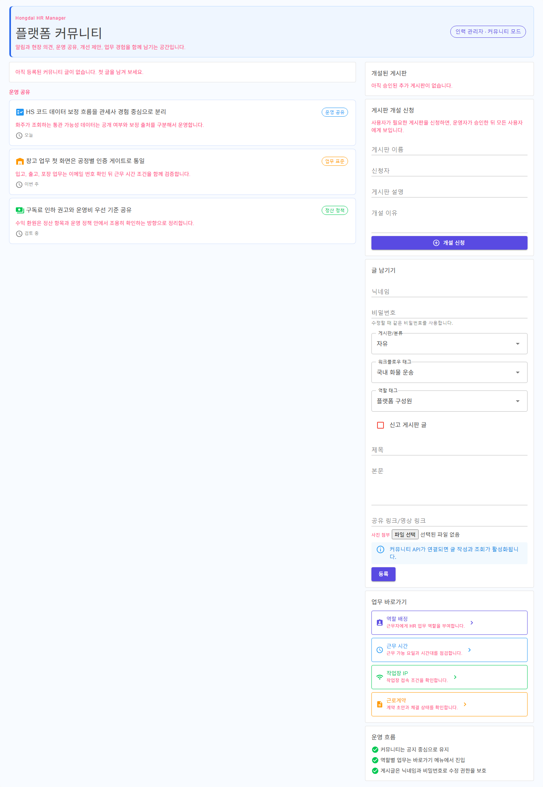

# HumanResourcesManagerApp-P01 - 인사/고용 관리 홈

[전체 화면 문서](../../README.md) / [HumanResourcesManagerApp 화면 목록](../README.md) / [앱 전체 카탈로그](../../../app-page-catalog.md)

## 화면 캡처

## 기본 정보

| 항목 | 내용 |
| --- | --- |
| 앱 | HumanResourcesManagerApp |
| 페이지 ID / 제목 | HumanResourcesManagerApp-P01 - 인사/고용 관리 홈 |
| 라우트 | / |
| 소스 파일 | [HumanResourcesManagerApp/Components/Pages/Home.razor](../../../../../HumanResourcesManagerApp/Components/Pages/Home.razor) |
| 분류 | 확장 |
| 1.0 필수 연결 | 직접 연결 없음 |
| 캡처 상태 | 완료 |

## 왜 필요한가

이 화면은 인사/고용 관리 홈을 담당하므로, 1.0 이후의 해외 물류, 창고, 주문자 집단, 판매채널 확장을 화면 단위로 검증하기 위해 필요합니다.

## 사용자와 참여자

주 사용자: 인사/고용 담당자 / 보조 참여자: 관리자, 현장 근무자, 주문자 집단 운영자

이 화면은 보조 또는 확장 업무 워크플로우 안에서 인사/고용 관리 홈 책임을 갖습니다. 화면 하나가 너무 많은 결정을 떠안지 않도록, 이 문서에서는 이 화면의 주 책임과 다른 화면으로 넘겨야 할 책임을 구분해 관리합니다.

## 화면에서 다루는 일

- 주 책임: 인사/고용 관리 홈
- 사용자가 확인해야 하는 것: 이 화면에서 상태, 입력값, 다음 행동이 명확히 보이는지 확인합니다.
- 사용자가 조작해야 하는 것: 버튼, 입력, 선택, 업로드, 조회 같은 조작이 이 화면의 책임 안에 머무는지 확인합니다.
- 화면 밖으로 넘길 일: 다른 앱이나 관리자 화면에서 처리해야 하는 상태 변경은 이 화면에 과하게 넣지 않습니다.

## 다른 화면과의 관계

- 이전 화면: 없음
- 다음 화면: 없음
- 상위 화면: 없음
- 하위 화면: 없음

상호작용 관점에서는 다음 흐름을 우선 봅니다. 인사/고용 관리 상태는 공동주문 집단 운영, 창고 작업, 경비/분류 보조 인력 운영과 연결될 수 있습니다.

## API 경로와 코드 연결

- 화면 소스: [HumanResourcesManagerApp/Components/Pages/Home.razor](../../../../../HumanResourcesManagerApp/Components/Pages/Home.razor)
- 클라이언트 서비스/계약: 화면 파일에서 직접 확인하거나 정적/라우팅 화면으로 본다.

| 구분 | 메서드 | API 경로 | 클라이언트/문서 근거 | 서버 근거 |
| --- | --- | --- | --- | --- |
| 워크플로우 문서 | - | `api/v1/admin/documents` | [docs/ProjectOverview/workflow-app-screen-map.md](../../../workflow-app-screen-map.md) | `GET api/v1/admin/documents/policies` [Ssalddel/Controllers/Admin/04_증빙/문서관리Controller.cs](../../../../../Ssalddel/Controllers/Admin/04_증빙/문서관리Controller.cs) `PUT api/v1/admin/documents/policies/{documentCode}` [Ssalddel/Controllers/Admin/04_증빙/문서관리Controller.cs](../../../../../Ssalddel/Controllers/Admin/04_증빙/문서관리Controller.cs) `GET api/v1/admin/documents` [Ssalddel/Controllers/Admin/04_증빙/문서관리Controller.cs](../../../../../Ssalddel/Controllers/Admin/04_증빙/문서관리Controller.cs) `GET api/v1/admin/documents/logs` [Ssalddel/Controllers/Admin/04_증빙/문서관리Controller.cs](../../../../../Ssalddel/Controllers/Admin/04_증빙/문서관리Controller.cs) |
| 워크플로우 문서 | - | `api/v1/admin/hr-employment-contracts` | [docs/ProjectOverview/workflow-app-screen-map.md](../../../workflow-app-screen-map.md) | `GET api/v1/admin/hr-employment-contracts` [Ssalddel/Controllers/Admin/HumanResources/HrEmploymentContractsController.cs](../../../../../Ssalddel/Controllers/Admin/HumanResources/HrEmploymentContractsController.cs) `GET api/v1/admin/hr-employment-contracts/{contractId:guid}` [Ssalddel/Controllers/Admin/HumanResources/HrEmploymentContractsController.cs](../../../../../Ssalddel/Controllers/Admin/HumanResources/HrEmploymentContractsController.cs) `POST api/v1/admin/hr-employment-contracts` [Ssalddel/Controllers/Admin/HumanResources/HrEmploymentContractsController.cs](../../../../../Ssalddel/Controllers/Admin/HumanResources/HrEmploymentContractsController.cs) `POST api/v1/admin/hr-employment-contracts/{contractId:guid}/sign` [Ssalddel/Controllers/Admin/HumanResources/HrEmploymentContractsController.cs](../../../../../Ssalddel/Controllers/Admin/HumanResources/HrEmploymentContractsController.cs) |
| 워크플로우 문서 | - | `api/v1/admin/hr-participation-benefits` | [docs/ProjectOverview/workflow-app-screen-map.md](../../../workflow-app-screen-map.md) | `GET api/v1/admin/hr-participation-benefits` [Ssalddel/Controllers/Admin/HumanResources/HrParticipationBenefitsController.cs](../../../../../Ssalddel/Controllers/Admin/HumanResources/HrParticipationBenefitsController.cs) `POST api/v1/admin/hr-participation-benefits/transfer` [Ssalddel/Controllers/Admin/HumanResources/HrParticipationBenefitsController.cs](../../../../../Ssalddel/Controllers/Admin/HumanResources/HrParticipationBenefitsController.cs) |
| 워크플로우 문서 | - | `api/v1/admin/hr-roles` | [docs/ProjectOverview/workflow-app-screen-map.md](../../../workflow-app-screen-map.md) | `GET api/v1/admin/hr-roles` [Ssalddel/Controllers/Admin/HumanResources/HrRolesController.cs](../../../../../Ssalddel/Controllers/Admin/HumanResources/HrRolesController.cs) `POST api/v1/admin/hr-roles` [Ssalddel/Controllers/Admin/HumanResources/HrRolesController.cs](../../../../../Ssalddel/Controllers/Admin/HumanResources/HrRolesController.cs) `DELETE api/v1/admin/hr-roles/{assignmentId:guid}` [Ssalddel/Controllers/Admin/HumanResources/HrRolesController.cs](../../../../../Ssalddel/Controllers/Admin/HumanResources/HrRolesController.cs) |
| 워크플로우 문서 | - | `api/v1/admin/hr-social-insurance-filings` | [docs/ProjectOverview/workflow-app-screen-map.md](../../../workflow-app-screen-map.md) | `GET api/v1/admin/hr-social-insurance-filings` [Ssalddel/Controllers/Admin/HumanResources/SocialInsuranceFilingsController.cs](../../../../../Ssalddel/Controllers/Admin/HumanResources/SocialInsuranceFilingsController.cs) `GET api/v1/admin/hr-social-insurance-filings/{id:guid}` [Ssalddel/Controllers/Admin/HumanResources/SocialInsuranceFilingsController.cs](../../../../../Ssalddel/Controllers/Admin/HumanResources/SocialInsuranceFilingsController.cs) `POST api/v1/admin/hr-social-insurance-filings/assess` [Ssalddel/Controllers/Admin/HumanResources/SocialInsuranceFilingsController.cs](../../../../../Ssalddel/Controllers/Admin/HumanResources/SocialInsuranceFilingsController.cs) `POST api/v1/admin/hr-social-insurance-filings` [Ssalddel/Controllers/Admin/HumanResources/SocialInsuranceFilingsController.cs](../../../../../Ssalddel/Controllers/Admin/HumanResources/SocialInsuranceFilingsController.cs) |
| 워크플로우 문서 | - | `api/v1/admin/hs-codes` | [docs/ProjectOverview/workflow-app-screen-map.md](../../../workflow-app-screen-map.md) | `GET api/v1/admin/hs-codes` [Ssalddel/Controllers/Admin/Customs/HS코드운영Controller.cs](../../../../../Ssalddel/Controllers/Admin/Customs/HS코드운영Controller.cs) `PUT api/v1/admin/hs-codes/{entryId:long}/business-category` [Ssalddel/Controllers/Admin/Customs/HS코드운영Controller.cs](../../../../../Ssalddel/Controllers/Admin/Customs/HS코드운영Controller.cs) `POST api/v1/admin/hs-codes/{entryId:long}/risk-tags` [Ssalddel/Controllers/Admin/Customs/HS코드운영Controller.cs](../../../../../Ssalddel/Controllers/Admin/Customs/HS코드운영Controller.cs) `PUT api/v1/admin/hs-codes/risk-tags/{tagId:long}` [Ssalddel/Controllers/Admin/Customs/HS코드운영Controller.cs](../../../../../Ssalddel/Controllers/Admin/Customs/HS코드운영Controller.cs) |
| 워크플로우 문서 | - | `api/v1/admin/orderer/group-purchase-` | [docs/ProjectOverview/workflow-app-screen-map.md](../../../workflow-app-screen-map.md) | - |
| 워크플로우 문서 | - | `api/v1/admin/transports` | [docs/ProjectOverview/workflow-app-screen-map.md](../../../workflow-app-screen-map.md) | `GET api/v1/admin/transports` [Ssalddel/Controllers/Admin/03_진행/운송진행관리Controller.cs](../../../../../Ssalddel/Controllers/Admin/03_진행/운송진행관리Controller.cs) `GET api/v1/admin/transports/events` [Ssalddel/Controllers/Admin/03_진행/운송진행관리Controller.cs](../../../../../Ssalddel/Controllers/Admin/03_진행/운송진행관리Controller.cs) |
| 워크플로우 문서 | - | `api/v1/community/activity-signals` | [docs/ProjectOverview/workflow-app-screen-map.md](../../../workflow-app-screen-map.md) | `GET api/v1/community/activity-signals` [Ssalddel/Controllers/Common/커뮤니티활동신호Controller.cs](../../../../../Ssalddel/Controllers/Common/커뮤니티활동신호Controller.cs) |
| 워크플로우 문서 | - | `api/v1/community/posts` | [docs/ProjectOverview/workflow-app-screen-map.md](../../../workflow-app-screen-map.md) | `GET api/v1/community/posts` [Ssalddel/Controllers/Common/커뮤니티게시글Controller.cs](../../../../../Ssalddel/Controllers/Common/커뮤니티게시글Controller.cs) `POST api/v1/community/posts` [Ssalddel/Controllers/Common/커뮤니티게시글Controller.cs](../../../../../Ssalddel/Controllers/Common/커뮤니티게시글Controller.cs) `GET api/v1/community/posts/{id:long}` [Ssalddel/Controllers/Common/커뮤니티게시글Controller.cs](../../../../../Ssalddel/Controllers/Common/커뮤니티게시글Controller.cs) `POST api/v1/community/posts/{id:long}/attachments` [Ssalddel/Controllers/Common/커뮤니티게시글Controller.cs](../../../../../Ssalddel/Controllers/Common/커뮤니티게시글Controller.cs) |
| 워크플로우 문서 | - | `api/v1/community/votes` | [docs/ProjectOverview/workflow-app-screen-map.md](../../../workflow-app-screen-map.md) | `GET api/v1/community/votes` [Ssalddel/Controllers/Common/커뮤니티투표Controller.cs](../../../../../Ssalddel/Controllers/Common/커뮤니티투표Controller.cs) `GET api/v1/community/votes/{voteId:guid}` [Ssalddel/Controllers/Common/커뮤니티투표Controller.cs](../../../../../Ssalddel/Controllers/Common/커뮤니티투표Controller.cs) `POST api/v1/community/votes` [Ssalddel/Controllers/Common/커뮤니티투표Controller.cs](../../../../../Ssalddel/Controllers/Common/커뮤니티투표Controller.cs) `POST api/v1/community/votes/{voteId:guid}/votes` [Ssalddel/Controllers/Common/커뮤니티투표Controller.cs](../../../../../Ssalddel/Controllers/Common/커뮤니티투표Controller.cs) |
| 워크플로우 문서 | - | `api/v1/customs` | [docs/ProjectOverview/workflow-app-screen-map.md](../../../workflow-app-screen-map.md) | `POST api/v1/customs/consents` [Ssalddel/Controllers/Common/통관연동Controller.cs](../../../../../Ssalddel/Controllers/Common/통관연동Controller.cs) |
| 워크플로우 문서 | - | `api/v1/driver/dispatch-actions` | [docs/ProjectOverview/workflow-app-screen-map.md](../../../workflow-app-screen-map.md) | `POST api/v1/driver/dispatch-actions/{requestId}/accept` [Ssalddel/Controllers/Driver/03_Action/기사배차액션Controller.cs](../../../../../Ssalddel/Controllers/Driver/03_Action/기사배차액션Controller.cs) `POST api/v1/driver/dispatch-actions/{requestId}/reject` [Ssalddel/Controllers/Driver/03_Action/기사배차액션Controller.cs](../../../../../Ssalddel/Controllers/Driver/03_Action/기사배차액션Controller.cs) `POST api/v1/driver/dispatch-actions/{requestId}/cancel-acceptance` [Ssalddel/Controllers/Driver/03_Action/기사배차액션Controller.cs](../../../../../Ssalddel/Controllers/Driver/03_Action/기사배차액션Controller.cs) |
| 워크플로우 문서 | - | `api/v1/driver/recommendations` | [docs/ProjectOverview/workflow-app-screen-map.md](../../../workflow-app-screen-map.md) | `GET api/v1/driver/recommendations` [Ssalddel/Controllers/Driver/02_Recommendation/기사배차추천Controller.cs](../../../../../Ssalddel/Controllers/Driver/02_Recommendation/기사배차추천Controller.cs) `GET api/v1/driver/recommendations/idle` [Ssalddel/Controllers/Driver/02_Recommendation/기사배차추천Controller.cs](../../../../../Ssalddel/Controllers/Driver/02_Recommendation/기사배차추천Controller.cs) `GET api/v1/driver/recommendations/driving` [Ssalddel/Controllers/Driver/02_Recommendation/기사배차추천Controller.cs](../../../../../Ssalddel/Controllers/Driver/02_Recommendation/기사배차추천Controller.cs) `GET api/v1/driver/recommendations/search` [Ssalddel/Controllers/Driver/02_Recommendation/기사배차추천Controller.cs](../../../../../Ssalddel/Controllers/Driver/02_Recommendation/기사배차추천Controller.cs) |
| 워크플로우 문서 | - | `api/v1/driver/transports` | [docs/ProjectOverview/workflow-app-screen-map.md](../../../workflow-app-screen-map.md) | `GET api/v1/driver/transports` [Ssalddel/Controllers/Driver/05_Settings/기사운송진행Controller.cs](../../../../../Ssalddel/Controllers/Driver/05_Settings/기사운송진행Controller.cs) `GET api/v1/driver/transports/current` [Ssalddel/Controllers/Driver/05_Settings/기사운송진행Controller.cs](../../../../../Ssalddel/Controllers/Driver/05_Settings/기사운송진행Controller.cs) `GET api/v1/driver/transports/{id:long}` [Ssalddel/Controllers/Driver/05_Settings/기사운송진행Controller.cs](../../../../../Ssalddel/Controllers/Driver/05_Settings/기사운송진행Controller.cs) `POST api/v1/driver/transports/{id:long}/arrive-pickup` [Ssalddel/Controllers/Driver/05_Settings/기사운송진행Controller.cs](../../../../../Ssalddel/Controllers/Driver/05_Settings/기사운송진행Controller.cs) |
| 워크플로우 문서 | - | `api/v1/files` | [docs/ProjectOverview/workflow-app-screen-map.md](../../../workflow-app-screen-map.md) | `POST api/v1/files/upload` [Ssalddel/Controllers/Common/파일업로드Controller.cs](../../../../../Ssalddel/Controllers/Common/파일업로드Controller.cs) |
| 워크플로우 문서 | - | `api/v1/orderer/group-purchase-logistics-workflows` | [docs/ProjectOverview/workflow-app-screen-map.md](../../../workflow-app-screen-map.md) | `GET api/v1/orderer/group-purchase-logistics-workflows/resolve` [Ssalddel/Controllers/Orderer/공동구매물류워크플로우Controller.cs](../../../../../Ssalddel/Controllers/Orderer/공동구매물류워크플로우Controller.cs) |
| 워크플로우 문서 | - | `api/v1/orderer/group-purchase-overseas-shipments` | [docs/ProjectOverview/workflow-app-screen-map.md](../../../workflow-app-screen-map.md) | `GET api/v1/orderer/group-purchase-overseas-shipments/lookup` [Ssalddel/Controllers/Orderer/공동구매해외선적추적Controller.cs](../../../../../Ssalddel/Controllers/Orderer/공동구매해외선적추적Controller.cs) `GET api/v1/orderer/group-purchase-overseas-shipments/import-logistics-references` [Ssalddel/Controllers/Orderer/공동구매해외선적추적Controller.cs](../../../../../Ssalddel/Controllers/Orderer/공동구매해외선적추적Controller.cs) `POST api/v1/orderer/group-purchase-overseas-shipments/import-logistics-normalization-simulation` [Ssalddel/Controllers/Orderer/공동구매해외선적추적Controller.cs](../../../../../Ssalddel/Controllers/Orderer/공동구매해외선적추적Controller.cs) `GET api/v1/orderer/group-purchase-overseas-shipments/lookup-normalized` [Ssalddel/Controllers/Orderer/공동구매해외선적추적Controller.cs](../../../../../Ssalddel/Controllers/Orderer/공동구매해외선적추적Controller.cs) |

추가 API 후보 6개는 관련 서비스 파일에서 계속 확인합니다. 이 화면 README는 화면 책임 판단에 필요한 대표 경로만 먼저 노출합니다.

검증할 때는 이 화면이 직접 메모리 데이터만 보는지, 위 API 응답을 받아 상태를 표시하는지, 실패했을 때 사용자가 다음 행동을 알 수 있는지 확인합니다.

## 보안과 개인정보 점검

위치, 주소, 운행 상태는 최소 공개와 최신성 표시가 필요합니다.

## 캡처와 문서 상태

현재 캡처는 문서용 캡처 호스트 또는 기존 캡처 파일 기준으로 확인한 화면입니다.

이미지 파일을 다시 생성하면 이 README는 같은 경로의 이미지를 참조하므로 자동으로 최신 캡처를 보여줍니다.

## 보완 메모

- 화면 설명이 실제 구현과 달라지면 이 문서와 app-page-catalog.md를 함께 갱신합니다.
- 화면이 1.0 필수 워크플로우에 포함되면 ssalddel-v1-required-pages.md에도 반영합니다.
- 렌더링이 깨지거나 내용이 잘리면 캡처 스크립트와 실제 화면 레이아웃을 같이 확인합니다.