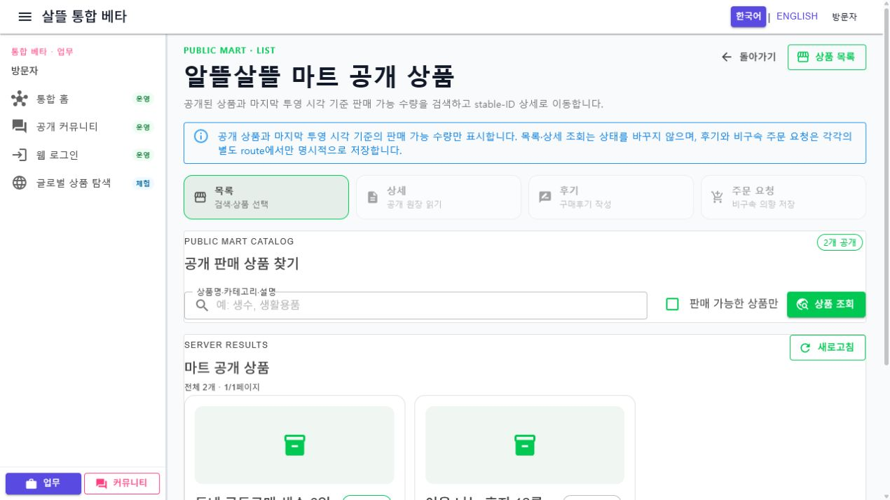

# OrdererApp-P04-2 - 마트 공개 상품 목록

[전체 화면 문서](../../README.md) / [OrdererApp 화면 목록](../README.md) / [앱 전체 카탈로그](../../../app-page-catalog.md)

## 화면 캡처

아래 이미지는 새 공용 목록 Screen을 통합 Web에서 1280px로 실제 렌더링한 기록입니다. 기존 route 분리 전 앱 캡처도 `assets/app-pages/OrdererApp/OrdererApp-P04-2.png`에 보존합니다.

## 기본 정보

| 항목 | 내용 |
| --- | --- |
| 앱 | OrdererApp, Ssalddel.WebApp |
| 페이지 ID / 제목 | OrdererApp-P04-2 - 마트 공개 상품 목록 |
| canonical route | `/food/mart` |
| Web legacy alias | `/orderer/mart` |
| 공용 화면 | `MartProductListScreen` |
| 앱 host | `OrdererApp/Components/Pages/MartOrder.razor`, `Ssalddel.WebApp/Pages/OrdererMartCatalogPage.razor` |
| capability | Beta / ReadOnly / 익명 공개 |
| 캡처 상태 | desktop 실제 렌더링 완료, [변경 기록](../../../../Changes/2026-07-22-mart-product-route-srp.md) |

## 한 가지 책임

이 화면은 공개 상품 검색, 판매 가능 조건과 서버 페이징만 담당합니다. 상품 한 건의 상세, 구매후기 저장과 비구속 주문 요청은 각각 stable-ID 전용 화면으로 이동합니다. 목록 조회는 장바구니, 재고 예약·차감, 결제, 피킹·포장과 배송을 생성하지 않습니다.

검색어·판매 가능 조건·페이지와 안전한 `from`은 URL 문맥으로 보존되며, 상품 선택은 `/food/mart/products/{ProductId}`로 이동합니다. 기존 `?productId=...` 링크는 stable-ID 상세 route로 호환 이동합니다.

## API와 상태

- `GET /api/v1/orderer/mart/products`
- `마트공개상품목록ViewModel`만 사용하며 상세·후기 ViewModel을 소유하지 않습니다.
- loading, empty, error, retry와 판매 가능 조건을 독립적으로 표시합니다.
- 내부 창고 위치·소유자·계약·정산 정보는 반환하거나 표시하지 않습니다.

## 현재 검증

- route 계약·검색 문맥·안전한 복귀 경로와 Web·Orderer 공용 Screen 조립 테스트 통과
- clean commit 기준 전체 `Ssalddel.Tests` 2,528개 통과
- `Ssalddel.WebApp`, `OrdererApp`, `SsalddelApp`, `SsalddelAdminApp` 소비 빌드 경고 0개·오류 0개
- 1280px 목록과 stable-ID 상세 이동, horizontal overflow 없음, final console 오류 0 실제 확인
