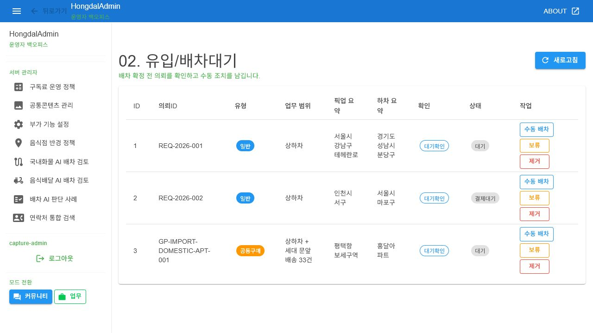

# SsalddelAdmin-P19 - 배차대기/추천 잠금 상태

[전체 화면 문서](../../README.md) / [SsalddelAdmin 화면 목록](../README.md) / [앱 전체 카탈로그](../../../app-page-catalog.md)

## 화면 캡처

## 기본 정보

| 항목 | 내용 |
| --- | --- |
| 앱 | SsalddelAdmin |
| 페이지 ID / 제목 | SsalddelAdmin-P19 - 배차대기/추천 잠금 상태 |
| 라우트 | /dispatch/wait |
| 소스 파일 | [SsalddelAdmin/Components/Pages/DispatchWait.razor](../../../../../SsalddelAdmin/Components/Pages/DispatchWait.razor) |
| 분류 | 필수 |
| 2.0 운송 필수 연결 | [SsalddelAdmin-P19 - 배차대기/추천 잠금 상태](../../../ssalddel-v1-required-pages.md) |
| 캡처 상태 | 완료 |

## 왜 필요한가

이 화면은 배차대기/추천 잠금 상태을 담당하므로, 1.0 업무 흐름이 실제 사용자 행동으로 닫히기 위해 필요합니다.

## 사용자와 참여자

주 사용자: 관리자, 운영자 / 보조 참여자: 화주, 기사, 파트너, 문서 담당자

이 화면은 살뜰 2.0 국내 화물 운송 워크플로우 안에서 배차대기/추천 잠금 상태 책임을 갖습니다. 화면 하나가 너무 많은 결정을 떠안지 않도록, 이 문서에서는 이 화면의 주 책임과 다른 화면으로 넘겨야 할 책임을 구분해 관리합니다.

## 화면에서 다루는 일

- 주 책임: 배차대기/추천 잠금 상태
- 사용자가 확인해야 하는 것: 이 화면에서 상태, 입력값, 다음 행동이 명확히 보이는지 확인합니다.
- 사용자가 조작해야 하는 것: 버튼, 입력, 선택, 업로드, 조회 같은 조작이 이 화면의 책임 안에 머무는지 확인합니다.
- 화면 밖으로 넘길 일: 다른 앱이나 관리자 화면에서 처리해야 하는 상태 변경은 이 화면에 과하게 넣지 않습니다.

## 다른 화면과의 관계

- 이전 화면: [SsalddelAdmin-P18 - 의뢰 상세](../SsalddelAdmin-P18/)
- 다음 화면: [SsalddelAdmin-P20 - 운행 중 기사 현황](../SsalddelAdmin-P20/)
- 상위 화면: 없음
- 하위 화면: 없음

상호작용 관점에서는 다음 흐름을 우선 봅니다. 관리자는 여러 앱에서 발생한 상태 변경을 모아 보고, 막힌 배차·증빙·정산·문서 문제에 개입합니다.

## API 경로와 코드 연결

- 화면 소스: [SsalddelAdmin/Components/Pages/DispatchWait.razor](../../../../../SsalddelAdmin/Components/Pages/DispatchWait.razor)
- 클라이언트 서비스/계약: [SsalddelAdmin/Services/I백오피스Service.cs](../../../../../SsalddelAdmin/Services/I백오피스Service.cs), [SsalddelAdmin/Services/백오피스메모리Service.cs](../../../../../SsalddelAdmin/Services/백오피스메모리Service.cs), [SsalddelAdmin/Services/백오피스조회Service.cs](../../../../../SsalddelAdmin/Services/백오피스조회Service.cs)

| 구분 | 메서드 | API 경로 | 클라이언트/문서 근거 | 서버 근거 |
| --- | --- | --- | --- | --- |
| 워크플로우 문서 | - | `api/v1/admin/documents` | [docs/ProjectOverview/workflow-app-screen-map.md](../../../workflow-app-screen-map.md) | `GET api/v1/admin/documents/policies` [Ssalddel/Controllers/Admin/04_증빙/문서관리Controller.cs](../../../../../Ssalddel/Controllers/Admin/04_증빙/문서관리Controller.cs) `PUT api/v1/admin/documents/policies/{documentCode}` [Ssalddel/Controllers/Admin/04_증빙/문서관리Controller.cs](../../../../../Ssalddel/Controllers/Admin/04_증빙/문서관리Controller.cs) `GET api/v1/admin/documents` [Ssalddel/Controllers/Admin/04_증빙/문서관리Controller.cs](../../../../../Ssalddel/Controllers/Admin/04_증빙/문서관리Controller.cs) `GET api/v1/admin/documents/logs` [Ssalddel/Controllers/Admin/04_증빙/문서관리Controller.cs](../../../../../Ssalddel/Controllers/Admin/04_증빙/문서관리Controller.cs) |
| 워크플로우 문서 | - | `api/v1/admin/transports` | [docs/ProjectOverview/workflow-app-screen-map.md](../../../workflow-app-screen-map.md) | `GET api/v1/admin/transports` [Ssalddel/Controllers/Admin/03_진행/운송진행관리Controller.cs](../../../../../Ssalddel/Controllers/Admin/03_진행/운송진행관리Controller.cs) `GET api/v1/admin/transports/events` [Ssalddel/Controllers/Admin/03_진행/운송진행관리Controller.cs](../../../../../Ssalddel/Controllers/Admin/03_진행/운송진행관리Controller.cs) |
| 워크플로우 문서 | - | `api/v1/transport-events` | [docs/ProjectOverview/workflow-app-screen-map.md](../../../workflow-app-screen-map.md) | `GET api/v1/transport-events` [Ssalddel/Controllers/Admin/03_진행/운송이벤트Controller.cs](../../../../../Ssalddel/Controllers/Admin/03_진행/운송이벤트Controller.cs) `GET api/v1/transport-events/{id:long}` [Ssalddel/Controllers/Admin/03_진행/운송이벤트Controller.cs](../../../../../Ssalddel/Controllers/Admin/03_진행/운송이벤트Controller.cs) `POST api/v1/transport-events` [Ssalddel/Controllers/Admin/03_진행/운송이벤트Controller.cs](../../../../../Ssalddel/Controllers/Admin/03_진행/운송이벤트Controller.cs) `PUT api/v1/transport-events/{id:long}` [Ssalddel/Controllers/Admin/03_진행/운송이벤트Controller.cs](../../../../../Ssalddel/Controllers/Admin/03_진행/운송이벤트Controller.cs) |
| 클라이언트 서비스 | - | `api/v1/dispatch/wait` | [SsalddelAdmin/Services/백오피스조회Service.cs](../../../../../SsalddelAdmin/Services/백오피스조회Service.cs) | `GET api/v1/dispatch/wait` [Ssalddel/Controllers/Admin/02_유입/배차대기Controller.cs](../../../../../Ssalddel/Controllers/Admin/02_유입/배차대기Controller.cs) `GET api/v1/dispatch/wait/{id:long}` [Ssalddel/Controllers/Admin/02_유입/배차대기Controller.cs](../../../../../Ssalddel/Controllers/Admin/02_유입/배차대기Controller.cs) `POST api/v1/dispatch/wait` [Ssalddel/Controllers/Admin/02_유입/배차대기Controller.cs](../../../../../Ssalddel/Controllers/Admin/02_유입/배차대기Controller.cs) `PUT api/v1/dispatch/wait/{id:long}` [Ssalddel/Controllers/Admin/02_유입/배차대기Controller.cs](../../../../../Ssalddel/Controllers/Admin/02_유입/배차대기Controller.cs) |
| 클라이언트 서비스 | DELETE | `api/v1/dispatch/wait/{id}` | [SsalddelAdmin/Services/백오피스조회Service.cs](../../../../../SsalddelAdmin/Services/백오피스조회Service.cs) | `DELETE api/v1/dispatch/wait/{id:long}` [Ssalddel/Controllers/Admin/02_유입/배차대기Controller.cs](../../../../../Ssalddel/Controllers/Admin/02_유입/배차대기Controller.cs) |
| 클라이언트 서비스 | GET | `api/v1/dispatch/wait/{id}` | [SsalddelAdmin/Services/백오피스조회Service.cs](../../../../../SsalddelAdmin/Services/백오피스조회Service.cs) | `GET api/v1/dispatch/wait` [Ssalddel/Controllers/Admin/02_유입/배차대기Controller.cs](../../../../../Ssalddel/Controllers/Admin/02_유입/배차대기Controller.cs) `GET api/v1/dispatch/wait/{id:long}` [Ssalddel/Controllers/Admin/02_유입/배차대기Controller.cs](../../../../../Ssalddel/Controllers/Admin/02_유입/배차대기Controller.cs) |
| 클라이언트 서비스 | PUT | `api/v1/dispatch/wait/{id}` | [SsalddelAdmin/Services/백오피스조회Service.cs](../../../../../SsalddelAdmin/Services/백오피스조회Service.cs) | `PUT api/v1/dispatch/wait/{id:long}` [Ssalddel/Controllers/Admin/02_유입/배차대기Controller.cs](../../../../../Ssalddel/Controllers/Admin/02_유입/배차대기Controller.cs) |

검증할 때는 이 화면이 직접 메모리 데이터만 보는지, 위 API 응답을 받아 상태를 표시하는지, 실패했을 때 사용자가 다음 행동을 알 수 있는지 확인합니다.

## 보안과 개인정보 점검

관리자 권한, 감사 로그, 민감 운영 정보 접근 통제가 필요합니다. 인증 필요 화면은 현재 로그인 장벽 캡처로 남겨 둡니다.

## 캡처와 문서 상태

현재 캡처는 문서용 캡처 호스트 또는 기존 캡처 파일 기준으로 확인한 화면입니다.

이미지 파일을 다시 생성하면 이 README는 같은 경로의 이미지를 참조하므로 자동으로 최신 캡처를 보여줍니다.

## 보완 메모

- 화면 설명이 실제 구현과 달라지면 이 문서와 app-page-catalog.md를 함께 갱신합니다.
- 화면이 2.0 운송 필수 워크플로우에 포함되면 ssalddel-v1-required-pages.md에도 반영합니다.
- 렌더링이 깨지거나 내용이 잘리면 캡처 스크립트와 실제 화면 레이아웃을 같이 확인합니다.