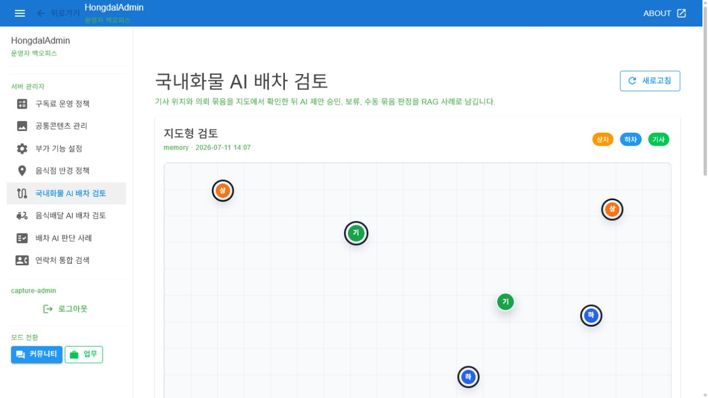

# SsalddelAdmin-P37 - 국내화물 AI 배차 검토

[전체 화면 문서](../../README.md) / [SsalddelAdmin 화면 목록](../README.md) / [앱 전체 카탈로그](../../../app-page-catalog.md)

## 화면 캡처

## 기본 정보

| 항목 | 내용 |
| --- | --- |
| 앱 | SsalddelAdmin |
| 페이지 ID / 제목 | SsalddelAdmin-P37 - 국내화물 AI 배차 검토 |
| 라우트 | /dispatch/ai-review |
| 소스 파일 | [SsalddelAdmin/Components/Pages/DomesticCargoDispatchAIReview.razor](../../../../../SsalddelAdmin/Components/Pages/DomesticCargoDispatchAIReview.razor) |
| 분류 | 운영 |
| 2.0 운송 필수 연결 | 운영 보조 |
| 캡처 상태 | 완료 |

## 왜 필요한가

국내화물 배차에서 AI가 만든 묶음 제안, 기사 위치, 상차지와 하차지를 운영자가 같은 화면에서 확인하기 위해 필요하다. 운영자는 제안을 바로 승인하거나 보류하고, 수동 판단을 남겨 이후 배차 판단 사례로 축적할 수 있다.

## 사용자와 참여자

주 사용자: 관리자, 운영자 / 보조 참여자: 기사, 화주, 배차 담당자

이 화면은 배차 엔진의 판단을 그대로 통과시키기보다, 운영자가 근거를 보고 예외를 잡아내는 검토 표면이다. 실제 기사 배정과 운송 상태 전이는 서버 배차 흐름에서 처리한다.

## 화면에서 다루는 일

- 주 책임: 국내화물 AI 배차 묶음 검토와 운영자 승인/보류 판단
- 사용자가 확인해야 하는 것: 상차/하차 위치, 기사 위치, 묶음 점수, 예상 거리, AI 판단 근거
- 사용자가 조작해야 하는 것: 묶음 선택, 승인/보류/수동 묶음 판정, 판단 메모 입력
- 화면 밖으로 넘길 일: 운송 상태 전이, 기사 정산, 문서 검수는 관련 운영 화면에서 처리한다.

## 다른 화면과의 관계

- 이전 화면: [SsalddelAdmin-P36 - 연락처 통합 검색](../SsalddelAdmin-P36/)
- 다음 화면: [SsalddelAdmin-P38 - 음식배달 AI 배차 검토](../SsalddelAdmin-P38/)
- 함께 보는 화면: [SsalddelAdmin-P19 - 배차대기/추천 잠금 상태](../SsalddelAdmin-P19/), [SsalddelAdmin-P22 - 운송 상세 원장](../SsalddelAdmin-P22/), [SsalddelAdmin-P39 - 배차 AI 판단 사례](../SsalddelAdmin-P39/)
- 상위 화면: 없음
- 하위 화면: 없음

승인 또는 보류 결과는 배차 판단 사례로 남겨 [SsalddelAdmin-P39](../SsalddelAdmin-P39/)에서 다시 확인하고, 운송 원장에서는 실제 운송 상태와 증빙 흐름을 확인한다.

## API 경로와 코드 연결

- 화면 소스: [SsalddelAdmin/Components/Pages/DomesticCargoDispatchAIReview.razor](../../../../../SsalddelAdmin/Components/Pages/DomesticCargoDispatchAIReview.razor)
- 클라이언트 서비스: [SsalddelAdmin/Services/DomesticCargoDispatchAIReviewAdminService.cs](../../../../../SsalddelAdmin/Services/DomesticCargoDispatchAIReviewAdminService.cs)
- 서버 계약: [Ssalddel.Contracts/Admin/Dispatch/DomesticCargoDispatchAIReviewDtos.cs](../../../../../Ssalddel.Contracts/Admin/Dispatch/DomesticCargoDispatchAIReviewDtos.cs)
- 서버 컨트롤러: [Ssalddel/Controllers/Admin/Dispatch/DomesticCargoDispatchAIReviewController.cs](../../../../../Ssalddel/Controllers/Admin/Dispatch/DomesticCargoDispatchAIReviewController.cs)

| 구분 | 메서드 | API 경로 | 클라이언트/문서 근거 | 서버 근거 |
| --- | --- | --- | --- | --- |
| 검토 작업공간 | GET | `api/v1/admin/dispatch/domestic-cargo-ai-review` | [DomesticCargoDispatchAIReviewAdminService.cs](../../../../../SsalddelAdmin/Services/DomesticCargoDispatchAIReviewAdminService.cs) | [DomesticCargoDispatchAIReviewController.cs](../../../../../Ssalddel/Controllers/Admin/Dispatch/DomesticCargoDispatchAIReviewController.cs) |
| 운영자 판단 기록 | POST | `api/v1/admin/dispatch/domestic-cargo-ai-review/decisions` | [DomesticCargoDispatchAIReviewAdminService.cs](../../../../../SsalddelAdmin/Services/DomesticCargoDispatchAIReviewAdminService.cs) | [DomesticCargoDispatchAIReviewController.cs](../../../../../Ssalddel/Controllers/Admin/Dispatch/DomesticCargoDispatchAIReviewController.cs) |

검증할 때는 `AdminData:UseMemory=true`에서 샘플 데이터가 먼저 렌더링되고, 실제 API 모드에서는 관리자 인증 토큰이 붙은 요청으로 같은 구조의 DTO를 받는지 확인한다.

## 보안과 개인정보 점검

지도 좌표, 기사 위치, 화주 주소가 함께 보이므로 실제 운영 캡처에는 개발용 샘플 데이터나 마스킹 데이터를 사용한다. 운영자 판단 기록은 감사 대상이므로 사용자 식별자, 판단 시각, 승인/보류 사유가 서버 로그와 연결되어야 한다.

## 캡처와 문서 상태

현재 캡처는 개발용 관리자 인증 세션과 문서용 메모리 데이터를 붙여 실제 운영 화면까지 렌더링한 결과입니다.

이미지 파일을 다시 생성하면 이 README는 같은 경로의 이미지를 참조하므로 자동으로 최신 캡처를 보여줍니다.

## 보완 메모

- 실제 지도 SDK가 붙으면 문서 캡처에서 좌표, 주소, 기사 위치 마스킹 정책을 다시 확인한다.
- AI 판단 사례 저장 정책이 바뀌면 [SsalddelAdmin-P39](../SsalddelAdmin-P39/)의 사례 문서와 함께 갱신한다.
- 이 화면이 2.0 운송 필수 배차 운영 범위로 올라가면 ssalddel-v1-required-pages.md에도 반영한다.
