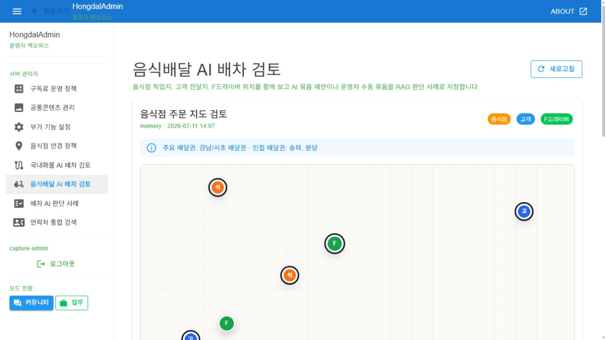

# SsalddelAdmin-P38 - 음식배달 AI 배차 검토

[전체 화면 문서](../../README.md) / [SsalddelAdmin 화면 목록](../README.md) / [앱 전체 카탈로그](../../../app-page-catalog.md)

## 화면 캡처

## 기본 정보

| 항목 | 내용 |
| --- | --- |
| 앱 | SsalddelAdmin |
| 페이지 ID / 제목 | SsalddelAdmin-P38 - 음식배달 AI 배차 검토 |
| 라우트 | /dispatch/food-ai-review |
| 소스 파일 | [SsalddelAdmin/Components/Pages/FoodDeliveryDispatchAIReview.razor](../../../../../SsalddelAdmin/Components/Pages/FoodDeliveryDispatchAIReview.razor) |
| 분류 | 운영 |
| 1.0 필수 연결 | 운영 보조 |
| 캡처 상태 | 완료 |

## 왜 필요한가

음식배달 운영에서는 음식점 픽업지, 고객 전달지, F드라이버 위치, 배달권 경계가 동시에 판단 기준이 된다. 이 화면은 AI의 묶음 배달 제안을 운영자가 확인하고, 수동 묶음 판단을 사례로 남기는 검토 표면이다.

## 사용자와 참여자

주 사용자: 관리자, 운영자 / 보조 참여자: F드라이버, 음식점, 주문자

이 화면은 음식 주문 상태를 직접 바꾸는 주문 접수 화면이 아니라, 배차 후보를 검토하고 판단 근거를 남기는 관리자 화면이다.

## 화면에서 다루는 일

- 주 책임: 음식배달 AI 묶음 제안 검토와 운영자 판단 기록
- 사용자가 확인해야 하는 것: 음식점 위치, 고객 위치, F드라이버 위치, 배달권, 묶음 점수, 예상 지연
- 사용자가 조작해야 하는 것: 묶음 선택, 승인/보류/수동 묶음 판정, 판단 메모 입력
- 화면 밖으로 넘길 일: 주문 접수, 결제, 배달 완료, 정산 처리는 각각의 주문/정산 화면으로 넘긴다.

## 다른 화면과의 관계

- 이전 화면: [SsalddelAdmin-P37 - 국내화물 AI 배차 검토](../SsalddelAdmin-P37/)
- 다음 화면: [SsalddelAdmin-P39 - 배차 AI 판단 사례](../SsalddelAdmin-P39/)
- 함께 보는 화면: [SsalddelAdmin-P30 - 음식 주문/배달 운영](../SsalddelAdmin-P30/), [SsalddelAdmin-P30-1 - 음식점 검색 정책](../SsalddelAdmin-P30-1/), [SsalddelAdmin-P39 - 배차 AI 판단 사례](../SsalddelAdmin-P39/)
- 상위 화면: 없음
- 하위 화면: 없음

음식 주문 운영 화면에서 주문 상태를 보고, 이 화면에서는 묶음 제안의 운영 판단만 담당한다. 승인/보류 결과는 배차 AI 판단 사례에 쌓아 재사용한다.

## API 경로와 코드 연결

- 화면 소스: [SsalddelAdmin/Components/Pages/FoodDeliveryDispatchAIReview.razor](../../../../../SsalddelAdmin/Components/Pages/FoodDeliveryDispatchAIReview.razor)
- 클라이언트 서비스: [SsalddelAdmin/Services/FoodDeliveryDispatchAIReviewAdminService.cs](../../../../../SsalddelAdmin/Services/FoodDeliveryDispatchAIReviewAdminService.cs)
- 서버 계약: [Ssalddel.Contracts/Admin/Dispatch/FoodDeliveryDispatchAIReviewDtos.cs](../../../../../Ssalddel.Contracts/Admin/Dispatch/FoodDeliveryDispatchAIReviewDtos.cs)
- 서버 컨트롤러: [Ssalddel/Controllers/Admin/Dispatch/FoodDeliveryDispatchAIReviewController.cs](../../../../../Ssalddel/Controllers/Admin/Dispatch/FoodDeliveryDispatchAIReviewController.cs)

| 구분 | 메서드 | API 경로 | 클라이언트/문서 근거 | 서버 근거 |
| --- | --- | --- | --- | --- |
| 검토 작업공간 | GET | `api/v1/admin/dispatch/food-delivery-ai-review` | [FoodDeliveryDispatchAIReviewAdminService.cs](../../../../../SsalddelAdmin/Services/FoodDeliveryDispatchAIReviewAdminService.cs) | [FoodDeliveryDispatchAIReviewController.cs](../../../../../Ssalddel/Controllers/Admin/Dispatch/FoodDeliveryDispatchAIReviewController.cs) |
| 운영자 판단 기록 | POST | `api/v1/admin/dispatch/food-delivery-ai-review/decisions` | [FoodDeliveryDispatchAIReviewAdminService.cs](../../../../../SsalddelAdmin/Services/FoodDeliveryDispatchAIReviewAdminService.cs) | [FoodDeliveryDispatchAIReviewController.cs](../../../../../Ssalddel/Controllers/Admin/Dispatch/FoodDeliveryDispatchAIReviewController.cs) |

검증할 때는 배달권, 음식점/고객/F드라이버 위치가 같은 지도형 검토 화면에 표시되고, 승인/보류 판단이 실패 없이 저장되는지 확인한다.

## 보안과 개인정보 점검

주문자 주소와 음식점 위치가 보일 수 있으므로 실제 고객 주소가 캡처되지 않도록 샘플 데이터나 마스킹 데이터를 사용한다. 운영자 판단 기록은 민감한 배차 근거이므로 관리자 권한과 감사 로그 기준을 함께 점검한다.

## 캡처와 문서 상태

현재 캡처는 개발용 관리자 인증 세션과 문서용 메모리 데이터를 붙여 실제 운영 화면까지 렌더링한 결과입니다.

이미지 파일을 다시 생성하면 이 README는 같은 경로의 이미지를 참조하므로 자동으로 최신 캡처를 보여줍니다.

## 보완 메모

- 음식점 검색 정책과 배달권 정책이 바뀌면 이 화면의 판단 기준 설명도 함께 갱신한다.
- F드라이버 위치 표시가 실시간으로 바뀌면 캡처 기준 시각과 데이터 출처를 문서에 남긴다.
- RAG 사례 적재 방식이 바뀌면 [SsalddelAdmin-P39](../SsalddelAdmin-P39/)와 함께 갱신한다.
