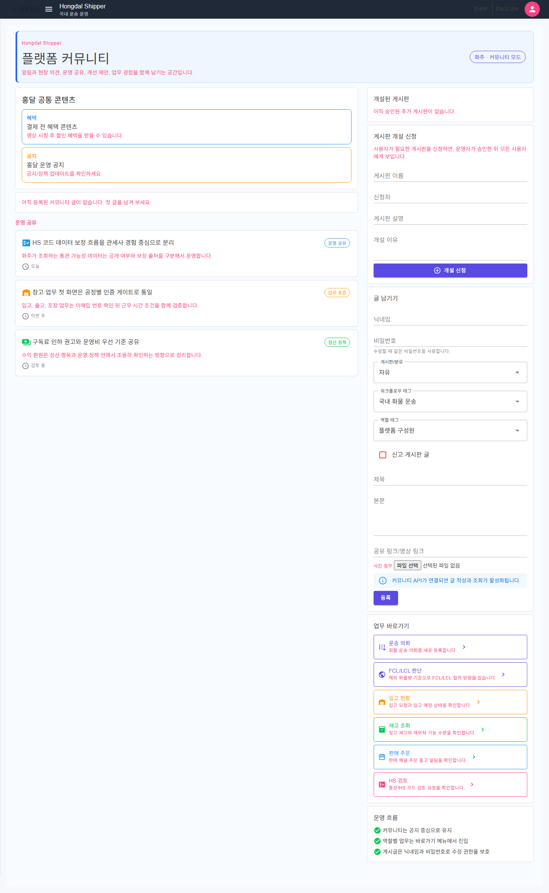

# SsalddelApp-P01 - 화주 업무 홈, 운송 의뢰/상태/창고/판매 업무 진입

[전체 화면 문서](../../README.md) / [SsalddelApp 화면 목록](../README.md) / [앱 전체 카탈로그](../../../app-page-catalog.md)

## 화면 캡처

## 기본 정보

| 항목 | 내용 |
| --- | --- |
| 앱 | SsalddelApp |
| 페이지 ID / 제목 | SsalddelApp-P01 - 화주 업무 홈, 운송 의뢰/상태/창고/판매 업무 진입 |
| 라우트 | `/shipper` (`/`는 역할 기반 통합 홈) |
| 내비게이션 단계 | 공통 셸·1단계 사방괘 진입 |
| 소스 파일 | [SsalddelApp/Components/Pages/Home.razor](../../../../../SsalddelApp/Components/Pages/Home.razor) |
| 분류 | 필수 |
| 1.0 필수 연결 | [SsalddelApp-P01 - 화주 업무 홈, 운송 의뢰/상태/창고/판매 업무 진입](../../../ssalddel-v1-required-pages.md) |
| 캡처 상태 | 완료 |

## 왜 필요한가

이 화면은 화주 역할의 커뮤니티와 업무 요약을 조합하고 운송·창고·판매 화면으로 연결하므로, 1.0 업무 흐름이 실제 사용자 행동으로 닫히기 위해 필요합니다. 역할 선택 자체는 [SsalddelApp-P00 통합 홈](../SsalddelApp-P00/)이 담당합니다.

## 사용자와 참여자

주 사용자: 화주, 판매자, 물류 의뢰자 / 보조 참여자: 기사, 관리자, 창고 관리자

이 화면은 살뜰 1.0 국내 화물 운송 워크플로우 안에서 화주 업무 홈, 운송 의뢰/상태/창고/판매 업무 진입 책임을 갖습니다. 화면 하나가 너무 많은 결정을 떠안지 않도록, 이 문서에서는 이 화면의 주 책임과 다른 화면으로 넘겨야 할 책임을 구분해 관리합니다.

## 화면에서 다루는 일

- 주 책임: 화주 커뮤니티와 상태 요약, 운송·창고·판매 업무 진입
- 사용자가 확인해야 하는 것: 이 화면에서 상태, 입력값, 다음 행동이 명확히 보이는지 확인합니다.
- 사용자가 조작해야 하는 것: 버튼, 입력, 선택, 업로드, 조회 같은 조작이 이 화면의 책임 안에 머무는지 확인합니다.
- 화면 밖으로 넘길 일: 다른 앱이나 관리자 화면에서 처리해야 하는 상태 변경은 이 화면에 과하게 넣지 않습니다.

## 다른 화면과의 관계

- 이전 화면: 없음
- 다음 화면: [SsalddelApp-P01-1 - 화주 프로필과 운영 프로필 설정](../SsalddelApp-P01-1/)
- 상위 화면: 없음
- 하위 화면: [SsalddelApp-P01-1 - 화주 프로필과 운영 프로필 설정](../SsalddelApp-P01-1/), [SsalddelApp-P01-2 - 화주 앱 메뉴/화면 노출 설정](../SsalddelApp-P01-2/), [SsalddelApp-P01-3 - 공개 화물 또는 공개 의뢰 확인](../SsalddelApp-P01-3/), [SsalddelApp-P01-4 - 탐색/제안성 업무 수신함](../SsalddelApp-P01-4/)

상호작용 관점에서는 다음 흐름을 우선 봅니다. 화주가 입력하거나 확인한 의뢰/결제/창고 상태는 기사 앱의 추천, 관리자 원장, 창고 작업 화면으로 이어질 수 있습니다.

## API 경로와 코드 연결

- 화면 소스: [SsalddelApp/Components/Pages/Home.razor](../../../../../SsalddelApp/Components/Pages/Home.razor)
- 클라이언트 서비스/계약: [DriverApp/Services/AuthApiService.cs](../../../../../DriverApp/Services/AuthApiService.cs), [DriverApp/Services/AuthSession.cs](../../../../../DriverApp/Services/AuthSession.cs), [DriverApp/Services/IAuthSession.cs](../../../../../DriverApp/Services/IAuthSession.cs), [SsalddelApp/Services/AuthApiService.cs](../../../../../SsalddelApp/Services/AuthApiService.cs), [SsalddelApp/Services/AuthSession.cs](../../../../../SsalddelApp/Services/AuthSession.cs), [SsalddelApp/Services/CommonContents/I화주공통콘텐츠Service.cs](../../../../../SsalddelApp/Services/CommonContents/I화주공통콘텐츠Service.cs), [SsalddelApp/Services/CommonContents/샘플화주공통콘텐츠Service.cs](../../../../../SsalddelApp/Services/CommonContents/샘플화주공통콘텐츠Service.cs), [SsalddelApp/Services/IAuthSession.cs](../../../../../SsalddelApp/Services/IAuthSession.cs)

| 구분 | 메서드 | API 경로 | 클라이언트/문서 근거 | 서버 근거 |
| --- | --- | --- | --- | --- |
| 워크플로우 문서 | - | `api/v1/admin/hs-codes` | [docs/ProjectOverview/workflow-app-screen-map.md](../../../workflow-app-screen-map.md) | `GET api/v1/admin/hs-codes` [Ssalddel/Controllers/Admin/Customs/HS코드운영Controller.cs](../../../../../Ssalddel/Controllers/Admin/Customs/HS코드운영Controller.cs) `PUT api/v1/admin/hs-codes/{entryId:long}/business-category` [Ssalddel/Controllers/Admin/Customs/HS코드운영Controller.cs](../../../../../Ssalddel/Controllers/Admin/Customs/HS코드운영Controller.cs) `POST api/v1/admin/hs-codes/{entryId:long}/risk-tags` [Ssalddel/Controllers/Admin/Customs/HS코드운영Controller.cs](../../../../../Ssalddel/Controllers/Admin/Customs/HS코드운영Controller.cs) `PUT api/v1/admin/hs-codes/risk-tags/{tagId:long}` [Ssalddel/Controllers/Admin/Customs/HS코드운영Controller.cs](../../../../../Ssalddel/Controllers/Admin/Customs/HS코드운영Controller.cs) |
| 워크플로우 문서 | - | `api/v1/customs` | [docs/ProjectOverview/workflow-app-screen-map.md](../../../workflow-app-screen-map.md) | `POST api/v1/customs/consents` [Ssalddel/Controllers/Common/통관연동Controller.cs](../../../../../Ssalddel/Controllers/Common/통관연동Controller.cs) |
| 워크플로우 문서 | - | `api/v1/sales-channels` | [docs/ProjectOverview/workflow-app-screen-map.md](../../../workflow-app-screen-map.md) | `GET api/v1/sales-channels/accounts` [Ssalddel/Controllers/Common/SalesChannelsController.cs](../../../../../Ssalddel/Controllers/Common/SalesChannelsController.cs) `POST api/v1/sales-channels/accounts` [Ssalddel/Controllers/Common/SalesChannelsController.cs](../../../../../Ssalddel/Controllers/Common/SalesChannelsController.cs) `GET api/v1/sales-channels/products` [Ssalddel/Controllers/Common/SalesChannelsController.cs](../../../../../Ssalddel/Controllers/Common/SalesChannelsController.cs) `POST api/v1/sales-channels/products` [Ssalddel/Controllers/Common/SalesChannelsController.cs](../../../../../Ssalddel/Controllers/Common/SalesChannelsController.cs) |
| 워크플로우 문서 | - | `api/v1/shipper/requests` | [docs/ProjectOverview/workflow-app-screen-map.md](../../../workflow-app-screen-map.md) | `GET api/v1/shipper/requests` [Ssalddel/Controllers/Shipper/01_Request/화주운송의뢰Controller.cs](../../../../../Ssalddel/Controllers/Shipper/01_Request/화주운송의뢰Controller.cs) `GET api/v1/shipper/requests/public` [Ssalddel/Controllers/Shipper/01_Request/화주운송의뢰Controller.cs](../../../../../Ssalddel/Controllers/Shipper/01_Request/화주운송의뢰Controller.cs) `POST api/v1/shipper/requests/recommend-vehicle` [Ssalddel/Controllers/Shipper/01_Request/화주운송의뢰Controller.cs](../../../../../Ssalddel/Controllers/Shipper/01_Request/화주운송의뢰Controller.cs) `POST api/v1/shipper/requests` [Ssalddel/Controllers/Shipper/01_Request/화주운송의뢰Controller.cs](../../../../../Ssalddel/Controllers/Shipper/01_Request/화주운송의뢰Controller.cs) |
| 클라이언트 서비스 | - | `api/v1/shipper/requests?shipperId={userId}` | [SsalddelApp/Services/ServerBackedShipperOperationsService.cs](../../../../../SsalddelApp/Services/ServerBackedShipperOperationsService.cs) | `GET api/v1/shipper/requests` [Ssalddel/Controllers/Shipper/01_Request/화주운송의뢰Controller.cs](../../../../../Ssalddel/Controllers/Shipper/01_Request/화주운송의뢰Controller.cs) `GET api/v1/shipper/requests/public` [Ssalddel/Controllers/Shipper/01_Request/화주운송의뢰Controller.cs](../../../../../Ssalddel/Controllers/Shipper/01_Request/화주운송의뢰Controller.cs) `POST api/v1/shipper/requests/recommend-vehicle` [Ssalddel/Controllers/Shipper/01_Request/화주운송의뢰Controller.cs](../../../../../Ssalddel/Controllers/Shipper/01_Request/화주운송의뢰Controller.cs) `POST api/v1/shipper/requests` [Ssalddel/Controllers/Shipper/01_Request/화주운송의뢰Controller.cs](../../../../../Ssalddel/Controllers/Shipper/01_Request/화주운송의뢰Controller.cs) |
| 클라이언트 서비스 | - | `api/v1/warehouse-operations/inbounds` | [SsalddelApp/Services/ServerBackedShipperOperationsService.cs](../../../../../SsalddelApp/Services/ServerBackedShipperOperationsService.cs) | `GET api/v1/warehouse-operations/inbounds` [Ssalddel/Controllers/Common/WarehouseOperationsController.cs](../../../../../Ssalddel/Controllers/Common/WarehouseOperationsController.cs) `POST api/v1/warehouse-operations/inbounds` [Ssalddel/Controllers/Common/WarehouseOperationsController.cs](../../../../../Ssalddel/Controllers/Common/WarehouseOperationsController.cs) `POST api/v1/warehouse-operations/inbounds/{inboundId:long}/complete` [Ssalddel/Controllers/Common/WarehouseOperationsController.cs](../../../../../Ssalddel/Controllers/Common/WarehouseOperationsController.cs) |
| 클라이언트 서비스 | - | `api/v1/warehouse-operations/inventory` | [SsalddelApp/Services/ServerBackedShipperOperationsService.cs](../../../../../SsalddelApp/Services/ServerBackedShipperOperationsService.cs) | `GET api/v1/warehouse-operations/inventory` [Ssalddel/Controllers/Common/WarehouseOperationsController.cs](../../../../../Ssalddel/Controllers/Common/WarehouseOperationsController.cs) `POST api/v1/warehouse-operations/inventory/{inboundItemId:long}/inspect` [Ssalddel/Controllers/Common/WarehouseOperationsController.cs](../../../../../Ssalddel/Controllers/Common/WarehouseOperationsController.cs) `POST api/v1/warehouse-operations/inventory/{inboundItemId:long}/put-away` [Ssalddel/Controllers/Common/WarehouseOperationsController.cs](../../../../../Ssalddel/Controllers/Common/WarehouseOperationsController.cs) `POST api/v1/warehouse-operations/inventory/{inboundItemId:long}/pack` [Ssalddel/Controllers/Common/WarehouseOperationsController.cs](../../../../../Ssalddel/Controllers/Common/WarehouseOperationsController.cs) |
| 클라이언트 서비스 | - | `api/v1/warehouse-operations/warehouses` | [SsalddelApp/Services/ServerBackedShipperOperationsService.cs](../../../../../SsalddelApp/Services/ServerBackedShipperOperationsService.cs) | `GET api/v1/warehouse-operations/warehouses` [Ssalddel/Controllers/Common/WarehouseOperationsController.cs](../../../../../Ssalddel/Controllers/Common/WarehouseOperationsController.cs) `POST api/v1/warehouse-operations/warehouses` [Ssalddel/Controllers/Common/WarehouseOperationsController.cs](../../../../../Ssalddel/Controllers/Common/WarehouseOperationsController.cs) `GET api/v1/warehouse-operations/warehouses/{warehouseId:long}/users` [Ssalddel/Controllers/Common/WarehouseOperationsController.cs](../../../../../Ssalddel/Controllers/Common/WarehouseOperationsController.cs) `POST api/v1/warehouse-operations/warehouses/{warehouseId:long}/users` [Ssalddel/Controllers/Common/WarehouseOperationsController.cs](../../../../../Ssalddel/Controllers/Common/WarehouseOperationsController.cs) |
| 클라이언트 서비스 | POST | `api/v1/auth/login` | [DriverApp/Services/AuthApiService.cs](../../../../../DriverApp/Services/AuthApiService.cs) | `POST api/v1/auth/login` [Ssalddel/Controllers/Common/인증Controller.cs](../../../../../Ssalddel/Controllers/Common/인증Controller.cs) |
| 클라이언트 서비스 | POST | `api/v1/auth/login` | [SsalddelApp/Services/AuthApiService.cs](../../../../../SsalddelApp/Services/AuthApiService.cs) | `POST api/v1/auth/login` [Ssalddel/Controllers/Common/인증Controller.cs](../../../../../Ssalddel/Controllers/Common/인증Controller.cs) |

검증할 때는 이 화면이 직접 메모리 데이터만 보는지, 위 API 응답을 받아 상태를 표시하는지, 실패했을 때 사용자가 다음 행동을 알 수 있는지 확인합니다.

## 보안과 개인정보 점검

위치, 주소, 운행 상태는 최소 공개와 최신성 표시가 필요합니다.

## 캡처와 문서 상태

현재 캡처는 문서용 캡처 호스트 또는 기존 캡처 파일 기준으로 확인한 화면입니다.

이미지 파일을 다시 생성하면 이 README는 같은 경로의 이미지를 참조하므로 자동으로 최신 캡처를 보여줍니다.

## 보완 메모

- 화면 설명이 실제 구현과 달라지면 이 문서와 app-page-catalog.md를 함께 갱신합니다.
- 화면이 1.0 필수 워크플로우에 포함되면 ssalddel-v1-required-pages.md에도 반영합니다.
- 렌더링이 깨지거나 내용이 잘리면 캡처 스크립트와 실제 화면 레이아웃을 같이 확인합니다.
