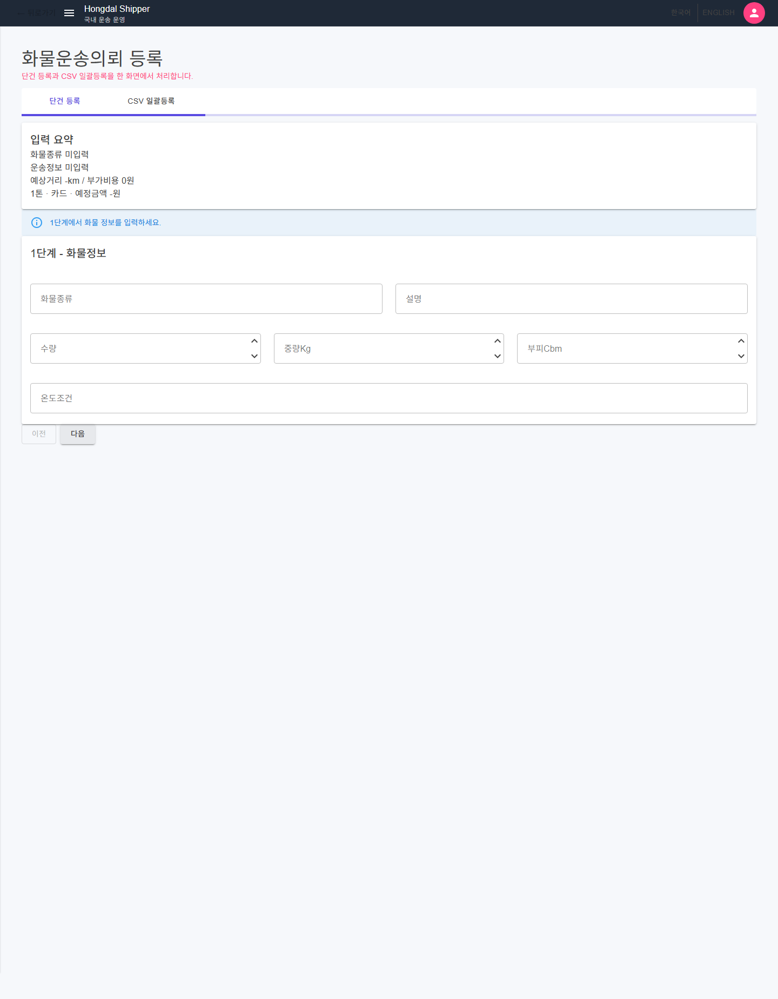

# SsalddelApp-P02 - 운송 의뢰 작성

[전체 화면 문서](../../README.md) / [SsalddelApp 화면 목록](../README.md) / [앱 전체 카탈로그](../../../app-page-catalog.md)

## 화면 캡처

## 기본 정보

| 항목 | 내용 |
| --- | --- |
| 앱 | SsalddelApp |
| 페이지 ID / 제목 | SsalddelApp-P02 - 운송 의뢰 작성 |
| 라우트 | /shipper/request |
| 소스 파일 | [SsalddelApp/Components/Pages/ShipperRequestWizard.razor](../../../../../SsalddelApp/Components/Pages/ShipperRequestWizard.razor) |
| 분류 | 필수 |
| 1.0 필수 연결 | [SsalddelApp-P02 - 운송 의뢰 작성](../../../ssalddel-v1-required-pages.md) |
| 캡처 상태 | 완료 |

## 왜 필요한가

이 화면은 운송 의뢰 작성을 담당하므로, 1.0 업무 흐름이 실제 사용자 행동으로 닫히기 위해 필요합니다.

현재 단건 등록 입력부는 화주 전용 화면 안에 직접 박아 두지 않고, 공통 운송 컴포넌트인 `Ssalddel운송모델작성Panel`을 사용합니다. 이 컴포넌트는 화주 운송 의뢰뿐 아니라 주문자 집단, 공동주문, 창고 출고품처럼 “운송이 필요해지는 대상”이 생겼을 때 같은 운송 모델 초안을 만들 수 있도록 분리한 것입니다.

요금이나 차량 선택이 애매한 사용자는 작성 중인 운송 조건을 바탕으로 커뮤니티 상담 글을 바로 등록할 수 있습니다. 이때 글에는 상세주소, 담당자 이름, 전화번호를 넣지 않고 화물, 차량 후보, 상하차 지역, 예상거리, 결제예정금액, 기준운임 같은 판단 정보만 요약합니다.

## 사용자와 참여자

주 사용자: 화주, 판매자, 물류 의뢰자 / 보조 참여자: 기사, 관리자, 창고 관리자

이 화면은 살뜰 1.0 국내 화물 운송 워크플로우 안에서 운송 의뢰 작성 책임을 갖습니다. 화면 하나가 너무 많은 결정을 떠안지 않도록, 이 문서에서는 이 화면의 주 책임과 다른 화면으로 넘겨야 할 책임을 구분해 관리합니다.

## 화면에서 다루는 일

- 주 책임: 운송 의뢰 작성
- 공통 책임: 화물, 상하차지, 차량, 운임, 결제 조건을 `운송모델작성Draft`로 만드는 일
- 상담 보조: 단가/차량 선택이 어려울 때 커뮤니티 `업무 질문` 글로 조건 요약을 등록하는 일
- 사용자가 확인해야 하는 것: 이 화면에서 상태, 입력값, 다음 행동이 명확히 보이는지 확인합니다.
- 사용자가 조작해야 하는 것: 버튼, 입력, 선택, 업로드, 조회 같은 조작이 이 화면의 책임 안에 머무는지 확인합니다.
- 화면 밖으로 넘길 일: 다른 앱이나 관리자 화면에서 처리해야 하는 상태 변경은 이 화면에 과하게 넣지 않습니다.

## 다른 화면과의 관계

- 이전 화면: [SsalddelApp-P01-4 - 탐색/제안성 업무 수신함](../SsalddelApp-P01-4/)
- 다음 화면: [SsalddelApp-P02-1 - 운송 의뢰 대량 등록](../SsalddelApp-P02-1/)
- 상위 화면: 없음
- 하위 화면: [SsalddelApp-P02-1 - 운송 의뢰 대량 등록](../SsalddelApp-P02-1/), [SsalddelApp-P02-2 - 배차 주소 입력/검증 폼](../SsalddelApp-P02-2/)

상호작용 관점에서는 다음 흐름을 우선 봅니다. 화주가 입력하거나 확인한 의뢰/결제/창고 상태는 기사 앱의 추천, 관리자 원장, 창고 작업 화면으로 이어질 수 있습니다.

## API 경로와 코드 연결

- 화면 소스: [SsalddelApp/Components/Pages/ShipperRequestWizard.razor](../../../../../SsalddelApp/Components/Pages/ShipperRequestWizard.razor)
- 공통 컴포넌트: [Ssalddel.Ui.Common/Areas/App/Components/Transport/Ssalddel운송모델작성Panel.razor](../../../../../Ssalddel.Ui.Common/Areas/App/Components/Transport/Ssalddel운송모델작성Panel.razor)
- 공통 Draft: [Ssalddel.Ui.Common/Areas/App/Models/운송모델작성Draft.cs](../../../../../Ssalddel.Ui.Common/Areas/App/Models/운송모델작성Draft.cs)
- 클라이언트 서비스/계약: [SsalddelApp/Services/IShipperOperationsService.cs](../../../../../SsalddelApp/Services/IShipperOperationsService.cs), [SsalddelApp/Services/Samples/SampleShipperOperationsService.cs](../../../../../SsalddelApp/Services/Samples/SampleShipperOperationsService.cs), [SsalddelApp/Services/ServerBackedShipperOperationsService.cs](../../../../../SsalddelApp/Services/ServerBackedShipperOperationsService.cs)

| 구분 | 메서드 | API 경로 | 클라이언트/문서 근거 | 서버 근거 |
| --- | --- | --- | --- | --- |
| 1.0 문서 | - | `api/v1/shipper/requests` | [docs/ProjectOverview/ssalddel-v1-required-pages.md](../../../ssalddel-v1-required-pages.md) | `GET api/v1/shipper/requests` [Ssalddel/Controllers/Shipper/01_Request/화주운송의뢰Controller.cs](../../../../../Ssalddel/Controllers/Shipper/01_Request/화주운송의뢰Controller.cs) `GET api/v1/shipper/requests/public` [Ssalddel/Controllers/Shipper/01_Request/화주운송의뢰Controller.cs](../../../../../Ssalddel/Controllers/Shipper/01_Request/화주운송의뢰Controller.cs) `POST api/v1/shipper/requests/recommend-vehicle` [Ssalddel/Controllers/Shipper/01_Request/화주운송의뢰Controller.cs](../../../../../Ssalddel/Controllers/Shipper/01_Request/화주운송의뢰Controller.cs) `POST api/v1/shipper/requests` [Ssalddel/Controllers/Shipper/01_Request/화주운송의뢰Controller.cs](../../../../../Ssalddel/Controllers/Shipper/01_Request/화주운송의뢰Controller.cs) |
| 워크플로우 문서 | - | `api/v1/shipper/requests` | [docs/ProjectOverview/workflow-app-screen-map.md](../../../workflow-app-screen-map.md) | `GET api/v1/shipper/requests` [Ssalddel/Controllers/Shipper/01_Request/화주운송의뢰Controller.cs](../../../../../Ssalddel/Controllers/Shipper/01_Request/화주운송의뢰Controller.cs) `GET api/v1/shipper/requests/public` [Ssalddel/Controllers/Shipper/01_Request/화주운송의뢰Controller.cs](../../../../../Ssalddel/Controllers/Shipper/01_Request/화주운송의뢰Controller.cs) `POST api/v1/shipper/requests/recommend-vehicle` [Ssalddel/Controllers/Shipper/01_Request/화주운송의뢰Controller.cs](../../../../../Ssalddel/Controllers/Shipper/01_Request/화주운송의뢰Controller.cs) `POST api/v1/shipper/requests` [Ssalddel/Controllers/Shipper/01_Request/화주운송의뢰Controller.cs](../../../../../Ssalddel/Controllers/Shipper/01_Request/화주운송의뢰Controller.cs) |
| 클라이언트 서비스 | - | `api/v1/shipper/requests` | [SsalddelApp/Services/ServerBackedShipperOperationsService.cs](../../../../../SsalddelApp/Services/ServerBackedShipperOperationsService.cs) | `GET api/v1/shipper/requests` [Ssalddel/Controllers/Shipper/01_Request/화주운송의뢰Controller.cs](../../../../../Ssalddel/Controllers/Shipper/01_Request/화주운송의뢰Controller.cs) `GET api/v1/shipper/requests/public` [Ssalddel/Controllers/Shipper/01_Request/화주운송의뢰Controller.cs](../../../../../Ssalddel/Controllers/Shipper/01_Request/화주운송의뢰Controller.cs) `POST api/v1/shipper/requests/recommend-vehicle` [Ssalddel/Controllers/Shipper/01_Request/화주운송의뢰Controller.cs](../../../../../Ssalddel/Controllers/Shipper/01_Request/화주운송의뢰Controller.cs) `POST api/v1/shipper/requests` [Ssalddel/Controllers/Shipper/01_Request/화주운송의뢰Controller.cs](../../../../../Ssalddel/Controllers/Shipper/01_Request/화주운송의뢰Controller.cs) |
| 클라이언트 서비스 | - | `api/v1/shipper/requests/recommend-vehicle` | [SsalddelApp/Services/ServerBackedShipperOperationsService.cs](../../../../../SsalddelApp/Services/ServerBackedShipperOperationsService.cs) | `GET api/v1/shipper/requests` [Ssalddel/Controllers/Shipper/01_Request/화주운송의뢰Controller.cs](../../../../../Ssalddel/Controllers/Shipper/01_Request/화주운송의뢰Controller.cs) `POST api/v1/shipper/requests/recommend-vehicle` [Ssalddel/Controllers/Shipper/01_Request/화주운송의뢰Controller.cs](../../../../../Ssalddel/Controllers/Shipper/01_Request/화주운송의뢰Controller.cs) `POST api/v1/shipper/requests` [Ssalddel/Controllers/Shipper/01_Request/화주운송의뢰Controller.cs](../../../../../Ssalddel/Controllers/Shipper/01_Request/화주운송의뢰Controller.cs) |
| 클라이언트 서비스 | POST | `api/v1/shipper/requests` | [SsalddelApp/Services/ServerBackedShipperOperationsService.cs](../../../../../SsalddelApp/Services/ServerBackedShipperOperationsService.cs) | `POST api/v1/shipper/requests/recommend-vehicle` [Ssalddel/Controllers/Shipper/01_Request/화주운송의뢰Controller.cs](../../../../../Ssalddel/Controllers/Shipper/01_Request/화주운송의뢰Controller.cs) `POST api/v1/shipper/requests` [Ssalddel/Controllers/Shipper/01_Request/화주운송의뢰Controller.cs](../../../../../Ssalddel/Controllers/Shipper/01_Request/화주운송의뢰Controller.cs) `POST api/v1/shipper/requests/bulk/preview` [Ssalddel/Controllers/Shipper/01_Request/화주운송의뢰Controller.cs](../../../../../Ssalddel/Controllers/Shipper/01_Request/화주운송의뢰Controller.cs) `POST api/v1/shipper/requests/bulk/confirm` [Ssalddel/Controllers/Shipper/01_Request/화주운송의뢰Controller.cs](../../../../../Ssalddel/Controllers/Shipper/01_Request/화주운송의뢰Controller.cs) |

검증할 때는 이 화면이 직접 메모리 데이터만 보는지, 위 API 응답을 받아 상태를 표시하는지, 실패했을 때 사용자가 다음 행동을 알 수 있는지 확인합니다.

## 보안과 개인정보 점검

화주 주소, 연락처, 의뢰 금액, 결제 조건은 역할 기반으로 제한해 노출해야 합니다.

## 캡처와 문서 상태

현재 캡처는 문서용 캡처 호스트 또는 기존 캡처 파일 기준으로 확인한 화면입니다.

이미지 파일을 다시 생성하면 이 README는 같은 경로의 이미지를 참조하므로 자동으로 최신 캡처를 보여줍니다.

## 보완 메모

- 화면 설명이 실제 구현과 달라지면 이 문서와 app-page-catalog.md를 함께 갱신합니다.
- 화면이 1.0 필수 워크플로우에 포함되면 ssalddel-v1-required-pages.md에도 반영합니다.
- 렌더링이 깨지거나 내용이 잘리면 캡처 스크립트와 실제 화면 레이아웃을 같이 확인합니다.
