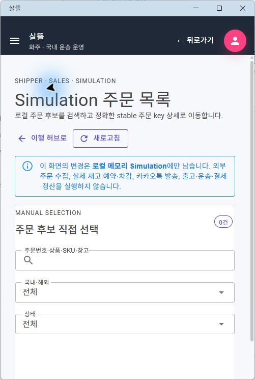

# SsalddelApp-P06-2-4 - Simulation 주문 목록

[SsalddelApp 화면 목록](../README.md) / [앱 전체 카탈로그](../../../app-page-catalog.md) / [상위 허브](../SsalddelApp-P06-2/)

| 항목 | 내용 |
| --- | --- |
| 라우트 | `/shipper/sales/fulfillment/orders` |
| 소스 | [OrderFulfillmentOrders.razor](../../../../../SsalddelApp/Components/Pages/OrderFulfillmentOrders.razor) |
| 경계 | ReadOnly |
| 검증 | 실제 MAUI Windows desktop·501px 확인 |

## 단일책임

로컬 Simulation 주문 후보를 검색·국내외·상태로 좁히고 opaque stable 주문 key 상세로 이동하는 일만 담당한다. 필터는 안전한 local `from`에 보존하며 피킹·포장 Command를 실행하지 않는다.
