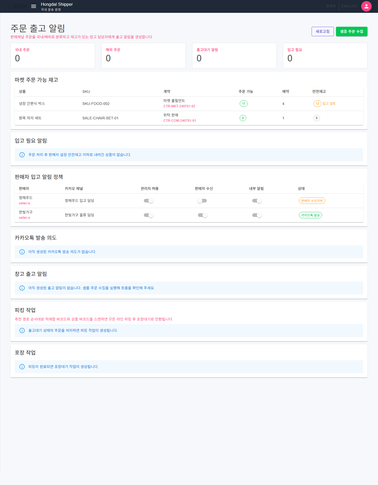

# SsalddelApp-P06-2 - 판매 주문 이행 Simulation

[전체 화면 문서](../../README.md) / [SsalddelApp 화면 목록](../README.md) / [앱 전체 카탈로그](../../../app-page-catalog.md)

## 화면 캡처

## 기본 정보

| 항목 | 내용 |
| --- | --- |
| 앱 | SsalddelApp |
| 페이지 ID / 제목 | SsalddelApp-P06-2 - 판매 주문 이행 Simulation |
| 라우트 | /shipper/sales/fulfillment |
| 소스 파일 | [SsalddelApp/Components/Pages/OrderFulfillment.razor](../../../../../SsalddelApp/Components/Pages/OrderFulfillment.razor) |
| 분류 | 개발·확장 |
| 1.0 필수 연결 | 직접 연결 없음 |
| 캡처 상태 | 완료 |

## 왜 필요한가

이 화면은 운영 효과 없이 판매 주문 이행 흐름을 검증하는 로컬 Simulation이다. 영속 판매 주문 조회는 별도 목록·상세 화면이 담당하며, 1.0 이후 실제 연동 준비 전까지 외부 주문 수집·재고 차감·메시지 발송·운송 인계를 실행하지 않는다.

## 사용자와 참여자

주 사용자: 화주, 판매자, 물류 의뢰자 / 보조 참여자: 기사, 관리자, 창고 관리자

이 화면은 샘플 주문, 재고, 피킹, 포장과 입고 알림 정책을 로컬 메모리에서 검증한다. 내부 component와 ViewModel은 분리되어 있지만 여러 사용자 목표가 탭 하나의 route에 남아 있으므로, 피킹·포장·정책 Action route 분리가 후속 작업이다.

## 화면에서 다루는 일

- 주 책임: 로컬 주문 이행 Simulation의 경계와 단계 검증
- 사용자가 확인해야 하는 것: 샘플 주문·재고·피킹·포장·알림 정책 상태와 현재 단계
- 사용자가 조작해야 하는 것: 명시적인 샘플 반영과 로컬 피킹·포장 Simulation
- 화면 밖으로 넘길 일: 영속 판매 주문 목록·상세, 실제 외부 주문 수집, 재고 예약·차감, 메시지 발송과 운송 인계

## 다른 화면과의 관계

- 이전 화면: [SsalddelApp-P06-1 - 상품 등록/리스팅](../SsalddelApp-P06-1/)
- 다음 화면: [SsalddelApp-P07 - FCL/LCL 해외 물류 계획](../SsalddelApp-P07/)
- 상위 화면: [SsalddelApp-P06 - 판매채널 연결/관리](../SsalddelApp-P06/)
- 하위 화면: [판매 주문 원장 목록](../SsalddelApp-P06-2-1/), [판매 주문 원장 상세](../SsalddelApp-P06-2-2/)

상호작용 관점에서는 다음 흐름을 우선 봅니다. 화주가 입력하거나 확인한 의뢰/결제/창고 상태는 기사 앱의 추천, 관리자 원장, 창고 작업 화면으로 이어질 수 있습니다.

## API 경로와 코드 연결

- 화면 소스: [SsalddelApp/Components/Pages/OrderFulfillment.razor](../../../../../SsalddelApp/Components/Pages/OrderFulfillment.razor)
- 클라이언트 서비스/계약: [SsalddelApp/Services/Commerce/Orders/CommerceOrderFulfillmentService.cs](../../../../../SsalddelApp/Services/Commerce/Orders/CommerceOrderFulfillmentService.cs), [SsalddelApp/Services/Commerce/Orders/CommerceOrderSampleFeedService.cs](../../../../../SsalddelApp/Services/Commerce/Orders/CommerceOrderSampleFeedService.cs), [SsalddelApp/Services/Commerce/Orders/ICommerceOrderFulfillmentService.cs](../../../../../SsalddelApp/Services/Commerce/Orders/ICommerceOrderFulfillmentService.cs), [SsalddelApp/Services/Commerce/Orders/ICommerceOrderSampleFeedService.cs](../../../../../SsalddelApp/Services/Commerce/Orders/ICommerceOrderSampleFeedService.cs)

이 route의 주문·재고·피킹·포장 변경은 `InMemoryShipperStore`에만 남는 Simulation이다. 영속 원장은 `/shipper/sales/orders`의 공용 Screen과 서버 API 경계에서 조회한다.

검증할 때는 이 화면이 직접 메모리 데이터만 보는지, 위 API 응답을 받아 상태를 표시하는지, 실패했을 때 사용자가 다음 행동을 알 수 있는지 확인합니다.

## 보안과 개인정보 점검

화주 주소, 연락처, 의뢰 금액, 결제 조건은 역할 기반으로 제한해 노출해야 합니다.

## 캡처와 문서 상태

현재 캡처는 route 의미를 분리하기 전 동일 화면을 실제 MAUI Blazor로 확인한 것이며, 화면 자체는 `/shipper/sales/fulfillment`로 이동했다.

이미지 파일을 다시 생성하면 이 README는 같은 경로의 이미지를 참조하므로 자동으로 최신 캡처를 보여줍니다.

## 보완 메모

- 화면 설명이 실제 구현과 달라지면 이 문서와 app-page-catalog.md를 함께 갱신합니다.
- 화면이 1.0 필수 워크플로우에 포함되면 ssalddel-v1-required-pages.md에도 반영합니다.
- 렌더링이 깨지거나 내용이 잘리면 캡처 스크립트와 실제 화면 레이아웃을 같이 확인합니다.
