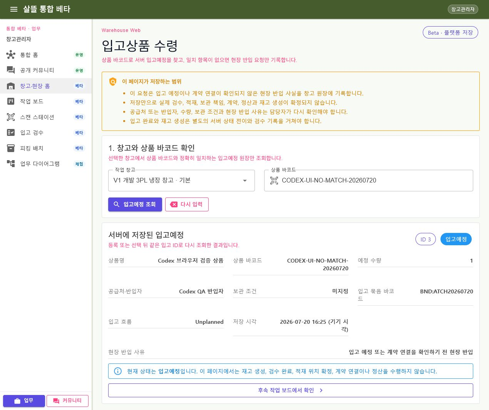
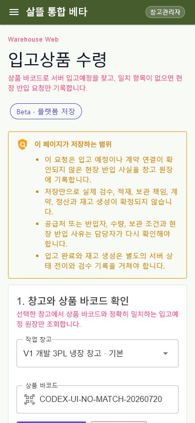

# WarehouseManagerApp-P03-1 - 입고상품 수령

[전체 화면 문서](../../README.md) / [WarehouseManagerApp 화면 목록](../README.md) / [앱 전체 카탈로그](../../../app-page-catalog.md)

## 실제 화면

### 데스크톱

### 모바일

두 화면은 실제 통합 WebApp과 local API를 연결해 등록 결과의 같은 입고 ID를 다시 조회한 모습이다. 사용한 합성 검증 요청은 캡처 뒤 서버 취소 API로 정리했다.

## 기본 정보

| 항목 | 내용 |
| --- | --- |
| 앱 | WarehouseManagerApp, 통합 WebApp |
| 페이지 ID / 제목 | WarehouseManagerApp-P03-1 - 입고상품 수령 |
| 역할 앱 라우트 | `/work/inbound/products` |
| 통합 웹 라우트 | `/warehouse/work/inbound/products`, `/work/inbound/products` |
| 역할 앱 host | [InboundProductScan.razor](../../../../../WarehouseManagerApp/Components/Pages/InboundProductScan.razor) |
| 통합 웹 host | [WarehouseInboundProductScanPage.razor](../../../../../Ssalddel.WebApp/Pages/WarehouseInboundProductScanPage.razor) |
| 공용 화면 | [SsalddelInboundReceivingWorkspace.razor](../../../../../Ssalddel.Ui.Common/Areas/App/Components/WarehouseOperations/SsalddelInboundReceivingWorkspace.razor) |
| 공용 상태 | [입고상품수령페이지ViewModels.cs](../../../../../Ssalddel.Ui.Common/Areas/App/ViewModels/입고상품수령페이지ViewModels.cs) |
| capability | 인증 필요 · `Beta/PlatformPersistence` |

## 주 책임과 완료 조건

이 페이지의 주 책임은 선택한 창고에서 상품 바코드 또는 SKU가 정확히 일치하는 `입고예정` 원장을 찾고, 일치 항목이 없을 때 사용자가 직접 확인한 현장 반입 사실을 `입고예정` 요청 한 건으로 기록하는 것이다.

- 접근 가능한 창고 목록을 서버에서 읽고 사용자가 작업 창고를 선택한다.
- 상품 바코드와 정확히 일치하는 `입고예정`만 조회한다. 부분 검색이나 첫 항목 대체는 하지 않는다.
- 일치 원장이 있으면 사용자가 고른 입고 ID를 다시 조회해 상세를 표시한다.
- 일치 원장이 없을 때만 현장 입고 요청 작성을 열 수 있다.
- 상품·공급처 또는 반입자·수량·묶음 바코드·사유와 안내 동의를 받은 뒤 멱등 요청 ID로 저장한다.
- 생성 응답을 화면에 그대로 확정하지 않고 같은 입고 ID를 서버에서 다시 조회한다.

## 단일 책임 분리

| 책임 | 담당 |
| --- | --- |
| 인증, 기능 capability, host route | WarehouseManagerApp/WebApp host adapter |
| 창고 목록과 선택 | `입고상품수령창고ViewModel` |
| 정확한 SKU 조회 | `입고예정상품검색ViewModel` |
| 현장 요청 입력·동의·멱등 ID | `현장입고요청작성ViewModel` |
| 정확한 입고 ID 상세 | `입고상품수령상세ViewModel` |
| 위 상태의 순서 조정 | `입고상품수령PageViewModel` |
| 렌더링과 사용자 event 전달 | `SsalddelInboundReceivingWorkspace` |
| 검증·저장·권한·재조회 | Controller API → UseCase → warehouse service → RDB |

## API 경로

- `GET /api/v1/warehouse-operations/warehouses`: 요청자가 접근할 수 있는 창고 조회
- `GET /api/v1/warehouse-operations/inbounds/query?warehouseId={id}&status=입고예정&sku={barcode}`: 선택 창고의 정확한 SKU 조회
- `POST /api/v1/warehouse-operations/inbounds/unplanned-requests`: 안내 동의와 멱등 요청 ID를 검증한 현장 입고 요청 저장
- `GET /api/v1/warehouse-operations/inbounds/{inboundId}`: 등록 또는 선택 뒤 같은 입고 ID 재조회

다른 사용자의 창고나 입고 ID는 서버 권한 범위에서 걸러진다. 화면은 API 실패나 빈 결과를 메모리 샘플 성공으로 바꾸지 않는다.

## 화면 밖 책임

저장만으로 다음 작업을 실행하거나 확정하지 않는다.

- 입고 검수 또는 입고 완료
- 재고 생성·수량 증가
- 랙·적재 위치 확정
- 보관 책임·계약 연결
- 운송 인계·배차
- 결제·정산

후속 작업은 별도 작업 보드와 서버 상태 전이에서 권한과 현재 상태를 다시 검증해야 한다.

## 보안과 개인정보

- 로그인과 창고 배정·HR 역할을 서버에서 확인한다.
- 입력은 상품과 현장 반입 확인에 필요한 최소 업무 정보로 제한한다.
- 주소, 전화번호, 계좌, 결제정보와 실제 증빙 원본을 받거나 표시하지 않는다.
- 현장 반입 안내 문구와 버전을 저장해 사용자가 확인한 경계를 추적한다.

## 검증 기준

- 예정 SKU 정확 일치, 불일치와 빈 상태
- 멱등 재시도 시 같은 입고 ID 반환
- 안내 미동의·필수값 누락·다른 창고 접근 거부
- 저장 뒤 같은 ID 재조회와 `입고예정` 상태 유지
- 재고와 입고 완료 상태가 생성되지 않음
- desktop/mobile 텍스트 잘림·겹침과 browser console 오류 여부
