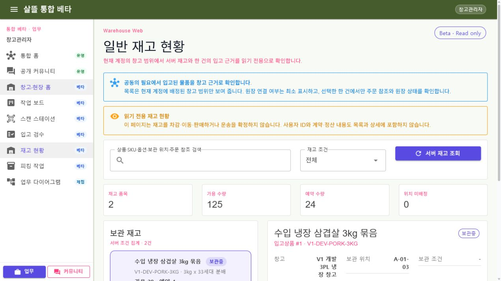

# WarehouseManagerApp-P03-2 - 일반 재고 현황

- 라우트: `/warehouse/general/inventory`
- 구현: `WarehouseManagerApp/Components/Pages/GeneralInventory.razor`
- 공용 화면: `Ssalddel.Ui.Common/Areas/App/Components/WarehouseOperations/SsalddelWarehouseInventoryWorkspace.razor`
- 분류: 확장 · `Beta/ReadOnly`

## 화면 책임

현재 계정이 소유하거나 배정받은 창고 범위에서 최소 재고 목록과 동일 조건 서버 집계를 조회합니다. 첫 항목을 자동 선택하지 않으며, 사용자가 고르거나 URL에 명시한 `inboundItemId` 한 건만 다시 조회해 입고·보관·주문 참조·공동 원장 근거를 표시합니다.

## 서버 연결

- `GET /api/v1/warehouse-operations/inventory-overview`
- `GET /api/v1/warehouse-operations/inventory-overview/{inboundItemId}`

## 보안과 실행 경계

상품 소유자·판매자 관계만으로는 접근할 수 없습니다. 목록과 상세 계약에는 사용자 ID, 계약·정산 정보, 주소·연락처·계좌·결제 식별자를 포함하지 않습니다. 재고 차감·이동·판매·운송·결제·정산은 실행하지 않습니다.
