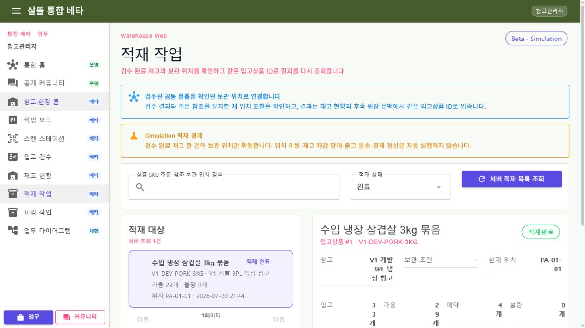

# WarehouseManagerApp-P03-3 - 적재 작업

- 라우트: `/work/inbound/put-away`
- 구현: `WarehouseManagerApp/Components/Pages/PutAwayTask.razor`
- 공용 화면: `Ssalddel.Ui.Common/Areas/App/Components/WarehouseOperations/SsalddelPutAwayTaskWorkspace.razor`
- 분류: 확장 · `Beta/Simulation`

## 화면 책임

현재 계정의 창고 범위에 있는 검수 완료 재고만 조회합니다. 사용자가 한 건을 고르면 같은 `inboundItemId`의 검수 근거를 조회하고, 검수 결과와 실제 위치 표찰을 모두 확인한 경우에만 보관 위치를 확정합니다. 성공 뒤 같은 ID의 상세와 목록을 서버에서 다시 조회합니다.

## 서버 연결

- `GET /api/v1/warehouse-operations/put-away-tasks`
- `GET /api/v1/warehouse-operations/put-away-tasks/{inboundItemId}`
- `POST /api/v1/warehouse-operations/put-away-tasks/{inboundItemId}/complete`

## 실행 경계

동일 위치 재시도는 새 이력·이동·Event를 만들지 않습니다. 적재 완료 뒤 다른 위치로 바꾸는 요청은 별도 재고 이동 업무로 분리합니다. 재고 차감·판매·출고·운송·결제·정산은 실행하지 않습니다.
