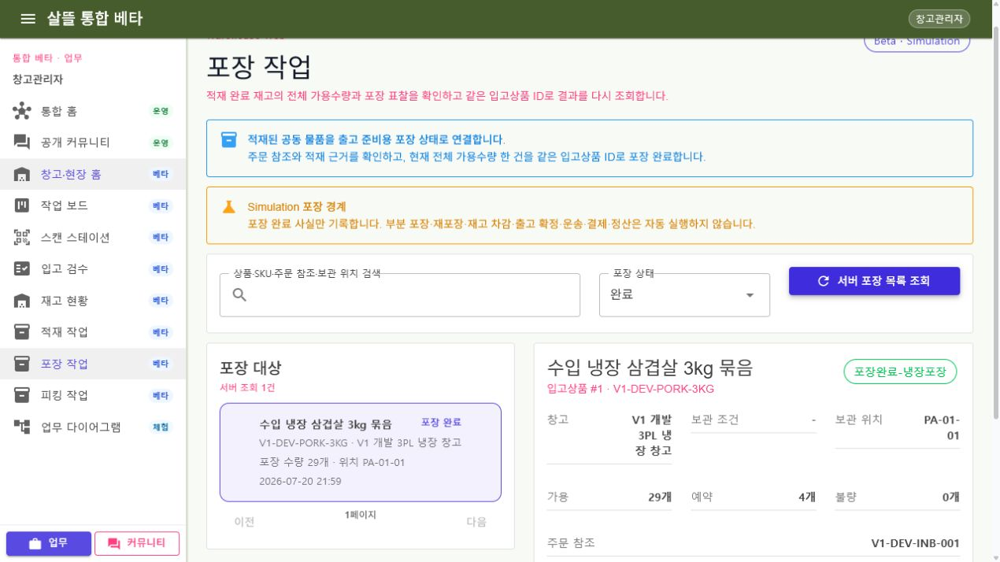

# WarehouseManagerApp-P04-1 - 포장 작업

- 경로: `/work/outbound/packing`
- 통합 웹 경로: `/warehouse/work/outbound/packing`
- 상태: 확장 · 실제 캡처
- 실행 경계: `Beta / Simulation`

적재 완료 재고의 주문 참조, 보관 위치, 적재 이력과 현재 전체 가용수량을 확인한 뒤 출고 준비용 포장 완료 사실을 기록하는 페이지다. 목록, 명시한 `inboundItemId` 상세, 완료 Command, 완료 후 같은 ID 재조회 책임을 각각 분리한다.

부분 포장은 별도 포장 단위를 만들지 않은 채 재고 전체 상태를 바꾸는 모순을 피하기 위해 허용하지 않는다. 동일 수량·동일 포장 유형 재시도는 이력·이동·감사·Event를 중복 생성하지 않으며, 완료 뒤 수량 또는 유형 변경은 별도 재포장 작업으로 분리한다.

이 페이지는 재고 차감, 출고 확정, 운송 생성, 계약, 결제, 정산을 자동 실행하지 않는다.

