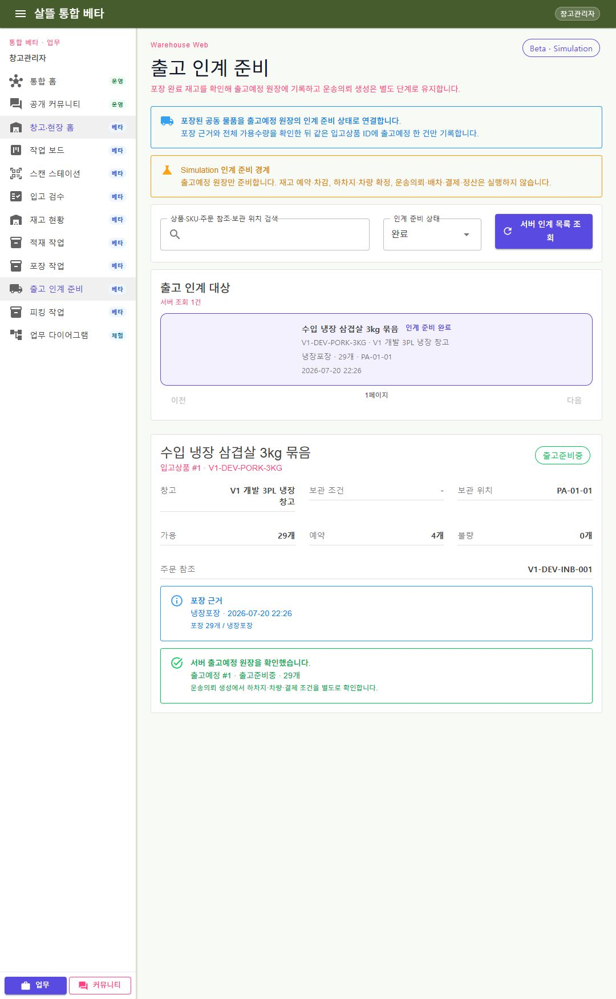

# WarehouseManagerApp-P04-2 - 출고 인계 준비

- 경로: `/warehouse/general/transport-handoff`
- 통합 웹 경로: `/warehouse/general/transport-handoff`
- 상태: 확장 · 실제 캡처
- 실행 경계: `Beta / Simulation`

포장 완료 재고의 포장 근거, 보관 조건과 현재 전체 가용수량을 확인한 뒤 `출고예정` 원장 한 건을 `출고준비중`으로 기록하는 페이지다. 목록, 명시한 `inboundItemId` 상세, 인계 준비 Command, 완료 후 같은 ID 재조회 책임을 각각 분리한다.

동일 수량 재시도는 새 출고예정·이력·감사·Event를 만들지 않는다. 부분 인계와 준비 완료 뒤 수량 변경은 별도 출고예정 조정 업무로 분리한다. 이 단계에서는 가용·예약 수량을 바꾸지 않으며 하차지, 차량, 운송의뢰, 배차, 결제, 정산을 생성하지 않는다.

