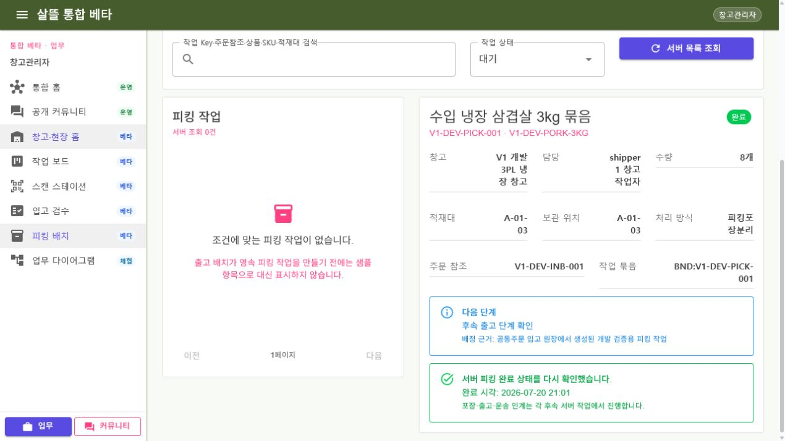

# WarehouseManagerApp-P04 - 피킹 작업

[전체 화면 문서](../../README.md) / [WarehouseManagerApp 화면 목록](../README.md) / [앱 전체 카탈로그](../../../app-page-catalog.md)

## 실제 화면

## 기본 정보

| 항목 | 내용 |
| --- | --- |
| 앱 | WarehouseManagerApp, Ssalddel.WebApp |
| 페이지 ID / 제목 | WarehouseManagerApp-P04 - 피킹 작업 |
| 라우트 | `/work/picking-batch`, `/warehouse/work/picking-batch` |
| 공용 화면 | [SsalddelPickingTaskWorkspace.razor](../../../../../Ssalddel.Ui.Common/Areas/App/Components/WarehouseOperations/SsalddelPickingTaskWorkspace.razor) |
| 앱 host | [PickingBatchWorkspace.razor](../../../../../WarehouseManagerApp/Components/Pages/PickingBatchWorkspace.razor) |
| capability | Beta / Simulation / 인증 필요 |
| 캡처 상태 | 실제 브라우저 캡처 |

## 한 가지 책임

이 화면은 서버에 이미 배정된 피킹 작업 한 건의 `대기 → 진행중 → 완료` 상태 전이만 맡습니다. 창고 옵션 편집, 작업자 배정, 부분 수량 계산, 포장, 출고, 기사 인계, 운송, 결제와 정산은 이 화면의 책임이 아닙니다.

커뮤니티에서 확인된 공동의 필요는 공동 원장·다이어그램을 거쳐 주문 참조와 피킹 작업 Key로 내려옵니다. 화면은 이 식별자를 바꾸지 않고 현장 결과를 저장하며, 후속 원장과 다이어그램이 같은 Key를 이어받을 수 있게 합니다. 따라서 피킹은 별도 제품이 아니라 커뮤니티 여정 위에서 필요할 때 열리는 실행 도구입니다.

## 분리된 책임

- `피킹작업목록ViewModel`: 검색, 상태 조건과 서버 페이징만 관리합니다.
- `피킹작업상세ViewModel`: 사용자가 고른 정확한 `taskKey` 한 건만 다시 조회합니다.
- `피킹작업처리ViewModel`: 시작과 완료 Command, 적재대·상품·전체 수량 확인만 관리합니다.
- `피킹작업PageViewModel`: Command 성공 뒤 같은 Key 상세와 현재 목록을 다시 읽는 순서만 조정합니다.
- Web·WarehouseManager host: 로그인, capability와 URL query 연결만 담당합니다.

## API와 권한

- `GET /api/v1/warehouse-operations/picking-tasks`
- `GET /api/v1/warehouse-operations/picking-tasks/{taskKey}`
- `POST /api/v1/warehouse-operations/picking-tasks/{taskKey}/start`
- `POST /api/v1/warehouse-operations/picking-tasks/{taskKey}/complete`

서버는 직접 담당 작업, 소유한 창고 또는 배정된 창고 작업만 반환하고 범위 밖의 Key는 없는 작업과 같은 404로 처리합니다. 목록·상세에는 사용자 ID, 주소, 연락처, 계좌와 결제 식별자를 포함하지 않습니다.

## 상태 전이와 경계

- 시작은 `대기` 작업만 `진행중`으로 바꾸며 동일 요청은 자연 멱등 결과를 반환합니다.
- 완료는 `진행중` 작업에서 서버 적재대 코드, 상품 확인과 전체 수량 확인을 모두 검증합니다.
- 최초 완료만 감사 기록과 `창고피킹완료됨Event`를 남깁니다.
- 완료 뒤 재고 차감, 포장 완료, 출고, 운송, 결제와 정산을 자동 실행하지 않습니다.
- 첫 목록 항목이나 sample을 자동 선택하지 않고 URL에 명시한 정확한 `taskKey`를 유지합니다.

## 검증

- 개발 계정 `shipper1`로 로그인해 대기 작업 목록과 정확한 상세를 조회했습니다.
- 시작 뒤 같은 Key의 `진행중`, 적재대·상품·전체 수량 확인 뒤 같은 Key의 `완료`를 다시 조회했습니다.
- 브라우저 콘솔에는 정보 로그 2건만 있었고 경고·오류는 없었습니다.
- 모바일 전용 viewport override는 제공되지 않아 공용 반응형 CSS와 WarehouseManagerApp 소비 빌드로 대체 확인했습니다.
