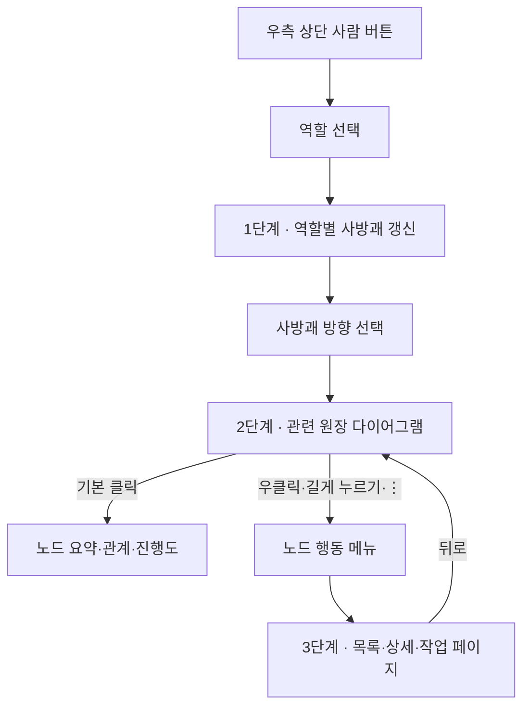
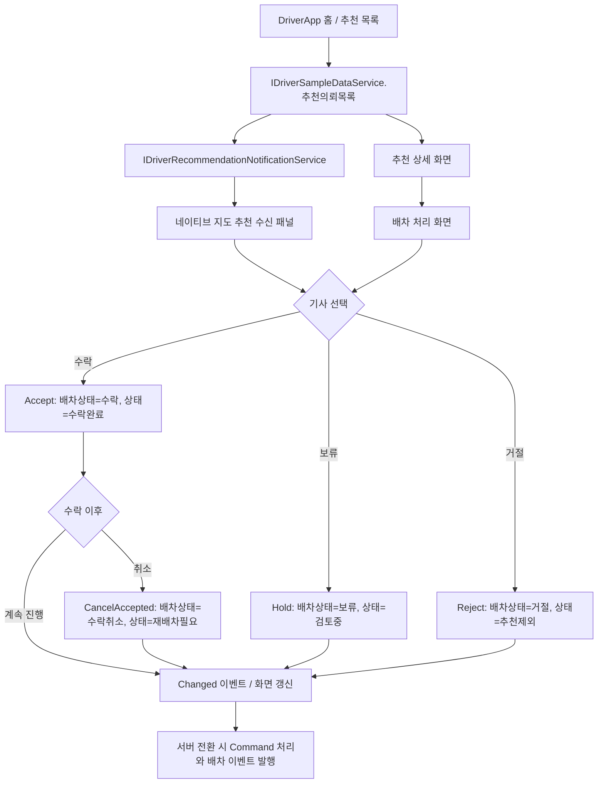
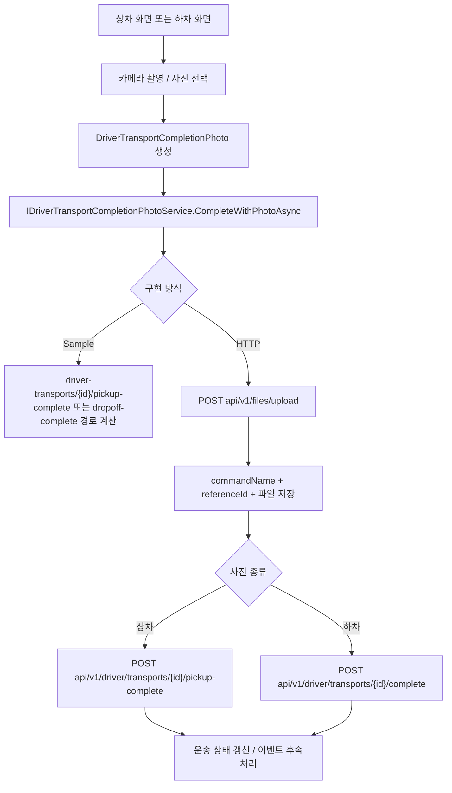
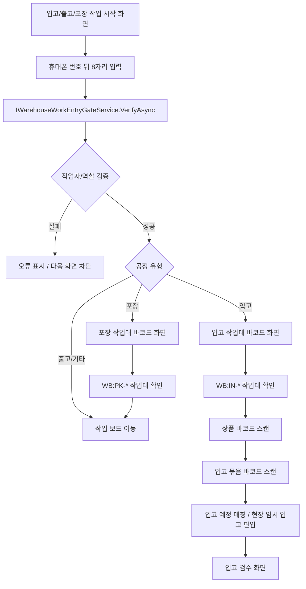

# Screen Flows

화면에 보이는 버튼과 카드가 내부적으로 어떻게 처리되는지 정리합니다. 일부 화면은 아직 샘플 서비스로 상태를 갱신하며, 서버 연동 시 같은 지점에서 Command/API 호출로 바뀝니다.

## 통합 홈과 3단계 업무 진입

`UnifiedHome`은 저장된 역할에 맞춰 역할 홈을 선택합니다. 사용자는 역할별 사방괘에서 영역을 고르고, 다이어그램에서 노드 관계를 파악한 뒤 노드 행동 메뉴로 구체 데이터 페이지를 엽니다. 자세한 규칙은 [3단계 내비게이션](../Architecture/ThreeStageClientNavigation.md)에서 봅니다.

현재 일부 사방괘 방향은 3단계 라우트로 바로 이동한다. 다이어그램 진입 문맥과 공통 노드 행동 메뉴를 연결한 뒤 위 흐름을 완료 상태로 판정한다.

## DriverApp 추천과 배차 처리

DriverApp 홈의 추천 목록, 추천 상세, 배차 처리 화면은 같은 추천 의뢰 데이터를 기준으로 움직입니다.
네이티브 지도 홈에서는 `IDriverRecommendationNotificationService`가 추천 수신 소스를 감싸고, 현재 샘플 구현은 같은 추천 데이터를 FCM/SignalR/폴링 수신처럼 노출합니다.

서버 전환 시 배차 결정 후속 처리는 다음 골격을 따른다.

| 결정 | 서버 후속 처리 |
| --- | --- |
| 수락 | `POST api/v1/driver/dispatch-actions/{requestId}/accept`, 추천 잠금, 배차 후보 생성, 화주 수락 알림 |
| 보류 | 기사 개인 검토 상태 유지, 서버 배차 확정은 하지 않음 |
| 수락 취소 | `POST api/v1/driver/dispatch-actions/{requestId}/cancel-acceptance`, 추천 잠금 해제, 재배차 열기, 화주 취소 알림, 취소 사유 감사 기록 |
| 거절 | `POST api/v1/driver/dispatch-actions/{requestId}/reject`, 해당 기사 후보 제외, 후보 기사 재계산, 거절 사유 감사/추천 품질 보정 |

`배차수락취소Command`는 배차 큐를 다시 `대기/배차추천/추천대기`로 되돌리고, 기존 기사는 제외 후보로 남긴 뒤 다음 추천 후보를 찾는 골격을 가진다.

## DriverApp 상차/하차 완료 사진 처리

상차 완료와 하차 완료 화면은 모바일 카메라에서 사진을 받은 뒤 완료 처리와 연결됩니다.

## WarehouseManagerApp 작업 진입

창고 앱의 입고와 포장 흐름은 먼저 휴대폰 번호 뒤 8자리로 작업자를 확인하고, 다음 화면에서 작업대 바코드를 확인합니다.

