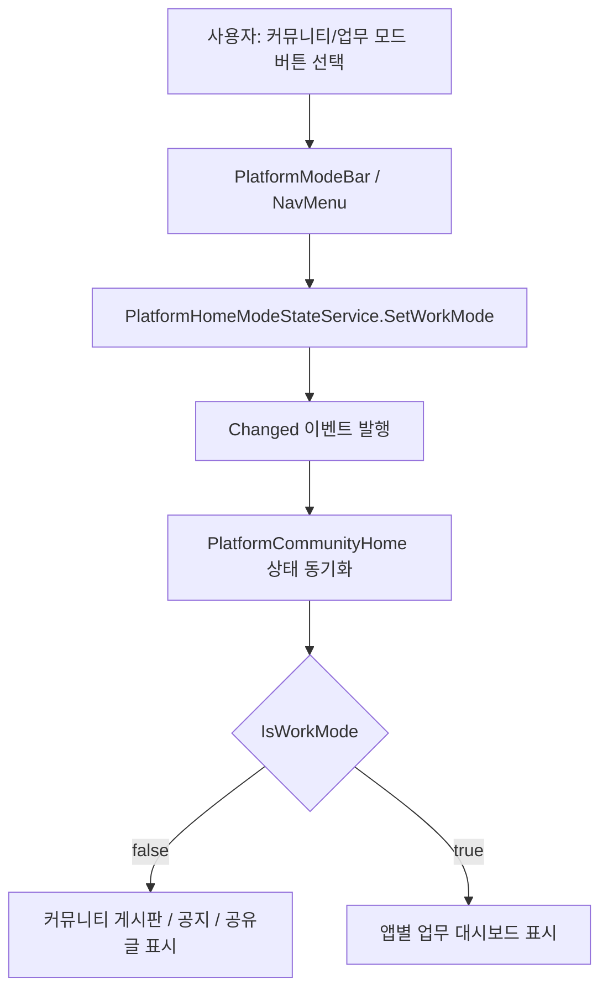
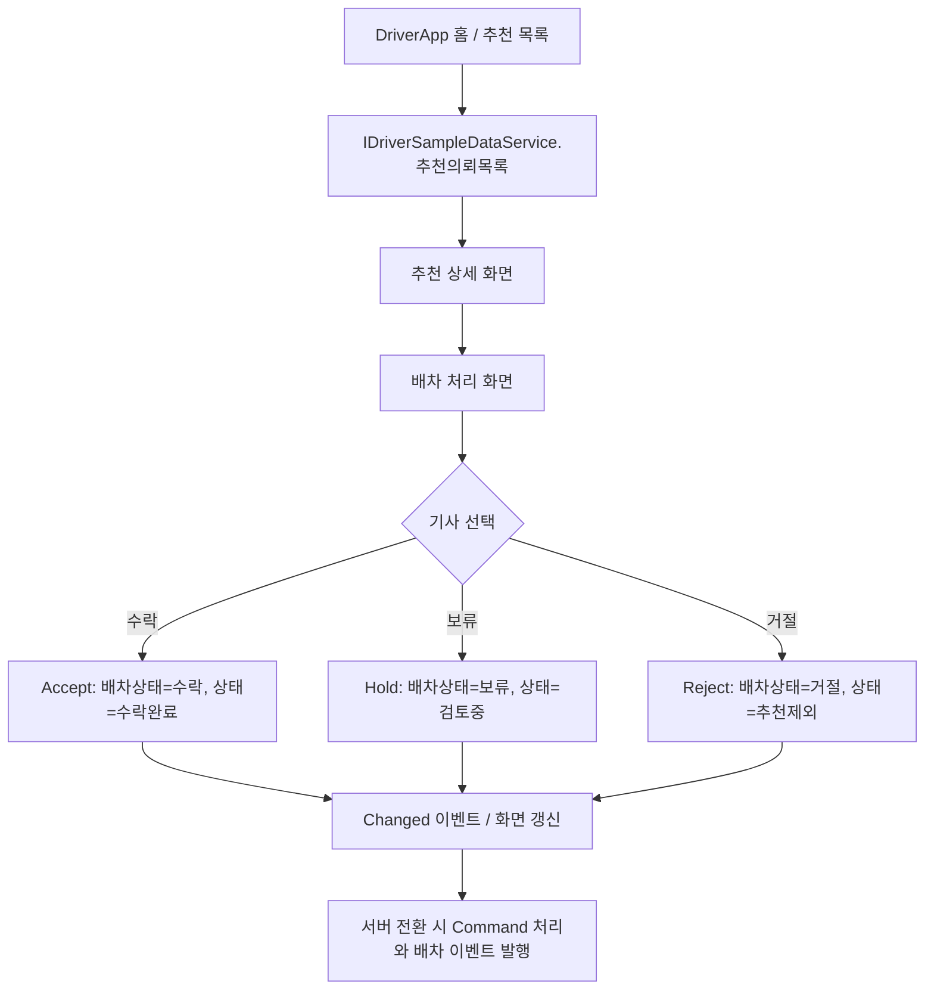
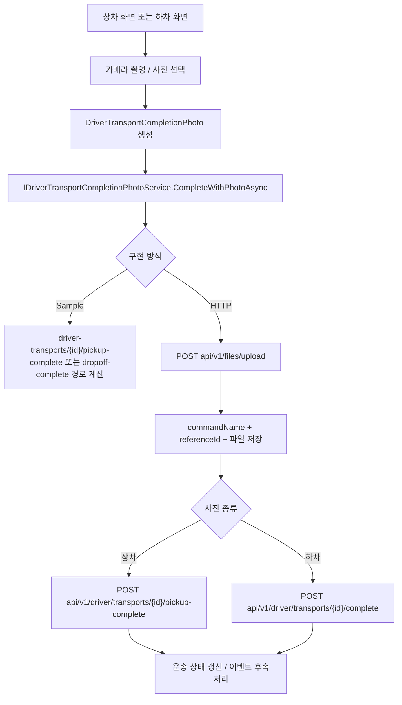
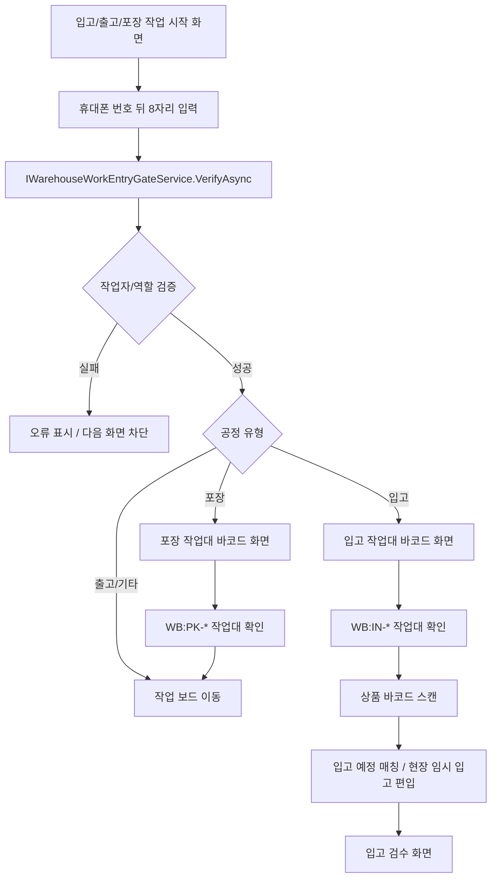

# Screen Flows

화면에 보이는 버튼과 카드가 내부적으로 어떻게 처리되는지 정리합니다. 일부 화면은 아직 샘플 서비스로 상태를 갱신하며, 서버 연동 시 같은 지점에서 Command/API 호출로 바뀝니다.

## 공통 홈 모드 전환

`PlatformCommunityHome`은 앱별 홈을 커뮤니티 모드와 업무 모드로 나눕니다. 모드 버튼은 공통 상태 서비스의 `IsWorkMode` 값을 바꾸고, 각 앱은 같은 상태값을 보고 커뮤니티 콘텐츠 또는 업무 콘텐츠를 렌더링합니다.

## DriverApp 추천과 배차 처리

DriverApp 홈의 추천 목록, 추천 상세, 배차 처리 화면은 같은 추천 의뢰 데이터를 기준으로 움직입니다.

## DriverApp 상차/하차 완료 사진 처리

상차 완료와 하차 완료 화면은 모바일 카메라에서 사진을 받은 뒤 완료 처리와 연결됩니다.

## WarehouseManagerApp 작업 진입

창고 앱의 입고와 포장 흐름은 먼저 휴대폰 번호 뒤 8자리로 작업자를 확인하고, 다음 화면에서 작업대 바코드를 확인합니다.

