# 살뜰 2.0 운송 필수 페이지 기준

> 재분류 안내: 레거시 파일명은 링크 호환을 위해 유지하지만 이 운송 화면 묶음의 현재 제품 버전은 **2.0**입니다.

이 문서는 국내 화물/용달 운송 워크플로우가 실제 화면에서 끊기지 않기 위해 반드시 필요한 페이지를 정리한다. 목적은 화면을 많이 만드는 것이 아니라, 하나의 운송 의뢰가 `등록 -> 배차대기 -> 추천 -> 수락/거절 -> 상차 -> 하차 -> POD -> 정산`까지 닫히는 데 필요한 최소 화면 경계를 고정하는 것이다.

필수 페이지를 실제로 하나씩 열어 보며 검증하는 순서는 [살뜰 2.0 운송 페이지 검증 순례](ssalddel-v1-page-validation-walkthrough.md)에 둔다. 이 문서는 화면의 필요성과 경계를 고정하고, 검증 순례 문서는 서버 데이터, API 연결, 상태 전파, 실패/예외 처리를 확인하는 실행 순서를 다룬다.

## 필수 페이지 판단 기준

어떤 페이지가 필수인지는 다음 네 가지 질문으로 판단한다.

| 기준 | 의미 |
| --- | --- |
| 상태 생성 | 이 화면이 없으면 다음 업무 상태를 만들 수 없는가 |
| 상태 확인 | 이 화면이 없으면 다른 참여자가 현재 상태를 확인할 수 없는가 |
| 증빙 확보 | 이 화면이 없으면 사진, POD, 인수증, 서명, 시간 기록 같은 증빙이 남지 않는가 |
| 예외 복구 | 이 화면이 없으면 실패나 현장 예외가 발생했을 때 다음 행동을 알 수 없는가 |

2.0에서는 한 화면이 여러 일을 처리하지 않도록 한다. 홈과 대시보드는 진입과 요약을 맡고, 실제 상태 변경은 상세, 처리, 증빙, 정산 화면처럼 책임이 분명한 화면에서 수행한다.

## 페이지 번호 체계

2.0 페이지 식별자는 실제 프로젝트명을 접두사로 붙여 `SsalddelApp-P01`, `DriverApp-P06`, `SsalddelAdmin-P22-1`처럼 관리한다. 번호는 화면 이름이 바뀌더라도 유지하고, 실제 라우트나 파일이 바뀌면 이 문서의 코드 연결만 갱신한다.

독립 라우트나 독립 책임을 가진 화면은 `SsalddelApp-P03`처럼 부모 번호를 가진다. 그 안에 들어가는 세부 페이지, 섹션, 탭, 모달, 보조 설정 화면은 `SsalddelApp-P03-1`, `SsalddelApp-P03-2`처럼 부모 번호 아래에 붙인다. 예를 들어 `SsalddelApp-P03 의뢰 상세/타임라인` 안의 결제 안내는 `SsalddelApp-P03-1`, 예외/분쟁 확인은 `SsalddelApp-P03-2`로 관리한다.

목록과 상세는 둘 다 원장을 여는 핵심 화면이면 상위 번호를 유지한다. 반대로 같은 원장 안에서 이벤트, 증빙, 정산, 설정처럼 일부 관점만 다루는 화면은 하위 번호로 내린다. 이미 문서에 남은 상위 번호는 재사용하지 않고, 이후 새 독립 화면이 생기면 다음 빈 상위 번호를 부여한다.

| 번호 범위 | 의미 |
| --- | --- |
| `SsalddelApp-P01`~`SsalddelApp-P03`, `SsalddelApp-P03-*` | 화주가 운송 의뢰를 만들고 상태를 확인하는 화면 |
| `DriverApp-P06`~`DriverApp-P15`, `DriverApp-P06-*`, `DriverApp-P07-*`, `DriverApp-P14-*`, `DriverApp-P15-*` | 기사가 운행을 시작하고 추천, 상차, 하차, 정산을 처리하는 화면 |
| `SsalddelAdmin-P16`~`SsalddelAdmin-P22`, `SsalddelAdmin-P22-*`, `SsalddelAdmin-P26-*`, `SsalddelAdmin-P27-*` | 관리자가 배차, 운송, 증빙, 정산, 예외를 운영하는 화면 |
| `Public-P28` | 수령자 또는 공개 POD 확인 확장 화면 |

## 한글/영문 표기 원칙

SsalddelApp-P01부터 Public-P28까지의 화면 이름과 업무 설명은 한글 도메인 용어를 우선한다. 실제 파일명, 클래스명, 메서드명, API 경로는 코드와 바로 대조할 수 있도록 현재 소스의 표기를 그대로 인용한다. 여기서 원문 표기란 영문 이름을 유지하라는 뜻이 아니며, 코드 자체의 명명은 [코드 탐색 메타데이터의 코드 명명 언어](../Architecture/SsalddelCodeMetadata.md#코드-명명-언어)를 따른다.

| 구분 | 표기 원칙 | 예시 |
| --- | --- | --- |
| 화면 이름 | 사용자가 이해하는 한글 업무명으로 쓴다 | `운송 의뢰 작성`, `기사 추천 상세`, `운송 증빙` |
| 도메인 상태 | 서버 상태와 업무 의미가 보이도록 한글로 쓴다 | `배차대기`, `추천중`, `상차 완료`, `정산 후보` |
| 앱/프로젝트명 | 실제 프로젝트명을 유지한다 | `SsalddelApp`, `DriverApp`, `SsalddelAdmin` |
| 파일/클래스/메서드 | 코드 검색이 가능하도록 실제 이름을 유지한다 | `ShipperRequestDetail.razor`, `배차수락CommandHandler` |
| 기술 접미사 | 처음 볼 때 뜻이 드러나도록 한글 설명을 붙인다 | `Controller(컨트롤러)`, `Handler(핸들러)`, `Service(서비스)` |
| 약어 | 물류·기술 약어는 원문을 유지하되 의미를 문맥에 붙인다 | `POD(하차 증빙)`, `FCM`, `SignalR`, `API` |

## 화면 캡처 속성

각 페이지는 나중에 실제 화면 캡처를 붙일 수 있도록 `캡처 이미지` 속성을 가진다. 페이지 식별자는 `프로젝트명-P번호`를 쓰고, 캡처 파일명은 기존 산출물과 링크 안정성을 위해 `P번호-화면명.png` 형식을 유지할 수 있다.

캡처 파일은 `docs/ProjectOverview/assets/v1-pages/` 아래에 둔다. 실제 캡처를 넣기 전에는 아래 경로를 예정값으로 남긴다.

보안상 캡처에는 실제 고객 주소, 연락처, 차량번호, 계좌번호, 가상계좌, 결제 식별자, POD 원본, 실제 위치 좌표를 그대로 넣지 않는다. 개발용 샘플 데이터로 찍거나, 민감정보를 마스킹한 뒤 넣는다.

현재 Android 에뮬레이터 기준 렌더링 스모크 결과와 대표 캡처는 [살뜰 2.0 렌더링/캡처 검증 요약](ssalddel-v1-render-capture-summary.md)에 둔다. 2026-07-09 기준 `DriverApp` 23개, `SsalddelApp` 30개, `WarehouseManagerApp` 22개 라우트가 Blazor 오류 UI 없이 렌더링되는 것을 확인했다. 이 결과는 `SsalddelApp-P01`~`SsalddelApp-P03`, `DriverApp-P06`~`DriverApp-P15`, 창고 확장 화면을 README에 설명할 때 근거로 사용한다.

| 번호 | 캡처 이미지 속성 | 권장 파일 경로 | 캡처 기준 |
| --- | --- | --- | --- |
| SsalddelApp-P01 | 화주 홈/업무 진입 캡처 | `assets/v1-pages/P01-화주홈.png` | 최근 의뢰와 SsalddelApp-P02/SsalddelApp-P03 진입이 보이는 상태 |
| SsalddelApp-P02 | 운송 의뢰 작성 캡처 | `assets/v1-pages/P02-운송의뢰작성.png` | 상차지, 하차지, 화물, 결제 조건 입력 흐름 |
| SsalddelApp-P02-1 | 운송 의뢰 대량 등록 캡처 | `assets/v1-pages/P02-1-운송의뢰대량등록.png` | 여러 운송 의뢰를 파일 또는 목록으로 등록하는 흐름 |
| SsalddelApp-P03 | 의뢰 상세/타임라인 캡처 | `assets/v1-pages/P03-의뢰상세타임라인.png` | 결제, 배차, 수락, 상차, 하차, 정산 타임라인 |
| SsalddelApp-P03-1 | 결제/입금 안내 캡처 | `assets/v1-pages/P03-1-결제입금안내.png` | 가상계좌/결제대기/입금 요청 알림 상태. 민감 결제값은 마스킹 |
| SsalddelApp-P03-2 | 예외/분쟁 확인 캡처 | `assets/v1-pages/P03-2-예외분쟁확인.png` | 현장 예외 사유와 다음 행동 안내. 사진 원본은 마스킹 |
| DriverApp-P06 | 운행 시작 캡처 | `assets/v1-pages/P06-운행시작.png` | 운행 시작, 위치 송신 안내, 복귀/수익 선호 |
| DriverApp-P06-1 | 운행 설정 캡처 | `assets/v1-pages/P06-1-운행설정.png` | 복귀/수익 선호, 위치 송신, 운행 조건 설정 |
| DriverApp-P07 | 지도 홈/추천 배너 캡처 | `assets/v1-pages/P07-지도홈추천배너.png` | 지도 위 추천 배너와 응답 제한 시간 |
| DriverApp-P07-1 | 기사 업무 허브/요약 캡처 | `assets/v1-pages/P07-1-기사업무허브.png` | 지도 홈에서 들어가는 기사 업무 요약과 주요 진입 |
| DriverApp-P08 | 추천 목록 캡처 | `assets/v1-pages/P08-추천목록.png` | 기사에게 노출된 추천 목록과 잠금/상태 표시 |
| DriverApp-P09 | 추천 상세 캡처 | `assets/v1-pages/P09-추천상세.png` | 운임, 추가 시간, 업무 유형, 경로 이점, 증빙 조건 |
| DriverApp-P10 | 배차 처리 캡처 | `assets/v1-pages/P10-배차처리.png` | 수락, 거절, 보류 버튼과 결정 전 확인 정보 |
| DriverApp-P11 | 진행 중 운송 캡처 | `assets/v1-pages/P11-진행중운송.png` | 다음 행동, 상차/하차 진입, 현재 운송 요약 |
| DriverApp-P12 | 상차 화면 캡처 | `assets/v1-pages/P12-상차화면.png` | 상차 사진, 인수증/서명, LCL/FCL 체크, 예외 신고 |
| DriverApp-P13 | 하차 화면 캡처 | `assets/v1-pages/P13-하차화면.png` | 하차 사진, POD, 인수 확인, 하차 예외 신고 |
| DriverApp-P14 | 기사 월정산 확인 캡처 | `assets/v1-pages/P14-기사정산확인.png` | 운임, 추가 수당, 정산 예정일. 계좌정보는 마스킹 |
| DriverApp-P14-1 | 기사 이용료/정산 정책 안내 캡처 | `assets/v1-pages/P14-1-정산이용료안내.png` | 이용료, 수수료, 정산 기준 안내 |
| DriverApp-P15 | 기사 알림함 캡처 | `assets/v1-pages/P15-알림함.png` | 추천, 수락 후 안내, 입금 알림, 실패 알림 목록 |
| DriverApp-P15-1 | 기사 알림 설정 캡처 | `assets/v1-pages/P15-1-알림설정.png` | 알림 수신 채널, 알림톡/FCM 선택 |
| DriverApp-P15-2 | 기사 푸시 설정 캡처 | `assets/v1-pages/P15-2-푸시설정.png` | 기기 푸시 권한, 토큰, 방해금지 조건 |
| SsalddelAdmin-P16 | 관리자 대시보드 캡처 | `assets/v1-pages/P16-관리자대시보드.png` | 막힌 배차, 증빙 누락, 정산 지연 요약 |
| SsalddelAdmin-P17 | 관리자 의뢰 목록 캡처 | `assets/v1-pages/P17-관리자의뢰목록.png` | 의뢰 목록과 상세 진입. 주소/연락처는 마스킹 |
| SsalddelAdmin-P18 | 관리자 의뢰 상세 캡처 | `assets/v1-pages/P18-관리자의뢰상세.png` | 의뢰 원문, 결제 조건, 배차 연결 상태 |
| SsalddelAdmin-P19 | 관리자 배차대기 캡처 | `assets/v1-pages/P19-관리자배차대기.png` | 배차대기, 추천중, 후보부족, 추천 잠금 |
| SsalddelAdmin-P20 | 기사 운행 현황 캡처 | `assets/v1-pages/P20-기사운행현황.png` | 운행 중 기사와 위치 최신성. 위치는 샘플 또는 마스킹 |
| SsalddelAdmin-P21 | 운송 목록 캡처 | `assets/v1-pages/P21-운송목록.png` | 진행 중, 완료, 예외 상태별 목록 |
| SsalddelAdmin-P22 | 운송 상세 캡처 | `assets/v1-pages/P22-운송상세.png` | 운송 상태, 기사, 화주, 증빙, 정산 연결 |
| SsalddelAdmin-P22-1 | 운송 이벤트 캡처 | `assets/v1-pages/P22-1-운송이벤트.png` | 수락, 거절, 만료, 상차, 하차, 예외 이벤트 시간순 기록 |
| SsalddelAdmin-P22-2 | 운송 증빙 캡처 | `assets/v1-pages/P22-2-운송증빙.png` | 사진, POD, 인수증, 서명, 문서 연결. 원본은 마스킹 |
| SsalddelAdmin-P22-3 | 운송 정산 캡처 | `assets/v1-pages/P22-3-운송정산.png` | 입금 요청, 입금 완료, 기사 정산 후보 |
| SsalddelAdmin-P26 | 결제 목록 캡처 | `assets/v1-pages/P26-결제목록.png` | 결제대기, 입금완료 목록. 결제 식별자는 마스킹 |
| SsalddelAdmin-P26-1 | 정산 목록 캡처 | `assets/v1-pages/P26-1-정산목록.png` | 정산예정/완료 목록. 계좌정보는 마스킹 |
| SsalddelAdmin-P27 | 문서 목록 캡처 | `assets/v1-pages/P27-문서목록.png` | 문서 보관, 문서 상태, 문서 상세 진입 |
| SsalddelAdmin-P27-1 | 문서 업로드 캡처 | `assets/v1-pages/P27-1-문서업로드.png` | 문서 업로드와 문서 유형 선택 |
| SsalddelAdmin-P27-2 | 문서 정책 목록 캡처 | `assets/v1-pages/P27-2-문서정책목록.png` | 문서별 보관, 다운로드, 서명 필요 정책 |
| SsalddelAdmin-P27-3 | 문서 정책 상세 캡처 | `assets/v1-pages/P27-3-문서정책상세.png` | 문서 코드별 세부 정책 |
| SsalddelAdmin-P27-4 | 문서 조회 로그 캡처 | `assets/v1-pages/P27-4-문서조회로그.png` | 조회자, 조회 시간, 다운로드 기록 |
| SsalddelAdmin-P27-5 | 파일/POD 관리 캡처 | `assets/v1-pages/P27-5-파일POD관리.png` | POD 파일 상태와 원본 보호 |
| Public-P28 | 공개 POD 확인 캡처 | `assets/v1-pages/P28-공개POD확인.png` | 공개 확인 링크, 만료 안내, 최소 정보 표시 |

이미지가 실제로 추가되면 각 페이지 설명 아래에 다음 형식으로 붙인다.

```markdown
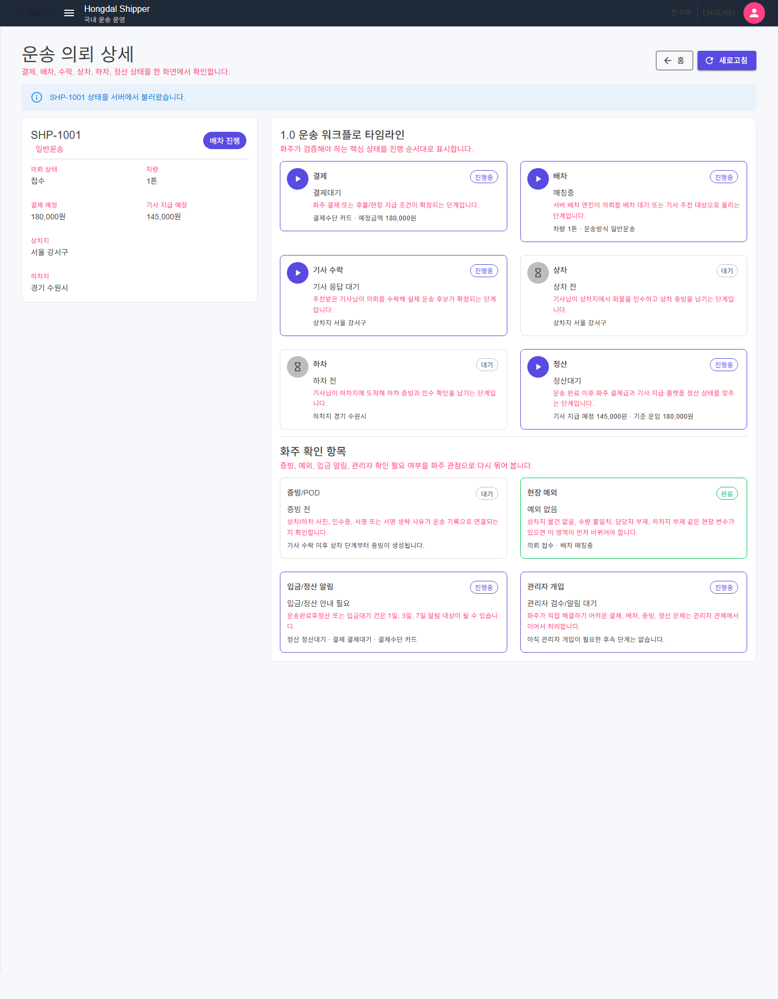
```

현재 첨부된 캡처는 다음과 같다. 상위 페이지와 일부 하위 페이지는 실제 렌더링된 화면을 기준으로 캡처를 붙였고, 아직 캡처하지 않은 하위 페이지는 `캡처 예정`으로 남긴다.

SsalddelApp-P03-1과 SsalddelApp-P03-2는 아직 독립 라우트가 아니라 SsalddelApp-P03 의뢰 상세 화면 안의 결제/예외 섹션으로 닫는 구조다. 그래서 현재 캡처도 같은 상세 화면을 기준으로 붙인다. DriverApp-P14와 DriverApp-P15는 기사 앱의 정산/알림 대표 라우트로 캡처했다.

## 상위/하위 페이지별 캡처

### SsalddelApp-P01 화주 홈/업무 진입

- 라우트: `/shipper`
- 역할: 화주가 운송 의뢰와 진행 상태 확인 흐름으로 들어가는 관문이다.
- 캡처: `assets/v1-pages/P01-화주홈.png`


### SsalddelApp-P02 운송 의뢰 작성

- 라우트: `/shipper/request`
- 역할: 상차지, 하차지, 화물, 차량 조건, 결제 조건을 입력해 운송 의뢰를 생성한다.
- 캡처: `assets/v1-pages/P02-운송의뢰작성.png`


### SsalddelApp-P02-1 운송 의뢰 대량 등록

- 라우트: `/shipper/request/bulk`
- 역할: 여러 운송 의뢰를 파일 또는 목록으로 한 번에 등록한다.
- 캡처 예정: `assets/v1-pages/P02-1-운송의뢰대량등록.png`

### SsalddelApp-P03 의뢰 상세/타임라인

- 라우트: `/shipper/request/{RequestId}`
- 역할: 결제, 배차, 수락, 상차, 하차, 정산 상태를 화주가 한 화면에서 추적한다.
- 캡처: `assets/v1-pages/P03-의뢰상세타임라인.png`


### SsalddelApp-P03-1 결제/입금 안내

- 라우트: 우선 `/shipper/request/{RequestId}` 내부 섹션
- 역할: 가상계좌, 입금대기, 입금 요청 알림 상태를 화주가 확인한다.
- 캡처: `assets/v1-pages/P03-1-결제입금안내.png`


### SsalddelApp-P03-2 예외/분쟁 확인

- 라우트: 우선 `/shipper/request/{RequestId}` 내부 섹션
- 역할: 상차/하차 예외와 분쟁 가능 상태를 화주 관점에서 확인한다.
- 캡처: `assets/v1-pages/P03-2-예외분쟁확인.png`


### DriverApp-P06 운행 시작

- 라우트: `/driver/work/start`
- 역할: 기사가 운행을 시작하고 위치 송신, 복귀/수익 선호를 설정한다.
- 캡처: `assets/v1-pages/P06-운행시작.png`

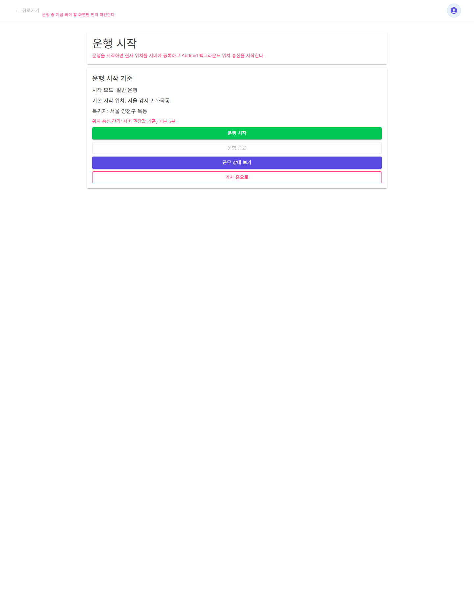

### DriverApp-P06-1 운행 설정

- 라우트: `/driver/work/settings`
- 역할: 운행 조건, 위치 송신, 복귀/수익 선호를 운행 시작 전후에 보조 설정한다.
- 캡처 예정: `assets/v1-pages/P06-1-운행설정.png`

### DriverApp-P07 지도 홈/추천 배너

- 라우트: `/driver/home`
- 역할: 기사 지도 홈에서 신규 추천 배너와 현재 운송 진입을 제공한다.
- 캡처: `assets/v1-pages/P07-지도홈추천배너.png`

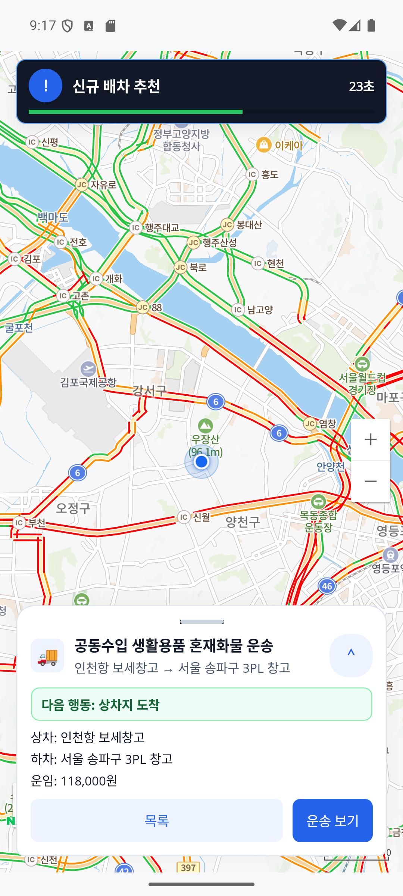

### DriverApp-P07-1 기사 업무 허브/요약

- 라우트: `/driver/home/summary`
- 역할: 지도 홈에서 진입하는 기사 업무 요약과 추천, 운행, 정산 진입을 제공한다.
- 캡처: `assets/v1-pages/P07-1-기사업무허브.png`


### DriverApp-P08 추천 목록

- 라우트: `/driver/recommendations`
- 역할: 기사에게 노출된 추천 후보와 추천 상태를 목록으로 확인한다.
- 캡처: `assets/v1-pages/P08-추천목록.png`

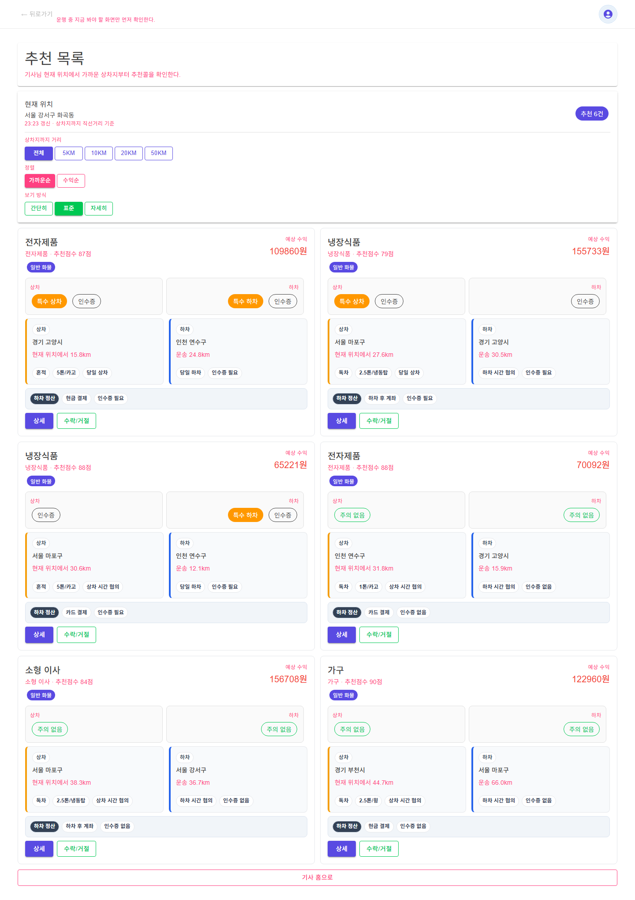

### DriverApp-P09 추천 상세

- 라우트: `/driver/recommendations/{의뢰Id}`
- 역할: 운임, 추가 시간, 업무 유형, 경로 이점, 증빙 조건을 보고 수락 여부를 판단한다.
- 캡처: `assets/v1-pages/P09-추천상세.png`

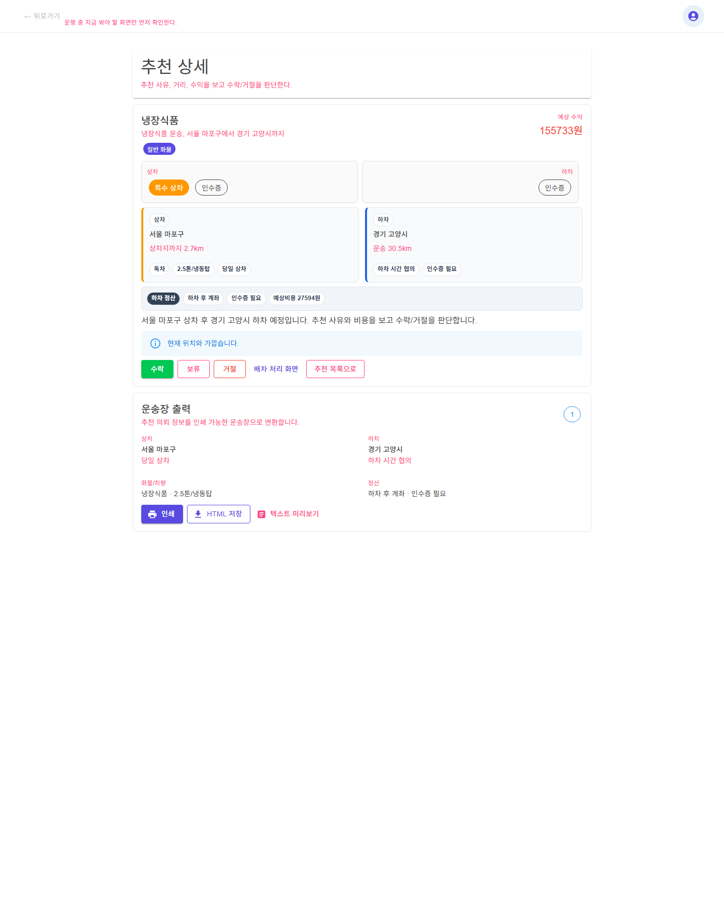

### DriverApp-P10 배차 처리

- Web 라우트: `/driver/dispatch-decisions/{의뢰Id}`
- 역할: 수락, 거절, 보류 같은 배차 결정 명령을 서버에 보낸다.
- 캡처: `assets/v1-pages/P10-배차처리.png`

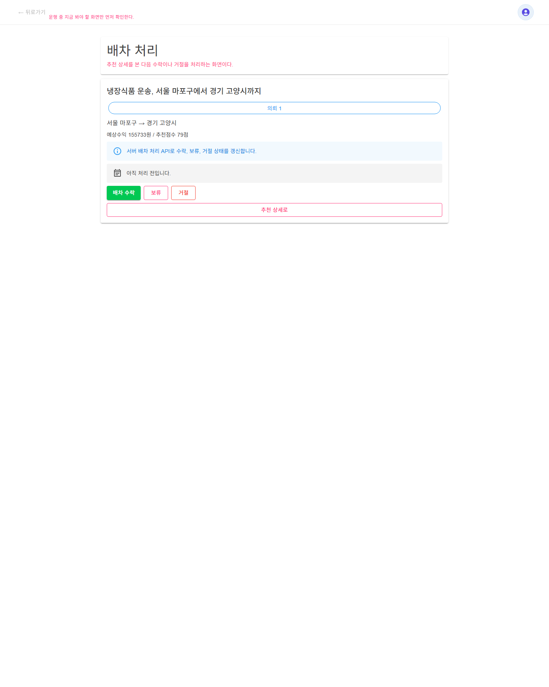

### DriverApp-P11 진행 중 운송

- 라우트: `/driver/transports/current`
- 역할: 현재 운송의 다음 행동을 보여주고 상차/하차 화면으로 넘긴다.
- 캡처: `assets/v1-pages/P11-진행중운송.png`

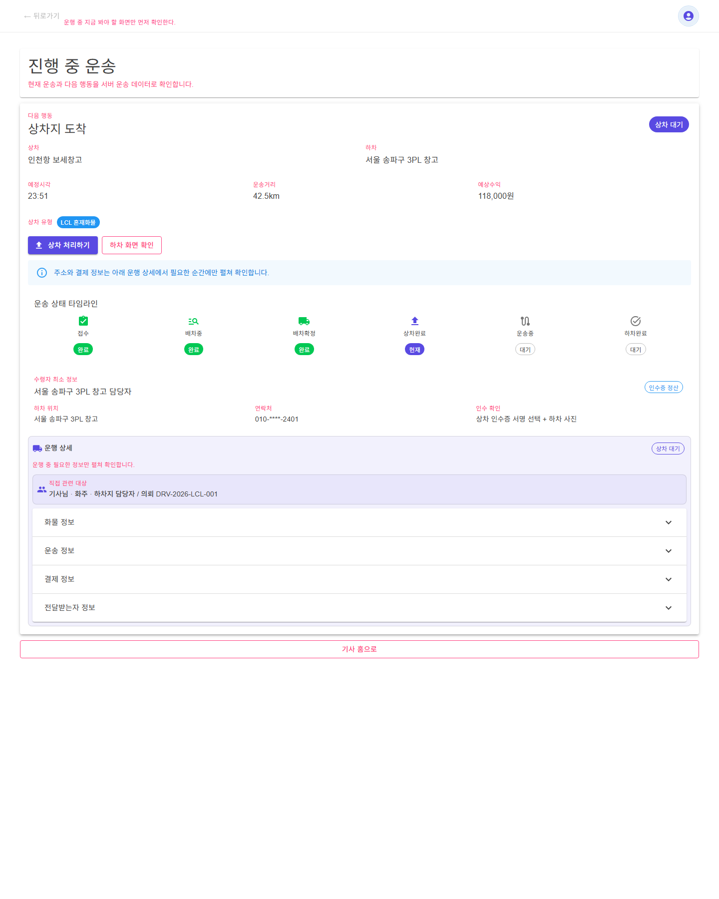

### DriverApp-P12 상차 화면

- 라우트: `/driver/transports/{운송Id}/pickup`
- 역할: 상차 사진, 인수증/서명, LCL/FCL 체크, 상차 예외 신고를 처리한다.
- 캡처: `assets/v1-pages/P12-상차화면.png`

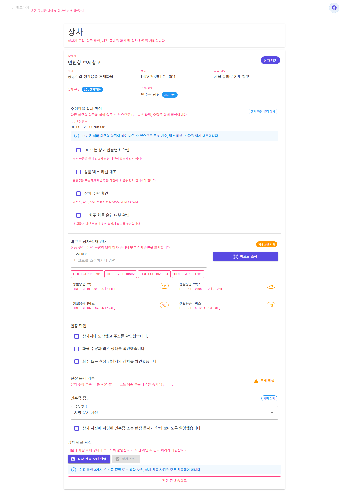

### DriverApp-P13 하차 화면

- 라우트: `/driver/transports/{운송Id}/dropoff`
- 역할: 하차 사진, POD, 인수 확인, 하차 예외 신고를 처리한다.
- 캡처: `assets/v1-pages/P13-하차화면.png`

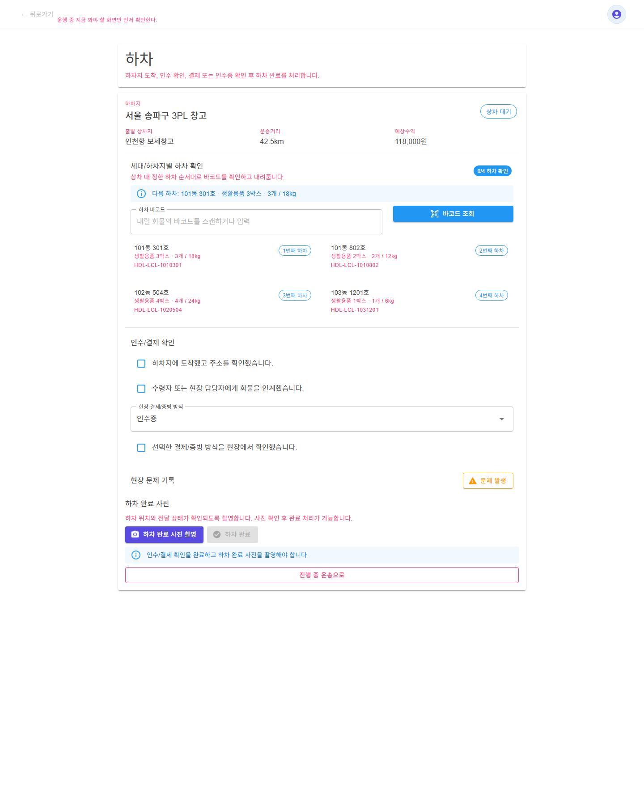

### DriverApp-P14 기사 월정산 확인

- 라우트: `/driver/settlements/current-month`
- 역할: 운임, 추가 수당, 정산 예정일, 입금 완료 여부를 기사에게 보여준다.
- 캡처: `assets/v1-pages/P14-기사정산확인.png`

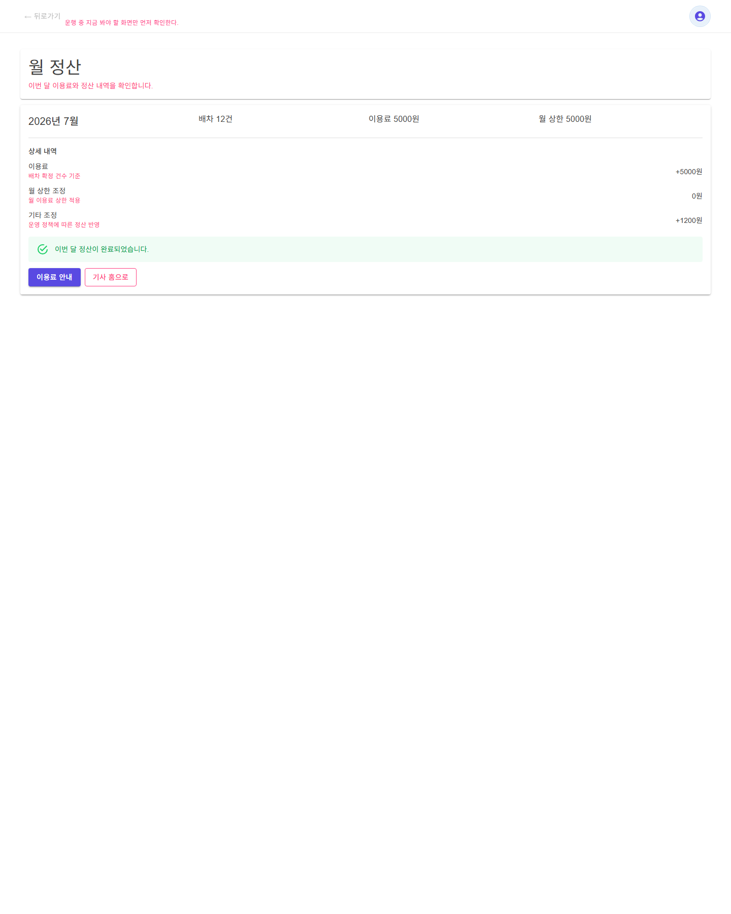

### DriverApp-P14-1 기사 이용료/정산 정책 안내

- 라우트: `/driver/settlements/info`
- 역할: 이용료, 수수료, 정산 기준처럼 월정산 확인 전에 알아야 할 정책을 안내한다.
- 캡처 예정: `assets/v1-pages/P14-1-정산이용료안내.png`

### DriverApp-P15 기사 알림함

- 라우트: `/driver/notifications`
- 역할: 추천, 수락 후 안내, 입금 알림, 실패 알림을 기사에게 모아 보여준다.
- 캡처: `assets/v1-pages/P15-알림함.png`

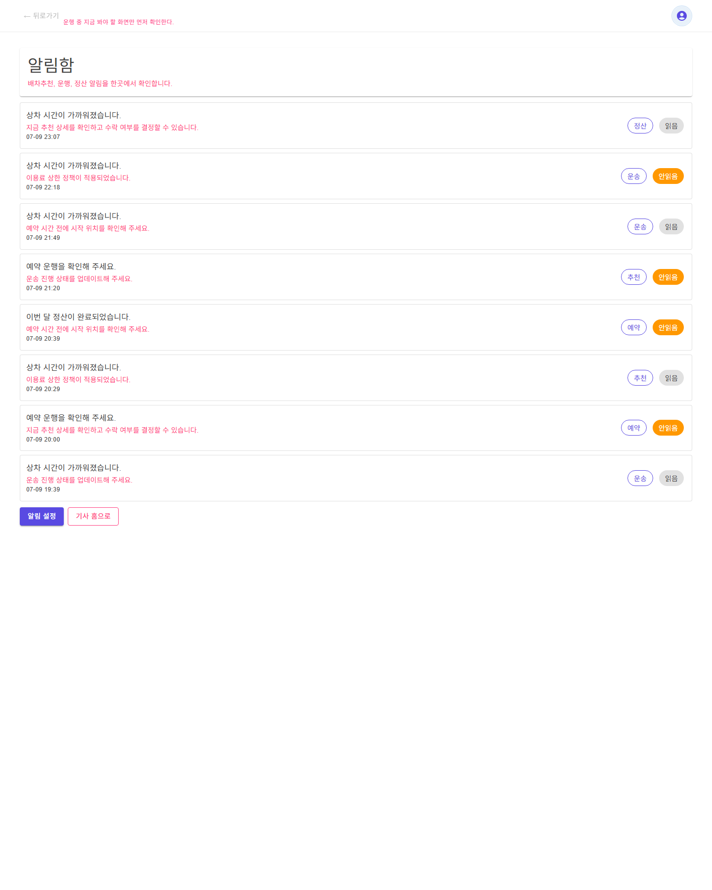

### DriverApp-P15-1 기사 알림 설정

- 라우트: `/driver/notifications/settings`
- 역할: 기사별 알림 수신 채널과 알림톡/FCM 선호를 설정한다.
- 캡처 예정: `assets/v1-pages/P15-1-알림설정.png`

### DriverApp-P15-2 기사 푸시 설정

- 라우트: `/driver/notifications/push`
- 역할: 기기 푸시 권한, 푸시 토큰, 방해금지 조건을 확인한다.
- 캡처 예정: `assets/v1-pages/P15-2-푸시설정.png`

### SsalddelAdmin-P16 관리자 대시보드

- 라우트: `/dashboard`
- 역할: 막힌 배차, 증빙 누락, 정산 지연을 운영자가 빠르게 확인한다.
- 캡처: `assets/v1-pages/P16-관리자대시보드.png`

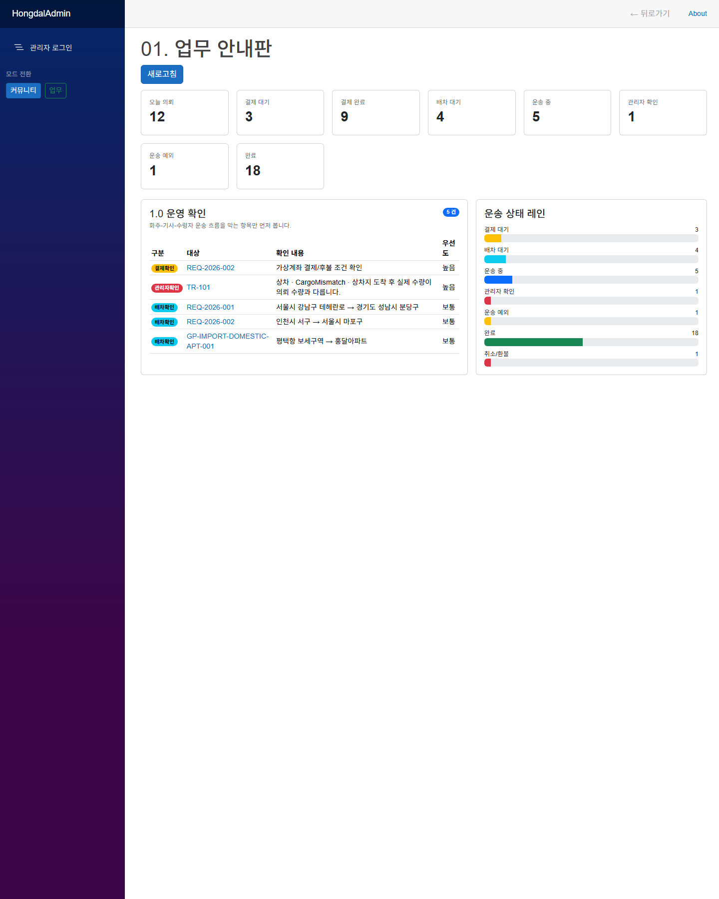

### SsalddelAdmin-P17 관리자 의뢰 목록

- 라우트: `/requests`
- 역할: 화주 의뢰 목록을 보고 상세, 배차, 운송 화면으로 진입한다.
- 캡처: `assets/v1-pages/P17-관리자의뢰목록.png`

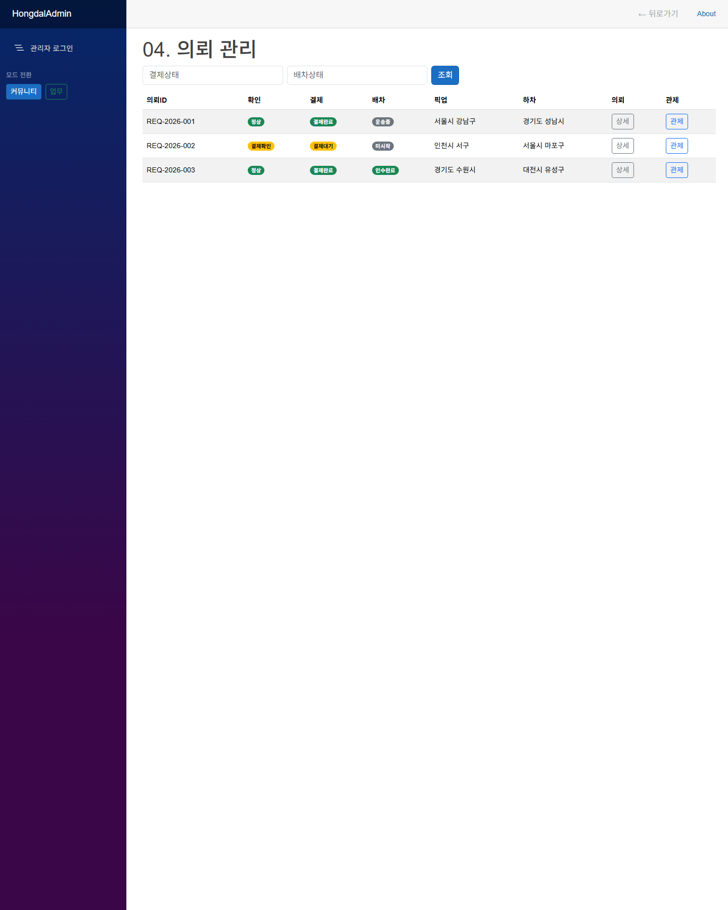

### SsalddelAdmin-P18 관리자 의뢰 상세

- 라우트: `/requests/{RequestId}`
- 역할: 의뢰 원문, 결제 조건, 배차 연결 상태를 운영자 관점에서 확인한다.
- 캡처: `assets/v1-pages/P18-관리자의뢰상세.png`

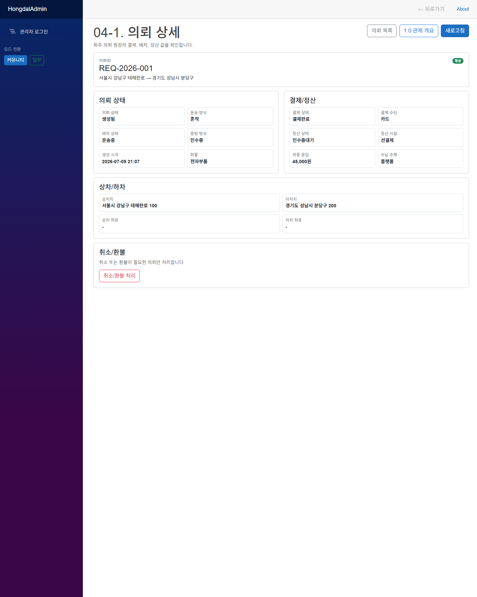

### SsalddelAdmin-P19 관리자 배차대기

- 라우트: `/dispatch/wait`
- 역할: 배차대기, 추천중, 후보부족, 추천 잠금 상태를 확인한다.
- 캡처: `assets/v1-pages/P19-관리자배차대기.png`

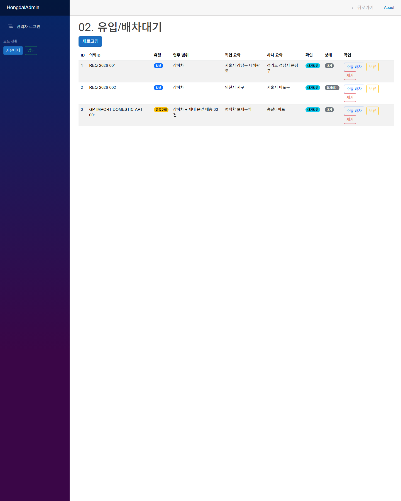

### SsalddelAdmin-P20 기사 운행 현황

- 라우트: `/drivers/operating`
- 역할: 운행 중 기사, 위치 최신성, 추천 가능 상태를 운영자가 확인한다.
- 캡처: `assets/v1-pages/P20-기사운행현황.png`


### SsalddelAdmin-P21 운송 목록

- 라우트: `/transports`
- 역할: 진행 중, 완료, 예외 상태별 운송을 찾고 상세로 들어간다.
- 캡처: `assets/v1-pages/P21-운송목록.png`

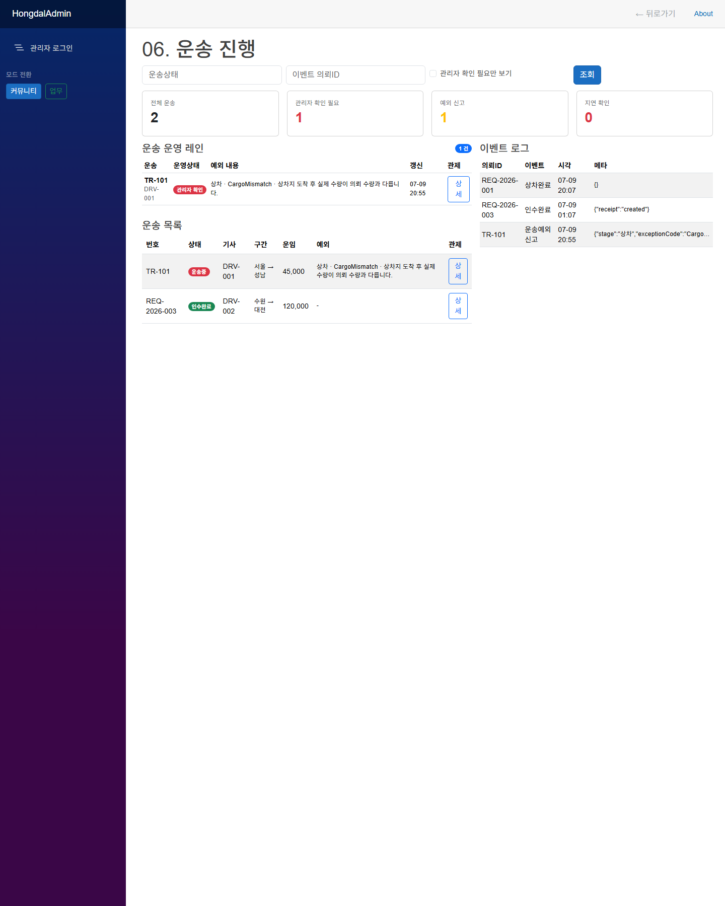

### SsalddelAdmin-P22 운송 상세

- 라우트: `/transports/{RequestId}`
- 역할: 운송 하나를 기준으로 상태, 기사, 화주, 증빙, 정산 연결을 본다.
- 캡처: `assets/v1-pages/P22-운송상세.png`

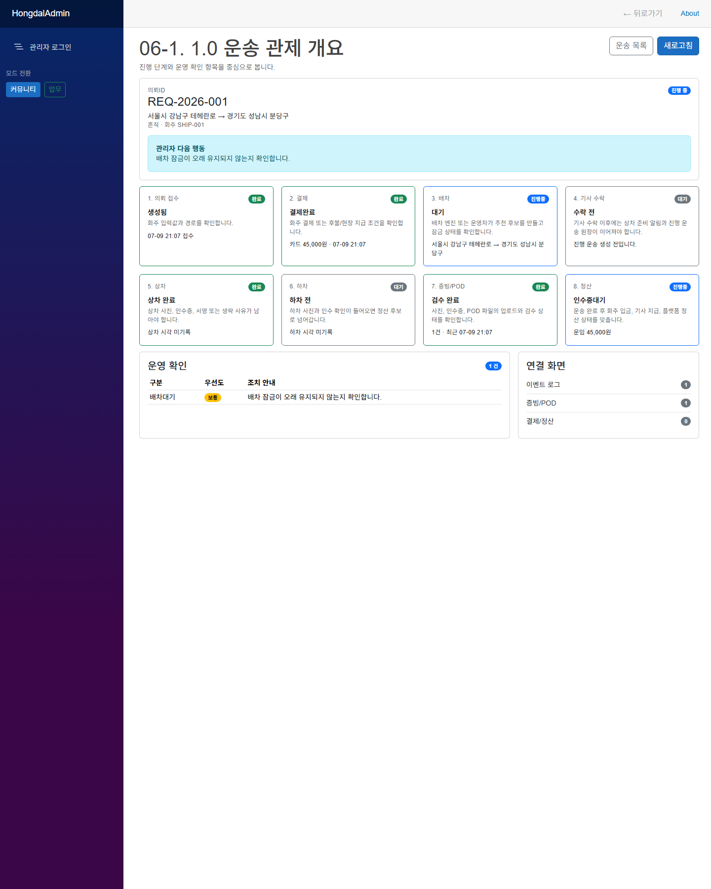

### SsalddelAdmin-P22-1 운송 이벤트

- 라우트: `/transports/{RequestId}/events`
- 역할: 수락, 거절, 만료, 상차, 하차, 예외 이벤트를 시간순 감사 기록으로 확인한다.
- 캡처: `assets/v1-pages/P22-1-운송이벤트.png`

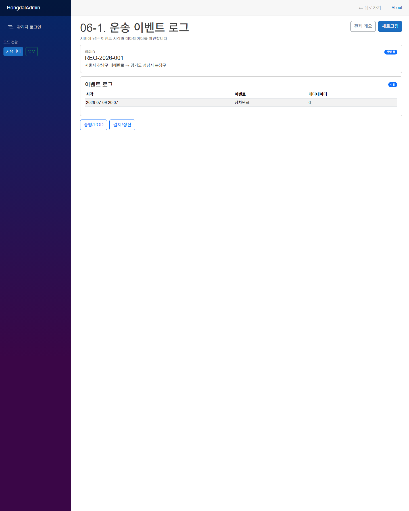

### SsalddelAdmin-P22-2 운송 증빙

- 라우트: `/transports/{RequestId}/proofs`
- 역할: 사진, POD, 인수증, 서명, 문서 연결을 운송 상세의 증빙 관점에서 확인한다.
- 캡처 예정: `assets/v1-pages/P22-2-운송증빙.png`

### SsalddelAdmin-P22-3 운송 정산

- 라우트: `/transports/{RequestId}/settlement`
- 역할: 하차 완료 후 입금 요청, 입금 완료, 기사 정산 후보를 운송 상세의 정산 관점에서 확인한다.
- 캡처 예정: `assets/v1-pages/P22-3-운송정산.png`

## 닫혀야 하는 2.0 루프

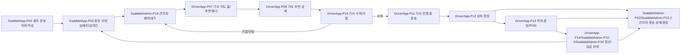
```mermaid
flowchart LR
    A["SsalddelApp-P02 화주 운송 의뢰 작성"] --> B["SsalddelApp-P03 화주 의뢰 상세/타임라인"]
    B --> C["SsalddelAdmin-P19 관리자 배차대기"]
    C --> D["DriverApp-P07 기사 지도 홈/추천 배너"]
    D --> E["DriverApp-P09 기사 추천 상세"]
    E --> F["DriverApp-P10 기사 수락/거절"]
    F -->|수락| G["DriverApp-P11 기사 진행 중 운송"]
    F -->|거절/만료| C
    G --> H["DriverApp-P12 상차 증빙"]
    H --> I["DriverApp-P13 하차 증빙/POD"]
    I --> J["DriverApp-P14/SsalddelAdmin-P22-3/SsalddelAdmin-P26 정산/입금 상태"]
    J --> B
    H --> K["SsalddelAdmin-P22/SsalddelAdmin-P22-2 관리자 운송 상세/증빙"]
    I --> K
    J --> K
```

## 화주 화면

화주 화면은 운송 의뢰를 만들고, 이후 상태를 한 화면에서 추적하는 것이 핵심이다. 화주는 기사 앱의 세부 작업을 직접 조작하지 않지만, 기사 수락, 상차 접근, 상차 완료, 하차 완료, 정산 상태가 자신의 의뢰에 어떻게 반영되는지는 확인할 수 있어야 한다.

| 번호 | 필수 화면 | 현재 라우트/파일 | 주 책임 | 연결 API/상태 | 현재 판정 |
| --- | --- | --- | --- | --- | --- |
| SsalddelApp-P01 | 화주 홈/업무 진입 | `/shipper`<br>`SsalddelApp/Components/Pages/Home.razor`<br>`/`는 `UnifiedHome.razor`의 역할 진입점 | 운송 의뢰, 의뢰 타임라인, 창고/판매 업무로 이동 | 서버 상태 요약, 최근 의뢰 | 라우트 확인 |
| SsalddelApp-P02 | 운송 의뢰 작성 | `/shipper/request` → `/cargo`<br>`/transport`<br>`/procedure`<br>`/review`<br>`SsalddelApp/Components/Pages/ShipperRequest*Page.razor` | 같은 공용 draft로 화물, 상하차, 차량·결제 조건을 단계별 확인해 의뢰 원장 등록을 요청 | `api/v1/shipper/requests` | 2.0 필수 |
| SsalddelApp-P02-1 | 운송 의뢰 대량 등록 | `/shipper/request/bulk`<br>`SsalddelApp/Components/Pages/ShipperBulkImport.razor` | 여러 의뢰를 한 번에 등록 | `api/v1/shipper/requests` 대량 등록 후보 | SsalddelApp-P02의 보조 화면 |
| SsalddelApp-P03 | 의뢰 상세/타임라인 | `/shipper/request/{RequestId}`<br>`SsalddelApp/Components/Pages/ShipperRequestDetail.razor` | 결제, 배차, 수락, 상차, 하차, POD, 정산 상태를 한 화면에서 확인 | `api/v1/shipper/requests`, `api/v1/payments`, 운송 이벤트 | 2.0 필수 |
| SsalddelApp-P03-1 | 결제/입금 안내 | 우선 SsalddelApp-P03 안에 포함 | 운송완료후정산, 가상계좌 입금대기, 1/3/7일 알림 상태 확인 | `api/v1/payments` | 상세 화면 안에서 먼저 닫고, 커지면 분리 |
| SsalddelApp-P03-2 | 예외/분쟁 확인 | 우선 SsalddelApp-P03 안에 포함 | 상차물건없음, 수량불일치, 하차지부재, 증빙업로드실패 같은 예외를 화주 관점에서 확인 | 운송 이벤트, 관리자 확인 상태 | 상세 화면 안에서 먼저 닫고, 커지면 분리 |

화주 앱에서 가장 먼저 완성해야 할 화면은 `의뢰 상세/타임라인`이다. 의뢰 작성 화면이 있어도 이후 상태가 보이지 않으면 2.0 워크플로우는 사용자가 체감하기 어렵다.

## 기사 화면

기사 화면은 지도 홈을 중심으로 두되, 추천 판단, 수락/거절, 상차, 하차, 정산은 각각 단일 책임 화면으로 분리한다. 운행 중 화면은 다음 행동을 알려주는 화면이지 모든 기능을 넣는 화면이 아니다.

| 번호 | 필수 화면 | 현재 라우트/파일 | 주 책임 | 연결 API/상태 | 현재 판정 |
| --- | --- | --- | --- | --- | --- |
| DriverApp-P06 | 운행 시작 | `/driver/work/start`<br>`DriverApp/Components/Pages/Driver/01_Work/운행시작Page.razor` | 기사 운행 상태 시작, 위치 송신 조건, 복귀/수익 선호 입력 | `api/v1/driver/work`, `api/v1/driver/shifts` | 2.0 필수 |
| DriverApp-P06-1 | 운행 설정 | `/driver/work/settings`<br>`DriverApp/Components/Pages/Driver/04_Settings/운행설정Page.razor` | 운행 조건과 선호 설정 | 운행 설정 API 후보 | DriverApp-P06의 보조 화면 |
| DriverApp-P07 | 지도 홈/추천 배너 | `/driver/home`<br>`DriverApp/Components/Pages/Home.razor` | 운행 중 지도, 신규 추천 배너, 현재 운송 진입 | 추천 수신, 위치 heartbeat(주기 송신), 현재 운송 | 2.0 필수 |
| DriverApp-P07-1 | 기사 업무 허브/요약 | `/driver/home/summary`<br>`DriverApp/Components/Pages/Driver/Home/기사홈Page.razor` | 지도 홈에서 들어가는 기사 업무 요약 | 기사 업무 요약 | DriverApp-P07의 보조 화면 |
| DriverApp-P08 | 추천 목록 | `/driver/recommendations`<br>`DriverApp/Components/Pages/Driver/02_Recommendation/추천목록Page.razor` | 현재 기사에게 노출된 추천 후보 목록 확인 | `api/v1/driver/recommendations` | 2.0 필수 보조 |
| DriverApp-P09 | 추천 상세 | `/driver/recommendations/{의뢰Id}`<br>`DriverApp/Components/Pages/Driver/02_Recommendation/추천상세Page.razor` | 상차지, 하차지, 운임, 업무 유형, 추가 시간, 경로 이점, 증빙 조건 확인 | `api/v1/driver/recommendations` | 2.0 필수 |
| DriverApp-P10 | 배차 처리 | Web `/driver/dispatch-decisions/{의뢰Id}`<br>`DriverApp/Components/Pages/Driver/02_Recommendation/배차처리Page.razor` | 수락, 거절, 보류, 수락 취소 같은 결정 명령 전송 | `api/v1/driver/dispatch-actions` | 2.0 필수 |
| DriverApp-P11 | 진행 중 운송 | `/driver/transports/current`<br>`DriverApp/Components/Pages/Driver/03_Progress/진행중운송Page.razor` | 현재 해야 할 다음 행동과 상차/하차 화면 진입 | `api/v1/driver/transports` | 2.0 필수 |
| DriverApp-P12 | 상차 화면 | `/driver/transports/{운송Id}/pickup`<br>`DriverApp/Components/Pages/Driver/03_Progress/상차Page.razor` | 상차 완료 사진, 인수증/서명, LCL/FCL 체크, 상차 예외 신고 | `api/v1/driver/transports`, `api/v1/files` | 2.0 필수 |
| DriverApp-P13 | 하차 화면 | `/driver/transports/{운송Id}/dropoff`<br>`DriverApp/Components/Pages/Driver/03_Progress/하차Page.razor` | 하차 완료 사진, POD, 인수 확인, 하차 예외 신고 | `api/v1/driver/transports`, `api/v1/files` | 2.0 필수 |
| DriverApp-P14 | 월정산 확인 | `/driver/settlements/current-month`<br>`DriverApp/Components/Pages/Driver/05_Settlement/월정산Page.razor` | 이번 운송이 얼마로, 언제, 어떤 증빙 기준으로 정산되는지 확인 | `api/v1/driver/settlements` | 2.0 신뢰 필수 |
| DriverApp-P14-1 | 이용료/정산 정책 안내 | `/driver/settlements/info`<br>`DriverApp/Components/Pages/Driver/05_Settlement/이용료안내Page.razor` | 이용료, 수수료, 정산 기준을 확인 | 정산 정책, 이용료 안내 | DriverApp-P14의 보조 화면 |
| DriverApp-P15 | 알림함 | `/driver/notifications`<br>`DriverApp/Components/Pages/Driver/06_Notification/알림함Page.razor` | 추천 수신, 수락 후 안내, 입금 알림, 실패 알림 확인 | `api/v1/driver/notifications` | 보조 필수 |
| DriverApp-P15-1 | 알림 설정 | `/driver/notifications/settings`<br>`DriverApp/Components/Pages/Driver/04_Settings/알림설정Page.razor` | 알림톡, FCM, 앱 내 알림 수신 기준 설정 | 알림 설정 | DriverApp-P15의 보조 화면 |
| DriverApp-P15-2 | 푸시 설정 | `/driver/notifications/push`<br>`DriverApp/Components/Pages/Driver/06_Notification/푸시설정Page.razor` | 기기 푸시 권한과 푸시 토큰 상태 확인 | FCM/푸시 토큰 | DriverApp-P15의 보조 화면 |

기사 화면에서 가장 중요한 원칙은 운행 중 부담을 줄이는 것이다. 추천 배너는 짧게, 추천 상세는 판단에 필요한 정보만, 상차/하차 화면은 증빙과 예외 신고만 책임진다.

## 관리자 화면

관리자 화면은 정상 흐름을 대신 조작하는 화면이 아니라, 상태가 막혔을 때 원인과 책임 경계를 볼 수 있는 화면이다. 2.0에서는 배차대기, 운송 진행, 증빙, 결제/정산, 예외 이벤트가 서로 연결되어야 한다.

| 번호 | 필수 화면 | 현재 라우트/파일 | 주 책임 | 연결 API/상태 | 현재 판정 |
| --- | --- | --- | --- | --- | --- |
| SsalddelAdmin-P16 | 운영 대시보드 | `/dashboard`<br>`SsalddelAdmin/Components/Pages/Dashboard.razor` | 2.0 핵심 지표와 막힌 상태 요약 | `api/v1/admin/dashboard` | 라우트 확인 |
| SsalddelAdmin-P17 | 의뢰 목록 | `/requests`<br>`SsalddelAdmin/Components/Pages/Requests.razor` | 화주 의뢰 목록과 상세 진입 | `api/v1/shipper/requests` 또는 관리자 조회 | 2.0 필수 |
| SsalddelAdmin-P18 | 의뢰 상세 | `/requests/{RequestId}`<br>`SsalddelAdmin/Components/Pages/RequestDetail.razor` | 의뢰 원문, 결제 조건, 배차 연결 상태 확인 | 의뢰 원장, 결제 원장 | 2.0 필수 |
| SsalddelAdmin-P19 | 배차대기 | `/dispatch/wait`<br>`SsalddelAdmin/Components/Pages/DispatchWait.razor` | 배차대기, 추천중, 후보부족, 잠금 상태 확인 | `api/v1/dispatch/wait` | 2.0 필수 |
| SsalddelAdmin-P20 | 기사 운행 현황 | `/drivers/operating`<br>`SsalddelAdmin/Components/Pages/DriverOperatingView.razor` | 운행 중 기사, 위치 최신성, 추천 가능 상태 확인 | `api/v1/admin/drivers/operating` | 2.0 필수 보조 |
| SsalddelAdmin-P21 | 운송 목록 | `/transports`<br>`SsalddelAdmin/Components/Pages/Transports.razor` | 진행 중/완료 운송 목록 확인 | `api/v1/admin/transports` | 2.0 필수 |
| SsalddelAdmin-P22 | 운송 상세 | `/transports/{RequestId}`<br>`SsalddelAdmin/Components/Pages/TransportWorkflowDetail.razor` | 운송 단계, 기사, 화주, 수령자, 현재 상태를 한 화면에서 확인 | `api/v1/admin/transports` | 2.0 필수 |
| SsalddelAdmin-P22-1 | 운송 이벤트 | `/transports/{RequestId}/events`<br>`SsalddelAdmin/Components/Pages/TransportWorkflowEvents.razor` | 수락, 거절, 만료, 상차, 하차, 예외 이벤트 감사 | `api/v1/transport-events` | SsalddelAdmin-P22의 세부 화면 |
| SsalddelAdmin-P22-2 | 운송 증빙 | `/transports/{RequestId}/proofs`<br>`SsalddelAdmin/Components/Pages/TransportWorkflowProofs.razor` | 사진, POD, 인수증, 서명, 문서 연결 확인 | `api/v1/admin/documents`, `api/v1/admin/files/pod` | SsalddelAdmin-P22의 세부 화면 |
| SsalddelAdmin-P22-3 | 운송 정산 | `/transports/{RequestId}/settlement`<br>`SsalddelAdmin/Components/Pages/TransportWorkflowSettlement.razor` | 기사 정산 후보, 화주 입금 상태, 입금 알림 상태 확인 | `api/v1/payments`, 정산 서비스 | SsalddelAdmin-P22의 세부 화면 |
| SsalddelAdmin-P26 | 결제 목록 | `/payments`<br>`SsalddelAdmin/Components/Pages/Payments.razor` | 가상계좌 입금대기, 입금완료 확인 | `api/v1/payments` | 2.0 필수 |
| SsalddelAdmin-P26-1 | 정산 목록 | `/settlements`<br>`SsalddelAdmin/Components/Pages/Settlements.razor` | 기사 정산 예정/완료 확인 | 정산 API | SsalddelAdmin-P26의 보조 화면 |
| SsalddelAdmin-P27 | 문서 목록 | `/documents`<br>`SsalddelAdmin/Components/Pages/Documents.razor` | POD와 인수증 문서 보관 상태 확인 | `api/v1/admin/documents` | 2.0 필수 보조 |
| SsalddelAdmin-P27-1 | 문서 업로드 | `/documents/upload`<br>`SsalddelAdmin/Components/Pages/DocumentUpload.razor` | 증빙 문서 업로드 | 문서 업로드 API | SsalddelAdmin-P27의 세부 화면 |
| SsalddelAdmin-P27-2 | 문서 정책 목록 | `/documents/policies`<br>`SsalddelAdmin/Components/Pages/DocumentPolicies.razor` | 문서 종류별 보관, 서명, 다운로드 정책 확인 | 문서 정책 | SsalddelAdmin-P27의 세부 화면 |
| SsalddelAdmin-P27-3 | 문서 정책 상세 | `/documents/policies/{DocumentCode}`<br>`SsalddelAdmin/Components/Pages/DocumentPolicyDetail.razor` | 문서 코드별 세부 정책 확인 | 문서 정책 | SsalddelAdmin-P27의 세부 화면 |
| SsalddelAdmin-P27-4 | 문서 조회 로그 | `/documents/logs`<br>`SsalddelAdmin/Components/Pages/DocumentLogs.razor` | 누가 언제 문서/POD를 봤는지 확인 | 조회 로그 | SsalddelAdmin-P27의 세부 화면 |
| SsalddelAdmin-P27-5 | 파일/POD 관리 | `/files/pod`<br>`SsalddelAdmin/Components/Pages/FilesPod.razor` | POD 파일 상태와 원본 보호 정책 확인 | `api/v1/admin/files/pod` | SsalddelAdmin-P27의 세부 화면 |

관리자 화면은 `운송 상세`를 중심으로 다른 화면이 연결되는 형태가 좋다. 배차대기에서 들어와도, 의뢰 목록에서 들어와도, 증빙 목록에서 들어와도 결국 같은 운송 원장을 보게 해야 한다.

## 수령자와 공개 확인 화면

2.0 최소 운영에서는 수령자 전용 앱 화면을 필수 릴리즈 범위로 두지 않아도 된다. 다만 하차 완료와 POD가 분쟁 방지에 중요하므로, 다음 중 하나는 필요하다.

| 방식 | 화면 | 처리 기준 |
| --- | --- | --- |
| 최소 방식 | SsalddelApp-P03 화주 의뢰 상세와 SsalddelAdmin-P22-2 관리자 운송 증빙에서 확인 | 수령자 직접 확인 없이 기사 증빙과 화주 확인으로 닫는다. |
| 확장 방식 | Public-P28 공개 POD 확인 화면 또는 수령자 확인 링크 | 수령자가 하차 사진, 인수 상태, 이의 제기를 직접 확인한다. |

초기에는 최소 방식으로 닫고, 수령자 직접 확인이 필요해지는 순간 별도 공개 화면으로 분리한다.

## 화면 간 상태 반영 계약

한 화면에서 상태가 바뀌면 다른 앱의 화면도 같은 원장을 다시 읽어야 한다.

| 상태 변경 | 조작 화면 | 반드시 반영되어야 하는 화면 | 비고 |
| --- | --- | --- | --- |
| 운송 의뢰 등록 | SsalddelApp-P02 화주 운송 의뢰 작성 | SsalddelApp-P03 화주 의뢰 상세, SsalddelAdmin-P17 관리자 의뢰 목록, SsalddelAdmin-P19 관리자 배차대기, DriverApp-P08/DriverApp-P09 기사 추천 후보 | 등록 직후 화주는 타임라인을 볼 수 있어야 한다. |
| 기사 추천 노출 | 서버 배차대기/추천 처리 | DriverApp-P07 기사 지도 홈 배너, DriverApp-P08/DriverApp-P09 기사 추천 목록/상세, SsalddelAdmin-P19 관리자 배차대기 | 추천 잠금 중에는 같은 의뢰를 다른 기사에게 중복 추천하지 않는다. |
| 기사 수락 | DriverApp-P10 기사 배차 처리 | DriverApp-P11 기사 진행 중 운송, SsalddelApp-P03 화주 의뢰 상세, SsalddelAdmin-P22 관리자 운송 상세, SsalddelAdmin-P22-1 관리자 운송 이벤트 | 수락 즉시 화주에게 상차 준비 알림 후보가 생긴다. |
| 기사 거절/만료 | DriverApp-P10 기사 배차 처리 또는 타임아웃 | DriverApp-P08/DriverApp-P09 기사 추천 화면 제거, SsalddelAdmin-P22-1 관리자 이벤트, SsalddelAdmin-P19 배차대기 재추천 상태, SsalddelApp-P03 화주 의뢰 상세 | 화주에게는 불필요한 세부 거절 사유를 과노출하지 않는다. |
| 상차 완료 | DriverApp-P12 기사 상차 화면 | DriverApp-P11 기사 진행 중 운송, SsalddelApp-P03 화주 의뢰 상세, SsalddelAdmin-P22/SsalddelAdmin-P22-2 관리자 운송 상세/증빙 | 사진 업로드 성공 이후에만 상차 완료로 전이한다. |
| 상차 예외 | DriverApp-P12 기사 상차 화면 | SsalddelAdmin-P22-1 관리자 이벤트/예외 확인, SsalddelApp-P03 화주 의뢰 상세 경고 | 물건없음, 수량불일치, 담당자부재는 업무 상태가 달라지는 사건이다. |
| 하차 완료 | DriverApp-P13 기사 하차 화면 | SsalddelApp-P03 화주 의뢰 상세, SsalddelAdmin-P22/SsalddelAdmin-P22-2/SsalddelAdmin-P22-3 관리자 운송 상세/증빙/정산, DriverApp-P14 기사 정산 확인 | 사진 업로드와 POD 연결 뒤 완료로 전이한다. |
| 입금 요청/입금 완료 | SsalddelAdmin-P22-3/SsalddelAdmin-P26 정산 이벤트/결제 API | SsalddelApp-P03 화주 의뢰 상세, DriverApp-P14 기사 정산 확인, SsalddelAdmin-P22-3/SsalddelAdmin-P26/SsalddelAdmin-P26-1 관리자 운송 정산/결제 목록 | 운송완료후정산은 1일/3일/7일 알림 예약을 가진다. |

## 구현 우선순위

| 순위 | 화면 묶음 | 완료 기준 |
| --- | --- | --- |
| 1 | 화주 의뢰 상세/타임라인 | 화주가 한 화면에서 결제, 배차, 수락, 상차, 하차, 정산 상태를 확인한다. |
| 2 | 기사 지도 홈, 추천 상세, 배차 처리 | 추천 배너, 제한 시간, 수락/거절 후 화면 전환과 서버 상태 변경이 맞는다. |
| 3 | 기사 상차/하차 증빙과 예외 신고 | 사진 업로드 성공 후 상태 전이, 실패 시 재시도/임시 안내, 현장 예외 코드가 남는다. |
| 4 | 관리자 운송 상세, 이벤트, 증빙, 정산 | 운영자가 의뢰 하나를 기준으로 모든 상태와 증빙, 결제 상태를 추적한다. |
| 5 | 기사 정산 확인과 화주 입금 안내 | 기사에게 운임, 추가수당, 정산 예정일, 입금완료 상태가 보인다. |
| 6 | 수령자 공개 확인 | 필요 시 POD 확인 링크와 이의 제기 흐름을 분리한다. |

## 페이지별 필요 이유, 보안, 관계

이 표는 SsalddelApp-P01부터 Public-P28까지를 구현할 때 단순히 화면이 있는지만 보지 않기 위한 기준이다. 각 페이지는 왜 필요한지, 민감정보와 증빙이 안전하게 다뤄지는지, 어떤 다른 페이지와 유스케이스를 주고받는지를 함께 확인한다.

보안 항목은 현재 구현 완료 여부가 아니라 페이지를 완성할 때 반드시 확인할 점이다. 주소, 연락처, 위치, 사진, POD, 인수증, 결제, 정산, 관리자 감사 기록은 기본적으로 역할 기반 권한, 전송 구간 암호화, 저장 시 암호화 또는 마스킹, 조회 로그를 검토해야 한다.

| 번호 | 왜 필요한가 | 보안/암호화 확인 | 관계 페이지·유스케이스 |
| --- | --- | --- | --- |
| SsalddelApp-P01 | 화주가 2.0 업무로 들어가는 관문이다. 최근 의뢰와 다음 행동을 보여주되 직접 상태 변경은 하지 않는다. | 홈 요약에는 상세 주소, 연락처, 증빙 원본을 노출하지 않는다. 사용자별 의뢰만 조회되는지 확인한다. | SsalddelApp-P02 운송 의뢰 작성, SsalddelApp-P03 의뢰 상세, 운송의뢰조회 |
| SsalddelApp-P02 | 운송 의뢰 원장을 생성하는 화면이다. 여기서 입력된 화물, 상하차, 결제 조건이 이후 배차와 증빙의 기준이 된다. | 주소, 연락처, 결제 조건, 화물 특이사항은 전송 구간 암호화와 서버 권한 검증이 필요하다. 금액과 결제 조건은 클라이언트 값을 그대로 신뢰하지 않는다. | SsalddelApp-P02-1, SsalddelApp-P03, SsalddelAdmin-P17, SsalddelAdmin-P19, DriverApp-P08/DriverApp-P09, 운송의뢰등록, 배차대기생성 |
| SsalddelApp-P02-1 | 운송 의뢰를 대량 등록하는 보조 화면이다. 같은 원장 생성 책임을 가지지만 입력 단위가 여러 건이다. | 파일 업로드, 대량 주소, 연락처, 금액 정보가 포함될 수 있으므로 파일 검증과 행별 권한 검증이 필요하다. | SsalddelApp-P02, SsalddelApp-P03, 대량운송의뢰등록 |
| SsalddelApp-P03 | 화주가 전체 진행 상태를 한 화면에서 확인하는 기준 화면이다. 상태가 보이지 않으면 운송이 진행되어도 신뢰가 생기기 어렵다. | 역할별 마스킹이 필요하다. 기사 연락처, 상세주소, POD, 결제 정보는 화주 권한과 의뢰 소유권을 확인한 뒤 노출한다. | SsalddelApp-P02, SsalddelApp-P03-1, SsalddelApp-P03-2, DriverApp-P10, DriverApp-P12, DriverApp-P13, SsalddelAdmin-P22-3/SsalddelAdmin-P26, 운송상태조회 |
| SsalddelApp-P03-1 | 운송완료후정산, 가상계좌, 입금 요청 알림을 화주가 이해하고 처리하게 하는 화면이다. | 결제 키, 가상계좌, 입금자 정보는 마스킹한다. 결제 승인과 콜백은 서버에서 서명, 금액, 대상 의뢰를 재검증한다. | SsalddelApp-P03, SsalddelAdmin-P22-3, SsalddelAdmin-P26, 결제준비, 결제승인, 입금요청알림 |
| SsalddelApp-P03-2 | 현장 예외와 분쟁 가능성을 화주가 확인하고 다음 행동을 정하게 하는 화면이다. | 예외 사진과 메모에는 개인정보가 섞일 수 있으므로 원본 접근 권한과 다운로드 권한을 분리한다. 조회 로그를 남긴다. | SsalddelApp-P03, DriverApp-P12, DriverApp-P13, SsalddelAdmin-P22-1, SsalddelAdmin-P22-2, 운송문제신고 |
| DriverApp-P06 | 기사가 운행을 시작하고 서버가 추천 후보로 볼 수 있게 만드는 화면이다. | 위치 정보 수집 동의, 운행 중 위치 송신 범위, 보관 기간을 명확히 한다. 위치 데이터는 기사 본인, 배차 엔진, 관리자 최소 범위로 제한한다. | DriverApp-P06-1, DriverApp-P07, SsalddelAdmin-P20, 배차후보선정, 기사위치갱신 |
| DriverApp-P06-1 | 운행 조건과 선호를 조정하는 보조 화면이다. | 위치 송신, 복귀 선호, 수익 선호 같은 설정은 기사 본인의 의사로만 바뀌어야 한다. | DriverApp-P06, 운행설정 |
| DriverApp-P07 | 기사 지도 홈에서 추천 수신과 현재 운송 진입을 담당한다. 지도 홈이 과부하되면 운행 중 판단 비용이 커진다. | 추천 배너에는 민감 상세주소를 과노출하지 않는다. 잠금된 추천은 해당 기사에게만 보여야 한다. | DriverApp-P07-1, DriverApp-P08, DriverApp-P09, DriverApp-P11, DriverApp-P15, 추천노출, 추천만료 |
| DriverApp-P07-1 | 지도 홈에서 들어가는 업무 허브/요약 보조 화면이다. | 홈 요약에는 민감 상세주소와 타 기사 정보를 과노출하지 않는다. | DriverApp-P07, DriverApp-P08, DriverApp-P11, DriverApp-P14, 기사업무요약 |
| DriverApp-P08 | 현재 기사에게 노출된 추천 목록을 보여준다. 추천이 여러 건일 때 우선순위와 잠금 상태를 구분하게 한다. | 추천 목록은 기사 본인에게 배정 또는 추천된 건만 조회한다. 다른 기사 추천 상태를 노출하지 않는다. | DriverApp-P07, DriverApp-P09, DriverApp-P10, SsalddelAdmin-P19, 추천목록조회 |
| DriverApp-P09 | 기사에게 수락 판단에 필요한 운임, 시간, 경로, 업무 유형을 제공한다. | 수락 전에는 필요한 최소 정보만 보여준다. 상세 연락처와 민감 요청사항은 수락 이후 노출하는 정책을 확인한다. | DriverApp-P08, DriverApp-P10, DriverApp-P11, 배차추천평가, 운송일정삽입평가 |
| DriverApp-P10 | 수락, 거절, 보류, 수락 취소처럼 배차 상태를 바꾸는 결정 화면이다. | 중복 수락, 만료 후 수락, 다른 기사 요청 위조를 서버에서 차단한다. 결정 이벤트와 사유는 감사 로그로 남긴다. | DriverApp-P09, DriverApp-P11, SsalddelAdmin-P19, SsalddelAdmin-P22, SsalddelAdmin-P22-1, 배차수락, 배차거절, 추천잠금 |
| DriverApp-P11 | 기사가 지금 해야 할 작업을 확인하고 상차 또는 하차 화면으로 들어가는 진행 중심 화면이다. | 현재 운송 건 접근 권한을 확인한다. 다른 기사 운송 건으로 URL을 바꿔 접근할 수 없어야 한다. | DriverApp-P10, DriverApp-P12, DriverApp-P13, DriverApp-P07, 현재운송조회 |
| DriverApp-P12 | 상차 완료 증빙과 상차 예외를 남기는 화면이다. 상차 사진이 성공적으로 저장되어야 상태 전이가 안전하다. | 사진, 인수증, 서명은 저장 시 암호화 또는 보호 저장소 정책을 확인한다. 업로드 실패 시 임시 저장과 재시도 정책을 둔다. | DriverApp-P11, DriverApp-P13, SsalddelAdmin-P22-1, SsalddelAdmin-P22-2, 운송상차완료, 운송문제신고 |
| DriverApp-P13 | 하차 완료, POD, 인수 확인, 하차 예외를 닫는 화면이다. 운송 완료와 정산 후보가 여기서 시작된다. | 하차 사진과 POD는 민감 증빙이다. 원본 조회 권한, 다운로드 권한, 보관 기간, 조회 로그를 분리한다. | DriverApp-P11, DriverApp-P14, SsalddelAdmin-P22-1, SsalddelAdmin-P22-2, SsalddelAdmin-P22-3, 운송인수완료, 입금요청생성 |
| DriverApp-P14 | 기사에게 정산 신뢰를 주는 화면이다. 얼마를 언제 받을지 알 수 있어야 다음 운송 수락에도 영향을 준다. | 계좌, 정산 금액, 수수료, 입금 상태는 본인 기사만 조회한다. 계좌번호는 마스킹한다. | DriverApp-P13, DriverApp-P14-1, DriverApp-P15, SsalddelAdmin-P22-3/SsalddelAdmin-P26, 기사정산조회 |
| DriverApp-P14-1 | 정산 기준과 이용료를 안내하는 보조 화면이다. | 요율과 약관은 최신 정책을 기준으로 서버에서 내려주는 값과 일치해야 한다. | DriverApp-P14, 정산정책조회 |
| DriverApp-P15 | 추천, 수락 후 안내, 접근 알림, 입금 알림, 실패 알림을 한 곳에서 확인하게 한다. | 알림에는 민감정보를 최소화한다. 푸시 토큰과 알림 수신 설정은 사용자별로 보호하고, 알림 발송 이력을 남긴다. | DriverApp-P07, DriverApp-P10, DriverApp-P12, DriverApp-P13, DriverApp-P14, DriverApp-P15-1, DriverApp-P15-2, 알림발송, 알림설정 |
| DriverApp-P15-1 | 알림 수신 채널과 선호를 설정하는 보조 화면이다. | 알림톡, FCM, 앱 내 알림 설정은 사용자별 권한으로 보호한다. | DriverApp-P15, 알림설정 |
| DriverApp-P15-2 | 푸시 토큰과 기기 권한을 확인하는 보조 화면이다. | 푸시 토큰은 민감한 식별자로 보고 저장, 갱신, 폐기 기준을 둔다. | DriverApp-P15, 푸시토큰관리 |
| SsalddelAdmin-P16 | 운영자가 막힌 상태를 빠르게 보는 대시보드다. 상세 처리는 각 전용 화면으로 넘긴다. | 대시보드에는 최소 요약만 노출한다. 관리자 역할별로 금액, 연락처, 증빙 접근 범위를 나눈다. | SsalddelAdmin-P17, SsalddelAdmin-P19, SsalddelAdmin-P21, SsalddelAdmin-P22-3/SsalddelAdmin-P26, 운영요약조회 |
| SsalddelAdmin-P17 | 관리자 의뢰 목록이다. 화주 의뢰가 배차와 운송으로 잘 이어지는지 운영자가 추적한다. | 목록에서는 상세주소와 연락처를 마스킹한다. 조회 가능한 관리자 역할을 제한한다. | SsalddelAdmin-P18, SsalddelAdmin-P19, SsalddelAdmin-P22, 의뢰관리조회 |
| SsalddelAdmin-P18 | 관리자 의뢰 상세다. 의뢰 원문, 결제 조건, 배차 연결 상태를 함께 확인한다. | 화주 입력 원문에는 민감정보가 포함된다. 상세 조회 권한과 조회 로그가 필요하다. | SsalddelAdmin-P17, SsalddelAdmin-P19, SsalddelAdmin-P22, SsalddelAdmin-P26, 의뢰상세조회 |
| SsalddelAdmin-P19 | 배차대기와 추천 잠금 상태를 운영자가 보는 화면이다. 중복 추천과 후보 부족을 다룬다. | 추천 잠금, 후보 기사 정보는 운영 목적 범위로만 노출한다. 수동 조정은 관리자 감사 로그를 남긴다. | SsalddelApp-P02, DriverApp-P08/DriverApp-P09, DriverApp-P10, SsalddelAdmin-P20, 배차대기조회, 재추천 |
| SsalddelAdmin-P20 | 운행 중 기사 위치와 추천 가능 상태를 운영자가 확인하는 화면이다. | 위치 정보는 가장 민감한 데이터 중 하나다. 실시간 위치 조회 권한, 보관 기간, 목적 외 사용 방지 기준을 둔다. | DriverApp-P06, DriverApp-P07, SsalddelAdmin-P19, 기사운행현황조회 |
| SsalddelAdmin-P21 | 운송 목록이다. 진행 중, 완료, 예외 운송을 단계별로 찾고 상세로 들어간다. | 목록에는 최소 식별 정보만 노출한다. 상태 필터와 권한을 같이 적용한다. | SsalddelAdmin-P22, SsalddelAdmin-P22-1, SsalddelAdmin-P22-2, SsalddelAdmin-P22-3, 운송목록조회 |
| SsalddelAdmin-P22 | 운송 하나의 중심 상세 화면이다. 상태, 기사, 화주, 증빙, 정산을 연결한다. | 여러 민감정보가 모이는 화면이므로 역할별 섹션 권한이 필요하다. 조회 로그와 관리자 행위 로그를 남긴다. | SsalddelAdmin-P21, SsalddelAdmin-P22-1, SsalddelAdmin-P22-2, SsalddelAdmin-P22-3, 운송상세조회 |
| SsalddelAdmin-P22-1 | 운송 이벤트 감사 화면이다. 수락, 거절, 만료, 상차, 하차, 예외를 시간순으로 설명한다. | 이벤트 사유와 메모는 변조되면 안 된다. 사후 수정 제한, 원본 보존, 감사 로그를 확인한다. | DriverApp-P10, DriverApp-P12, DriverApp-P13, SsalddelAdmin-P22, 운송이벤트조회 |
| SsalddelAdmin-P22-2 | 운송 증빙 화면이다. 사진, POD, 인수증, 서명, 문서 조회를 다룬다. | 증빙 파일은 암호화 저장, 접근 권한, 다운로드 권한, 워터마크 또는 조회 로그를 검토한다. | DriverApp-P12, DriverApp-P13, SsalddelAdmin-P22, SsalddelAdmin-P27, 증빙조회, 문서관리 |
| SsalddelAdmin-P22-3 | 운송 정산 상세다. 하차 완료 후 입금 요청, 입금 완료, 기사 정산 후보를 연결한다. | 정산 금액, 계좌, 입금 상태는 역할별로 분리한다. 금액 변경과 정산 완료 처리는 감사 로그를 남긴다. | SsalddelApp-P03, DriverApp-P13, DriverApp-P14, SsalddelAdmin-P26, 운송완료입금요청, 정산후보생성 |
| SsalddelAdmin-P26 | 결제 목록이다. 결제대기와 입금완료를 운영자가 관리한다. | 결제 식별자, 가상계좌, 계좌 정보, 영수증은 마스킹한다. 결제 상태 변경은 서버 검증과 로그가 필요하다. | SsalddelApp-P03-1, SsalddelAdmin-P22-3, 결제조회 |
| SsalddelAdmin-P26-1 | 정산 목록이다. 정산예정과 정산완료를 운영자가 관리한다. | 정산 금액, 계좌, 수수료 정보는 역할별로 분리한다. 정산 완료 처리는 감사 로그를 남긴다. | DriverApp-P14, SsalddelAdmin-P22-3, 정산관리 |
| SsalddelAdmin-P27 | 문서 목록 화면이다. 문서 보관 상태와 상세 진입을 담당한다. | 문서 종류별 암호화, 다운로드 허용, 보관 기간, 서명 필요 여부를 확인한다. | SsalddelAdmin-P22-2, SsalddelAdmin-P27-1, SsalddelAdmin-P27-2, SsalddelAdmin-P27-4, 문서관리 |
| SsalddelAdmin-P27-1 | 문서 업로드 화면이다. | 업로드 파일 검증, 바이러스 검사, 문서 유형 검증, 권한 검사를 둔다. | SsalddelAdmin-P27, 문서업로드 |
| SsalddelAdmin-P27-2 | 문서 정책 목록 화면이다. | 정책 수정 권한과 정책 변경 로그를 관리한다. | SsalddelAdmin-P27, SsalddelAdmin-P27-3, 문서정책 |
| SsalddelAdmin-P27-3 | 문서 정책 상세 화면이다. | 문서 코드별 보관 기간, 다운로드 제한, 서명 필요 여부를 변경할 때 감사 로그를 남긴다. | SsalddelAdmin-P27-2, 문서정책상세 |
| SsalddelAdmin-P27-4 | 문서 조회 로그 화면이다. | 조회자, 조회 시간, 다운로드 여부는 변조되지 않는 감사 기록으로 관리한다. | SsalddelAdmin-P27, 문서조회로그 |
| SsalddelAdmin-P27-5 | 파일/POD 관리 화면이다. | POD 원본 접근, 썸네일, 다운로드 권한을 분리한다. | SsalddelAdmin-P22-2, SsalddelAdmin-P27, 파일POD관리 |
| Public-P28 | 공개 POD 확인 확장 화면이다. 수령자가 직접 확인해야 할 때만 별도 공개 링크로 둔다. | 공개 링크는 만료 시간, 일회성 토큰, 최소 정보 노출, 다운로드 제한이 필요하다. | DriverApp-P13, SsalddelAdmin-P22-2, SsalddelApp-P03, 공개POD조회, 이의제기 |

## 순서별 코드 검증표

이 표는 각 페이지를 완성할 때 따라갈 실제 작업 순서다. 한 줄을 처리할 때는 먼저 클라이언트 페이지가 어떤 서비스나 API를 부르는지 보고, 그 다음 서버 Controller(컨트롤러)와 Application/Service 계층이 같은 상태 전이를 처리하는지 확인한다.

| 번호 | 검증할 페이지 | 클라이언트 코드 | 서버/API 연결 | 검증 포인트 |
| --- | --- | --- | --- | --- |
| SsalddelApp-P01 | 화주 홈/업무 진입 | `SsalddelApp/Components/Pages/Home.razor`<br>`SsalddelApp/Services/ShipperRoutes.cs` | `ServerBackedShipperOperationsService`의 `api/v1/shipper/requests` 조회 | 최근 의뢰에서 SsalddelApp-P03으로 이동하고, 홈이 직접 상태 변경을 하지 않는지 확인 |
| SsalddelApp-P02 | 운송 의뢰 작성 | `ShipperRequestCargoPage.razor` 등 네 단계 route<br>`ShipperRequestAuthoringPageViewModel`<br>`ServerBackedShipperOperationsService.AddRequestAsync` | `화주운송의뢰Controller`<br>`api/v1/shipper/requests` | 네 단계가 같은 draft·validation을 사용하고 등록 후 같은 의뢰 ID 상세로 이동하며 등록만으로 자동 배차·계약·결제를 확정하지 않는지 확인 |
| SsalddelApp-P02-1 | 운송 의뢰 대량 등록 | `ShipperBulkImport.razor` | 대량 등록 API 후보 | 여러 의뢰 생성 시 행별 검증과 실패 행 안내가 분리되는지 확인 |
| SsalddelApp-P03 | 의뢰 상세/타임라인 | `ShipperRequestDetail.razor`<br>`ServerBackedShipperOperationsService.GetRequestAsync` | `api/v1/shipper/requests/{id}`<br>`api/v1/payments` | 결제, 배차, 수락, 상차, 하차, 정산 상태가 한 화면에서 끊기지 않는지 확인 |
| SsalddelApp-P03-1 | 결제/입금 안내 | 우선 SsalddelApp-P03 내부 섹션 | `화주결제Controller`<br>`토스결제준비CommandHandler`<br>`토스결제승인CommandHandler` | 운송완료후정산, 가상계좌/결제대기, 1/3/7일 알림 상태를 화주가 이해할 수 있는지 확인 |
| SsalddelApp-P03-2 | 예외/분쟁 확인 | 우선 SsalddelApp-P03 내부 섹션 | `운송이벤트Controller`<br>`운송문제신고CommandHandler` | 기사 예외 신고가 화주에게 다음 행동 중심으로 보이는지 확인 |
| DriverApp-P06 | 운행 시작 | `운행시작Page.razor`<br>`DriverWorkApiService` | `기사운행Controller`<br>`api/v1/driver/work/start`, `/location`, `/stop` | 운행 시작 뒤 위치 heartbeat(주기 송신)와 기사 상태 Store(상태 저장소)가 갱신되는지 확인 |
| DriverApp-P06-1 | 운행 설정 | `운행설정Page.razor` | 운행 설정 API 후보 | 운행 설정이 기사 위치 송신과 추천 후보 판단에 반영되는지 확인 |
| DriverApp-P07 | 지도 홈/추천 배너 | `DriverApp/Components/Pages/Home.razor`<br>`SampleDriverRecommendationNotificationService` | `api/v1/driver/recommendations` 또는 FCM/SignalR/폴링 확장 | 신규 추천 배너, 60초 응답 제한, 현재 운송 진입이 분리되어 있는지 확인 |
| DriverApp-P07-1 | 기사 업무 허브/요약 | `기사홈Page.razor` | 기사 업무 요약 API 후보 | 지도 홈과 요약 허브가 서로 중복 상태 변경을 하지 않는지 확인 |
| DriverApp-P08 | 추천 목록 | `추천목록Page.razor`<br>`ServerBackedDriverSampleDataService` | `기사배차추천Controller`<br>`api/v1/driver/recommendations` | 현재 기사에게 노출된 추천만 보이고, 추천 잠금 상태와 충돌하지 않는지 확인 |
| DriverApp-P09 | 추천 상세 | `추천상세Page.razor` | `기사배차추천Controller`<br>`배차추천평가Service`<br>`운송일정삽입평가Service` | 운임, 추가 시간, 경로 이점, 업무 유형, 증빙 조건이 판단 가능하게 보이는지 확인 |
| DriverApp-P10 | 배차 처리 | `배차처리Page.razor`<br>`DriverRecommendationDecisionService` | `기사배차액션Controller`<br>`배차수락CommandHandler`<br>`배차거절CommandHandler` | 수락/거절/만료 후 추천 잠금, 재추천, 화주/관리자 이벤트가 맞는지 확인 |
| DriverApp-P11 | 진행 중 운송 | `진행중운송Page.razor`<br>`ServerBackedDriverSampleDataService` | `기사운송진행Controller`<br>`api/v1/driver/transports` | 다음 행동이 상차인지 하차인지 명확하고, 홈이 아닌 전용 화면에서 진행되는지 확인 |
| DriverApp-P12 | 상차 화면 | `상차Page.razor`<br>`DriverTransportCompletionPhotoService`<br>`DriverTransportExceptionService` | `api/v1/driver/transports/{id}/pickup-complete`<br>`api/v1/files`<br>`report-exception` | 사진 업로드 성공 후에만 상차 완료로 전이하고, 실패/예외가 남는지 확인 |
| DriverApp-P13 | 하차 화면 | `하차Page.razor`<br>`DriverTransportCompletionPhotoService`<br>`DriverTransportExceptionService` | `api/v1/driver/transports/{id}/complete`<br>`api/v1/files`<br>`report-exception` | POD와 하차 사진 저장 후 완료/정산 후보가 생성되는지 확인 |
| DriverApp-P14 | 기사 월정산 확인 | `월정산Page.razor` | `기사정산Controller`<br>`api/v1/driver/settlements` | 운임, 추가 수당, 정산 예정일, 입금 완료 여부가 기사에게 보이는지 확인 |
| DriverApp-P14-1 | 기사 이용료/정산 정책 안내 | `이용료안내Page.razor` | 정산 정책/이용료 안내 | 월정산 화면과 정책 안내가 서로 충돌하지 않는지 확인 |
| DriverApp-P15 | 기사 알림함 | `알림함Page.razor` | `기사알림Controller`<br>`Command알림Outbox발송Service` | 추천, 수락 후 안내, 입금 알림, 실패 알림이 중복 없이 보이는지 확인 |
| DriverApp-P15-1 | 기사 알림 설정 | `알림설정Page.razor` | 알림 설정 API 후보 | 알림톡/FCM/앱 내 알림 설정이 사용자별로 저장되는지 확인 |
| DriverApp-P15-2 | 기사 푸시 설정 | `푸시설정Page.razor` | FCM/푸시 토큰 API 후보 | 푸시 토큰 갱신과 권한 실패 시 다음 행동이 보이는지 확인 |
| SsalddelAdmin-P16 | 관리자 대시보드 | `Dashboard.razor`<br>`백오피스조회Service` | `관리자대시보드Controller`<br>`api/v1/admin/dashboard` | 막힌 배차, 증빙 누락, 정산 지연을 요약하는지 확인 |
| SsalddelAdmin-P17 | 관리자 의뢰 목록 | `Requests.razor`<br>`백오피스조회Service` | `api/v1/shipper/requests` 또는 관리자 의뢰 조회 | 의뢰에서 SsalddelAdmin-P18/SsalddelAdmin-P19/SsalddelAdmin-P22로 자연스럽게 이동하는지 확인 |
| SsalddelAdmin-P18 | 관리자 의뢰 상세 | `RequestDetail.razor` | 의뢰 원장, 결제 원장 | 화주 입력값과 배차/결제 연결 상태가 함께 보이는지 확인 |
| SsalddelAdmin-P19 | 관리자 배차대기 | `DispatchWait.razor`<br>`백오피스조회Service` | `배차대기Controller`<br>`api/v1/dispatch/wait` | 추천중 잠금, 후보부족, 재추천 가능 상태가 운영자에게 보이는지 확인 |
| SsalddelAdmin-P20 | 기사 운행 현황 | `DriverOperatingView.razor`<br>`기사운행현황Service` | `기사운행현황Controller`<br>`api/v1/admin/drivers/operating` | 위치 최신성, 운행 상태, 추천 가능 상태를 운영자가 확인하는지 확인 |
| SsalddelAdmin-P21 | 운송 목록 | `Transports.razor`<br>`백오피스조회Service` | `운송진행관리Controller`<br>`api/v1/admin/transports` | 진행 중/완료/예외 상태별로 SsalddelAdmin-P22 상세 진입이 되는지 확인 |
| SsalddelAdmin-P22 | 운송 상세 | `TransportWorkflowDetail.razor` | `api/v1/admin/transports` | 운송 하나를 기준으로 상태, 기사, 화주, 증빙, 정산 연결이 보이는지 확인 |
| SsalddelAdmin-P22-1 | 운송 이벤트 | `TransportWorkflowEvents.razor` | `운송이벤트Controller`<br>`api/v1/transport-events` | 수락, 거절, 만료, 상차, 하차, 예외 감사 기록이 순서대로 보이는지 확인 |
| SsalddelAdmin-P22-2 | 운송 증빙 | `TransportWorkflowProofs.razor`<br>`백오피스조회Service.Documents` | `문서관리Controller`<br>`파일POD관리Controller` | POD, 사진, 인수증, 서명, 조회 로그가 연결되는지 확인 |
| SsalddelAdmin-P22-3 | 운송 정산 | `TransportWorkflowSettlement.razor` | `api/v1/payments`<br>정산 서비스 | 하차 완료 후 입금 요청, 입금 완료, 기사 정산 후보 상태가 맞는지 확인 |
| SsalddelAdmin-P26 | 결제 목록 | `Payments.razor` | `화주결제Controller` | 결제대기와 입금완료가 목록과 상세 흐름에서 맞는지 확인 |
| SsalddelAdmin-P26-1 | 정산 목록 | `Settlements.razor` | `기사월정산관리Controller` | 정산예정과 정산완료가 목록과 상세 흐름에서 맞는지 확인 |
| SsalddelAdmin-P27 | 문서 목록 | `Documents.razor` | `문서관리Controller` | 문서 목록과 운송 증빙 연결이 맞는지 확인 |
| SsalddelAdmin-P27-1 | 문서 업로드 | `DocumentUpload.razor` | `문서관리Controller` | 문서 업로드, 유형 지정, 권한 검증이 맞는지 확인 |
| SsalddelAdmin-P27-2 | 문서 정책 목록 | `DocumentPolicies.razor` | 문서 정책 API 후보 | 보관/다운로드/서명 정책이 목록에서 보이는지 확인 |
| SsalddelAdmin-P27-3 | 문서 정책 상세 | `DocumentPolicyDetail.razor` | 문서 정책 API 후보 | 문서 코드별 정책이 상세에서 수정 가능한지 확인 |
| SsalddelAdmin-P27-4 | 문서 조회 로그 | `DocumentLogs.razor` | 문서 조회 로그 API 후보 | 조회 기록이 감사 로그로 남는지 확인 |
| SsalddelAdmin-P27-5 | 파일/POD 관리 | `FilesPod.razor` | `파일POD관리Controller` | POD 원본, 썸네일, 다운로드 권한이 분리되는지 확인 |
| Public-P28 | 공개 POD 확인 | 아직 후보 | 공개 확인 API 후보 | 수령자 직접 확인이 필요해질 때만 별도 화면으로 분리 |

## 페이지 완료 기준

각 페이지는 다음 조건을 만족해야 2.0 워크플로우에 편입된 것으로 본다.

1. 화면의 주 책임이 하나로 설명된다.
2. 화면이 읽는 서버 API와 변경하는 서버 Command가 분리되어 있다.
3. 상태 변경 뒤 다른 앱 화면에 반영되어야 할 상태가 문서에 적혀 있다.
4. 실패 시 다음 행동이 보인다.
5. 사용자에게 보이는 용어와 서버 상태명이 충돌하지 않는다.
6. 민감정보, 위치, 증빙, 결제, 정산 데이터의 권한, 마스킹, 암호화, 조회 로그 기준이 적혀 있다.
7. 화면 캡처 이미지 경로와 캡처 기준이 적혀 있고, 실제 캡처에는 민감정보가 마스킹되어 있다.
8. 홈 화면은 직접 업무를 다 처리하지 않고, 책임 화면으로 보내는 역할에 머문다.

## 관련 소스 코드 색인

| 구분 | 먼저 볼 위치 |
| --- | --- |
| 화주 라우트 | `SsalddelApp/Services/ShipperRoutes.cs` |
| 기사 라우트 | `DriverApp/Services/DriverRoutes.cs` |
| 화주 의뢰 화면 | `SsalddelApp/Components/Pages/ShipperRequestWizard.razor`, `SsalddelApp/Components/Pages/ShipperRequestDetail.razor` |
| 기사 추천 화면 | `DriverApp/Components/Pages/Driver/02_Recommendation` |
| 기사 진행 화면 | `DriverApp/Components/Pages/Driver/03_Progress` |
| 기사 정산 화면 | `DriverApp/Components/Pages/Driver/05_Settlement` |
| 관리자 2.0 화면 | `SsalddelAdmin/Components/Pages/DispatchWait.razor`, `Requests.razor`, `RequestDetail.razor`, `Transports.razor`, `TransportWorkflow*.razor`, `Payments.razor`, `Settlements.razor` |
| 서버 API | `Ssalddel/Controllers/Shipper/01_Request`, `Ssalddel/Controllers/Driver`, `Ssalddel/Controllers/Admin` |
| 배차/추천 서버 흐름 | `Ssalddel/Services/Dispatch/Queue`, `Ssalddel/Services/Dispatch/Recommendation`, `Ssalddel/Application/Driver/DispatchAction` |
