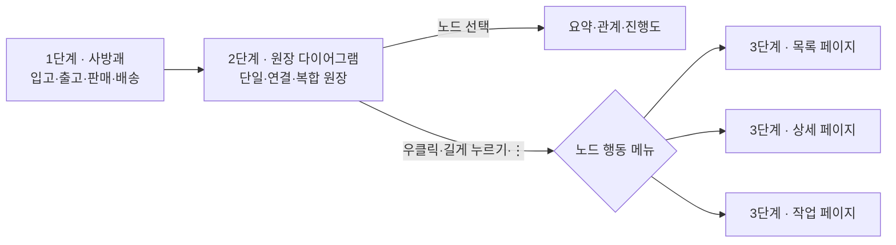
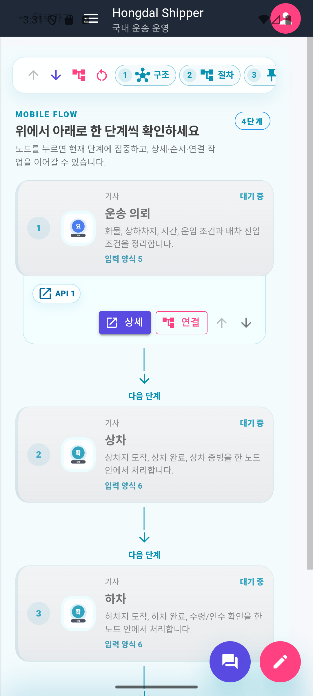
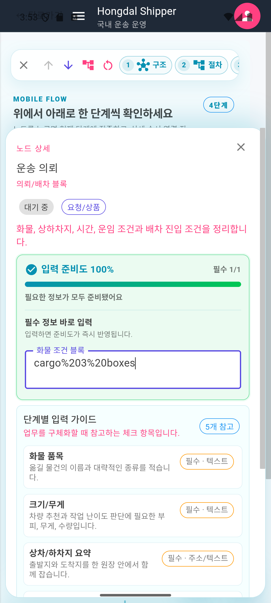
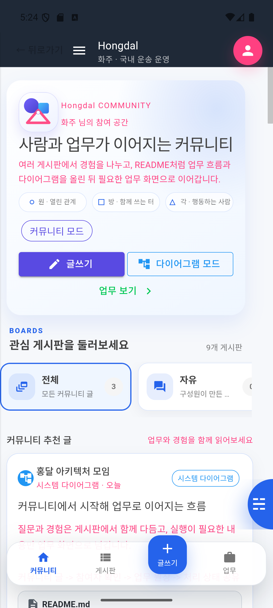
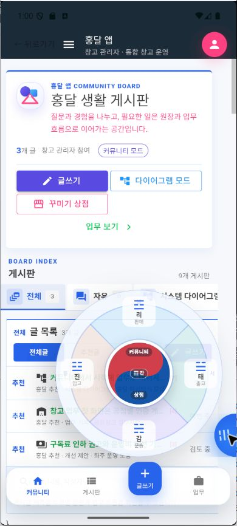
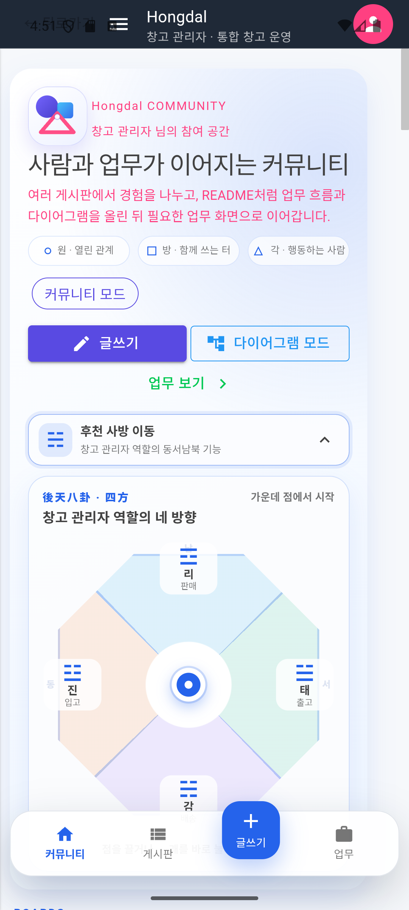
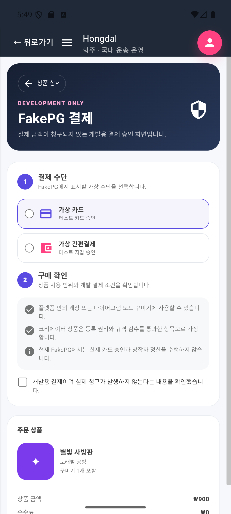
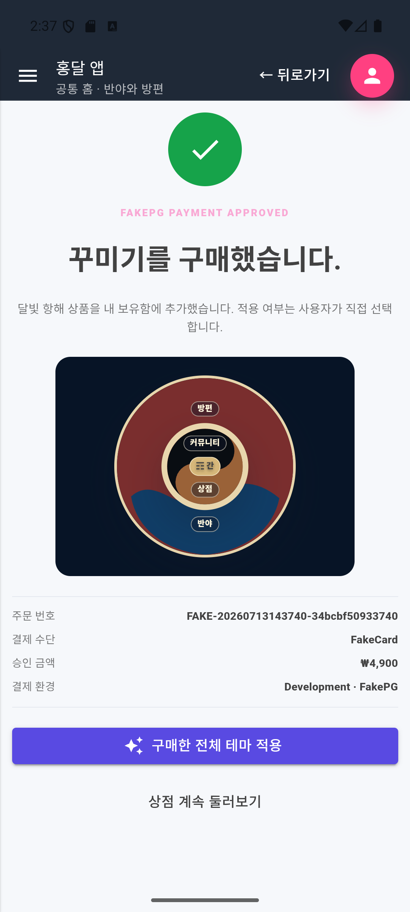

# 통합 커뮤니티 클라이언트와 꾸미기 상점

> 구현·캡처 기준: 2026-07-13  
> 사용자 표시명: **홍달 앱**  
> 코드 위치: `ShipperApp` 기반 통합 클라이언트  
> 관련 정책: [커뮤니티 운영 정책](../Architecture/CommunityOperatingPolicy.md), [홈 모드 구조](../Architecture/PlatformHomeMode.md)

홍달 앱의 첫 화면은 `실시간 베스트`, `살뜰 커뮤니티`, `꾸미기 상점`의 핵심 현황만 축약한 공통 홈이다. 게시판 상세, 원장 초안, 다이어그램과 업무 도구는 사용자가 해당 영역으로 들어간 뒤 표시한다. 사용자는 우측 상단 사람 버튼으로 역할을 바꾸고, `사방괘 → 다이어그램 → 구체 데이터 페이지` 순서로 업무를 찾아간다. `ShipperApp`은 전환 기간의 내부 프로젝트명일 뿐 사용자에게 별도 화주 앱으로 표시하지 않는다. 상세 설계 원칙은 [통합 클라이언트 3단계 내비게이션](../Architecture/ThreeStageClientNavigation.md)을 따른다.

## 화면 책임

| 화면 | 라우트 | 내비게이션 단계 | 한 가지 주 책임 |
| --- | --- | --- | --- |
| 통합 홈 | `/` | 공통 셸 | 현재 역할을 선택하고 공통 홈 요약을 표시한다. |
| 역할 미설정 홈 | `/` | 공통 셸 | 반야·방편 두 겹 태극과 공통 커뮤니티를 보여준다. |
| 화주 홈 | `/shipper` | 공통 셸·1단계 진입 | 커뮤니티와 화주 업무 요약을 조합한다. |
| 사방 이동판 | 홈 내부 | 1단계 | 역할별 네 업무 영역 중 하나를 선택한다. |
| 원장 다이어그램 | 홈의 다이어그램 모드 | 2단계 | 단일·연결·복합 원장의 경계, 노드 관계·상태·진행도와 다음 행동을 보여준다. |
| 운송 업무 | `/shipper/transport` | 3단계 | 의뢰별 결제·배차·운송 상태와 다음 행동을 처리한다. |
| 꾸미기 상점 | `/community/decorations` | 3단계 보조 기능 | 플랫폼·크리에이터·보유 상품을 탐색한다. |
| 상품 상세 | `/community/decorations/{ProductKey}` | 3단계 보조 기능 | 상품 정보, 미리보기, 구매·적용 판단을 제공한다. |
| FakePG 결제 | `/community/decorations/{ProductKey}/checkout` | 3단계 보조 기능 | 개발용 구매 승인 흐름만 담당한다. |
| 내 꾸미기 만들기 | `/community/decorations/create` | 3단계 보조 기능 | 사용자 기호·색상·이미지를 검증해 개인 꾸미기로 만든다. |

`UnifiedHome.razor`는 역할만 판별하고 `RoleNeutralHome`, 화주 홈 또는 `WarehouseManagerRoleHome`을 선택한다. 커뮤니티, 다이어그램, 업무 데이터 조회, 결제를 이 파일에 넣지 않는 것이 단일 책임의 기준이다.

## 3단계 페이지 구성

1단계에서는 업무 영역만 고르고, 2단계에서는 관계와 흐름을 이해하며, 3단계에서 실제 데이터 조회·입력·처리를 수행한다. 앱 프로젝트 이름은 사용자 내비게이션 단계가 아니라 코드 위치를 찾는 물리 색인으로만 사용한다.

현재 사방괘의 일부 역할 항목은 3단계 업무 라우트로 바로 이동한다. 이는 전환기 동작이며, 목표 구조에서는 관련 원장 템플릿과 초점 노드를 가진 다이어그램을 먼저 연다.

### 원장 묶음과 복합 원장

2단계 다이어그램은 원장을 모두 같은 크기의 카드로 나열하지 않는다.

| 표시 단위 | 포함 원장 | 사용자에게 보이는 관계 |
| --- | --- | --- |
| 음식 주문·배달 연결 묶음 | 음식 주문 원장 1건, 음식 배달 원장 0..N건 | 직접 수령은 배달 없이 종료하고, 첫 배달·분할·재배달은 회차별 원장으로 이어짐 |
| 공동구매 복합 원장 | 수요, 수입 결정, 선적/통관, 입고/분배 원장 | 상위 공동구매 문맥 안에서 하위 원장이 순서대로 진행되고 창고·운송 원장으로 인계됨 |

음식 주문은 준비 완료까지를 담당하고 배달은 한 번의 픽업·전달 시도를 담당한다. 주문과 배달은 한 여정으로 묶어 보이지만 별도 원장 식별자와 상태를 유지하며, 분할 배달과 재배달은 새 배달 원장으로 추가한다. 공동구매는 여러 하위 원장을 포함·조정하는 상위 복합 문맥으로 보인다. 묶음의 원장을 선택하면 2단계 안에서 세부 원장으로 초점을 옮기고, 노드 행동을 선택해야 3단계 데이터 페이지로 이동한다. 상세 관계와 다이어그램은 [3단계 내비게이션 문서](../Architecture/ThreeStageClientNavigation.md)에서 관리한다.

## 역할 전환과 내비게이션

우측 상단의 사람 모양 원형 버튼은 기존 상단 메뉴를 바꾸지 않고 역할 선택 패널만 연다. 상태는 `역할 미설정`, `화주`, `창고 관리자`이며, 선택값은 `Preferences`의 `hongdal.client.active_role`에 저장된다. 저장값이 없는 새 사용자는 역할 미설정 상태로 시작하고, `공통 홈`을 선택하면 다시 역할을 비울 수 있다.

역할이 바뀌면 다음 세 가지가 함께 갱신된다.

- `/`에서 렌더링하는 역할 홈
- 좌측 업무 메뉴의 노출 항목
- 후천 사방 이동판에서 열 수 있는 네 다이어그램 영역

모바일 하단 내비게이션은 `커뮤니티`, `게시판`, `글쓰기`, `업무`를 유지한다. 역할 선택은 하단에 중복 배치하지 않아 글쓰기와 업무 버튼의 터치 영역을 보존한다.

## 커뮤니티 홈

커뮤니티 홈은 여러 게시판, 글 피드, 글쓰기, 업무 진입을 한 흐름으로 보여준다. 게시판은 `시스템 다이어그램`, `운송 실무`, `업무 질문`, `업무 기록`, `생활 원장`, `개선 제안`, `신고/분쟁`으로 분류한다.

게시글 본문에 `A -> B` 또는 Mermaid 코드가 있으면 간단한 다이어그램 미리보기로 해석할 수 있다. 업무 모드의 `궁금한 점`, `처리한 일`, `개선 제안` 버튼은 역할과 앱 문맥을 포함한 글 초안을 만든 뒤 커뮤니티 글쓰기로 돌려보낸다.

커뮤니티는 단순 장식 화면이 아니라 업무 원장으로 들어가는 접수 표면이다. 게시글·댓글·투표·활동 신호는 커뮤니티 API가 담당하고, 구체적인 실행은 원장 템플릿과 해당 업무 OS/API로 넘긴다.

## 모바일과 데스크톱 다이어그램

| 항목 | 모바일 | 데스크톱 |
| --- | --- | --- |
| 흐름 방향 | 위에서 아래로 이어지는 세로 단계 | 넓은 캔버스의 자유 배치 |
| 단계 이동 | 위·아래 버튼 | 왼쪽·오른쪽 버튼과 캔버스 이동 |
| 선 옵션 | 하단 시트 | 우측 도크 |
| 상세 입력 | 화면 하단 집중 패널 | 캔버스와 상세 패널 병행 |
| 도구 막대 | 상단 고정, 가로 스크롤 | 한 줄 도구 영역 |

화면 폭이 `760px` 이하이면 데스크톱 캔버스를 숨기고 세로 흐름을 사용한다. 사용자는 한 단계씩 스크롤하며 읽고, 선택한 노드의 필수 정보만 하단 패널에서 입력한다.

### 노드에서 구체 페이지 열기

노드 기본 클릭은 선택과 요약에 사용한다. 데스크톱에서는 오른쪽 클릭 또는 노드의 `⋮` 버튼, 모바일에서는 길게 누르기 또는 `⋮` 버튼으로 행동 메뉴를 연다. 데스크톱은 노드 가까운 작은 팝오버, 모바일은 하단 시트를 사용한다.

예를 들어 창고 노드의 메뉴는 `입고 내역`, `재고 목록`, `현장 스캔`, `출고 작업`을 제공하고, 선택한 항목의 3단계 페이지로 `warehouseId` 같은 안정된 식별자를 전달한다. 구체 라우트와 권한 계약은 [3단계 내비게이션 문서](../Architecture/ThreeStageClientNavigation.md)에서 관리한다.

### 노드 입력 준비도

노드는 필요한 입력 항목 중 채워진 수를 백분율로 계산한다. 입력할수록 노드의 준비도 색상이 차오르고, `100%`가 되면 완료 상태로 강조한다. 색상만으로 상태를 판단하지 않도록 `퍼센트`, `입력 개수`, `안내 문구`를 함께 표시한다.

## 후천 사방 이동판

역할 미설정 상태에서 오른쪽 하단 손잡이를 펼치면 사방괘 대신 두 겹 태극을 연다. 바깥 태극은 위·왼쪽·오른쪽을 넓게 감싸는 빨간 `방편`과 아래 중앙의 곡선 영역만 차지하는 파란 `반야`로 구성한다. 안쪽 태극은 먹색 `커뮤니티`와 목재 갈색 `상점`으로 구분하고 상아색 테두리와 간괘 `☶`를 유지한다. 갈색 상점이 파란 반야 위에 놓여 물 위에 뜬 배처럼 읽히도록 한다. 역할을 고르면 바깥 태극만 해당 역할의 사방괘로 바뀐다.

후천팔괘의 여덟 방향을 모두 메뉴로 쓰지 않고, 모바일에서 판단하기 쉬운 동서남북 네 괘만 노출한다. 이 화면은 북쪽을 아래에 두므로 화면 배치는 다음과 같다.

| 화면 위치 | 방위·괘 | 창고 관리자 영역 | 목표 다이어그램 문맥 |
| --- | --- | --- | --- |
| 위 | 남·리괘 `☲` | 판매 | 상품·판매채널·주문·출고 관계 |
| 오른쪽 | 서·태괘 `☱` | 출고 | 주문·피킹·포장·출고 관계 |
| 아래 | 북·감괘 `☵` | 운송 | 출고·기사·차량·인도 관계 |
| 왼쪽 | 동·진괘 `☳` | 입고 | 공급처·입고·검수·보관 관계 |

공통 사방괘의 가운데에는 산을 뜻하는 간괘 `☶`를 둔다. 펼친 이동판은 외곽 사방괘 원과 내부 간괘 원의 두 동심원이다. 내부 원은 태극 문양처럼 위쪽 빨간 양효 영역과 아래쪽 파란 음효 영역으로 나누고, 빨간 영역은 커뮤니티 글 목록, 파란 영역은 꾸미기 상점을 연다. 이 중심 디자인은 특정 역할 설정이 아니라 `PlatformCommunityHome`과 `HongdalLaterHeavenBaguaNavigator`의 공통 기본값이다. 역할별 차이는 외곽 사방괘의 목적지에만 적용한다. 모바일에서는 오른쪽 아래 벽면에 정확한 반원 손잡이만 보이도록 접고, 하단 업무 버튼과 겹치지 않도록 안전 영역 위에 고정한다.

원방각 표시는 `원=열린 관계`, `방=함께 쓰는 터`, `각=행동하는 사람`이라는 홈의 시각 언어로 사용한다. 필수 기능은 아니며 꾸미기 설정에서 괘상 표시를 끌 수 있다.

## 꾸미기 상점

상점은 홈 위에 뜨는 임시 패널이 아니라 독립 페이지다. `전체`, `홈 테마`, `노드·괘상` 상품 종류와 `플랫폼 기본`, `크리에이터`, `내 보유` 출처 탭을 조합해 탐색한다. 홈 테마 카드는 실제 태극 마스크로 합성한 축소판과 `보유 중`, `현재 적용 중` 상태를 표시한다.

상품 상세에서는 사용 위치가 `홈 내비게이터 테마`, `괘상·사방 이동판`, `다이어그램 노드` 중 무엇인지 확인한다. 홈 테마는 펼친 패널·접힌 손잡이·밝고 어두운 배경을 전환하며 실제 결과를 미리 보고, 방편·반야·커뮤니티·상점·간괘·테두리·라벨·손잡이 8개 슬롯을 확인한 뒤 전체 패키지를 한 번에 적용한다.

FakePG는 실제 카드 승인이나 창작자 정산을 수행하지 않는다. 가상 결제 수단과 약관을 확인하면 현재 앱 실행 동안 구매·보유 상태만 갱신한다. 결제 완료 뒤에는 첫 자산을 자동 적용하지 않으며 사용자가 `구매한 전체 테마 적용` 또는 `상품에서 적용 항목 고르기`를 명시적으로 선택한다.

## 내 꾸미기 등록 규격

사용자는 기호와 강조 색상만으로 괘상을 만들거나, 다이어그램 노드용 PNG·WebP·SVG 파일 또는 이미지 주소를 입력할 수 있다.

| 항목 | 현재 기준 |
| --- | --- |
| 권장 캔버스 | 정사각형 `512 × 512px` |
| 앱 직접 업로드 제한 | 최대 `2MB` |
| 허용 형식 | `image/png`, `image/webp`, `image/svg+xml` |
| 안전 영역 | 핵심 도형은 중앙 80%, 바깥 10%는 잘림 방지 여백 |
| 텍스트 | 축소 시 읽기 어려운 긴 문구는 이미지 안에 넣지 않음 |
| 권리 | 직접 제작했거나 저작권·사용권을 가진 이미지만 등록 |
| 공개 판매 | 검수 상태와 라이선스 메타데이터를 확인한 뒤 노출 |

현재 제작 페이지는 개인 보유함에 저장하고 즉시 적용하는 클라이언트 기능이다. 공개 판매 등록, 서버 영속 보유권, 실제 결제, 환불, 창작자 정산은 아직 연결하지 않았다.

디자이너 홈 테마 등록은 `/community/decorations/themes/submit`에서 별도 처리한다. 8개 슬롯마다 필수 대체색과 선택 PNG·WebP·SVG 이미지를 입력하고, 펼친 패널·접힌 손잡이·배경별 미리보기를 확인한다. 저장 결과는 `초안`으로 내 제작함에만 추가되며 현재 홈에 적용된다. 클릭 영역과 커뮤니티·상점 이동 의미는 패키지가 변경하지 못한다.

## 현재 상태와 서버 연결 경계

`PlatformCommunityDecorationStateService`는 상품, 보유 팩, 활성 홈 테마 패키지, 활성 괘상, 활성 노드 이미지, 직접 만든 항목을 앱 실행 상태로 관리한다. 홈 테마는 `neutral-taegeuk-v1` 렌더러와 버전형 8개 슬롯 manifest를 사용한다. 앱을 완전히 종료하거나 서비스 수명이 끝난 뒤에도 보존해야 하는 데이터는 서버 계정 보유권으로 옮겨야 한다.

서버에는 다음 노드 스티커 상점 API 골격이 있다.

| 메서드 | 경로 | 상태 |
| --- | --- | --- |
| `GET` | `api/v1/community/node-sticker-store/items` | 상품 목록 조회 |
| `GET` | `api/v1/community/node-sticker-store/items/{itemKey}` | 상품 상세 조회 |
| `GET` | `api/v1/community/node-sticker-store/entitlements/me` | 인증 사용자의 구매 보유권 스냅샷 조회 |
| `POST` | `api/v1/community/node-sticker-store/fake-pg/confirm` | 인증 필요, Development 전용 FakePG 승인 |

노드 스티커 구매는 서버 FakePG 승인과 계정 보유권 조회 API에 연결한다. 서버의 승인 완료 결제가 보유권 원본이며, Windows·Android·iOS·macOS 앱은 사용자 ID별 보유권 스냅샷을 로컬 저장소에 캐시한다. 로그인, 저장된 로그인 복원, 구매 승인 직후에 서버 스냅샷으로 교체하므로 다른 기기에서 같은 계정으로 로그인해도 같은 구매 팩을 확인할 수 있다. 로그아웃하면 메모리에 표시하던 계정 보유권은 제거하되 사용자별 캐시는 유지해 다음 로그인 때 먼저 표시하고 서버 응답으로 재검증한다.

로컬 캐시는 오프라인 표시 속도를 위한 복사본일 뿐 구매 권한을 새로 만들지 않는다. 결제·환불·관리자 지급처럼 권한을 바꾸는 업무 사실은 서버가 관리하고, 현재 적용 중인 테마·노드 선택처럼 기기별 UI 취향은 클라이언트에 둔다. 현재 서버 동기화 범위는 노드 스티커 팩이며 홈 테마와 괘상 상품은 서버 상품 카탈로그가 마련되기 전까지 개발용 로컬 흐름으로 남는다.

## 주요 코드 위치

| 책임 | 코드 |
| --- | --- |
| 역할 라우팅 | `ShipperApp/Components/Pages/UnifiedHome.razor` |
| 역할 상태 | `ShipperApp/Services/HongdalClientRoleService.cs` |
| 역할별 메뉴 | `ShipperApp/Services/HongdalClientNavigationCatalog.cs` |
| 공통 커뮤니티·다이어그램 | `Hongdal.Ui.Common/Areas/App/Components/Community/PlatformCommunityHome.razor` |
| 후천 사방 이동판 | `Hongdal.Ui.Common/Areas/App/Components/Community/HongdalLaterHeavenBaguaNavigator.razor` |
| 반야·방편 홈 테마 렌더러 | `HongdalPrajnaUpayaTaegeukNavigator.razor`, `HongdalHomeNavigatorThemePreview.razor` |
| 원방각 표시 | `Hongdal.Ui.Common/Areas/App/Components/Community/HongdalWonBangGakMark.razor` |
| 꾸미기 상태 | `Hongdal.Ui.Common/Areas/App/Services/PlatformCommunityDecorationStateService.cs` |
| 상점 페이지 | `ShipperApp/Components/Pages/CommunityDecorationStorePage.razor` |
| 상세·결제·제작 | `CommunityDecorationDetailPage.razor`, `CommunityDecorationCheckoutPage.razor`, `CommunityDecorationCreatePage.razor` |
| 디자이너 테마 등록 | `CommunityDecorationThemeSubmitPage.razor` |

## 검증 기준

- Android `1080 × 2400` 화면에서 역할 패널, 모바일 세로 다이어그램, 반원 도크, 홈 테마 상점·상세·디자이너 등록·FakePG·적용 결과를 확인한다.
- 화주 역할과 창고 관리자 역할을 바꾼 뒤 `/`의 홈, 좌측 메뉴, 사방 기능이 함께 바뀌는지 확인한다.
- 사방괘를 선택하면 관련 다이어그램이 열리고 역할과 방향에 맞는 초점 노드가 선택되는지 확인한다. 이 항목은 현재 전환기 구현이 끝난 뒤 필수 검증한다.
- 노드 행동 메뉴가 데스크톱 우클릭·키보드와 모바일 길게 누르기·`⋮` 버튼에서 같은 행동을 제공하는지 확인한다.
- 모바일 다이어그램에서 노드를 선택하고 필수 입력을 채웠을 때 준비도가 즉시 증가하는지 확인한다.
- 꾸미기 구매 후 상세에서 자산을 적용하고 홈 또는 다이어그램에 반영되는지 확인한다.
- FakePG 문구에 실제 청구·정산이 발생하지 않는다는 안내가 항상 보이는지 확인한다.
