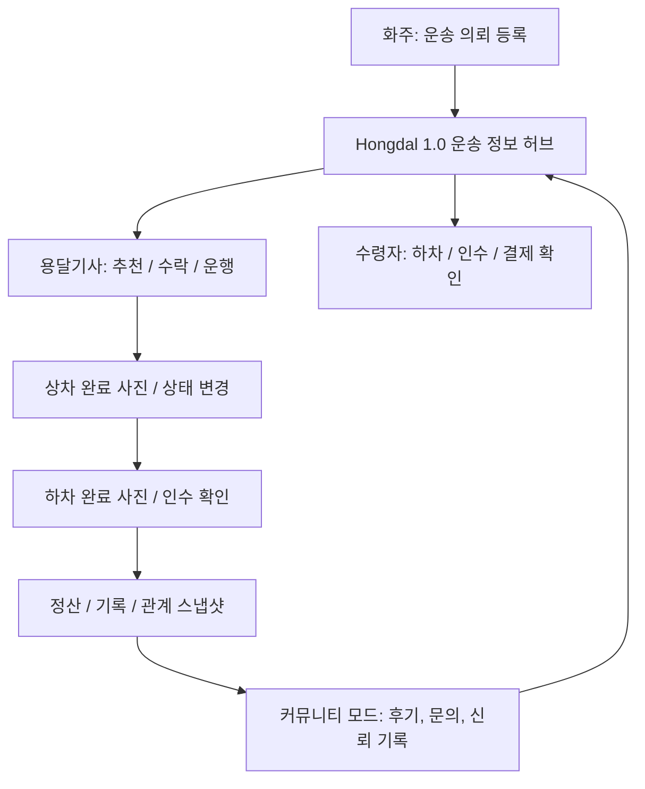
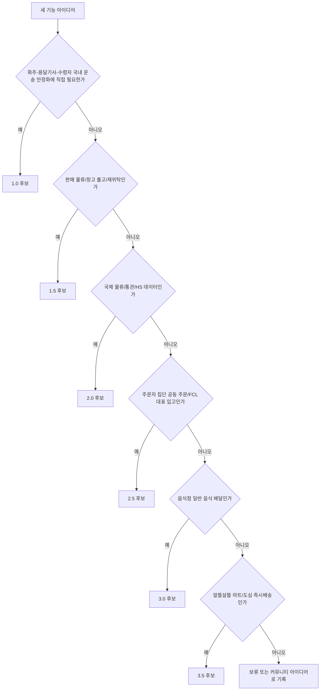

# Version Roadmap

Hongdal은 기능을 한 번에 넓히기보다 버전별 안정화 대상을 분리합니다.

소스 프로젝트는 앱/도메인 기준으로 유지하고, 버전 관리는 문서, 브랜치, 태그, 마이그레이션, 기능 플래그로 분리합니다. `DriverApp`, `ShipperApp`, `WarehouseManagerApp`, `Hongdal.Domain` 같은 실행 코드를 버전별 폴더로 복제하지 않습니다.

## 1.0 우선순위

1.0은 국내 화물/용달 운송의 핵심 참여자인 화주, 용달기사, 수령자 사이에서 필요한 정보를 정확히 제공하는 것을 최우선으로 둡니다.

| 참여자 | 1.0 핵심 정보 | 주요 앱/화면 |
| --- | --- | --- |
| 화주 | 의뢰 등록, 상차/하차 정보, 화물 정보, 결제/정산 조건, 배차 상태 | `ShipperApp` |
| 용달기사 | 추천 운송, 상차지/하차지, 화물 제원, 결제 방식, 상차/하차 완료 증빙 | `DriverApp` |
| 수령자 | 하차 예정 정보, 수령/인수 확인, 결제 또는 인수증 관련 정보 | 운송 상세, 하차 완료 흐름 |
| 운영자 | 의뢰, 결제, 배차, 취소/환불, 기능 노출 정책 | `HongdalAdmin` |

## 버전별 범위

| 버전 | 목표 | 포함 범위 |
| --- | --- | --- |
| `1.0` | 국내 화물/용달 운송 정보 서비스 안정화 | 화주 의뢰, 용달기사 추천/수락/거절, 상차/하차 증빙, 수령자 정보, 결제/정산 기본 |
| `1.5` | 판매 물류와 창고 기반 출고/재위탁 확장 | 판매상품 재고, 입고/적재/출고, 주문 출고 알림, 재위탁 운송 |
| `2.0` | 국제 물류/통관/HS 데이터 기반 확장 | HS 코드 DB, 통관/수입 대행 조회, 관세사 전용 앱, FCL/LCL 판단 |
| `2.5` | 주문자 집단 기반 공동 주문과 FCL/대량 입고 | 도로명주소/Kakao 지역 2단계 주문자 집단 구성, 공동주택/생활권 하위 식별, 공동 주문 모집, FCL 가능 조건 계산, 집단 대표 입고/분류 |
| `3.0` | 음식점 일반 음식 배달 운영 | 음식점 주문, 조리/픽업 상태, 음식 배달 기사 배차, 고객 배송 완료 |
| `3.5` | 알뜰살뜰 마트와 도심 즉시배송 운영 | 알뜰살뜰 마트 주문, 도심 재고 보충, 피킹/포장, 음식 배달 기사 픽업 |

## 장기 성장 축

일부 기능은 특정 버전 하나에 닫히지 않고 여러 버전을 관통하며 커집니다. 이런 기능은 제품 버전과 별도로 API 성장 트랙을 기록합니다.

| 성장 트랙 | 시작점 | 진화 방향 |
| --- | --- | --- |
| `Community` | `1.0` 보조 모드 | 후기, 문의, 감사, 인연 연결, 관계 스냅샷을 시작점으로 두고 2.5 공동주문 모집/공유, 3.0 음식점 지역 소통, 3.5 알뜰살뜰 마트 운영 공유까지 확장 |

커뮤니티는 국내 화물/용달 1.0에만 속한 기능이 아니라 플랫폼 신뢰와 참여 밀도를 쌓는 장기 축입니다. 따라서 `HongdalApiVersionAttribute`는 최초 안정화 버전을 기록하고, `HongdalApiGrowthTrackAttribute`는 커뮤니티처럼 계속 성장하는 기능 계열을 기록합니다.

## 판단 기준

## 1.0 추가 보완 축

| 축 | 보완 방향 |
| --- | --- |
| 기사 편의 | DriverApp은 접힌 하단 운송 바와 진행 중 운송 화면에서 다음 행동, 상차/하차, 운임을 먼저 보여줍니다. |
| 화주 요금 정책 | 기본운임, km당 단가, 최소운임, 기사 지급 예정 운임, 알선 단계를 기록합니다. |
| 알선소/재알선 방지 | 재알선금지 의뢰에서 2차 이상 알선 단계가 들어오면 정책 이벤트로 차단합니다. |

세부 릴리즈 게이트는 [../Versions/release-gates.md](../Versions/release-gates.md), 기능 플래그 정책은 [../Versions/feature-flags.md](../Versions/feature-flags.md)를 따릅니다. API와 운영 노출을 실제 업무 처리 절차별로 묶는 기준은 [workflow-api-policy.md](./workflow-api-policy.md)를 따릅니다.
