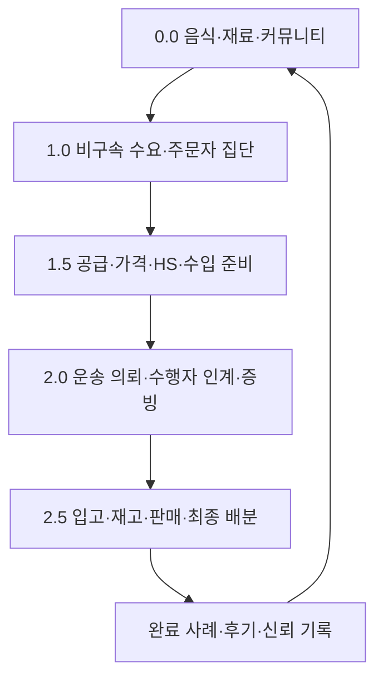
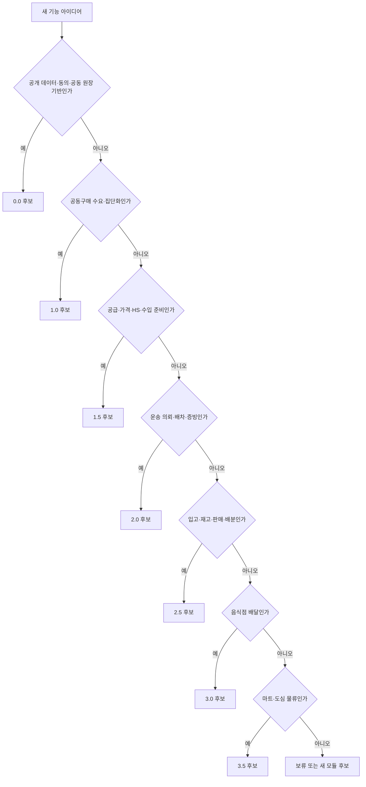

# Version Roadmap

Ssalddel은 소스 프로젝트를 버전별로 복제하지 않고 앱·도메인 경계로 유지합니다. `0.0`부터 `1.5`까지의 제품군 이름은 **문화교통**이며, 제품 버전은 기능이 어떤 사용자 결과를 먼저 완성하고 다음 단계에 무엇을 인계하는지 정의합니다.

## 출시 순서

```text
문화교통 0.0 커뮤니티·공공데이터 기반
  → 문화교통 1.0 공동구매·주문자 집단화
  → 문화교통 1.5 공급·가격·무역 준비
  → 2.0 국내 화물·운송 이행
  → 2.5 창고·판매 이행
  → 3.0 음식점 배달
  → 3.5 마트·도심 물류
```

현재 집중 대상은 문화교통 `1.5`입니다. `1.0` 집단 수요를 선행 입력으로 삼고, 세부 구현 우선순위는 [공동구매 집중 로드맵](../Versions/v0.0/focus-roadmap.md)을 따릅니다.

## 핵심 여정



국내 공동구매는 통관이 필요하지 않으면 `1.5`의 수입 검토 일부를 생략할 수 있습니다. 그러나 공급자, 가격, 수량과 책임 주체의 근거 없이 운송을 자동 생성하지 않습니다.

## 버전별 범위

| 버전 | 목표 | 포함 범위 | 보류 범위 |
| --- | --- | --- | --- |
| `0.0` | 커뮤니티·공공데이터 기반 | 음식·재료 자료, 대화, 참여 동의, 공동 원장, 신고와 신뢰 기록 | 거래·운송·창고 외부 효과 |
| `1.0` | 공동구매·주문자 집단화 | 제안, 비구속 수요, 등록·철회, 품목·지역·수령 조건별 집단, 모집·협의 | 결제·계약·신고·자동 배차 |
| `1.5` | 공급·가격·무역 준비 | 기업 근거, 견적, 예상 총원가, HS·HTS 후보, 수입 준비 원장 | 전문 판단·서명·신고 실행 |
| `2.0` | 국내 화물·운송 이행 | 화주 의뢰, 기사·운송사 인계, 배차, 상·하차, 인수, 증빙과 정산 후보 | 준비 없는 유상 주선·실정산 |
| `2.5` | 창고·판매 이행 | 입고, 검수, 재고, 피킹, 포장, 판매채널, 출고와 최종 배분 | 책임 주체 없는 보관·판매 |
| `3.0` | 음식점 일반 배달 | 주문, 조리, 픽업과 고객 배송 | 마트 재고 흐름 혼합 |
| `3.5` | 마트·도심 물류 | 재고 보충, 피킹, 포장과 즉시배송 | 공동구매·음식점 정책 흡수 |

## 1.0 참여자

| 참여자 | 핵심 정보 | 주요 화면 |
| --- | --- | --- |
| 주문자 | 음식·재료, 희망 수량, 지역·수령 조건, 참여·철회 상태 | 공동구매 목록·상세·개설, 미국 한국음식 공동구매 |
| 공동구매 대표 | 목표 수량, 모집 기간, 공급 조건, 이견과 합의 | 공동구매 원장·협의 |
| 생산자·공급자 | 공급 가능 물량, 포장, 일정과 가격 근거 | 공급자 후보·연락 요청·제안 초안 |
| 플랫폼 운영자 | 집단화 규칙, 중복 방지, 공개 집계와 개인정보 경계 | 자동집단화 미리보기·운영 검토 |

## 판단 기준



## 장기 성장 축

커뮤니티는 `0.0`에서 독립적으로 시작해 모든 버전의 대화, 동의, 원장, 신고, 후기와 관계 기록을 지지합니다. 제품 버전과 성장 트랙은 분리하며, 실제 외부 효과는 기능 플래그와 `SsalddelExecution:Mode`로 통제합니다.

세부 릴리즈 게이트는 [릴리즈 게이트](../Versions/release-gates.md), 기능 플래그 정책은 [기능 플래그 정책](../Versions/feature-flags.md)을 따릅니다.
