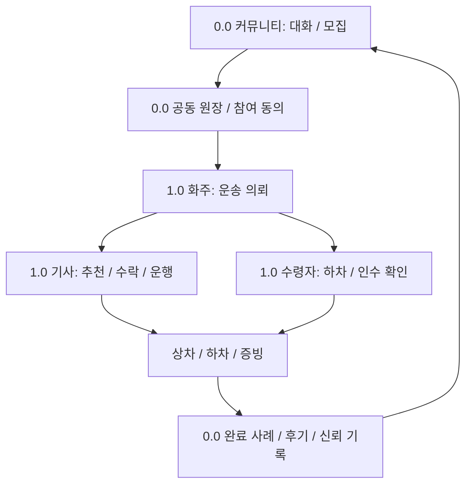
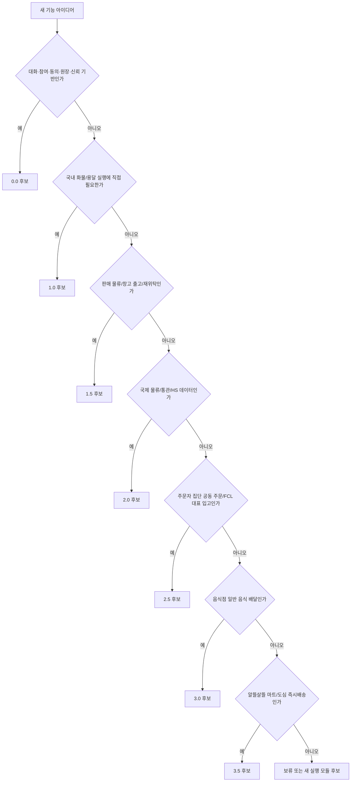

# Version Roadmap

Hongdal은 기능을 한 번에 넓히기보다 버전별 안정화 대상을 분리합니다.

소스 프로젝트는 앱/도메인 기준으로 유지하고, 버전 관리는 문서, 브랜치, 태그, 마이그레이션, 기능 플래그로 분리합니다. `DriverApp`, `ShipperApp`, `WarehouseManagerApp`, `Hongdal.Domain` 같은 실행 코드를 버전별 폴더로 복제하지 않습니다.

## 출시 순서

홍달은 커뮤니티 기반을 먼저 `0.0`으로 독립 안정화하고, 그 위에 국내 화물/용달 `1.0`을 첫 실행 모듈로 올립니다. 이후 버전도 0.0의 계정, 동의, 원장, 신고와 신뢰 기록을 공통 기반으로 사용합니다.

현재 구현 순서와 국내 공동구매 대표 파일럿은 [0.0 집중 로드맵](../Versions/v0.0/focus-roadmap.md)을 기준으로 합니다. 이 문서는 전체 버전 지도를 설명하고, 집중 로드맵은 정보 공개형 커뮤니티에서 당장 무엇을 먼저 할지 결정합니다. 1.0 운송 주선·배차는 면허 취득 경로가 구체화될 때까지 현재 계획에서 제외합니다.

## 0.0 우선순위

| 참여자 | 0.0 핵심 경험 | 주요 앱/화면 |
| --- | --- | --- |
| 커뮤니티 참여자 | 대화, 질문, 모집, 댓글, 투표와 참여 의사 | 통합 커뮤니티 홈·게시판 |
| 일을 제안한 사람 | 참여자와 조건을 직접 합의하고 공동 원장으로 전환 | 원장·다이어그램 작업공간 |
| 함께하는 사람 | 공개 범위에 동의하고 상태·이견·선택적 증빙을 공유 | 원장 대화·참여자 화면 |
| 운영자 | 신고, 차단, 개인정보 최소 공개와 분쟁 기록 확인 | 커뮤니티 운영 화면 |

## 1.0 첫 실행 모듈

1.0은 0.0 커뮤니티에서 생긴 국내 화물/용달 필요를 화주, 기사, 수령자의 실행 정보로 전환하는 첫 번째 수직 모듈입니다.

| 참여자 | 1.0 핵심 정보 | 주요 앱/화면 |
| --- | --- | --- |
| 화주 | 의뢰 등록, 상차/하차 정보, 화물 정보, 결제/정산 조건, 배차 상태 | `ShipperApp` |
| 용달기사 | 추천 운송, 상차지/하차지, 화물 제원, 결제 방식, 상차/하차 완료 증빙 | `DriverApp` |
| 수령자 | 하차 예정 정보, 수령/인수 확인, 결제 또는 인수증 관련 정보 | 운송 상세, 하차 완료 흐름 |
| 운영자 | 의뢰, 결제, 배차, 취소/환불, 기능 노출 정책 | `HongdalAdmin` |

## 버전별 범위

| 버전 | 목표 | 포함 범위 |
| --- | --- | --- |
| `0.0` | 커뮤니티와 공동 원장 기반 안정화 | 대화, 모집, 투표, 상호 동의, 원장·다이어그램, 신고·숙고, 완료 사례와 신뢰 기록 |
| `1.0` | 국내 화물/용달 운송 정보 서비스 안정화 | 화주 의뢰, 용달기사 추천/수락/거절, 상차/하차 증빙, 수령자 정보, 결제/정산 기본 |
| `1.5` | 판매 물류와 창고 기반 출고/재위탁 확장 | 판매상품 재고, 입고/적재/출고, 주문 출고 알림, 재위탁 운송 |
| `2.0` | 국제 물류/통관/HS 데이터 기반 확장 | HS 코드 DB, 통관/수입 대행 조회, 관세사 전용 앱, FCL/LCL 판단 |
| `2.5` | 주문자 집단 기반 공동 주문과 FCL/대량 입고 | 도로명주소/Kakao 지역 2단계 주문자 집단 구성, 공동주택/생활권 하위 식별, 공동 주문 모집, FCL 가능 조건 계산, 집단 대표 입고/분류 |
| `3.0` | 음식점 일반 음식 배달 운영 | 음식점 주문, 조리/픽업 상태, 음식 배달 기사 배차, 고객 배송 완료 |
| `3.5` | 알뜰살뜰 마트와 도심 즉시배송 운영 | 알뜰살뜰 마트 주문, 도심 재고 보충, 피킹/포장, 음식 배달 기사 픽업 |

## 장기 성장 축

일부 기능은 특정 버전 하나에 닫히지 않고 여러 버전을 관통하며 커집니다. 이런 기능은 제품 버전과 별도로 API 성장 트랙을 기록합니다.

| 성장 트랙 | 시작점 | 진화 방향 |
| --- | --- | --- |
| `Community` | `0.0` 제품 기반 | 대화, 원장, 참여 동의, 신고, 후기와 관계 기록을 시작점으로 두고 모든 실행 모듈의 지역 소통과 운영 공유로 확장 |

커뮤니티는 0.0에서 독립 제품으로 시작하면서 동시에 이후 모든 버전을 관통하는 장기 성장 축입니다. 따라서 `HongdalApiVersionAttribute`는 커뮤니티 기반 API의 최초 안정화 버전을 `0.0`으로 기록하고, `HongdalApiGrowthTrackAttribute`는 이후에도 계속 성장하는 기능 계열임을 기록합니다.

## 판단 기준

## 1.0 추가 보완 축

| 축 | 보완 방향 |
| --- | --- |
| 기사 편의 | DriverApp은 접힌 하단 운송 바와 진행 중 운송 화면에서 다음 행동, 상차/하차, 운임을 먼저 보여줍니다. |
| 화주 요금 정책 | 기본운임, km당 단가, 최소운임, 기사 지급 예정 운임, 알선 단계를 기록합니다. |
| 알선소/재알선 방지 | 재알선금지 의뢰에서 2차 이상 알선 단계가 들어오면 정책 이벤트로 차단합니다. |

세부 릴리즈 게이트는 [../Versions/release-gates.md](../Versions/release-gates.md), 기능 플래그 정책은 [../Versions/feature-flags.md](../Versions/feature-flags.md)를 따릅니다. API와 운영 노출을 실제 업무 처리 절차별로 묶는 기준은 [workflow-api-policy.md](./workflow-api-policy.md)를 따릅니다.
