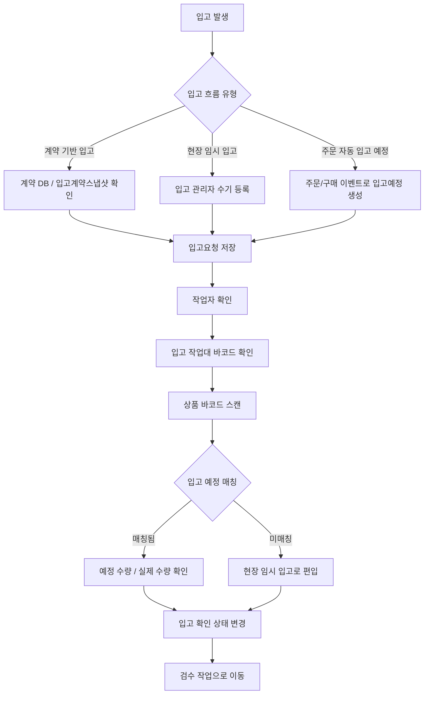
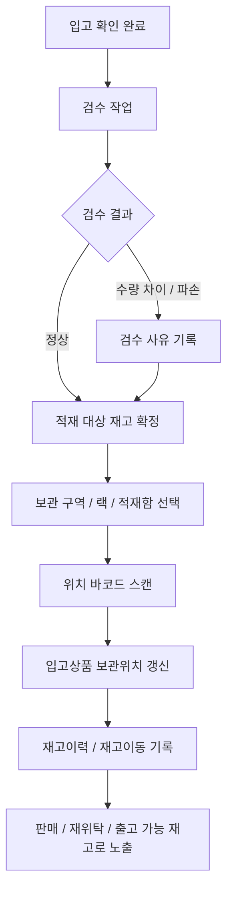
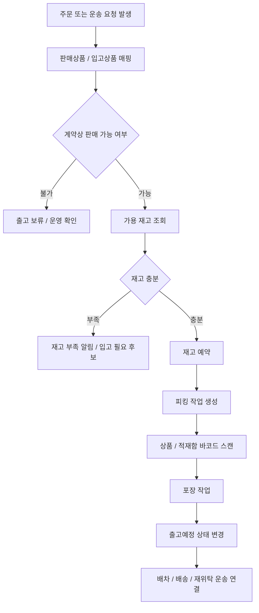
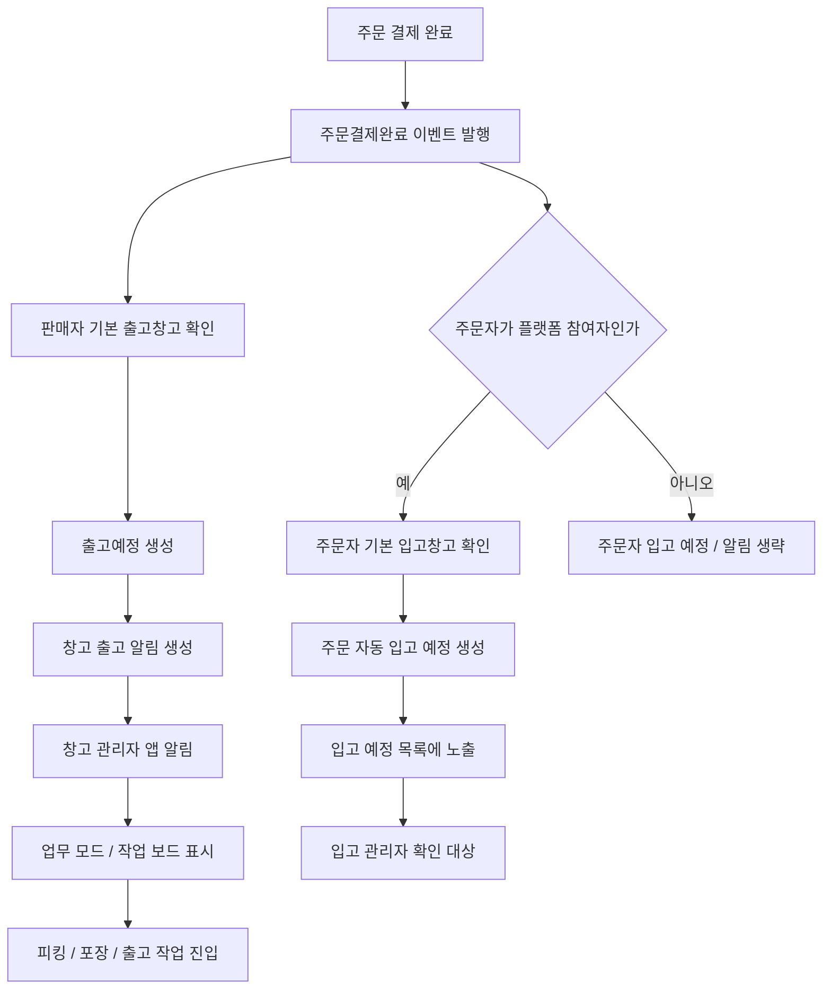
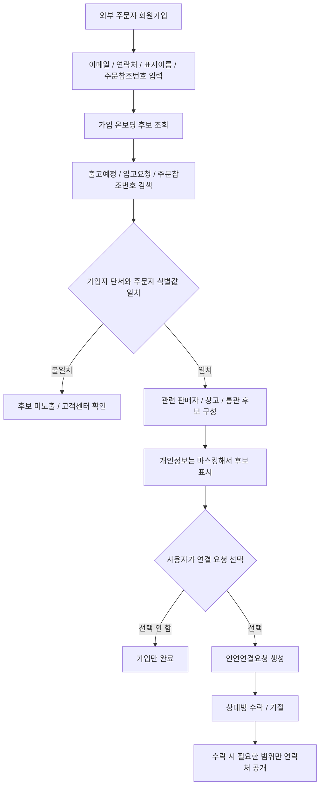

# Warehouse Flows

입고, 적재, 출고는 같은 재고를 다루지만 책임 지점이 다릅니다.

- 입고: 물건을 시스템에 편입합니다.
- 적재: 입고된 물건을 실제 보관 위치에 배치합니다.
- 출고: 주문이나 운송 요청에 맞춰 재고를 예약하고 밖으로 내보냅니다.

## 입고 흐름

## 적재 흐름

## 출고 흐름

## 주문 발생 시 창고 알림 흐름

주문 결제 완료 후에는 판매자 창고에 출고 준비 알림이 생성됩니다. 주문자가 플랫폼 참여자로 확인될 때만 주문자 기본 입고창고와 자동 입고 예정이 생성됩니다. 외부 주문자라면 주문자 입고 예정 알림은 생략하고, 판매자 창고의 피킹/포장/출고 흐름만 진행합니다.

## 외부 주문자 가입 후 연결 후보 흐름

가입자가 과거에는 외부 주문자였더라도, 회원가입 후 주문참조번호와 본인 단서가 맞으면 관련 판매자나 업무 참여자 후보를 확인할 수 있습니다.

서버에서는 이 후보 조회를 회원가입/인증 온보딩 흐름으로 보고 `POST /api/v1/auth/onboarding/connection-candidates`에서 처리합니다. 컨트롤러는 얇게 유지하고, 실제 후보 검색은 `I가입온보딩인연후보Service`로 분리합니다.
