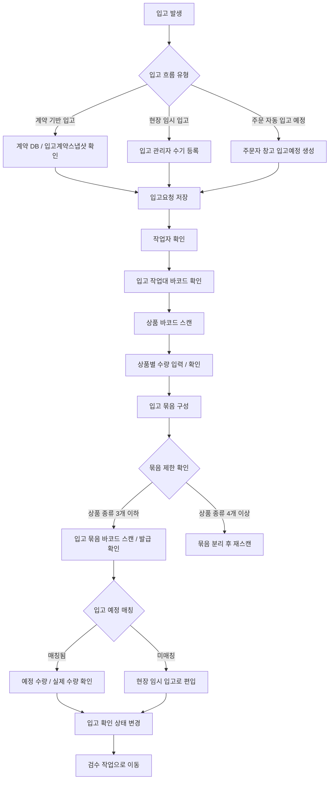
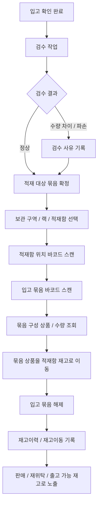
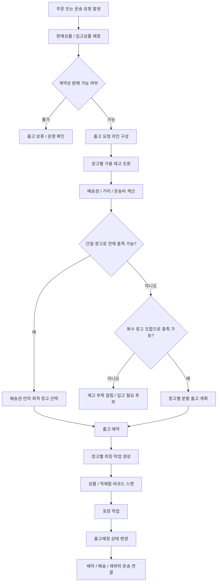
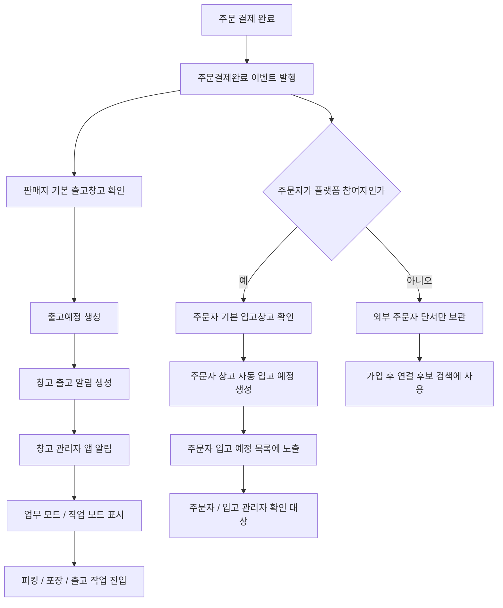
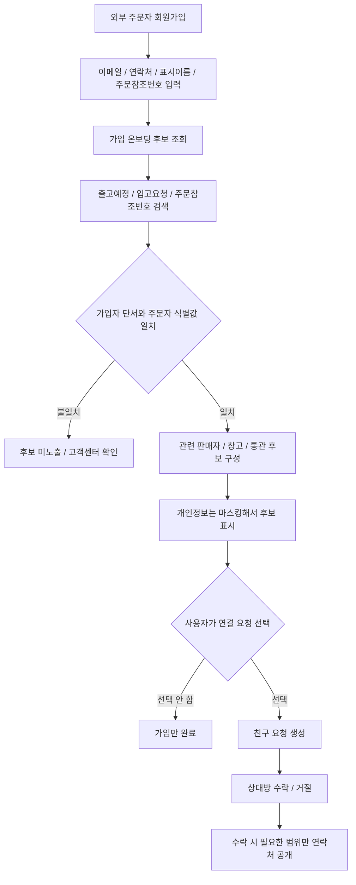

# Warehouse Flows

입고, 적재, 출고는 같은 재고를 다루지만 책임 지점이 다릅니다.

- 입고: 물건을 시스템에 편입합니다.
- 적재: 입고된 물건을 실제 보관 위치에 배치합니다.
- 출고: 주문이나 운송 요청에 맞춰 출고를 예약하고 밖으로 내보냅니다.

## 입고 흐름

입고는 계약 기반 입고, 현장 임시 입고, 주문 자동 입고 예정 흐름으로 나눕니다. 주문 자동 입고 예정은 주문자가 플랫폼 안에서 주문했을 때 자신의 창고에 "받을 예정인 물건"이 보이도록 하는 흐름입니다.
입고 확인은 상품 바코드 스캔만으로 끝나지 않고, 입고 묶음 바코드까지 확인되어야 완료됩니다. 입고 묶음 바코드 하나에는 서로 다른 상품 바코드 최대 3개와 각 수량을 담는 것을 기본 단위로 봅니다.

## 적재 흐름

적재는 개별 상품을 바로 적재함으로 옮기는 방식보다, 입고 묶음 바코드를 통해 묶음 단위로 위치를 확정하는 흐름을 기본으로 둡니다. 작업자가 적재함 위치 바코드와 입고 묶음 바코드를 모두 스캔하면, 묶음에 포함된 상품별 수량이 해당 적재함 재고로 이동하고 묶음은 해제됩니다.

## 출고 흐름

출고는 단일 상품 주문만 전제로 보지 않습니다. 주문자가 여러 상품을 한 번에 주문했을 때 한 창고가 전체 수요를 충족할 수 있으면 하나의 출고 배치로 처리하고, 한 창고에서 충족할 수 없으면 여러 창고에 출고 요청을 나누는 분할 출고를 고려합니다. 다만 창고에 상품이 있다는 사실만으로 창고를 결정하지 않고, 주문자 주소와 창고 사이의 거리, 배송권 포함 여부, 예상 운송비를 함께 반영합니다. 자세한 계획 계층은 [출고 배치 엔진](../Architecture/OutboundBatchEngine.md)에서 관리합니다.

## 주문 발생 시 창고 알림 흐름

주문 결제 완료 후에는 판매자 창고에 출고 준비 알림이 생성됩니다. 주문자가 플랫폼 참여자로 확인되고 주문자 기본 창고가 있으면, 주문자 창고에는 자동 입고 예정 정보가 생성됩니다. 외부 주문자라면 주문자 입고 예정은 만들지 않고, 주문 참조 단서만 보관합니다.

## 외부 주문자 가입 후 연결 후보 흐름

가입자가 과거에는 외부 주문자였더라도, 회원가입 후 주문참조번호와 본인 단서가 맞으면 관련 판매자나 업무 참여자 후보를 확인할 수 있습니다.

서버에서는 이 후보 조회를 회원가입/인증 온보딩 흐름으로 보고 `POST /api/v1/auth/onboarding/connection-candidates`에서 처리합니다. 컨트롤러는 얇게 유지하고, 실제 후보 검색은 `I가입온보딩친구후보Service`로 분리합니다.
