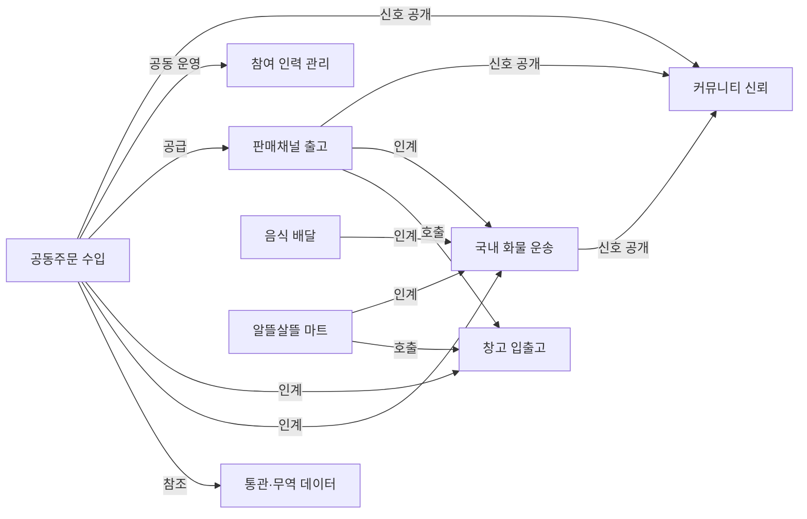

# 워크플로우 API 정책

살뜰 API는 버전별 기능 묶음에서 업무 처리 절차별 워크플로우 묶음으로 이동합니다.

`0.0`, `0.5`, `1.0`, `1.5`, `2.0`, `2.5`, `3.0`, `3.5` 제품 버전은 기능이 어떤 결과를 먼저 완성하고 다음 단계에 무엇을 인계하는지 기록합니다. 실제 API 노출, 메뉴 노출, 권한, 운영 가능 여부는 워크플로우 기준으로 관리합니다.

## 핵심 개념

| 개념 | 의미 |
| --- | --- |
| 제품 버전 | API나 기능이 속한 로드맵 단계. 커뮤니티 기반은 0.0, 개별주문은 0.5, 공동주문 집단화는 1.0, 공급·무역 준비는 1.5, 운송 이행은 2.0부터 시작 |
| HIOPS | Ssalddel Integrated Operations & Policy System. 여러 참여자의 입장과 책임을 조율하기 위해 하위 OS, 워크플로우, 엔진을 조합하는 최상위 운영 체제 |
| 하위 OS | HIOPS 안에서 특정 운영 목적을 맡는 실행 단위. 예: 공동구매 수요·모집 OS, 공동주문 수입 OS, 국내 화물 운송 OS, 창고·커머스 이행 OS |
| 워크플로우 | 하나의 업무 절차를 완성하기 위해 묶이는 API 집합 |
| 액터 | 유스케이스를 직접 실행하거나 보조로 참여하는 사용자·운영 주체 |
| 유스케이스 | 액터가 워크플로우 안에서 목적을 달성하기 위해 호출하는 업무 기능 단위 |
| 워크플로우 플래그 | 해당 업무 절차를 현재 환경에서 열지 말지 결정하는 스위치 |
| 성장 트랙 | 커뮤니티처럼 여러 워크플로우와 버전에 걸쳐 계속 커지는 기능 축 |

OS와 워크플로우는 같은 계층이 아닙니다. 워크플로우는 업무 절차와 책임 경계를 설명하고, OS는 그 절차들을 어떤 목적과 정책으로 묶어 엔진을 호출할지 결정합니다. 예를 들어 `공동구매 수요·모집 OS`는 `공동구매 수요·모집`과 `커뮤니티 신뢰` 워크플로우를 조합해 주문자 집단화 엔진을 호출합니다. 사람이 인계를 승인한 뒤에는 `공동주문 수입 OS`가 `공동주문 수입`, `통관·무역 데이터`, `창고 입출고`, `국내 화물 운송` 워크플로우를 조율합니다.

원장 블록, 조합 규칙, OS, 엔진, API/UseCase, 저장소의 전체 책임 경계는 [HIOPS Layer Model](../Architecture/HIOPSLayerModel.md)을 기준으로 봅니다. 이 문서는 API와 워크플로우 노출 정책을 다루고, 층위 모델 문서는 각 계층이 무엇을 직접 실행하고 무엇을 넘겨야 하는지 다룹니다.

`GET /api/v1/version-feature-flags`의 `OperatingSystems` 항목은 각 OS가 사용하는 워크플로우, 엔진, 스케줄링 정책을 반환합니다. 서버와 앱은 이 정보를 기준으로 “이 업무는 어떤 OS에서 운영되는가”, “어떤 엔진이 호출되는가”, “대기 큐를 어떤 정책으로 처리하는가”를 설명할 수 있습니다.

| 정책 계열 | 쓰임 |
| --- | --- |
| FCFS | 일반 승인, 게시판 개설 신청처럼 접수 순서가 중요한 큐 |
| SJF | 단순 출고, 소량 피킹처럼 빨리 끝낼 수 있는 작업 우선 |
| Priority | 냉장/냉동, 통관 완료, 운영 사고처럼 위험도나 중요도가 높은 작업 우선 |
| EDF | 상차 마감, 반출 마감, 음식 픽업 마감처럼 시간 제한이 있는 작업 우선 |
| MLFQ | 계획배차, 추천배차, 공개배차처럼 큐 단계가 있는 작업 |
| Aging | 장기 대기 작업이 계속 밀리는 것을 막는 보정 |

## 워크플로우 목록

| 한글 이름 | 코드 식별자 | 플래그 키 | 포함 API 예 |
| --- | --- | --- | --- |
| 국내 화물 운송 | `DomesticTransport` | `DomesticTransportWorkflow` | 화주 의뢰, 기사 추천, 수락/거절, 상차, 하차, 증빙, 정산 |
| 창고 입출고 | `WarehouseFulfillment` | `WarehouseFulfillmentWorkflow` | 입고, 적재, 재고, 포장, 출고 배치, 재위탁 |
| 통관·무역 데이터 | `CustomsAndTradeData` | `CustomsAndTradeDataWorkflow` | HS 코드, 통관 조회, 관세사 보정, 수출입 단가 데이터 |
| 공동구매 수요·모집 | `GroupPurchaseDemand` | `GroupPurchaseDemandWorkflow` | 비구속 수요, 자동 집단화 미리보기, 모집 현황, 수요 철회 |
| 공동수입 준비 | `GroupPurchaseImport` | `CustomsAndTradeDataWorkflow` | 공급·HS 후보 검토, 공동수입 원장, 통관 준비 자료 |
| 판매채널 출고 | `SalesChannelFulfillment` | `SalesChannelFulfillmentWorkflow` | 판매채널 계정, 상품 출품, 주문 수집, 창고 재고 연결, 출고 요청 |
| 커뮤니티 신뢰 | `CommunityTrust` | `CommunityTrustWorkflow` | 커뮤니티 글, 댓글, 후기, 활동 신호, 투표, 관계 기록 |
| 참여 인력 관리 | `HrParticipation` | `HrParticipationWorkflow` | 역할, 근로계약, 4대보험 신고 준비, 참여 보상 |
| 음식 배달 | `FoodDelivery` | `FoodDeliveryWorkflow` | 음식점 주문, 조리 상태, 픽업, 고객 전달 |
| 알뜰살뜰 마트 | `SsalddelMart` | `SsalddelMartWorkflow` | 마트 주문, 도심 재고, 피킹, 포장, 기사 인계 |

## 사용자와 책임 경계

워크플로우는 API 목록만으로 정의하지 않습니다. 주 사용자, 보조 참여자, 책임 경계를 함께 둡니다. 이 기준이 있어야 화면 권한, 메뉴 노출, 알림, 예외 처리 책임을 정할 수 있습니다.

| 워크플로우 | 주 사용자 | 보조 참여자 | 책임 경계 |
| --- | --- | --- | --- |
| 국내 화물 운송 | 화주, 기사 | 수령자, 플랫폼 운영자 | 운송 의뢰가 배차되어 상차, 하차, 증빙, 정산 후보 상태까지 진행되는 범위 |
| 창고 입출고 | 창고 관리자 | 화주·판매자 | 물품이 창고에 들어온 뒤 재고화되고 출고 가능 상태가 되거나 출고 배치로 넘어가는 범위 |
| 통관·무역 데이터 | 관세사 | 플랫폼 운영자 | 수출입 판단에 필요한 공공 데이터, HS 코드, 통관 상태, 관세사 검토 정보를 제공하는 범위 |
| 공동주문 수입 | 주문자 집단 대표, 주문자 | 해외 판매자·배송대행지, 플랫폼 운영자 | 주문자 집단이 해외 상품을 공동으로 들여와 통관, 국내 반출, 분배 또는 3PL 입고로 넘기는 범위 |
| 판매채널 출고 | 판매자 | 창고 관리자 | 상품을 판매채널에 출품하고 주문을 창고 출고 또는 운송 인계로 연결하는 범위 |
| 커뮤니티 신뢰 | 커뮤니티 참여자 | 플랫폼 운영자 | 업무 활동에서 공개 가능한 신뢰 신호, 후기, 투표, 관계 기록을 개인정보 보호 범위 안에서 다루는 범위 |
| 참여 인력 관리 | 참여 인력, 고용·운영 주체 | 플랫폼 운영자 | 역할, 계약, 보상, 4대보험 신고 준비 상태를 관리하는 범위 |
| 음식 배달 | 음식점, 배달 기사 | 주문자, 플랫폼 운영자 | 음식 주문이 조리, 픽업, 고객 전달, 완료 증빙으로 이어지는 범위 |
| 알뜰살뜰 마트 | 알뜰살뜰 마트 운영자 | 기사, 플랫폼 운영자 | 마트 주문이 도심 재고, 피킹, 포장, 기사 인계로 이어지는 범위 |

`GET /api/v1/version-feature-flags`의 `Workflows` 항목은 각 워크플로우의 `BoundarySummary`와 `Participants`를 함께 반환합니다. 앱은 이 정보를 이용해 “이 업무는 누가 주로 쓰는가”, “사용자가 여기서 할 수 있는 일은 어디까지인가”를 설명할 수 있습니다.

## 앱과 화면 경계

워크플로우를 구현할 때는 “주 사용자”를 실제 앱과 화면으로 연결합니다. 같은 워크플로우라도 화주 앱과 기사 앱에서 보는 화면은 다릅니다.

여러 앱 화면이 이어지면서 하나의 워크플로우가 완성되는 상세 관계와 보완할 페이지 후보는 [workflow-app-screen-map.md](workflow-app-screen-map.md)에 둡니다.

| 워크플로우 | 사용자 | 앱 | 화면 | 라우트 | 용도 |
| --- | --- | --- | --- | --- | --- |
| 국내 화물 운송 | 화주 | 화주 앱 | 운송 의뢰 | `/shipper/request` | 상차지, 하차지, 화물 조건, 결제 조건 입력 |
| 국내 화물 운송 | 기사 | 기사 앱 | 추천 목록 | `/driver/recommendations` | 추천된 일반 화물, 공동주문 운송, 배송 의뢰 확인 |
| 국내 화물 운송 | 기사 | 기사 앱 | 진행 중 운송 | `/driver/transports/current` | 상차, 하차, 인수 확인, 증빙 제출 |
| 국내 화물 운송 | 기사 | 기사 앱 | 월 정산 | `/driver/settlements/current-month` | 정산 후보, 지급 상태, 이용료 확인 |
| 국내 화물 운송 | 플랫폼 운영자 | 관리자 앱 | 운송 관리 | `/transports` | 운송 진행, 예외, 분쟁, 운영 상태 관리 |
| 창고 입출고 | 창고 관리자 | 창고 관리자 앱 | 입고 작업 | `/work/inbound` | 입고 시작과 검수 흐름 진입 |
| 창고 입출고 | 창고 관리자 | 창고 관리자 앱 | 작업 보드 | `/work-board` | 대기 중인 입고, 포장, 출고 작업 확인 |
| 창고 입출고 | 화주·판매자 | 화주 앱 | 창고 재고 | `/shipper/warehouse/inventory` | 입고상품, 재고, 출고 가능 상태 확인 |
| 통관·무역 데이터 | 관세사 | 관세사 앱 | 관세사 홈 | `/` | HS 코드, 식품/일반화물 분류, 통관 주의 태그 보정 |
| 통관·무역 데이터 | 화주·판매자 | 화주 앱 | HS 코드 검토 | `/shipper/customs/hs-reviews` | HS 코드 후보, 통관 리스크, 관세사 검토 필요성 확인 |
| 공동구매 1.0 | 주문자 | 주문자 앱 | 재료 자동집단화·근거 상세 | `/group-purchase/products`, `/group-purchase/products/{ProductId}` | 카드 클릭으로 배치 미리보기와 비구속 저장을 이어서 실행하며 상세는 근거만 확인 |
| 공동구매 1.0 | 주문자 | 주문자 앱 | 수요 상세 조건 | `/group-purchase/demands/new/{ProductId}` | 배송권·희망 수량을 직접 조정하는 보조 비구속 Action |
| 공동주문 수입 준비 | 주문자 집단 대표 | 주문자 앱 | 수입 원가 참고 | `/group-purchase/import-review/{ProductId}` | 1.5 Simulation 원가와 검토 필요 항목 확인 |
| 공동주문 수입 준비 | 주문자 | 주문자 앱 | 선적 조회 | `/group-purchase/shipments` | 문서관리번호 한 건의 공개 선적 상태 조회 |
| 판매채널 출고 | 판매자 | 화주 앱 | 판매채널 연결 | `/shipper/sales/channels` | 판매채널 계정 연결 |
| 판매채널 출고 | 판매자 | 화주 앱 | 상품 출품 | `/shipper/sales/listings` | 판매상품을 채널별 출품 후보로 준비 |
| 판매채널 출고 | 판매자 | 화주 앱 | 판매 주문 원장 | `/shipper/sales/orders`, `/shipper/sales/orders/{OrderId}` | 판매채널 주문과 출고 투영을 읽기 전용으로 확인 |
| 판매채널 출고 | 판매자 | 화주 앱 | 주문 이행 Simulation | `/shipper/sales/fulfillment` | 비식별 샘플로 재고·피킹·포장 흐름을 검증하며 운영 상태는 변경하지 않음 |
| 커뮤니티 신뢰 | 커뮤니티 참여자 | 주문자 앱 | 홈 커뮤니티 | `/` | 글, 후기, 활동 신호 확인 |
| 참여 인력 관리 | 고용·운영 주체 | 관리자 앱 | 인력·4대보험 신고 준비 | `/dashboard` | 역할, 근로계약, 4대보험 신고 준비 상태 관리 |
| 음식 배달 | 주문자 | 주문자 앱 | 음식점 | `/food/restaurants` | 음식점과 메뉴 확인 |
| 음식 배달 | 배달 기사 | 기사 앱 | 추천 목록 | `/driver/recommendations` | 음식 픽업·전달 추천 의뢰 확인 |
| 알뜰살뜰 마트 | 알뜰살뜰 마트 운영자 | 창고 관리자 앱 | 알뜰살뜰 마트 작업 홈 | `/mart` | 도심 재고, 피킹, 포장, 기사 인계 작업 진입 |
| 알뜰살뜰 마트 | 주문자 | 주문자 앱 | 알뜰살뜰 마트 주문 | `/food/mart` | 도심 창고 재고 기반 마트 상품 주문 |

`GET /api/v1/version-feature-flags`의 `Workflows[].Screens`는 위 앱/화면 매핑을 반환합니다. 메뉴, 권한, 온보딩 안내, 비활성 기능 안내는 이 값을 기준으로 구성할 수 있습니다.

같은 응답의 `PageCapabilities`는 통합 웹과 역할별 대표 진입점의 현재 완성 단계, 도입 버전, 실행 경계, 인증 필요 여부, 외부 효과 가능성, 연결된 기능 플래그와 워크플로우를 반환합니다. `Workflows[].Screens`가 업무 설계상의 대표 화면을 설명한다면, `PageCapabilities`는 현재 환경에서 그 화면을 어느 수준까지 열어도 되는지를 설명합니다. 화면에서 별도의 실행 모드를 만들지 않고 이 메타데이터와 전역 `SsalddelExecution:Mode`를 함께 사용합니다.

## 메타데이터 규칙

컨트롤러와 action은 `SsalddelApiVersionAttribute`를 유지합니다. 이 값은 도입 시점을 기록합니다. 워크플로우에 속한 API는 `SsalddelApiWorkflowAttribute`도 함께 붙입니다.

```csharp
[SsalddelApiVersion(SsalddelProductVersion.V1_0, FeatureKey = VersionFeatureFlagKeys.GroupPurchaseDemandWorkflow, WorkflowKey = VersionFeatureFlagKeys.GroupPurchaseDemandWorkflow)]
[SsalddelApiWorkflow(SsalddelWorkflow.GroupPurchaseDemand)]
[RequireVersionFeature(VersionFeatureFlagKeys.GroupPurchaseDemandWorkflow)]
public sealed class 공동구매자동집단화Controller : ControllerBase
{
}
```

위 예시는 다음 뜻입니다.

- 도입 시점: `1.0`
- 업무 절차: `비구속 공동구매 수요·집단화`
- 운영 스위치: `GroupPurchaseDemandWorkflow`

공급·HS·공동수입 준비 API는 `1.5`의 `GroupPurchaseImport` 또는 `CustomsAndTradeDataWorkflow`, 해외 선적은 `2.0`의 `DomesticTransportWorkflow`, 창고 이행은 `2.5`의 `WarehouseFulfillmentWorkflow`로 별도 차단합니다.

유스케이스는 `SsalddelUseCaseActorAttribute`로 주 액터와 보조 액터를 기록합니다. 이 값은 권한을 강제하는 장치라기보다, 설계 문서와 코드에서 “누가 이 업무를 주로 쓰는가”를 드러내는 메타데이터입니다. 실제 권한 검사는 기존 `Authorize`, 정책, HR 역할 검사와 함께 둡니다.

```csharp
[SsalddelApiWorkflow(SsalddelWorkflow.DomesticTransport)]
[SsalddelUseCase("기사 배차 추천 조회", Summary = "기사에게 일반 화물, 공동주문 운송, 공개 배차, 전국콜 후보를 추천하고 상세를 조회합니다.")]
[SsalddelUseCaseActor(SsalddelActor.Driver)]
[SsalddelUseCaseActor(SsalddelActor.PlatformOperator, SsalddelUseCaseActorRole.Supporting)]
public sealed class 기사배차추천UseCase : I기사배차추천UseCase
{
}
```

액터 메타데이터는 다음 기준으로 붙입니다.

| 구분 | 의미 |
| --- | --- |
| `Primary` | 유스케이스를 직접 조작하고 결과에 가장 큰 책임을 지는 사용자 |
| `Supporting` | 같은 업무를 보정, 운영, 인계, 확인하는 보조 참여자 |

유스케이스 사이에는 UML의 `include`, `extend` 개념을 메타데이터로 기록합니다. 이 값은 런타임 호출을 강제하지 않고, 설계 문서와 앱 화면에서 “어떤 기능이 항상 포함되는가”, “어떤 기능이 조건부로 붙는가”를 보여주는 용도입니다.

| 관계 | 한글 이름 | 적용 기준 | 예시 |
| --- | --- | --- | --- |
| `Include` | 포함 | 원 유스케이스가 성립하려면 사실상 함께 필요한 공통 하위 기능 | `공동구매자동집단화UseCase` → `공공데이터조회UseCase` |
| `Extend` | 확장 | 기본 유스케이스는 독립적으로 성립하지만 특정 조건에서 추가되는 기능 | `화주운송의뢰UseCase` → `문서관리UseCase` |

```csharp
[SsalddelUseCaseRelation(
    SsalddelUseCaseRelationKind.Extend,
    "문서관리UseCase",
    Condition = "인수증 거래, 전자서명, POD 증빙이 필요한 경우",
    Summary = "운송 의뢰의 상차·하차 증빙을 문서 관리 흐름으로 확장합니다.")]
public sealed class 화주운송의뢰UseCase : I화주운송의뢰UseCase
{
}
```

관계 판단은 보수적으로 합니다. 항상 필요한 선행 판단이나 공통 조회는 `Include`로 두고, 거래 조건, 증빙 방식, 고용 여부, 판매채널 출품 여부처럼 선택적으로 붙는 흐름은 `Extend`로 둡니다.

## Controller/UseCase와 OS 기능 호출

컨트롤러는 유스케이스를 주입받아 HTTP 요청을 넘기는 역할만 맡습니다. 컨트롤러에 업무 판단을 쌓지 않고, 유스케이스 이름이 다이어그램의 노드와 대응되도록 둡니다.

살뜰의 Controller API는 단순한 HTTP CRUD 목록이 아니라, OS가 열어 둔 업무 기능을 호출하는 입구로 본다. 실제 코드 호출은 `Controller -> UseCase/Command` 방향이지만, 운영 의미는 `해당 OS의 특정 기능을 호출한다`에 가깝다.

예를 들어 `POST api/v1/driver/transports/{id}/pickup-complete`는 HTTP로는 기사 앱에서 호출하는 Controller action이고, 코드로는 운송 진행 UseCase나 Command가 상태를 바꾸는 실행 단위다. HIOPS 관점에서는 국내 화물 운송 OS가 `상차 완료` 기능을 해당 시점에 열어 두었고, 그 기능 호출이 이 API/UseCase로 이어지는 것이다.

따라서 새 Controller API를 만들 때는 다음 항목을 함께 기록한다.

| 항목 | 기록 기준 |
| --- | --- |
| OS | 이 API가 어느 OS의 기능을 호출하는지 |
| 워크플로우 | 어떤 업무 절차와 화면에서 호출되는지 |
| 실행 UseCase/Command | 컨트롤러가 넘기는 내부 실행 단위 |
| 원장 블록 | 참여자, 장소, 물건, 상태, 증빙, 정산, 인계 중 어떤 블록을 읽거나 바꾸는지 |
| 상태 전이 | API 성공 후 어떤 상태가 바뀌는지 |
| 선행 판단 | 호출 전 필요한 조합 규칙, 엔진 결과, 권한, 사람 확인 |
| 후속 이벤트 | 이벤트, outbox, 감사 로그, 경험치 후보, 원장 투영 갱신 여부 |

컨트롤러는 OS 판단을 직접 구현하지 않는다. OS 판단과 스케줄링은 원장 블록, 조합 규칙, 엔진 결과, 기능 플래그, UseCase metadata를 읽어 결정한다. 컨트롤러는 그 결과로 허용된 기능을 HTTP 요청으로 받아 같은 UseCase 검증을 통과시킨다. 이렇게 해야 화면에서 직접 호출한 경우와 OS가 내부 handoff로 호출한 경우가 같은 업무 규칙을 공유한다.

예시는 아래처럼 둔다.

```csharp
[ApiController]
[Route("api/v1/driver/recommendations")]
public sealed class 기사배차추천Controller : ControllerBase
{
    private readonly I기사배차추천UseCase _useCase;

    public 기사배차추천Controller(I기사배차추천UseCase useCase)
    {
        _useCase = useCase;
    }

    [HttpGet]
    public async Task<IReadOnlyList<DispatchRecommendationDto>> Get(CancellationToken cancellationToken)
        => await _useCase.추천조회Async(User.Identity?.Name ?? string.Empty, cancellationToken);
}
```

새 유스케이스를 추가할 때는 attribute, 인터페이스, 구현체, DI 등록을 한 묶음으로 본다.

```csharp
[SsalddelApiWorkflow(SsalddelWorkflow.DomesticTransport)]
[SsalddelUseCase("파일 POD 관리", Summary = "하차 완료 사진과 배송 완료 증빙 파일 상태를 관리합니다.")]
[SsalddelUseCaseActor(SsalddelActor.PlatformOperator)]
[SsalddelUseCaseRelation(
    SsalddelUseCaseRelationKind.Include,
    "파일업로드UseCase",
    Condition = "POD 파일을 저장하거나 상태를 확인할 때",
    Summary = "POD 관리는 업로드된 파일을 전제로 합니다.")]
public sealed class 파일POD관리UseCase : I파일POD관리UseCase
{
}

services.AddScoped<I파일POD관리UseCase, 파일POD관리UseCase>();
```

`GET /api/v1/version-feature-flags`는 기존 `Flags` 응답을 유지하면서 `Workflows`, `Workflows[].UseCases`, `WorkflowRelations`도 함께 반환합니다. 앱과 관리자 화면은 이 응답을 이용해 워크플로우별 메뉴 노출, 비활성 안내, 워크플로우 관계도, 워크플로우를 성립시키는 유스케이스 목록을 구성할 수 있습니다.

## 워크플로우별 필수 유스케이스

워크플로우는 화면이나 API 하나로 닫히지 않습니다. 아래 유스케이스들이 서로 연결될 때 실제 업무 흐름이 성립합니다.

| 워크플로우 | 필요한 유스케이스 |
| --- | --- |
| 국내 화물 운송 | `화주운송의뢰UseCase`, `기사배차추천UseCase`, `용달기사프로필UseCase`, `기사알림UseCase`, `파일업로드UseCase`, `파일POD관리UseCase`, `문서관리UseCase`, `ISMSP전송보호UseCase`, `버전워크플로우UseCase` |
| 공동주문 수입 | `공동구매자동집단화UseCase`, `공동구매커머스이행계획UseCase`, `공동구매해외선적추적UseCase`, `공공데이터조회UseCase` |
| 창고 입출고 | `창고작업UseCase` |
| 통관·무역 데이터 | `HS코드운영UseCase` |
| 판매채널 출고 | `판매채널UseCase`, `샘플이미지작업UseCase` |
| 커뮤니티 신뢰 | `커뮤니티게시판UseCase`, `커뮤니티게시글UseCase`, `커뮤니티투표UseCase`, `커뮤니티활동신호UseCase`, `업무관계스냅샷조회UseCase` |
| 참여 인력 관리 | `HR참여운영UseCase`, `사회보험신고UseCase`, `플랫폼수익환급UseCase` |

이 목록은 `SsalddelApiWorkflowAttribute`와 `SsalddelUseCaseAttribute`가 붙은 유스케이스 클래스를 서버가 읽어 구성합니다. 새 유스케이스를 추가할 때는 워크플로우, 표시 이름, 주 액터, 보조 액터를 함께 붙이는 것을 기본 규칙으로 둡니다.

컨트롤러는 HTTP 라우팅, 인증 정책, 파일 스트림 열기처럼 웹 계층에 가까운 일만 담당합니다. 게시글 작성, 댓글 작성, 추천 중복 방지, 신고 수 증가, 운영자 숨김 같은 업무 처리는 유스케이스에 둡니다.

## 한글 도메인 명명 규칙

코드에서 도메인을 설명하는 명사는 가능한 한 한글로 둡니다. 반면 계층이나 기술 역할을 나타내는 접미사는 기존 .NET 관례를 유지합니다.

| 구분 | 규칙 | 예시 |
| --- | --- | --- |
| 도메인 명사 | 한글 사용 | `커뮤니티게시글`, `공동구매자동집단화`, `기사배차추천` |
| 기술 접미사 | 영어 관례 유지 | `UseCase`, `Service`, `Controller`, `Dto`, `Command` |
| 외부 계약 DTO | API 호환성을 우선 | `PlatformCommunityPostResponse`, `CommunityVoteCreateRequest` |
| 인프라/외부 서비스 | 기존 라이브러리 용어 유지 | `GoogleCloudStorage`, `InMemory`, `HttpContext` |

따라서 새 유스케이스는 `커뮤니티투표UseCase`처럼 작성합니다. API 계약 DTO는 기존 클라이언트 호환이 필요하므로 `CommunityVoteCreateRequest`처럼 유지할 수 있고, 컨트롤러는 API 경로를 유지하면서 `커뮤니티투표Controller`처럼 도메인 이름을 한글화할 수 있습니다.

관리자 운영 기능도 같은 규칙을 따릅니다. 예를 들어 `api/v1/admin/auxiliary-feature-settings` 경로는 유지하되, 서버 코드에서는 `보조기능설정Controller`와 `보조기능설정UseCase`가 전역/사용자별 설정 변경과 감사 로그 기록을 나눠 맡습니다.

통관·무역 데이터 워크플로우에서도 같은 원칙을 적용합니다. `api/v1/admin/hs-codes` 경로는 유지하되, 서버 코드에서는 `HS코드운영Controller`가 HTTP 요청을 받고 `HS코드운영UseCase`가 HS 코드 조회, 업무 분류 보정, 위험 태그 저장, 관세사/운영자 보정 출처 판단을 담당합니다.

공동주문 수입 워크플로우에서도 같은 원칙을 적용합니다. `api/v1/orderer/group-purchase-overseas-shipments`와 관리자 원장 API 경로는 유지하되, 서버 코드에서는 `공동구매해외선적추적UseCase`가 문서관리번호 조회, BL 기반 공개 조회, 수입 물류 정규화, 통관 동기화, 원장 이벤트 추가를 담당합니다.

증빙과 운영 보조 기능도 컨트롤러 밖 유스케이스에서 처리합니다. `파일업로드UseCase`, `파일POD관리UseCase`, `문서관리UseCase`는 파일 검증, 저장 경로 결정, 문서 다운로드 감사 로그를 담당하고, 컨트롤러는 파일 바인딩과 HTTP 응답만 처리합니다.

## 기존 버전 플래그 호환

기존 버전명 플래그는 설정 호환을 위해 계속 지원합니다. 서버는 기존 키와 새 워크플로우 키를 같은 운영 판단으로 해석합니다.

| 기존 키 | 새 워크플로우 키 | 한글 이름 |
| --- | --- | --- |
| `CargoYongdalV1` | `DomesticTransportWorkflow` | 국내 화물 운송 |
| `WarehouseV15` | `WarehouseFulfillmentWorkflow` | 창고 입출고 |
| `CustomsHsV20` | `CustomsAndTradeDataWorkflow` | 통관·무역 데이터 |
| `GroupPurchaseImportWorkflow`, `OrdererGroupOrderV25`, `ApartmentGroupOrderV25` | `GroupPurchaseDemandWorkflow` | 비구속 공동구매 수요 |
| `FoodDeliveryV30` | `FoodDeliveryWorkflow` | 음식 배달 |
| `SsalddelMartV35` | `SsalddelMartWorkflow` | 알뜰살뜰 마트 |

## 워크플로우 관계

워크플로우는 서로 독립된 섬이 아닙니다. 하나의 업무가 끝나면 다른 워크플로우로 인계되거나, 중간에 다른 워크플로우의 데이터를 참조하거나, 공개 가능한 활동 신호를 커뮤니티로 보낼 수 있습니다.

| 출발 워크플로우 | 관계 | 대상 워크플로우 | 의미 |
| --- | --- | --- | --- |
| 공동주문 수입 | 참조 | 통관·무역 데이터 | HS 코드, BL/AWB, 문서관리번호, 통관 단계, 수출입 단가를 조회합니다. |
| 공동주문 수입 | 인계 | 국내 화물 운송 | 보세구역 반출 뒤 아파트 직행 배송이나 국내 3PL 이동을 운송 의뢰로 넘깁니다. |
| 공동주문 수입 | 인계 | 창고 입출고 | 국내 3PL 입고를 선택하면 공동수입 물품을 입고, 재고, 출고 가능 상태로 넘깁니다. |
| 공동주문 수입 | 공급 | 판매채널 출고 | 공동수입 재고를 스마트스토어, 쿠팡, Amazon 같은 판매채널 출품 후보로 공급합니다. |
| 공동주문 수입 | 공동 운영 | 참여 인력 관리 | 공동주문 분류, 배분, 단지 내부 보조 업무에 필요한 인력 역할과 보상을 연결합니다. |
| 판매채널 출고 | 호출 | 창고 입출고 | 판매채널 주문이 들어오면 재고 확인과 출고 배치를 요청합니다. |
| 판매채널 출고 | 인계 | 국내 화물 운송 | 출고 뒤 화물 배송이나 재위탁 운송이 필요하면 운송 의뢰로 넘깁니다. |
| 알뜰살뜰 마트 | 호출 | 창고 입출고 | 도심 재고, 피킹, 포장 처리를 창고 흐름과 연결합니다. |
| 알뜰살뜰 마트 | 인계 | 국내 화물 운송 | 포장 완료 뒤 기사 인계와 배송 증빙 흐름으로 넘깁니다. |
| 음식 배달 | 인계 | 국내 화물 운송 | 픽업, 이동, 고객 전달, 완료 증빙 흐름으로 합류합니다. |
| 국내 화물 운송 | 신호 공개 | 커뮤니티 신뢰 | 상하차 완료, 감사, 후기 같은 공개 가능한 활동 신호를 보냅니다. |
| 공동주문 수입 | 신호 공개 | 커뮤니티 신뢰 | 모집, 투표, 진행 상태, 분배 후기를 개인정보 보호 범위에서 보냅니다. |
| 판매채널 출고 | 신호 공개 | 커뮤니티 신뢰 | 판매 후기와 상품 여정 신호를 동의된 범위에서 보냅니다. |



## 통합 규칙

문화교통 0.0의 커뮤니티 신뢰는 모든 실행 워크플로우보다 먼저 독립적으로 동작하는 기반입니다. 문화교통 0.5는 한 사람의 철회 가능한 개별주문 원장을 만들고, 문화교통 1.0 공동주문은 동의한 개별 원장만 주문자 집단으로 묶습니다. 문화교통 1.5 공급·무역 준비를 거쳐 실제 이동이 필요한 시점에 살뜰 2.0 국내 화물 운송으로 인계합니다. 창고 입출고와 판매채널 출고는 살뜰 2.5에서 결과를 이어받고, 음식 배달과 알뜰살뜰 마트도 실제 상차·하차·증빙이 필요할 때 운송 워크플로우를 재사용합니다.
