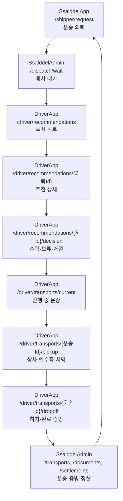
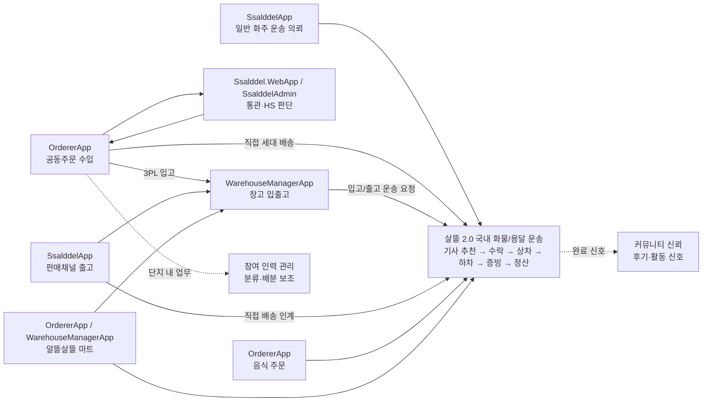
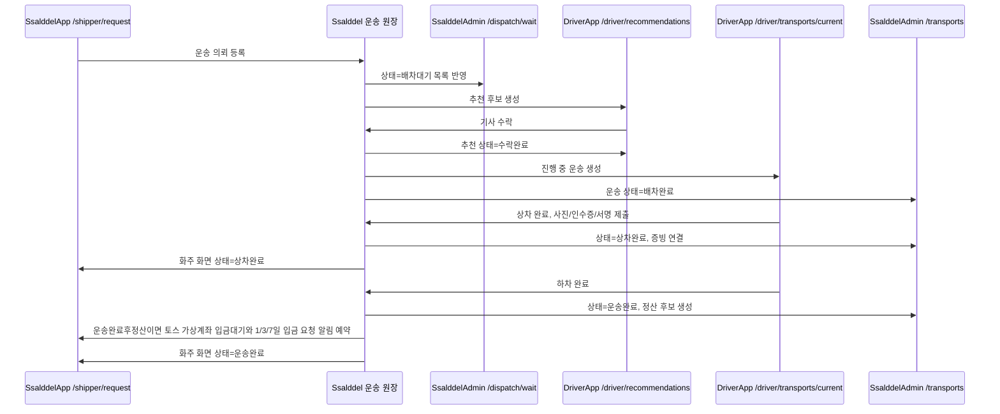
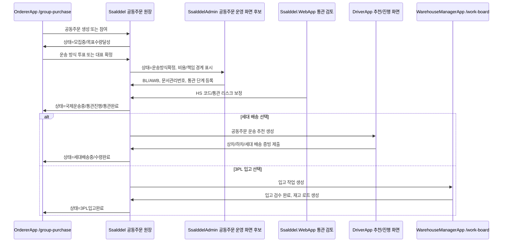
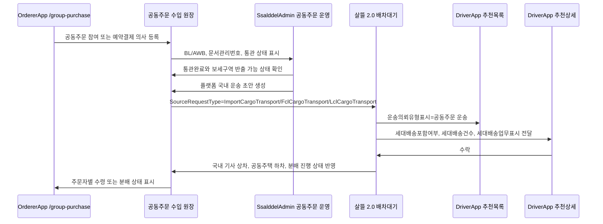
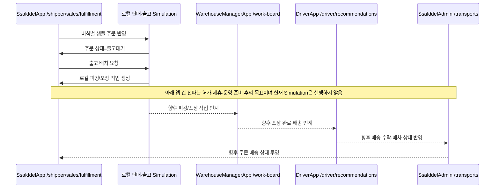
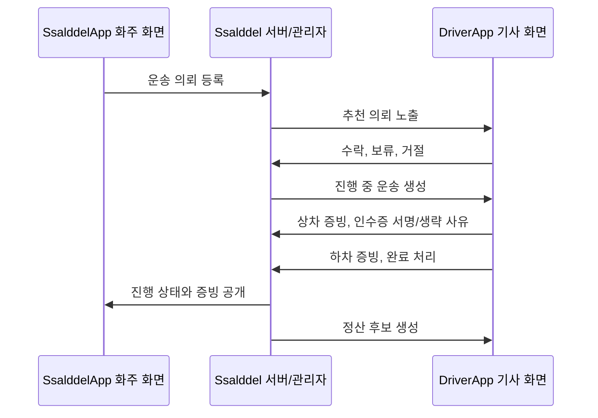
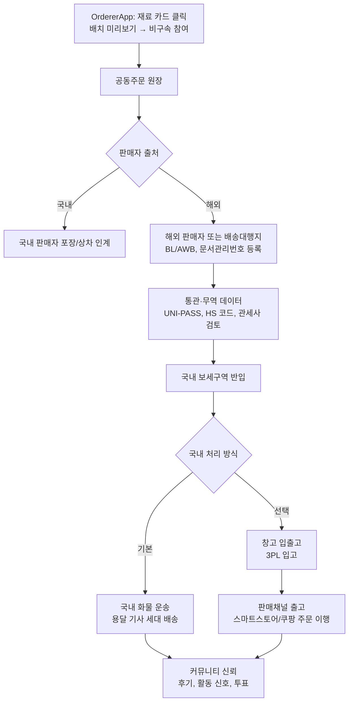
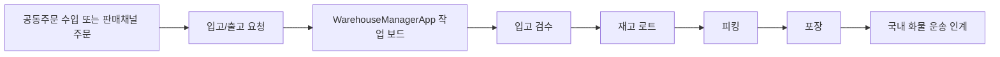
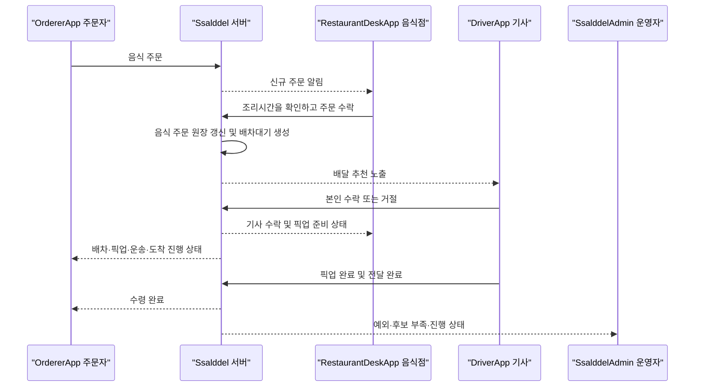

# 워크플로우 앱 화면 지도

이 문서는 살뜰의 워크플로우가 실제 앱 화면에서 어떻게 성립되는지 정리한다. 현재 제품 중심은 문화교통 0.0 커뮤니티·공공데이터 기반이다. 1.0 공동구매, 1.5 공급·무역 준비와 기존 운송 화면 지도는 후속 자산으로 읽는다.

기본 정책은 [workflow-api-policy.md](workflow-api-policy.md)를 따른다. 이 문서는 그 정책을 화면, 앱, 부족한 페이지 후보 관점으로 풀어쓴다.

운송 이행을 닫기 위한 기존 체크리스트는 레거시 파일명인 [운송 필수 페이지 기준](ssalddel-v1-required-pages.md)에 둔다. 해당 문서의 제품 범위는 2.0이며, 현재 구현 우선순위는 [0.0 집중 로드맵](../Versions/v0.0/focus-roadmap.md)을 따른다.

## 읽는 방법

| 구분 | 의미 |
| --- | --- |
| 현재 화면 | 프로젝트 안에 이미 존재하는 앱 페이지 또는 라우트 |
| 보완 후보 | 워크플로우를 더 자연스럽게 성립시키기 위해 추가하거나 강화할 화면 |
| 주 사용자 | 해당 절차를 가장 자주 직접 조작하는 사용자 |
| 보조 참여자 | 같은 워크플로우 안에서 확인, 보정, 승인, 작업을 맡는 참여자 |
| 인계 | 한 워크플로우의 결과가 다음 워크플로우의 입력이 되는 지점 |

## 문서의 중심축

아래 흐름은 2.0에서 닫아야 할 운송 화면 자산이다. 현재 0.0에서는 이 흐름을 열지 않으며 커뮤니티 글·동의·공동 원장과 완료 사례 경로만 기본 노출한다.

확장 워크플로우는 이 중심축에 들어오는 의뢰의 출처를 늘린다. 예를 들어 공동주문 수입은 보세구역 반출 후 `공동주문 세대 배송` 또는 `3PL 입고 운송`으로 기사 추천 화면에 들어오고, 판매채널 출고는 포장 완료 후 `출고 배송`으로 들어온다.

## 앱별 기본 역할

| 앱 | 주 사용자 | 현재 역할 |
| --- | --- | --- |
| `OrdererApp` | 주문자, 주문자 집단 대표 | 음식/마트 주문, 화물 주문, 수입 공동구매, 주문 내역, 커뮤니티 진입 |
| `SsalddelApp` | 화주, 판매자, 물류 의뢰자 | 운송 의뢰, 대량 의뢰, 창고 재고, 판매채널, HS 코드 검토, 국제 운송 계획 |
| `DriverApp` | 용달 기사, 배달 기사 | 운행 시작, 추천 의뢰 확인, 배차 수락/거절, 상차/하차 증빙, 정산 |
| `WarehouseManagerApp` | 창고 관리자, 현장 작업자 | 입고, 검수, 스캔, 피킹, 포장, 출고, 알뜰살뜰 마트 작업 |
| `SsalddelAdmin` | 플랫폼 운영자 | 배차 대기, 운송 진행, 기사/화주 관리, 문서, 정산, HS 코드, HR, 운영 정책 |
| `Ssalddel.WebApp` | 관세사, 화주, 판매자 | 통관·무역 데이터 검토와 보정의 사용자 접점 |

## 2.0 운송 연결 그림

## 화면 간 상태 전파

앱 화면은 각자 독립적으로 보이지만, 실제로는 같은 서버 원장을 보고 있다. 한 화면에서 버튼을 누르면 서버의 상태가 바뀌고, 그 상태를 다른 앱 화면이 목록, 상세, 작업 보드, 알림으로 다시 읽어 보여준다.

| 우선순위 | 상태 변경 | 조작 화면 | 반영 화면 | 의미 |
| --- | --- | --- | --- | --- |
| 1 | 운송 의뢰 등록 | `SsalddelApp` `/shipper/request` | `SsalddelAdmin` `/dispatch/wait`, `DriverApp` `/driver/recommendations` | 화주의 입력이 배차 대기와 기사 추천으로 전파된다. |
| 1 | 기사 수락 | `DriverApp` `/driver/recommendations/{의뢰Id}/decision` | `SsalddelApp` 운송 의뢰 상세, `SsalddelAdmin` `/transports`, `DriverApp` `/driver/transports/current` | 추천 상태가 진행 중 운송 상태로 바뀐다. |
| 1 | 상차 완료 | `DriverApp` `/driver/transports/{운송Id}/pickup` | `SsalddelAdmin` `/documents`, `SsalddelApp` 운송 상태, 커뮤니티 활동 신호 후보 | 사진, 인수증, 서명 여부가 증빙 원장으로 전파된다. |
| 1 | 현장 예외 신고 | `DriverApp` `/driver/transports/{운송Id}/pickup`, `/driver/transports/{운송Id}/dropoff`, `/driver/transports/current` | `SsalddelAdmin` `/transports`, `SsalddelApp` 운송 의뢰 상세 후보 | 상차물건없음, 수량불일치, 담당자부재, 하차지부재, 증빙업로드실패 같은 상황이 단계와 예외코드로 남고 다음 행동 안내가 내려간다. |
| 2 | 공동주문 운송 방식 확정 | 향후 전용 Action route. 현재 `OrdererApp` `/group-purchase`는 화면 색인만 담당 | `SsalddelAdmin` 공동주문 원장, `DriverApp` 추천 상세, `WarehouseManagerApp` 작업 보드 | 세대 배송 또는 3PL 입고 선택은 1.0 비구속 수요 화면과 분리해야 한다. |
| 2 | 창고 입고 검수 완료 | `WarehouseManagerApp` `/work/inbound/inspection` | `SsalddelApp` `/shipper/warehouse/inventory`, `SsalddelApp` `/shipper/sales/orders` | 실물 입고가 재고와 판매 주문 원장의 출고 가능 투영으로 전파된다. |
| 2 | 판매채널 주문 출고 배치 | 향후 운영 Action route. 현재 `SsalddelApp` `/shipper/sales/fulfillment`는 로컬 Simulation | `WarehouseManagerApp` `/work-board`, `DriverApp` `/driver/recommendations` | 운영 준비 전에는 외부 주문·재고·운송 상태를 변경하지 않고 피킹/포장 흐름만 검증한다. |
| 3 | 통관 상태 보정 | `Ssalddel.WebApp` `/shipper/customs/hs-reviews` 또는 `SsalddelAdmin` `/customs/hs-codes` | `OrdererApp` `/group-purchase/import-review/{ProductId}`, `SsalddelApp` `/shipper/customs/hs-reviews` | 관세사 검토 결과가 주문자와 판매자 화면의 리스크 표시로 반영된다. |
| 보조 | 투표 결정 | `OrdererApp` 공동주문 투표 화면 후보 | `SsalddelAdmin` 문서/활동 로그, 커뮤니티 홈 | 집단 결정이 문서화와 공개 가능한 활동 신호로 이어진다. |

### 국내 운송 상태 전파

기사에게 추천이 노출되는 순간에는 `DriverApp`이 추천 배너, 추천 카드, 추천 상세를 단계적으로 보여준다. 추천 배너는 신규 추천과 응답 제한 시간을 알리고, 추천 카드는 거리·운임·시간·업무유형을 요약하며, 추천 상세는 상하차 조건, 세대 배송, 인수증/서명/POD, 기존 운행 중 추가 추천의 경로 삽입 결과까지 확인하게 한다.

화주 화면은 같은 원장을 다른 관점으로 읽는다. 화주는 의뢰 상세에서 배차대기, 추천중, 추천만료/재추천중, 후보부족/보류, 기사수락, 상차접근중, 상차완료 상태를 확인하고, 수락 이후에는 기사 도착 전 상차 준비 알림을 받을 수 있어야 한다.

### 공동주문 수입에서 국내 운송 또는 창고 입고로 갈라지는 흐름

### 공동주문 수입 통관완료 후 기사 추천으로 이어지는 흐름

공동주문 수입이 국내 보세구역에 들어온 뒤에는 새 운송 워크플로우를 따로 만들기보다, 살뜰 2.0 국내 화물/용달 운송 흐름으로 합류한다. 운송 의뢰 주체와 비용 부담·정산 범위는 실제 계약과 책임 주체를 확인해 별도로 기록한다.

검증 계약:

| 연결 지점 | 고정해야 할 값 |
| --- | --- |
| 공동주문 국내 운송 초안 | `DispatchQueueDraft.SourceRequestType`가 `ImportCargoTransport`, `FclCargoTransport`, `LclCargoTransport` 중 하나여야 한다. |
| 1.0 배차대기 | `배차대기.원본의뢰유형`에 위 SourceRequestType을 보존한다. |
| 기사 추천 DTO | `운송의뢰유형코드=GroupPurchaseCargoTransport`, `운송의뢰유형표시=공동주문 운송`으로 표시한다. |
| 세대 배송 선택 | `세대배송포함여부=true`, `세대배송건수`, `세대배송업무표시`를 추천 목록과 상세에 노출한다. |
| 3PL 입고 선택 | 공동주문 운송으로 표시하되 `세대배송포함여부=false`, 업무 표시는 `상하차 + 3PL 입고`로 둔다. |

### 판매채널 주문이 창고와 기사 화면으로 전파되는 흐름

## 국내 화물 운송

국내 화물 운송은 살뜰 2.0의 실행 워크플로우다. 공동구매·수입, 창고 입출고, 판매채널 출고, 음식 배달, 알뜰살뜰 마트도 실제 상차와 하차가 필요하면 이 흐름으로 합류한다.

| 참여자 | 현재 화면 | 주요 API |
| --- | --- | --- |
| 화주 | `SsalddelApp` `/shipper/request`, `/shipper/request/bulk`, `/shipper/public-cargo` | `api/v1/shipper/requests` |
| 기사 | `DriverApp` `/driver/work/start`, `/driver/recommendations`, `/driver/recommendations/{의뢰Id}`, `/driver/recommendations/{의뢰Id}/decision` | `api/v1/driver/recommendations`, `api/v1/driver/dispatch-actions` |
| 기사 | `DriverApp` `/driver/transports/current`, `/driver/transports/{운송Id}/pickup`, `/driver/transports/{운송Id}/dropoff` | `api/v1/driver/transports`, `api/v1/files` |
| 플랫폼 운영자 | `SsalddelAdmin` `/dispatch/wait`, `/transports`, `/drivers/operating`, `/documents`, `/settlements` | `api/v1/admin/transports`, `api/v1/transport-events`, `api/v1/admin/documents` |

보완 후보:

| 화면 후보 | 앱 | 이유 |
| --- | --- | --- |
| 운송 의뢰 상세/분쟁 상세 | `SsalddelApp` | 화주가 비용, 증빙, 정산 예정, 분쟁 상태를 한 화면에서 확인해야 한다. |
| 운송 완료 후 입금 요청 화면 | `SsalddelApp` | 운송완료후정산 건에서 토스페이먼츠 가상계좌 결제대기 건, 입금 기한, 1/3/7일 알림 상태를 확인해야 한다. |
| 업무 유형이 강조된 추천 상세 | `DriverApp` | 일반 화물, 공동주문 세대 배송, 음식, 마트 인계를 기사에게 명확히 구분해 보여야 한다. |
| 수령자 확인 화면 | `OrdererApp` 또는 별도 공개 화면 | 하차 완료 후 수령자가 확인, 이의 제기, 사진 확인을 할 수 있어야 한다. |
| 운송 워크플로우 운영 보드 | `SsalddelAdmin` | 모든 운송 건을 워크플로우 단계 기준으로 모아 보고 예외를 처리해야 한다. |

## 공동주문 수입

공동주문 수입은 주문자 집단이 해외 상품을 공동으로 구매하고, 해외 선적, 통관, 국내 반출, 국내 운송 또는 3PL 입고까지 이어지는 흐름이다. 주문자 집단이 사업자 주체가 아닐 수 있으므로 플랫폼 위임, 운영 주체, 비용 정산 경계를 화면에서 분명히 보여야 한다.

| 참여자 | 현재 화면 | 주요 API |
| --- | --- | --- |
| 주문자 | `OrdererApp` `/group-purchase/products` 카드 원클릭 집단화, 상품 근거와 상세 조건 route | `group-purchase-auto-groups/placement-preview`, `group-purchase-auto-groups/demands/{DemandSourceKey}`, 배송권 resolve API |
| 주문자, 주문자 집단 대표 | `OrdererApp` `/group-purchase/import-review/{ProductId}`, `/group-purchase/shipments` | `api/v1/orderer/group-purchase-logistics-workflows`, `api/v1/orderer/group-purchase-overseas-shipments` |
| 주문자 | `OrdererApp` `/orders` | 공동주문 상태와 개인 주문 확인 |
| 플랫폼 운영자 | `SsalddelAdmin` `/dashboard`, `/documents`, `/activity-logs` | `api/v1/admin/orderer/group-purchase-*`, `api/v1/admin/documents` |
| 관세사 | `Ssalddel.WebApp` `/shipper/customs/hs-reviews` 또는 `SsalddelAdmin` `/customs/hs-codes` | `api/v1/customs`, `api/v1/admin/hs-codes` |
| 화주·판매자 | `SsalddelApp` `/shipper/customs/hs-reviews`, `/shipper/international/fcl-lcl` | HS 검토, FCL/LCL 계획 |
| 기사 | `DriverApp` 국내 화물 운송 화면 | 국내 보세구역 반출 이후 운송 |
| 창고 관리자 | `WarehouseManagerApp` `/work/inbound`, `/work-board` | 3PL 입고 또는 판매채널 출고 준비 |

보완 후보:

| 화면 후보 | 앱 | 이유 |
| --- | --- | --- |
| 공동주문 투표/결정 화면 | `OrdererApp` | 운송 방식, 세대 배송 범위, 3PL 입고 여부, 비용 부담 방식을 집단이 합의해야 한다. |
| 공동주문 수입 원장 콘솔 | `SsalddelAdmin` | BL/AWB, 문서관리번호, 통관 상태, 보세구역, 국내 운송 인계를 운영자가 한 곳에서 봐야 한다. |
| 해외 판매자/배송대행지 업로드 화면 | 별도 파트너 화면 또는 `SsalddelApp` 확장 | 라벨, 상품 정보 스티커, 포장 단위, 선적 증빙을 외부 참여자가 입력할 접점이 필요하다. |
| 기사 세대 배송 상세 | `DriverApp` | 송장 필수 배송과 품목 스티커만 필요한 배송을 구분하고, 동/호수 분배 책임을 표시해야 한다. |
| 공동주문 수령/분배 체크리스트 | `OrdererApp` | 주문자 집단이 세대별 수령, 미수령, 파손, 추가 비용을 확인해야 한다. |

## 창고 입출고

창고 입출고는 물품이 창고에 들어와 재고화되고, 피킹, 포장, 출고 배치로 이어지는 흐름이다. 공동주문 수입과 판매채널 출고가 모두 이 워크플로우를 호출할 수 있다.

| 참여자 | 현재 화면 | 주요 API |
| --- | --- | --- |
| 창고 관리자 | `WarehouseManagerApp` `/work/inbound`, `/work/outbound`, `/work/packing`, `/scan`, `/work-board` | `api/v1/warehouse-operations` |
| 창고 관리자 | `WarehouseManagerApp` `/work/inbound/products`, `/work/inbound/inspection`, `/work/{ProcessCode}/workbench` | 입고 검수, 작업대 스캔 |
| 화주·판매자 | `SsalddelApp` `/shipper/warehouse/workspace`, `/shipper/warehouse/inventory`, `/shipper/warehouse/scan` | 재고, 입고 상태 확인 |
| 화주·판매자 | `SsalddelApp` `/shipper/warehouse/work/inbound`, `/shipper/warehouse/work/outbound`, `/shipper/warehouse/work/packing` | 창고 작업 진입 |

보완 후보:

| 화면 후보 | 앱 | 이유 |
| --- | --- | --- |
| 같이 수입 입고 로트 상세 | `WarehouseManagerApp` | BL/AWB, 통관 단위, 세대 배송 단위, 냉장/냉동 조건을 창고 입고 단위와 연결해야 한다. |
| 출고 배치 상세 | `WarehouseManagerApp` 또는 `SsalddelApp` | 출고 배치 엔진이 어떤 창고와 재고를 선택했는지 사람이 검토할 수 있어야 한다. |
| 보관 조건 적합성 확인 | `WarehouseManagerApp` | 냉장, 냉동, 상온, 유통기한 조건에 맞는 창고만 선택되도록 보여야 한다. |

## 판매채널 출고

판매채널 출고는 같이 수입 또는 일반 입고 상품을 스마트스토어, 쿠팡, 아마존 같은 판매채널 주문으로 연결하는 흐름이다. 현재는 국내 채널과 출고 배치의 골격을 중심으로 보고, 해외 수출 채널은 관세사 검토와 수출 통관 판단이 붙는 확장 흐름으로 본다.

| 참여자 | 현재 화면 | 주요 API |
| --- | --- | --- |
| 판매자 | `SsalddelApp` `/shipper/sales/channels` | `api/v1/sales-channels` |
| 판매자 | `SsalddelApp` `/shipper/sales/listings` | 상품 출품 후보와 채널 상품 연결 |
| 판매자 | `SsalddelApp` `/shipper/sales/orders`, `/shipper/sales/orders/{OrderId}` | 영속 판매 주문과 창고 출고 투영 읽기 |
| 판매자 | `SsalddelApp` `/shipper/sales/fulfillment` | 로컬 주문·재고·피킹·포장 Simulation |
| 창고 관리자 | `WarehouseManagerApp` `/work-board`, `/work/outbound`, `/work/packing` | 출고, 피킹, 포장 |
| 기사 | `DriverApp` 국내 화물 운송 화면 | 출고 후 국내 배송 |

보완 후보:

| 화면 후보 | 앱 | 이유 |
| --- | --- | --- |
| 채널 주문 상세 | `SsalddelApp` | 주문별 재고 배분, 출고 배치, 배송 인계를 추적해야 한다. |
| 상품 상세 이미지 생성/검수 화면 | `SsalddelApp` 또는 `SsalddelAdmin` | 물류 이력과 후기를 판매 상세 이미지로 활용하려면 검수 접점이 필요하다. |
| 수출 채널 준비 화면 | `SsalddelApp` | 아마존 등 해외 채널로 보낼 때 수출 통관, 관세사 검토, 금지 품목 판단을 연결해야 한다. |

## 통관·무역 데이터

통관·무역 데이터는 공동주문 수입과 수출 채널 확장의 판단 근거다. HS 코드, 국가, 월 기준 수출입 평균 단가, BL/AWB, 항구/공항, 관할 세관, 보세구역 코드를 정규화해서 보여주는 방향이 맞다.

| 참여자 | 현재 화면 | 주요 API |
| --- | --- | --- |
| 화주·판매자 | `SsalddelApp` `/shipper/customs/hs-reviews`, `/shipper/international/fcl-lcl` | HS 코드 검토, FCL/LCL 판단 |
| 관세사 | `Ssalddel.WebApp` `/shipper/customs/hs-reviews` 또는 `SsalddelAdmin` `/customs/hs-codes` | 관세사 검토와 보정 |
| 플랫폼 운영자 | `SsalddelAdmin` `/customs/hs-codes` | HS 코드 운영 |
| 주문자 | `OrdererApp` `/group-purchase/import-review/{ProductId}`, `/group-purchase/shipments` | 같이 수입 예상 단가와 문서관리번호별 선적 상태를 서로 다른 화면에서 확인 |

보완 후보:

| 화면 후보 | 앱 | 이유 |
| --- | --- | --- |
| BL/AWB 조회 상세 | `OrdererApp` 또는 공개 조회 화면 | 주문자가 자신의 같이 수입 화물이 어디 있는지 문서관리번호로 확인해야 한다. |
| 항구/공항/세관/보세구역 코드 브라우저 | `SsalddelAdmin` | 공공 데이터를 정규화해 통관 응답값과 연결해야 한다. |
| 관세사 작업 보드 | `Ssalddel.WebApp` 또는 `SsalddelAdmin` | HS 코드 보정, 수입 가능성 검토, 보류 사유를 관세사 업무 단위로 처리해야 한다. |

## 커뮤니티 신뢰

커뮤니티 신뢰는 0.0에서 독립 제품 기반으로 먼저 성립하고, 이후 모든 워크플로우를 관통하며 성장하는 트랙이다. 공개 가능한 활동 신호, 후기, 투표, 관계 기록을 개인정보 보호 범위 안에서 공유해 다음 참여 판단을 돕는다.

| 참여자 | 현재 화면 | 주요 API |
| --- | --- | --- |
| 커뮤니티 참여자 | 각 앱 홈의 커뮤니티 모드 | `api/v1/community/posts`, `api/v1/community/activity-signals` |
| 주문자 집단 | `OrdererApp` `/group-purchase`, 홈 커뮤니티 | `api/v1/community/votes` |
| 플랫폼 운영자 | `SsalddelAdmin` `/common-contents`, `/activity-logs` | 콘텐츠와 활동 로그 관리 |

보완 후보:

| 화면 후보 | 앱 | 이유 |
| --- | --- | --- |
| 워크플로우 활동 신호 뷰어 | 각 앱 또는 `SsalddelAdmin` | 어떤 업무 행동이 커뮤니티에 공개 가능한지 확인해야 한다. |
| 투표와 전자문서 화면 | `OrdererApp` | 집단 결정, 참여자 서명, 제출 가능한 문서 생성을 연결해야 한다. |
| 공개 범위 설정 | 각 앱 | 개인정보와 영업정보를 보호하면서 신뢰 신호만 공개해야 한다. |

## 참여 인력 관리

참여 인력 관리는 주문자 집단, 창고, 단지 내 분배, 경비·관리 보조 같은 일을 실제 사람의 역할과 계약, 보상으로 연결하는 흐름이다.

| 참여자 | 현재 화면 | 주요 API |
| --- | --- | --- |
| 플랫폼 운영자 | `SsalddelAdmin` `/dashboard` | `api/v1/admin/hr-roles`, `api/v1/admin/hr-employment-contracts` |
| 플랫폼 운영자 | `SsalddelAdmin` `/dashboard` | `api/v1/admin/hr-participation-benefits`, `api/v1/admin/hr-social-insurance-filings` |
| 주문자 집단 | `OrdererApp` `/group-purchase` | 주문자 집단 운영 주체와 참여 가능 역할 확인 |

보완 후보:

| 화면 후보 | 앱 | 이유 |
| --- | --- | --- |
| HR 운영 콘솔 | `SsalddelAdmin` | 역할, 계약, 보상, 4대보험 신고 준비 상태를 분리해서 관리해야 한다. |
| 입주민 참여 신청 화면 | `OrdererApp` | 같은 단지 주민이 분류, 배분, 관리 보조 업무에 지원할 접점이 필요하다. |
| 계약/신고 준비 체크리스트 | `SsalddelAdmin` | API만 있으면 운영자가 누락 상태를 파악하기 어렵다. |

## 음식 배달

음식 배달은 주문자, 음식점, 기사와 운영자가 같은 음식 주문·운송 실행 투영을 서로 다른 관점에서 조회하는 흐름이다. 음식 주문 원장은 주문·음식점 수락·조리를 맡고, 운송 실행 투영은 배차대기·기사 수락·픽업·전달을 맡는다.

| 참여자 | 현재 화면 | 주요 API |
| --- | --- | --- |
| 주문자 | `OrdererApp` `/food`, `/food/restaurants`, `/orders/food` | `GET/POST api/v1/food-orders`, 음식점 탐색 |
| 음식점 | `RestaurantDeskApp` `/orders`, `/orders/{OrderNo}`, `/settings/preparation-times` | `POST api/v1/food-orders/{orderNo}/restaurant-acceptance` |
| 기사 | `DriverApp` `/driver/recommendations`, `/driver/recommendations/{의뢰Id}/decision`, `/driver/transports/current` | `api/v1/driver/recommendations`, `api/v1/driver/dispatch-actions`, `api/v1/driver/food-deliveries` |
| 플랫폼 운영자 | `SsalddelAdmin` `/food/operations`, `/dispatch/wait`, `/dispatch/food-ai-review`, `/transports` | 음식 운영, 배차대기, 판단 검토와 운송 진행 |

### 화면 전환과 인계

| 시작 화면 | 사용자 행동 | 다음 화면·상태 | 서버 기준 |
| --- | --- | --- | --- |
| `OrdererApp /food/restaurants` | 음식점과 메뉴를 선택해 주문 | `/orders/food?orderNo={주문번호}` | 음식 주문 원장 `주문대기` |
| `RestaurantDeskApp /orders` | `상세 보기` | `/orders/{OrderNo}` | 정확한 주문번호 재조회 |
| `RestaurantDeskApp /orders/{OrderNo}` | `조리 N분으로 수락` | 같은 상세의 수락·조리 상태 | 음식점 수락 Event 뒤 배차대기 생성 |
| `DriverApp /driver/recommendations` | 추천 카드의 `상세 보기` | `/driver/recommendations/{의뢰Id}` | 현재 기사에게 유효한 추천만 조회 |
| 기사 추천 상세 | `수락/거절 결정` | `/driver/recommendations/{의뢰Id}/decision` | 기사 본인의 명시적 Command |
| 기사 결정 화면 | `수락` | `/driver/transports/current` | 운송 실행 투영 `배차확정` |
| 기사 현재 운송 | `픽업 완료`, `전달 완료` | 현재 운송의 다음 단계 | 운송 상태 Event와 원장 동기화 |
| `OrdererApp /orders/food` | 주문 선택 또는 새로 조회 | 같은 화면의 주문 상세 | 운송 실행 투영을 다시 읽어 배차·픽업·전달 상태 표시 |
| `SsalddelAdmin /dispatch/wait` | 후보 부족·보류 건 검토 | 음식 배달 AI 검토 또는 운송 상세 | 운영자는 추천을 검토하지만 기사 대신 수락하지 않음 |

주문자 화면은 확정 기사 식별자나 상세 위치를 그대로 노출하지 않는다. `배차대기`, `추천 응답 대기`, `기사 수락`, `음식점 도착`, `픽업 후 이동`, `수령지 도착`, `전달 완료`처럼 주문 이행에 필요한 상태와 최근 변경 시각만 제공한다.

남은 보완 후보:

| 화면 후보 | 앱 | 이유 |
| --- | --- | --- |
| 음식점 배달 인계 상태 | `RestaurantDeskApp` 주문 상세 | 주문 수락 뒤 기사 찾기, 기사 수락, 음식점 도착을 확인하고 픽업 준비 시점을 맞춰야 한다. |
| 음식 픽업 전용 상세 | `DriverApp` | 일반 화물 상차/하차와 다른 조리 완료, 픽업 누락, 고객 전달 상태를 더 분명히 구분해야 한다. |
| 배차 실패 복구 안내 | `OrdererApp`, `RestaurantDeskApp`, `SsalddelAdmin` | 후보 부족, 추천 만료, 기사 수락 취소 때 다음 탐색·취소·환불 책임을 역할별로 안내해야 한다. |

## 알뜰살뜰 마트

알뜰살뜰 마트는 도심 재고를 기반으로 주문, 피킹, 포장, 기사 인계가 빠르게 이어지는 흐름이다.

| 참여자 | 현재 화면 | 주요 API |
| --- | --- | --- |
| 주문자 | `OrdererApp` `/food/mart` | 마트 상품 주문 |
| 창고 관리자 | `WarehouseManagerApp` `/mart`, `/mart/work-board`, `/mart/work/{ProcessCode}` | 마트 입고, 보충, 피킹, 기사 인계 |
| 기사 | `DriverApp` `/driver/recommendations`, `/driver/transports/current` | 마트 배송 추천과 진행 |

보완 후보:

| 화면 후보 | 앱 | 이유 |
| --- | --- | --- |
| 마트 상품/재고 운영 화면 | `SsalddelAdmin` 또는 `WarehouseManagerApp` | 판매 가능 재고, 품절, 가격, 보충 정책을 운영해야 한다. |
| 마트 주문 상세 | `OrdererApp` | 피킹, 포장, 기사 인계, 배송 완료 상태를 주문자가 봐야 한다. |
| 반품/취소 처리 화면 | `OrdererApp` 또는 `SsalddelAdmin` | 신선식품과 일반상품의 취소 가능 시점을 다르게 관리해야 한다. |

## 화면 보완 우선순위

| 순위 | 보완 항목 | 이유 |
| --- | --- | --- |
| 1 | `DriverApp` 추천 상세의 업무 유형 강화 | 살뜰 2.0 운송의 첫 판단 화면이다. 일반 화물, 공동주문 세대 배송, 음식, 마트 배송은 기사 책임 범위가 다르다. |
| 2 | `DriverApp` 상차·하차 증빙 화면 강화 | 기사님 운행 흐름에서 실제 법적·정산 증빙이 닫히는 지점이다. 인수증, 사진, 서명, 생략 사유가 안정적으로 남아야 한다. |
| 3 | `SsalddelAdmin` 국내 운송 운영 보드 | 배차 대기, 진행 중, 상차 완료, 하차 완료, 정산 후보를 2.0 운송 중심 상태로 먼저 볼 수 있어야 한다. |
| 4 | 공동주문 수입 원장 콘솔 | BL/AWB, 통관, 보세구역, 국내 운송, 3PL 입고가 하나의 원장으로 이어져야 한다. |
| 5 | 공동주문 투표/결정/전자문서 화면 | 주문자 집단의 합의와 책임 경계를 기록해야 이후 분쟁을 줄일 수 있다. |
| 6 | 창고 입고 로트와 출고 배치 상세 | 같이수입, 냉장/냉동, 판매채널 출고를 창고 작업자가 이해할 수 있어야 한다. |
| 7 | 통관 코드/보세구역 데이터 브라우저 | BL/AWB 응답값과 플랫폼 내부 원장을 안정적으로 연결해야 한다. |
| 8 | HR 참여 인력 콘솔 | 주문자 집단의 고용, 보상, 4대보험 준비 상태는 API보다 운영 화면이 먼저 필요하다. |

## 화면 설계 원칙

1. 화면은 버전 번호보다 워크플로우 이름을 먼저 보여준다.
2. 추천, 주문, 입고, 통관, 정산 같은 카드에는 현재 워크플로우와 다음 인계 워크플로우를 함께 표시한다.
3. 사용자에게는 "내가 지금 책임지는 단계"와 "다음 단계의 책임자"를 분리해서 보여준다.
4. `GET /api/v1/version-feature-flags`의 `Workflows`, `Screens`, `WorkflowRelations` 값을 메뉴, 비활성 안내, 운영 보드의 기준 데이터로 사용한다.
5. 공동주문, 통관, HR, 커뮤니티처럼 민감한 흐름은 공개 가능한 정보와 비공개 정보를 화면 단위에서 나눈다.

## 용어 정리

| 용어 | 정의 |
| --- | --- |
| 워크플로우 | 하나의 업무 절차를 완성하기 위해 여러 API와 화면이 묶인 단위 |
| 화면 경계 | 한 화면에서 사용자가 직접 책임지고 처리할 수 있는 업무 범위 |
| 인계 지점 | 한 워크플로우의 결과가 다른 워크플로우의 시작 조건이 되는 지점 |
| 원장 | 업무 상태, 증빙, 문서 번호, 책임 주체를 계속 추적하기 위한 기록 |
| 활동 신호 | 거래나 작업에서 발생한 기록 중 커뮤니티에 공개 가능한 요약 정보 |
| 보완 후보 | 현재 화면만으로는 워크플로우를 설명하거나 운영하기 부족해 추가가 필요한 화면 |
